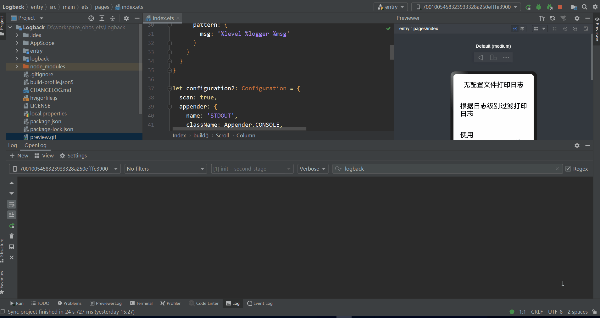

# logback

## 简介

> 日志记录框架



## 下载安装

```shell
ohpm install @ohos/logback
```

OpenHarmony ohpm环境配置等更多内容，请参考[如何安装OpenHarmony ohpm包](https://gitee.com/openharmony-tpc/docs/blob/master/OpenHarmony_har_usage.md)

## 使用说明
1. 使用SMTPAppender需要添加权限，添加到module.json5文件中

 ```
   "requestPermissions": [
      {
        "name": "ohos.permission.INTERNET"
      },
      {
        "name": "ohos.permission.GET_NETWORK_INFO"
      },
      {
        "name": "ohos.permission.GET_WIFI_INFO"
      }
    ]
 ```

2. 使用SocketAppender需要添加权限，添加到module.json5文件中

 ```
   "requestPermissions": [
      {
        "name": "ohos.permission.INTERNET"
      }
    ]
 ```

3. 引入依赖

 ```
   import  { Level, Appender, FilterEnum, Configuration, Logger, LoggerFactory }  from '@ohos/logback'
 ```

4. 在MainAbility的onWindowStageCreate中添加配置文件

 ```
let configuration: Configuration = {
    appender: [{
                   name: 'ROOT',
                   className: AppenderEnum.CONSOLE,
                   encoder: {
                       pattern: {
                           msg: '%date %level %logger %msg'
                       }
                   }
               },
               {
                   name: 'LOGGER',
                   className: AppenderEnum.CONSOLE,
                   encoder: {
                       pattern: {
                           msg: '%date %level %logger %msg'
                       }
                   }
               },
               {
                   name: 'THRESHOLD',
                   className: AppenderEnum.CONSOLE,
                   encoder: {
                       pattern: {
                           msg: '%date %level %logger %msg'
                       }
                   },
                   filter: {
                       className: FilterEnum.THRESHOLD,
                       level: Level.INFO,
                   }
               },
               {
                   name: 'LEVEL',
                   className: AppenderEnum.CONSOLE,
                   encoder: {
                       pattern: {
                           msg: '%date %level %logger %msg'
                       }
                   },
                   filter: {
                       className: FilterEnum.LEVEL,
                       level: Level.WARN,
                       onMatch: Match.ACCEPT,
                       onMismatch: Match.DENY
                   }
               },
               {
                   name: 'LOGFILE',
                   className: AppenderEnum.FILE,
                   file: '111.log',
                   encoder: {
                       pattern: {
                           msg: '%level %logger %msg'
                       }
                   },
                   filter: {
                       className: FilterEnum.THRESHOLD,
                       level: Level.ERROR,
                   }
               },
               {
                   name: 'SMTP',
                   className: AppenderEnum.SMTP,
                   fromMail: "xxx1@xxx.com", //发送者邮箱
                   toMail: "xxx2@xxx.com", //接收者邮箱
                   subject: "mail subject", //邮件主题
                   smtpHost: "smtp host", //接收邮件服务器的host域名
                   smtpPort: 25, ////接收邮件服务器的端口
                   username: "xxx", //发送者邮箱
                   password: "xxx", //邮件三方授权码
                   localHost: "xx.xx.xx.xx"  //设备ip
               },
               {
                   name: 'SIFT',
                   className: AppenderEnum.SIFT,
                   discriminator: {
                       Key: 'userid',
                       DefaultValue: 'unknown'
                   },
                   sift: {
                       appender: {
                           file: '${userid}.log',
                           className: AppenderEnum.FILE,
                           encoder: {
                               pattern: {
                                   msg: '%level %logger %msg'
                               }
                           },
                           filter: {
                               className: FilterEnum.THRESHOLD,
                               level: Level.INFO,
                           }
                       },
                       mdc: [
                           { key: 'userid', value: '100001' },
                           { key: 'userid', value: '100002' }
                       ]
                   }
               },
               {
                   name: 'DB',
                   className: AppenderEnum.DB,
                   storeName: 'logback_rdb.db',
                   encoder: {
                       pattern: {
                           msg: '%date %level %logger %msg'
                       }
                   },
                   filter: {
                       className: FilterEnum.THRESHOLD,
                       level: Level.INFO,
                   }
               },
               {
                   name: 'ROLLING',
                   className: AppenderEnum.ROLLING_FILE,
                   encoder: {
                       pattern: {
                           msg: '%date %level %logger %msg'
                       }
                   },
                   rollingPolicy:{
                       fileName: 'rolling.log',
                       filePattern: 'rolling-%d{yyyy-MM-dd HH:mm:ss}.log',
                       maxHistory: 5
                   }
               },
              {
                   name: 'SOCKET',
                   className: AppenderEnum.SOCKET,
                   localHost: 'xx.xx.xx.xx',  //aw当前设备ip
                   remoteHost: 'xx.xx.xx.xx', //目标设备ip
                   port: xxx              //目标地址的端口号
                 }],
    logger: [{
                 name: 'com.log.logger',
                 additivity: true,
                 level: Level.FATAL,
                 appenderRef: {
                     ref: 'LOGGER'
                 }
             }, {
                 name: 'com.log.threshold',
                 additivity: true,
                 level: Level.WARN,
                 appenderRef: {
                     ref: 'THRESHOLD'
                 }
             }, {
                 name: 'com.log.level',
                 additivity: true,
                 level: Level.WARN,
                 appenderRef: {
                     ref: 'LEVEL'
                 }
             },
             {
                 name: 'com.log.file',
                 additivity: true,
                 level: Level.WARN,
                 appenderRef: {
                     ref: 'LOGFILE'
                 }
             },
             {
                 name: 'com.log.smtp',
                 additivity: true,
                 level: Level.ERROR,
                 appenderRef: {
                     ref: 'SMTP'
                 }
             },
             {
                 name: 'com.log.sift',
                 additivity: true,
                 level: Level.WARN,
                 appenderRef: {
                     ref: 'SIFT'
                 }
             },
             {
                 name: 'com.log.db',
                 additivity: true,
                 level: Level.WARN,
                 appenderRef: {
                     ref: 'DB'
                 }
             },
             {
                 name: 'com.log.rolling',
                 additivity: true,
                 level: Level.WARN,
                 appenderRef: {
                     ref: 'ROLLING'
                 }
             },
             {
                name: 'com.log.socket',
                additivity: true,
                level: Level.WARN,
                appenderRef: {
                  ref: 'SOCKET'
                }
              }],
    root: {
        level: Level.ERROR,
        appenderRef: {
            ref: 'ROOT'
        }
    }
}
 ```

5. 日志打印

 ```
   let logger: Logger = LoggerFactory.getLogger(this.context, "com.log.hello")
   logger.debug("=====debug=====")
   logger.info("=====info=====")
   logger.warn("=====warn=====")
   logger.error("=====error=====")
   logger.fatal("=====fatal=====")
 ```

6. 日志写入到文件

 ```
   let logger: Logger = LoggerFactory.getLogger(this.context, "com.log.file", this.config)
   logger.info("=====info=====")
   logger.warn("=====warn=====")
   logger.error("=====error=====")
 ```

## 接口说明

1. debug类型打印日志
   `Logger.debug()`
2. 设置日志级别
   `Logger.setLevel(level: Level)`

## 约束与限制

在下述版本验证通过：

- DevEco Studio 版本： 4.1 Canary(4.1.3.317)

- OpenHarmony SDK:API11 (4.1.0.36)

## 目录结构

````
|---- logback
|     |---- entry  # 示例代码文件夹
|     |---- library  # logback库文件夹
|	    |----src
          |----main
              |----ets
                  |----components
                      |----appender #不同保存日志的appender类型
                      |----config #日志消息转换
                      |----format #日期格式化文件
                      |----formatter #日志配置文件
                      |----io #文件操作
                      |----log #日志输出
                      |----mdc #MDC存储
                      |----rdb #数据库操作
                      |----slf4j #slf4j日志打印类文件
                      |----util #工具类文件
                      |----AppenderEnum.ts #日志打印类型枚举
                      |----FilterEnum.ts #日志过滤类型枚举
                      |----Level.ts #日志级别枚举
                      |----Logger.ts #日志打印输出类
|           |---- index.ts  # 对外接口
|     |---- README.md  # 安装使用方法                    
````

## 贡献代码

使用过程中发现任何问题都可以提 [Issue](https://gitee.com/openharmony-sig/logback/issues) 给组件，当然，也非常欢迎发 [PR](https://gitee.com/openharmony-sig/logback/pulls) 共建。

## 开源协议

本项目基于 [Apache License 2.0](https://gitee.com/openharmony-sig/logback/blob/master/LICENSE) ，请自由地享受和参与开源。