# Running a Sample Project

## Running Guide

​This demo contains a OpenHarmony project directory `SampleApp` and a ReactNative project directory `SampleProject`. You need to use `SampleProject` to generate a bundle and load the bundle to `SampleApp` to run the OpenHarmony project.

**Configure an environment variable:**

​ The default version of **SampleApp** is CAPI. For this version, you need to set `RNOH_C_API_ARCH` to `1`. For details about how to set environment variables, see [Configuring the CAPI Version Environment Variable](..//../en/environment-setup.md#set_capi_path).

**Configure a React Native project:**
1. Run **npm i @react-native-oh/react-native-harmony@x.x.x** in the `SampleProject/MainProject` directory to install the dependency.

2. Run **npm run dev:all** to generate a local bundle. Run the command to generate the `bundle` and `assets` folders in the `SampleApp/entry/src/main/resources/rawfile` directory.

3. Use Metro to generate a bundle. If you want to use the Metro service to update bundles in real time, connect to a real device and run the following commands:
  
  ```bash
  hdc rport tcp:8081 tcp:8081
  npm run start
  ```

**Configure a OpenHarmony project:**

1. Specify the version of `react-native-openharmony` in `entry/oh-package.json5` and `oh-package.json5`in the root.
2. Open `SampleApp` in DevEco Studio and run **Sync and Refresh Project**.
3. Click **run** in the upper right corner to start the project.

## Project Introduction

​ On the React Native side, an empty project consists of **HomePage**, **Goods**, **test**, and **Detail** modules. On OpenHarmony, the bundles of the four service modules are loaded to create the corresponding RNSurfaces, which are then embedded into the ArkUI page components to build the OpenHarmony page.

- HomePage: The third-party library react-native-pager-view is used to implement the split-view layout of tabs.
- Goods: The scrollbar component on the top is customized by ArkUI and imported and rendered on the RN side. The bottom provides the examples of using multiple TurboModule methods.
- Test: Multiple common code example pages are provided.
- Detail: The **ArkUI** and **RN** components are used for hybrid rendering. In the **RN** component, the data transferred from the OpenHarmony side is used for style and content rendering.
  
| HomePage| Goods| Test| Detail|
| --- | --- | --- | ---|
| 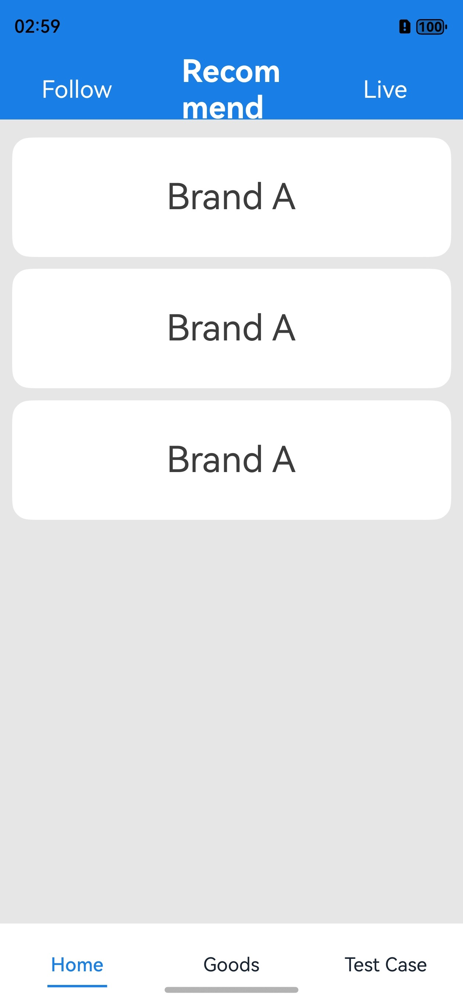| 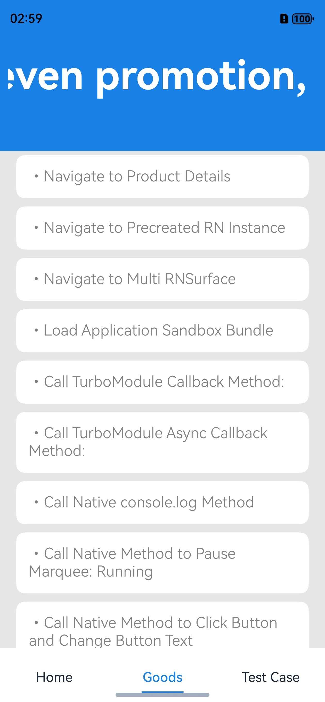| 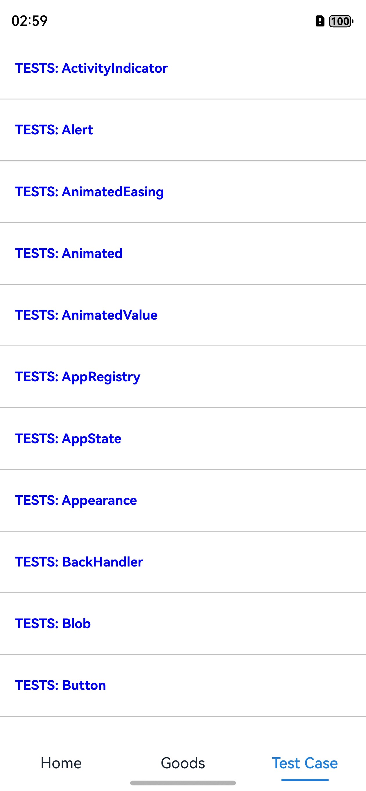| 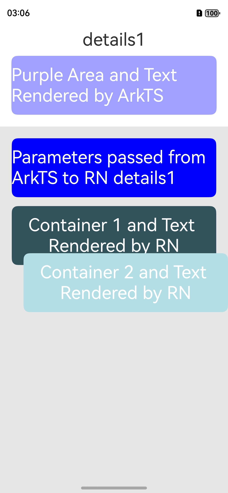|

### React Native Project Structure

​ The React Native service code of an empty project is stored in the `SampleProject/MainProject/src/bundles` directory, including the `HomePage`, `Goods`, `Detail`, `basic`, and `test` directories.

- **React Native component code:**
  
  Take the **Goods** module as an example. Under the `SampleProject/MainProject/src/bundles/Goods` directory, `App()` in the `GoodsMainPage.tsx` file is called to create a root view, and `AppRegistry.registerComponent('Goods', () => AppGoods)` in the `GoodsMainPage.tsx` file is called to register the root view and provide a reference API for the generated `good.harmony.bundle`. In addition, all module components are registered in `MainProject/index.js` and provided for the Metro server.
- **Configure the local bundle command:**
  
  Under the `SampleProject/MainProject` directory, the `config.js` file is created to configure the bundles of all modules. For example, the configuration file of the **Goods** module is `goods.config.js`. The `package.json` file in the same directory implements the bundle commands of all modules, which are encapsulated in `dev:all`.
  
  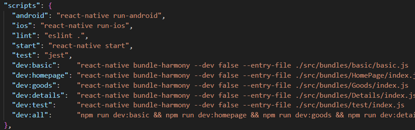

### OpenHarmony Project Structure

​ The `Tabs` component is used to build the basic page framework of the OpenHarmony project, and is created in the `MultiHome` component, containing three `TabContent`s: `HomePage`, `Goods`, and `Test`.

  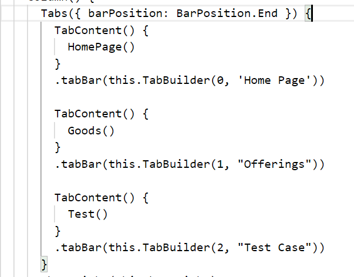

​ The `HomePage` and `Goods` components contain a `BaseRN` component (Metro uses the `MetroBaseRN` component), which is a basic component that encapsulates the `RNSurface` component and is used to load the specified React Native module view.

  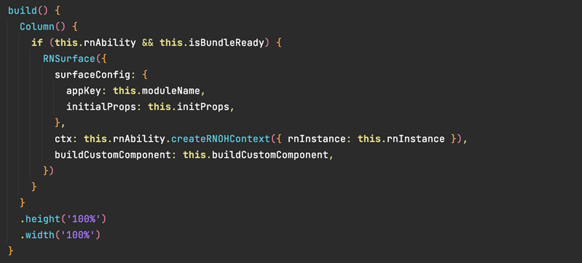

### Using TurboModule

​ Create a `RNInstance`, transfer the `createRNPackages` implemented in `RNPackagesFactory`, and create the corresponding `SampleTurboModulePackage`.

  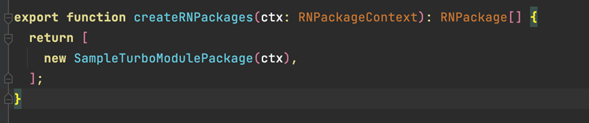

​ Define the API to be implemented by `SampleTurboModule` in `basic/SampleTurboModule.tsx` on the React Native side and export the `SampleTurboModule` instance.

  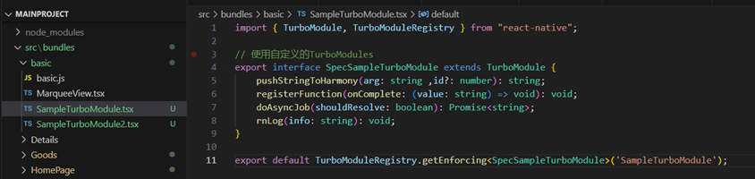

​ In `GoodsMainPage.tsx`, use `SampleTurboModule` to call the method defined in the protocol for OpenHarmony communication.

  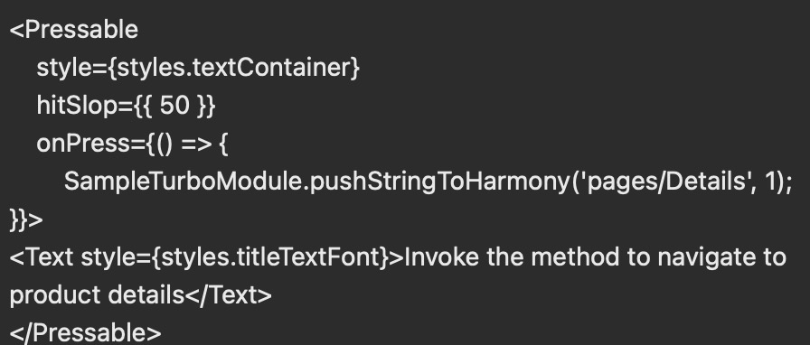

​ Implement the API defined on the React Native side in the OpenHarmony `SampleTurboModule.ts`, and use `emitter` to send the message of redirecting to the Detail page.

  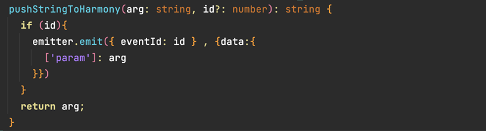

### Using a Custom Component

​ Create a custom component `ButtonView` in the `entry/src/main/cpp/ButtonView` directory. The directory contains all code of the component.

​ Add the mapping of the custom component to the `src/main/cpp/SampleTurboModulePackage.cpp` method.

  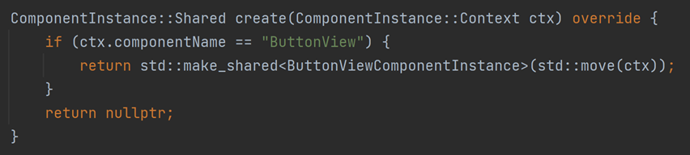

​ Define the `JSI` API of `ButtonView` in `basic/ButtonView.tsx` on the React Native side.

  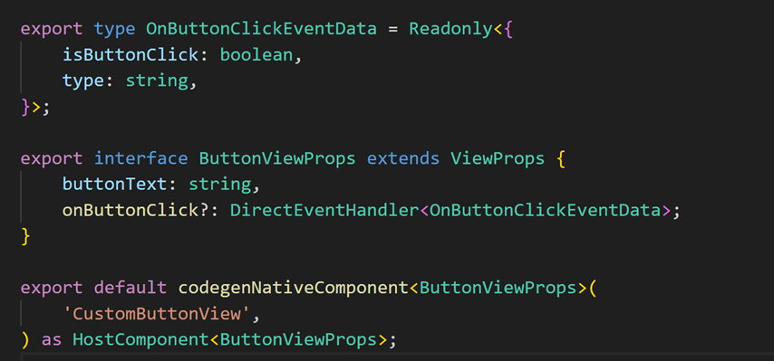

​ Use custom components in `GoodsMainPage.tsx`.

  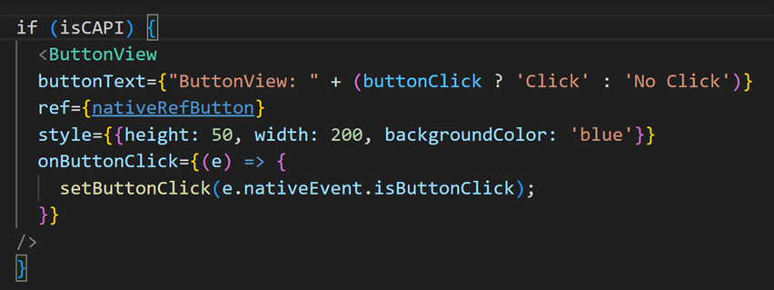

### Using a Third-Party Library

​ The home page view of this project is developed using the `react-native-pager-view` library. You need to add the third-party library dependency by following the instructions in [Running Guide](#running-guide).

​ You can use a third-party library in either of the following ways:

- Method 1: Use the third-party library of the ArkTS version in the C API version. Currently, RN supports only the third-party libraries of the ArkTS version of leaf nodes. Third-party libraries of container nodes are not supported. Specifically, add the third-party library component mapping, for example, `FastImage`, to the `buildCustomComponent` method on the OpenHarmony side. Note that you need to add a `Stack` component externally and set `position = (0,0)` for the mapping.
  
  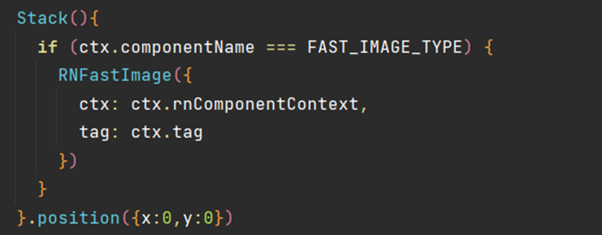
- Method 2: Directly use the third-party library of the CPP version. In this method, no other operation is required.
  
  Use the `PagerView` component of the third-party library in the `SamplePackage/MainProject/src/bundles/HomePage/HomePage.tsx` file on the React Native side.
  
  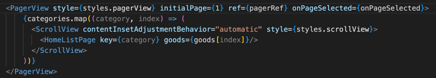

### Metro

​ In this project, Metro is used to load bundles. To use Metro, please refer to [Running Guide](#running-guide). You can modify the code on the React Native side and save it to refresh the application UI content in real time. For details, see [Metro](../../en/debugging.md#metro-hot-reloading).

  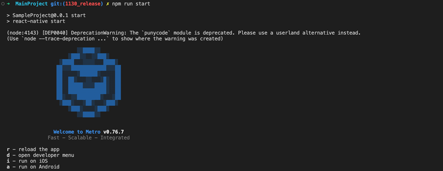

### Reload and LogBox

​ The processing needs to be performed on the service side. For details, see `rnoh/src/main/ets/RNApp.ets`.

### About the Release Version

In this release, a HAR package named **rnoh_release.har** is added. Compared with **rnoh.har** (in the debug version), the differences are as follows:
	Size: In the release version, the C++ source code is converted into a binary .so file. Therefore, the package size is much smaller.
	Application build speed: The main application build speed is significantly accelerated because the HAR package of the release version is referenced during precompilation.
	Function: The debugging function is removed from the release version. Therefore, if you want to use the JS breakpoint for debugging, you are advised to use the debug version first.
	Usage: The usage of the release version is slightly different from that of the debug version. For details, see the following information.

The usage of the release version is basically the same as that in [Creating an OpenHarmony Project](../../en/environment-setup.md#creating-an-openharmony-project). The only difference is that, in the section <Loading a HAR Package>, you need to rename the **MyApplicationReplace/entry/src/main/cpp/CMakeLists - release.txt** file **CMakeLists.txt** when replacing the **entry** folder.

For details about the differences between **CMakeLists - release.txt** and **CMakeLists.txt**, see the comments in **CMakeLists - release.txt**.

NOTE
1. If a CMake error is reported, check whether the file is of the latest version.
2. If an include file error is reported, check whether the **rnoh.har** file is of the latest version.
