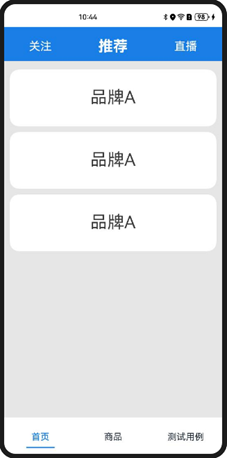
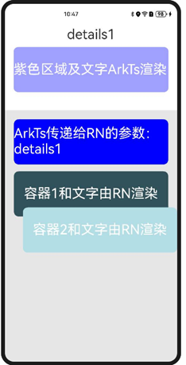
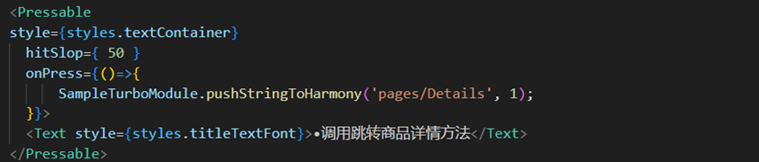

# 运行Sample工程

## 工程运行指导

​本Demo包含一个鸿蒙工程目录 `SampleApp`和一个ReactNative工程目录`SampleProject`，接下来需要使用`SampleProject`生成bundle包，并将bundle包加载到`SampleApp`中运行鸿蒙工程。

**环境变量配置：**

​ SampleApp默认为CAPI版本，该版本需要设置`RNOH_C_API_ARCH`环境变量的值为`1`。如何设置环境变量，您可以参考[配置CAPI版本环境变量](..//../zh-cn/环境搭建.md#set_capi_path)。

**React Native工程配置：**
1. 在 `SampleProject/MainProject` 目录下执行 **npm i @react-native-oh/react-native-harmony@x.x.x**或**yarn add @react-native-oh/react-native-harmony@x.x.x** 安装依赖；

2. 运行 **npm run dev:all** 生成本地bundle。执行此命令后会在`SampleApp/entry/src/main/resources/rawfile`目录下生成一个名为`bundle`和`assets`的文件夹；

3. 使用Metro生成bundle。如果您想使用Metro服务实时更新bundle，请连接真机，分别执行以下命令：
  
  ```bash
  hdc rport tcp:8081 tcp:8081
  npm run start
  ```

**鸿蒙工程配置：**

1. 在 `entry/oh-package.json5` 和根目录下的 `oh-package.json5` 中指定 `react-native-openharmony` 的版本。
2. 用 DevEco Studio 打开 `SampleApp` 执行 **Sync and Refresh Project**。
3. 点击右上角的 **run** 启动项目。

## 工程内容介绍

​ 空工程的业务内容包括首页HomePage、商品Goods、测试用例test、商品详情Detail四个模块，由React Native侧实现。在鸿蒙侧，通过加载四个业务模块的bundle包创建对应的RNSurface，最后将RNSurface嵌入ArkUI的页面组件中完成鸿蒙侧的页面构建。

- 首页：使用了三方库react-native-pager-view，实现了tabs分栏效果；
- 商品：顶部的滚动条组件由ArkUI实现自定义组件，在RN侧导入并渲染；底部提供了多个TurboModule方法的使用示例；
- 测试用例：提供了多个常用的代码示例页面；
- 商品详情：同时使用了ArkUI组件和RN组件混合渲染，并在RN组件中使用了鸿蒙侧传递过来的数据进行样式和内容的渲染。
  
| 首页 | 商品 | 测试用例 | 商品详情 |
| --- | --- | --- | ---|
| |  |  |  |

### React Native工程内容结构

​ 空工程的React Native业务代码在`SampleProject/MainProject/src/bundles`目录下，包含`HomePage`、`Goods`、`Detail`、`basic`、`test`目录。

- **React Native组件代码：**
  
  以Goods模块为例，`SampleProject/MainProject/src/bundles/Goods`目录下的`GoodsMainPage.tsx`文件调用`App()`方法创建根视图，在同目录的`index.js`文件中调用`AppRegistry.registerComponent('Goods', () => AppGoods)`注册根视图，为生成的`good.harmony.bundle`提供引用接口。另外，在`MainProject/index.js`中也对所有模块组件进行了统一注册，提供给Metro服务器使用。
- **配置本地bundle打包命令：**
  
  `SampleProject/MainProject`目录下创建了各模块bundle打包配置的`config.js`文件，例如Goods模块的配置文件为`goods.config.js`。同目录下的`package.json`文件中实现了各模块的bundle打包命令，其中`dev:all`是对所有模块打包命令的封装：
  
  

### OpenHarmony工程内容结构

​ 鸿蒙工程由一个`Tabs`组件来构建基本页面框架。在`MultiHome`组件创建了一个`Tabs`组件，`Tabs`包含的三个`TabContent`分别为`HomePage`、`Goods`和`Test`：


​ `HomePage`和`Goods`组件包含一个`BaseRN`组件（Metro服务使用的是`MetroBaseRN`），`BaseRN`是一个封装了`RNSurface`组件的基础组件，用来加载指定React Native模块视图：


### 使用TurboModule

​ `RNInstance`创建时传入在`RNPackagesFactory`中实现的`createRNPackages`，创建对应的`SampleTurboModulePackage`：


​ 在React Native侧的`basic/SampleTurboModule.tsx`中定义了`SampleTurboModule`要实现的接口，并导出 `SampleTurboModule`实例：


​ `GoodsMainPage.tsx`中使用`SampleTurboModule`调用协议里定义的方法和鸿蒙侧通信：



​ 鸿蒙侧`SampleTurboModule.ts`中实现了React Native侧定义的接口，使用`emitter`发送跳转详情页的消息：


### 使用自定义组件

​ 在`entry/src/main/cpp/ButtonView`目录下创建了自定义组件`ButtonView`，该目录下包括了组件的所有代码。

​ 在`src/main/cpp/SampleTurboModulePackage.cpp`方法中添加自定义组件的映射：


​ 在React Native侧的`basic/ButtonView.tsx`中定义了`ButtonView`的`JSI`接口：


​ `GoodsMainPage.tsx`中使用自定义组件：


### 使用三方库

​ 本工程的首页视图中使用了`react-native-pager-view`库进行开发。需要先按照[工程运行指导](#工程运行指导)的说明添加三方库依赖。

​ 使用三方库包括两种方式：

- 方式一：在CAPI版本中使用ArkTS版本的三方库。当前RN框架仅支持叶子节点的ArkTS版本的三方库，不支持容器节点的三方库。具体的使用方法为在鸿蒙侧的`buildCustomComponent`方法中添加三方库组件映射，例如`FastImage`。注意，映射需要在外侧添加一个`Stack`组件，并设置`position为(0,0)`：
  
  
- 方式二：直接使用CPP版本的三方库，此种方式无需进行其他操作，可以直接使用。
  
  在React Native侧`SamplePackage/MainProject/src/bundles/HomePage/HomePage.tsx`文件中使用三方库的`PagerView`组件：
  
  

### Metro服务

​ 本工程实现了Metro加载bundle包服务，请根据[工程运行指导](#工程运行指导)的说明启动Metro服务，您可以在修改React Native侧的代码后保存，即可实时刷新App界面内容。详细介绍可以参考[Metro](../../zh-cn/调试调测.md#metro热加载)。


### reload和logbox

​ 需要在业务侧进行处理，详见`rnoh/src/main/ets/RNApp.ets`

### 关于Release版本

本次发版新增了一个release版本的har包，命名为rnoh_release.har。跟rnoh.har（我们称为debug版本）相比，主要的区别如下：
	大小：release版本中我们将C++源码转换成了二进制so文件，因此大小明显小了很多
	应用构建速度：由于做了预编译，引用release版本的har包，主应用的构建速度会明显加快
	功能：release版本去除了调试功能，因此想用JS断点调试的话建议先使用debug版本
	用法：release版本的使用方法跟debug版本小有区别，详见如下：

Release版本用法跟[创建鸿蒙工程](../../zh-cn/环境搭建.md#创建鸿蒙工程)这一节基本上是一致的，唯一的区别点是<加载har包>这一节中【替换entry文件夹内容】时需要将MyApplicationReplace/entry/src/main/cpp/CMakeLists - release.txt文件重命名为CMakeLists.txt。

CMakeLists - release.txt与原CMakeLists.txt的区别详见CMakeLists - release.txt里的注释说明。

注意：
1. 如果出现CMake报错先确认是否该文件是否是最新版
2. 如果出现inclue文件报错先确认rnoh.har是否是最新版