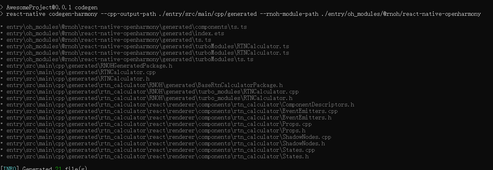
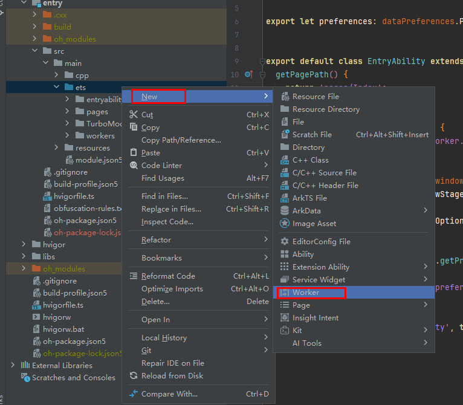
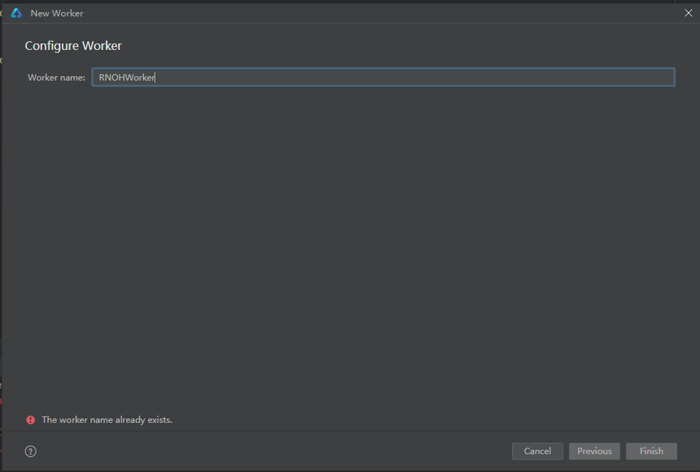

This documentation is based on React Native documentation licensed under the [CC-BY-4.0](https://creativecommons.org/licenses/by/4.0/) license at https://reactnative.cn/docs/0.72/the-new-architecture/pillars-turbomodules. © Meta Platforms Inc. Changed to How to create a TurboModule on OpenHarmony.

# Implementation of a Custom TurboModule

## Implementation of ArkTS TurboModule

### Directory Structure

You can declare TurboModule as a module and add it to your project as a dependency.

You can create a `RTNCalculator` directory at the same level as the `MyApp` directory of the React Native project, create a `src/specs` subdirectory, and create the `v1` and `v2` subdirectories based on the Codegen version. The directory structure is as follows:
```
├── MyApp
└── RTNCalculator
    └── src
        └── specs
            ├── v1
            └── v2
```

### JavaScript API Declaration

Create `index.ts` in the `RTNCalculator` directory and export the API declaration file. The NativeCalculator.ts file is stored in the `v1` or `v2` directory as required. In this example, the file is stored in the `V2` directory. The API declaration file can be compiled using the [Flow](https://flow.org/) or [TypeScript](https://www.typescriptlang.org/) language.

```TypeScript
// index.ts
import NativeCalculator from "./src/specs/v2/NativeCalculator";

export const RTNCalculator = NativeCalculator;
```

> `npm` does not pack empty folders. You need to create a `.gitkeep` file to save the **v1** directory.

Note that the file must meet the following requirements. For details, see [React Native](https://reactnative.cn/docs/0.72/the-new-architecture/pillars-turbomodules#2-%E5%A3%B0%E6%98%8E-javascript-%E6%8E%A5%E5%8F%A3).

- The file must be named using `Native<MODULE_NAME>`. Codegen finds only the files that match these naming rules.
- The `TurboModuleRegistrySpec` object must be output from the code.

```JavaScript
// NativeCalculator.ts
import type {TurboModule} from 'react-native/Libraries/TurboModule/RCTExport';
import {TurboModuleRegistry} from 'react-native';

export interface Spec extends TurboModule {
  add(a: number, b: number): Promise<number>;
}

export default TurboModuleRegistry.get<Spec>(
  'RTNCalculator',
) as Spec | null;
```

### Module Configuration
Add `package.json` to the `RTNCalculator` directory.
```json
{
  "name": "rtn-calculator",
  "version": "1.0.0",
  "description": "Add numbers with TurboModules",
  "main": "index.ts",
  "keywords": [],
  "author": "<Your Name> <your_email@your_provider.com> (https://github.com/<your_github_handle>)",
  "license": "ISC",
  "harmony": {
    "alias": "rtn-calculator",
    "codegenConfig": [
      {
        "version": 1,
        "specPaths": [
            "./src/specs/v1"
        ]
      },
      {
        "version": 2,
        "specPaths": [
          "./src/specs/v2"
        ]
      }
    ]
  },
  "files": [
    "index.ts",
    "src/*",
    "harmony.tar.gz"
  ],
  "peerDependencies": {
    "react": "*",
    "react-native": "*"
  },
  "devDependencies": {
    "@types/react": "^18.2.47",
    "react": "18.2.0",
    "react-native": "0.72.5"
  },
  "dependencies": {}
}
```
The preceding file contains some common descriptive information, such as the package name, version, and author information. You need to set the placeholder by using `<>`.
In addition, the configuration declaration of OpenHarmony uses the `harmony` field, which contains the following two fields:
  - `alias`: alias of the module.
  - `codegenConfig`: file for storing the object array of a third-party library to be generated. Each object contains two fields:
    - `version`: Codegen version used by the third-party library. Values: {1, 2}.
    - `specPaths`: relative path of the API declaration file.


### Native Code

#### Using Codegen to Generate Native Code

For details about how to use Codegen, see [Codegen](Codegen.md).

1. Add commands to the original project.
   
    Add the Codegen-related scripts to `package.json` in `MyApp`.
    ```diff
    {
      "name": "MyApp",
      "version": "0.0.1",
      "private": true,
      "scripts": {
        ···
    +  "codegen": "react-native codegen-harmony --cpp-output-path ./entry/src/main/cpp/generated --rnoh-module-path ./entry/oh_modules/@rnoh/react-native-openharmony"
      },
      ···
    }
    ```
2. Call the scripts to generate code.

    > `npm` does not pack empty folders. You can retain the directory by implementing `.gitkeep`.
    ```bash
    cd RTNCalculator
    npm pack
    cd ../MyApp
    npm i file:../RTNCalculator/rtn-calculator-1.0.0.tgz
    npm run codegen
    ```
    
After the execution is successful, copy the generated glue code to your OpenHarmony project.


#### Writing Native OpenHarmony Code

1. Create a `CalculatorModule.ts` file.

    Create the `turbomodule` folder in the `entry/src/main/ets` directory and add `CalculatorModule.ts` to the folder.
    For **CxxTurboModule**, you do not need to implement it here. Leave the function body empty.
    For **ArkTSTurboModule**, add the following code:

    ```TypeScript
    // entry/src/main/ets/turbomodule/CalculatorModule.ts
    import { TurboModule } from '@rnoh/react-native-openharmony/ts';
    import { TM } from '@rnoh/react-native-openharmony/generated/ts';

    export class CalculatorModule extends TurboModule implements TM.RTNCalculator.Spec {
      add(a: number, b: number): Promise<number>{
        return Promise.resolve(a+b);
      }
    }
    ```
    For **CxxTurboModule**, you do not need to implement it here. You only need to ensure that the parameter type and return type of the function are correct.

    ```typescript
    // entry/src/main/ets/turbomodule/CalculatorModule.ts
    import { TurboModule } from '@rnoh/react-native-openharmony/ts';
    import { TM } from '@rnoh/react-native-openharmony/generated/ts';

    export class CalculatorModule extends TurboModule implements TM.RTNCalculator.Spec {
      add(a: number, b: number): Promise<number>{
        return Promise.resolve(123456);
      }
    }
    ```
2. Create the implementation file `GeneratedPackage.ets` of the package.

    Create `GeneratedPackage.ets` in the `entry/src/main/ets` directory and add the following code:
    ```TypeScript
    // entry/src/main/ets/GeneratedPackage.ets
    import { RNPackage, TurboModulesFactory } from '@rnoh/react-native-openharmony/ts';
    import type {
      TurboModule,
      TurboModuleContext
    } from '@rnoh/react-native-openharmony/ts';
    import { TM } from "@rnoh/react-native-openharmony/generated/ts"
    import { CalculatorModule } from './turbomodule/CalculatorModule';
    class GeneratedTurboModulesFactory extends TurboModulesFactory {
      createTurboModule(name: string): TurboModule | null {
        if (name === TM.RTNCalculator.NAME) {
          return new CalculatorModule(this.ctx);
        }
        return null;
      }
      hasTurboModule(name: string): boolean {
        return name === TM.RTNCalculator.NAME;
      }
    }
    export class GeneratedPackage extends RNPackage {
      createTurboModulesFactory(ctx: TurboModuleContext): TurboModulesFactory {
        return new GeneratedTurboModulesFactory(ctx);
      }
    }
    ```
    Note the following:

    - Use `export` for the class that inherits `RNPackage`. The class implements `createTurboModulesFactory`, which is used to create the factory class of TurboModule.
    - The following two methods must be implemented in the project class:
      - `createTurboModule`: creates the TurboModulele class based on the name.
      - `hasTurboModule`: determines whether the TurboModule corresponding to the name exists.
    - Add the method of creating the package to `entry/src/main/ets/RNPackagesFactory.ets`.
    ```diff
    import { RNPackageContext, RNPackage } from '@rnoh/react-native-openharmony/ts';
    import {SamplePackage} from '@rnoh/sample-package/src/main/ets/SamplePackage';
    + import { GeneratedPackage } from './GeneratedPackage';

    export function createRNPackages(ctx: RNPackageContext): RNPackage[] {
      return [
        new SamplePackage(ctx),
    +    new GeneratedPackage(ctx)
      ];
    }
    ```
3. For **CxxTurboModule**, some additional steps are required:

   For details about **CxxTurbomodule**, expand the macro `ARK_ASYNC_METHOD_METADATA` in the glue code file `RTNCalculator.cpp`.

    ```diff
    #include "RTNCalculator.h"

    namespace rnoh {
    using namespace facebook;

    RTNCalculator::RTNCalculator(const ArkTSTurboModule::Context ctx, const std::string name) : ArkTSTurboModule(ctx, name) {
        methodMap_ = {
    -       ARK_ASYNC_METHOD_METADATA(add, 2),
    +       { "add",
    +         { 2,
    +           [] (facebook::jsi::Runtime& rt, facebook::react::TurboModule& turboModule, const facebook::jsi::Value* args, size_t count) {
    +             return static_cast<ArkTSTurboModule&>(turboModule).callAsync(rt, "add", args, count);
    +           } 
    +         } 
    +       }
        };
    }

    } // namespace rnoh

    ```

    Delete the asynchronous bridge call to **ArkTSTurboModule** from the lambda expression and perform direct implementation.

    ```diff
    #include "RTNCalculator.h"

    namespace rnoh {
    using namespace facebook;

    RTNCalculator::RTNCalculator(const ArkTSTurboModule::Context ctx, const std::string name) : ArkTSTurboModule(ctx, name) {
        methodMap_ = {
           { "add",
             { 2,
               [] (facebook::jsi::Runtime& rt, facebook::react::TurboModule& turboModule, const facebook::jsi::Value* args, size_t count) {
    -             return static_cast<ArkTSTurboModule&>(turboModule).callAsync(rt, "add", args, count);
    +             return jsi::Value(args[0].asNumber() + args[1].asNumber());
               } 
             } 
           }
        };
    }

    } // namespace rnoh

    ```

4. The subsequent steps vary according to the Codegen version in use:
#### V1 Version
1. Add the new glue code file to `CMakeLists.txt`.
   
    Define the **generated** path of .cpp file in `entry/src/main/cpp/CMakeLists.txt` and add the path to the build.
    ```diff
    project(rnapp)
    cmake_minimum_required(VERSION 3.4.1)
    set(CMAKE_SKIP_BUILD_RPATH TRUE)
    set(OH_MODULE_DIR "${CMAKE_CURRENT_SOURCE_DIR}/../../../oh_modules")
    set(RNOH_APP_DIR "${CMAKE_CURRENT_SOURCE_DIR}")

    set(RNOH_CPP_DIR "${OH_MODULE_DIR}/@rnoh/react-native-openharmony/src/main/cpp")
    set(RNOH_GENERATED_DIR "${CMAKE_CURRENT_SOURCE_DIR}/generated")
    set(CMAKE_ASM_FLAGS "-Wno-error=unused-command-line-argument -Qunused-arguments")
    set(CMAKE_CXX_FLAGS "-fstack-protector-strong -Wl,-z,relro,-z,now,-z,noexecstack -s -fPIE -pie")
    add_compile_definitions(WITH_HITRACE_SYSTRACE)
    set(WITH_HITRACE_SYSTRACE 1) # for other CMakeLists.txt files to use

    add_subdirectory("${RNOH_CPP_DIR}" ./rn)

    # RNOH_BEGIN: add_package_subdirectories
    add_subdirectory("${OH_MODULE_DIR}/@rnoh/sample-package/src/main/cpp" ./sample-package)
    # RNOH_END: add_package_subdirectories

    + file(GLOB GENERATED_CPP_FILES "./generated/*.cpp")
    add_library(rnoh_app SHARED
    +     ${GENERATED_CPP_FILES}
        "./PackageProvider.cpp"
        "${RNOH_CPP_DIR}/RNOHAppNapiBridge.cpp"
    )

    target_link_libraries(rnoh_app PUBLIC rnoh)

    # RNOH_BEGIN: link_packages
    target_link_libraries(rnoh_app PUBLIC rnoh_sample_package)
    # RNOH_END: link_packages
    ```
2. Create the **package** object of CPP in `entry/src/main/cpp/PackageProvider.cpp`.
    ```diff
    #include "RNOH/PackageProvider.h"
    #include "SamplePackage.h"
    + #include "generated/RNOHGeneratedPackage.h"

    using namespace rnoh;

    std::vector<std::shared_ptr<Package>> PackageProvider::getPackages(Package::Context ctx) {
        return {
    +         std::make_shared<RNOHGeneratedPackage>(ctx), 
            std::make_shared<SamplePackage>(ctx)
        };
    }
    ```


#### V2 Version

1. Add the new glue code file to `CMakeLists.txt`.
   
   In this step, use `add_library` and `target_include_directories` to add the generated Codegen files to the build task in the CMake file.
    ```diff
    project(rnapp)
    cmake_minimum_required(VERSION 3.4.1)
    set(CMAKE_SKIP_BUILD_RPATH TRUE)
    set(OH_MODULE_DIR "${CMAKE_CURRENT_SOURCE_DIR}/../../../oh_modules")
    set(RNOH_APP_DIR "${CMAKE_CURRENT_SOURCE_DIR}")

    set(RNOH_CPP_DIR "${OH_MODULE_DIR}/@rnoh/react-native-openharmony/src/main/cpp")
    + set(RNOH_GENERATED_DIR "${CMAKE_CURRENT_SOURCE_DIR}/generated")
    set(CMAKE_ASM_FLAGS "-Wno-error=unused-command-line-argument -Qunused-arguments")
    set(CMAKE_CXX_FLAGS "-fstack-protector-strong -Wl,-z,relro,-z,now,-z,noexecstack -s -fPIE -pie")
    add_compile_definitions(WITH_HITRACE_SYSTRACE)
    set(WITH_HITRACE_SYSTRACE 1) # for other CMakeLists.txt files to use

    add_subdirectory("${RNOH_CPP_DIR}" ./rn)

    # RNOH_BEGIN: add_package_subdirectories
    add_subdirectory("${OH_MODULE_DIR}/@rnoh/sample-package/src/main/cpp" ./sample-package)
    # RNOH_END: add_package_subdirectories

    + set(rtn_calculator_generated_dir "${RNOH_GENERATED_DIR}/rtn_calculator")
    + file(GLOB_RECURSE rtn_calculator_generated_dir_SRC "${rtn_calculator_generated_dir}/**/*.cpp")
    + file(GLOB rtn_calculator_package_SRC CONFIGURE_DEPENDS *.cpp)
    add_library(rnoh_app SHARED
    +     ${rtn_calculator_generated_dir_SRC}
    +     ${rtn_calculator_package_SRC}
        "./PackageProvider.cpp"
        "${RNOH_CPP_DIR}/RNOHAppNapiBridge.cpp"
    )

    + target_include_directories(rnoh_app PUBLIC ${rtn_calculator_generated_dir})

    target_link_libraries(rnoh_app PUBLIC rnoh)

    # RNOH_BEGIN: link_packages
    target_link_libraries(rnoh_app PUBLIC rnoh_sample_package)
    # RNOH_END: link_packages
    ```
2. Create the **package** object of CPP in `entry/src/main/cpp/PackageProvider.cpp`.
   
    ```diff
    #include "RNOH/PackageProvider.h"
    #include "SamplePackage.h"
    + #include "generated/rtn_calculator/RNOH/generated/BaseRtnCalculatorPackage.h"

    using namespace rnoh;

    std::vector<std::shared_ptr<Package>> PackageProvider::getPackages(Package::Context ctx) {
        return {
            std::make_shared<SamplePackage>(ctx),
    +         std::make_shared<BaseRtnCalculatorPackage>(ctx)
        };
    }
    ```

#### Setting the Custom TurboModule to Run in the Worker Thread

1. To create a TurboModule that runs in the worker thread, perform the following steps:

    ```typescript
    // entry/src/main/ets/GeneratedPackage.ets
    import { RNPackage, AnyThreadTurboModuleFactory } from '@rnoh/react-native-openharmony/ts';
    import type {
      AnyThreadTurboModule,
      AnyThreadTurboModuleContext
    } from '@rnoh/react-native-openharmony/ts';
    import { TM } from "@rnoh/react-native-openharmony/generated/ts"
    import { CalculatorModule } from './turbomodule/CalculatorModule';
    class GeneratedTurboModulesFactory extends AnyThreadTurboModuleFactory {
      createTurboModule(name: string): AnyThreadTurboModule | null {
        if (name === TM.RTNCalculator.NAME) {
          return new CalculatorModule(this.ctx);
        }
        return null;
      }
      hasTurboModule(name: string): boolean {
        return name === TM.RTNCalculator.NAME;
      }
    }
    export class GeneratedPackage extends RNPackage {
      createAnyThreadTurboModuleFactory(ctx: AnyThreadTurboModuleContext): AnyThreadTurboModuleFactory {
        return new GeneratedTurboModulesFactory(ctx);
      }
    }
    ```
    To run the `CalculatorModule.ets` method on the worker thread, add the corresponding implementation code:

    ```typescript
    // entry/src/main/ets/turbomodule/CalculatorModule.ets
    import { AnyThreadTurboModule } from '@rnoh/react-native-openharmony/ts';
    import { TM } from '@rnoh/react-native-openharmony/generated/ts';

    export class CalculatorModule extends AnyThreadTurboModule implements TM.RTNCalculator.Spec {
      add(a: number, b: number): Promise<number>{
        return Promise.resolve(a+b);
      }
      ...
    }
    ```
    Note that:

   - `GeneratedPackage` should inherit the `RNPackage` class, and `createAnyThreadTurboModuleFactory` should be implemented, to create `AnyThreadTurboModuleFactory`.
      - The type of the **ctx** parameter of the `createAnyThreadTurboModuleFactory` method should be set to `AnyThreadTurboModuleContext`, and the return value type should be `AnyThreadTurboModuleFactory`.
   - `GeneratedTurboModulesFactory` should inherit `AnyThreadTurboModuleFactory`.
   - The following two methods must be implemented in `GeneratedTurboModulesFactory`:
      - `createTurboModule`: used to create the corresponding `AnyThreadTurboModule` class based on the name or returns `null`.
      - `hasTurboModule`: used to determine whether the TurboModule corresponding to the name exists.
   - The `CalculatorModule` class of TurboModule should inherit `AnyThreadTurboModule`.

2. Configure TurboModule to run in the worker thread. `getRNOHWorkerScriptUrl` should be reloaded after RNability is inherited. The code is modified as follows:
    ```typescript
    // entry/src/main/ets/entryability/EntryAbility.ets
    import {RNAbility} from '@rnoh/react-native-openharmony';

    export default class EntryAbility extends RNAbility {
    +  override getRNOHWorkerScriptUrl() {
    +    return "entry/ets/workers/RNOHWorker.ets"
    +  }
    ...
    }
    ```
   Right-click the **ets** directory, choose `New`, and select `Worker` in the menu on the right.
   
   Enter `RNOHWorker.ets` in the window that is displayed.
   
   The directory structure is as follows:
    ```
    └── ets
        ├── entryability
        ├── page
        ├── rn
        └── workers
            └── RNOHWorker.ets         
    ```
    Change `RNOHWorker.ets` to the following code:
    ```typescript
    // entry/src/main/ets/worker/RNOHWorker.ets
    import { setupRNOHWorker } from "@rnoh/react-native-openharmony/src/main/ets/setupRNOHWorker";
    import { createRNPackages } from '../RNPackagesFactory';

    setupRNOHWorker({
      createWorkerRNInstanceConfig: (_rnInstanceName) => {
        return { thirdPartyPackagesFactory: createRNPackages }
      }
    })
    ```

### TurboModule Usage

Now, you can use TurboModule in your application. The following is an example:
```javascript
/**
 * Sample React Native App
 * https://github.com/facebook/react-native
 *
 * @format
 * @flow strict-local
 */
import React from 'react';
import {useState} from 'react';
import type {Node} from 'react';
import {
  SafeAreaView,
  StatusBar,
  Text,
  Button,
} from 'react-native';
import { RTNCalculator } from 'rtn-calculator';

const App: () => Node = () => {
  const [result, setResult] = useState<number | null>(null);
  return (
    <SafeAreaView>
      <StatusBar barStyle={'dark-content'} />
      <Text style={{marginLeft: 20, marginTop: 20}}>
        3+7={result ?? '??'}
      </Text>
      <Button
        title="Compute"
        onPress={async () => {
          const value = await RTNCalculator.add(3, 7);
          setResult(value);
        }}
      />
    </SafeAreaView>
  );
};
export default App;
```
