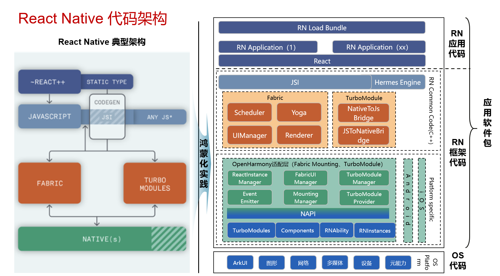
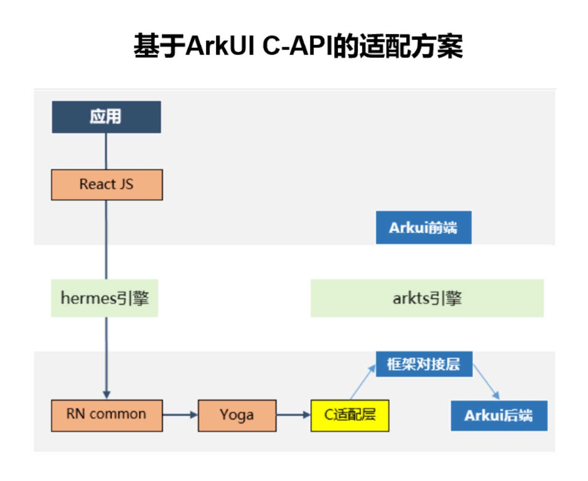
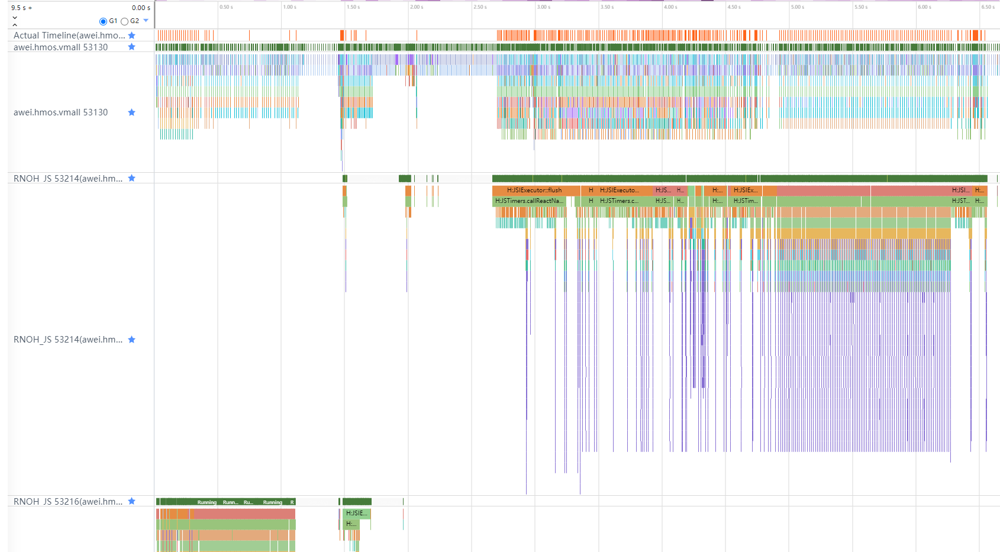
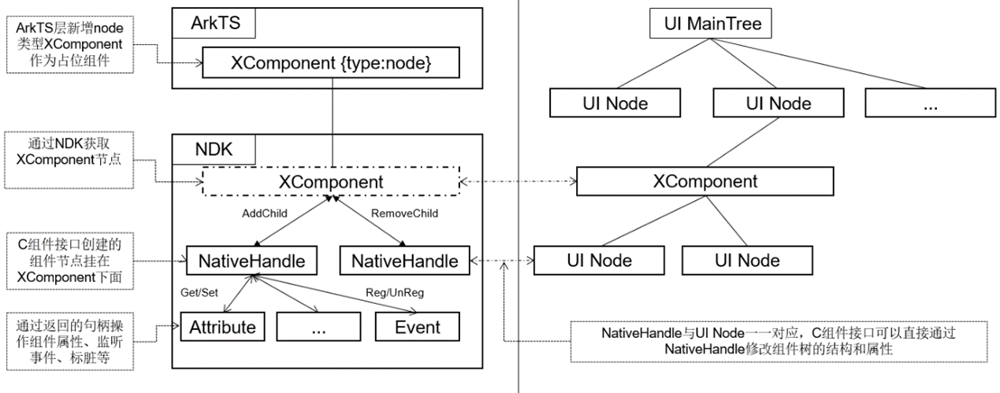
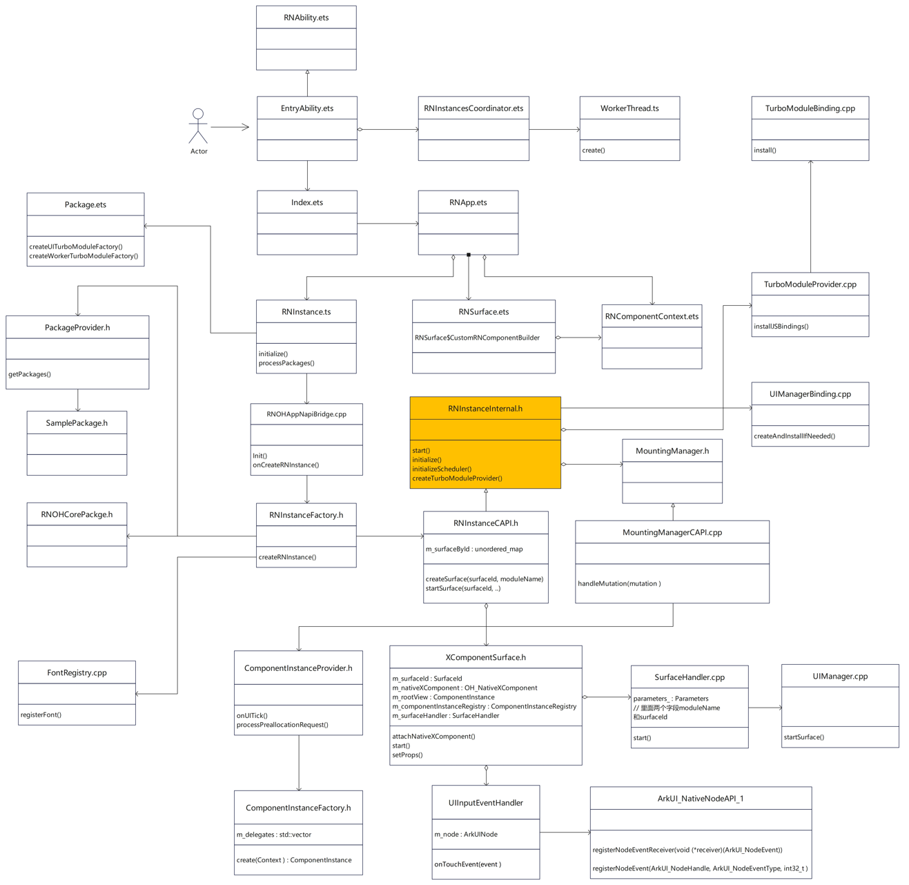

# Architecture

For details about the **RN** architecture, see [React Native](https://reactnative.dev/architecture/overview).

## RNOH Architecture



As shown in the figure, React Native for OpenHarmony is adapted to the new architecture (0.68 and later versions) of React Native. There are the following functions:

- **RN** app code: service code implemented by developers.
- **RN** library code: encapsulation and declaration of components and APIs provided by React Native for developers.
- JavaScript Interface (JSI): API used for communication between JavaScript and CPP.
- React Common: CPP code that is common to all platforms. It is used to preprocess the data sent from **RN**.
- OpenHarmony adaptation code: receives and processes data from React Common, connects to native code, and calls native components and APIs of ArkUI. It consists of two parts: TurboModule and Fabric.
- OS code: interconnects with the bottom-layer functions of the system and performs rendering or implements corresponding functions based on the data sent from the adaptation layer code.

## RN Library Code

- In the current React Native, many attributes are encapsulated on the React side and are platform-specific. To achieve this effect, React Native adds many judgments based on `Platform` on the JS side. Therefore, the platform judgments related to `HarmonyOS` and the encapsulation of corresponding component attributes need to be added for implementing React Native for OpenHarmony. To address this issue, the OpenHarmony team provides a .tgz package of `react-native-harmony` and applies the .tgz package to Metro Bundler by modifying `metro.config.js`.
- React Native also provides encapsulation of many libraries, such as Codegen and bundle tools. The OpenHarmony team provides the `react-native-harmony-cli` package to adapt the libraries to the `HarmonyOS` platform.

## Fabric

Fabric is the component rendering system of React Native. It receives component information from React Native, processes the information, and sends it to the native OS. The OS renders the page.



In the adaptation solution, components are not connected to the declarative paradigm of ArkUI through a complex process. Instead, they are directly connected to the backend API of ArkUI through [XComponent](#xcomponent-access) for rendering, which shortens the process and improves component rendering efficiency. The performance benefits of C-API include the following parts:

- C minimization and no cross-language component creation and attribute settings.
- Data format conversion before crossing languages. Data types such as `string` and `enum` do not need to be converted to `object`. The corresponding data can be directly used for processing on the CPP.
- Attribute Diff. This avoids repeated settings.

For details about the render pipeline, see [Three Rendering Phases](three-rendering-phases.md).

## TurboModule


TurboModule is used for interaction between JavaScript and native code in React Native. It provides a mechanism for RN JS applications to invoke system capabilities. Based on whether HarmonyOS-related capabilities are required, there are cxxTurboModule and ArkTSTurboModule.

1. ArkTSTurboModule:
    - ArkTSTurboModule provides React Native with methods for calling native ArkTS APIs.There are two types: synchronous and asynchronous.
    - ArkTSTurboModule depends on **NAPI** to implement communication between the native code and CPP, including the type conversion between JS and C, implementations of synchronous and asynchronous calls, and more.
2. cxxTurboModule:
    - cxxTurboModule provides capabilities that do not require system participation. For example, `NativeAnimatedTurboModule` provides data computing capabilities.
    - **cxxTurboModule** does not depend on the native APIs of the system.To improve the communication efficiency, this module is implemented on the CPP side, which reduces the communications between the native and CPP and improves the performance.

## React Native Thread Model

### RNOH Thread Model

There are four RNOH threads:

```cpp
enum TaskThread {
  MAIN = 0, // main thread running the eTS event loop
  JS, // React Native's JS runtime thread
  BACKGROUND, // background tasks queue
  WORKER, // used by some turbo modules
};
```

#### MAIN/UI Thread

Main thread of the **RN** service, also the main thread and UI thread of the application. This thread has a unique instance in the application.

**RN** provides the following functions in the **MAIN** thread:

- Lifecycle management of ArkUI components: CREATE, UPDATE, INSERT, REMOVE, DELETE;
- ArkUI component tree management;
- RN TurboModule service function running;
- Interaction event and message processing.

#### JS Thread

A JS thread executes the React (JS) code through the VM, and interacts with the core code of RN Common through the React code to complete the Render phase tasks of React Native.

**RN** provides the following functions in the JS thread:

- Loads a bundle and executes the React code on which the bundle depends and the service code of the bundle.
- Driven by the React service code, creates an RN ShadowTree and set the attributes of ShadowTree.
- Implements component layout and text measurement and layout based on the Yoga engine.
- Compares the old and new ShadowTrees and generates the difference result mutations. Submits mutations to the **MAIN** thread to trigger the display refresh of Native.
- Processes interaction events and messages.

A JS thread is bound to an `RNInstance`. Multiple `RNInstances` indicate multiple JS threads.

#### BACKGROUND Thread

The **BACKGROUND** thread is an experimental feature of **RN**. After the **BACKGROUND** thread is enabled, some layout and ShadowTree comparison tasks of the JS thread are migrated to this thread for execution, reducing the load of the JS thread.

Enabling the **BACKGROUND** thread involves complex inter-thread communication, which brings risks to stability. Therefore, do not enable the **BACKGROUND** thread in the commercial edition.

#### WORKER Thread

The WORKER thread is a new feature of RNSDK700. You need to inherit `RNAbility` and override the `getRNOHWorkerScriptUrl` method to configure the startup file path of the worker thread.
 

The worker thread provides the following functions:

- Runs TurboModule to prevent the TurboModule communication and the UI drawing logic of the main thread from competing for limited main thread resources.
- Enables TurboModule communication.

### Long-Term Evolution of RNOH Threads

The **MAIN** and JS threads bear all services of the **RN** framework, which may cause performance bottlenecks in heavy load scenarios. The **RN** service is also affected by other application code of the same thread, causing problems such as execution delay or blocking.

During long-term evolution, thread extension can be considered:

- Add a unique **TM** thread to execute the TurboModule service code, reducing the load of the **MAIN** thread.
- Add an independent **TIMER** thread to ensure that the time reference is stable.

### Typical Thread Traces

- Thread ID 53130: MAIN thread
- Thread ID 53214: JS thread instance 1
- Thread ID 53216: JS thread instance 2



## Command Components
### XComponent Access



In the CAPI version, the XComponent is used in two steps:

1. `XComponentSurface` is created when `createSurface` is used.
2. `XComponentSurface` of CPP is attached to `XComponent` of ArkUI when `startSurface` is used.

`createSurface` does the following operations:

1. Create `XComponentSurface` and record it in the map.

    ```CPP
    void RNInstanceCAPI::createSurface(
    facebook::react::Tag surfaceId,
    std::string const& moduleName) {
    m_surfaceById.emplace(
        surfaceId,
        XComponentSurface(
            ···
            surfaceId,
            moduleName));
    }
    ```

2. Create a rootView in `XComponentSurface` to mount C-API components and handle touch events in the Surface.

    ```CPP
    XComponentSurface::XComponentSurface(
    ···
    SurfaceId surfaceId,
    std::string const& appKey)
    : 
      ···
      m_nativeXComponent(nullptr),
      m_rootView(nullptr),
      m_surfaceHandler(SurfaceHandler(appKey, surfaceId)) {
    m_scheduler->registerSurface(m_surfaceHandler);
    m_rootView = componentInstanceFactory->create(
        surfaceId, facebook::react::RootShadowNode::Handle(), "RootView");
    m_componentInstanceRegistry->insert(m_rootView);
    m_touchEventHandler = std::make_unique<SurfaceTouchEventHandler>(m_rootView);
    }
    ```

`startSurface` does the following operations:

1. Create `XComponent` on ArkTS and set the `id`, `type`, and `libraryname` attributes. Specifically:
    - **id**: unique identifier of a component, which consists of `InstanceID` and `SurfaceID` to record the instance and surface to which `XComponent` belongs.
    - **type**: `node`, indicating that `XComponent` is a placeholder component. The component is implemented on the CAPI side.
    - **libraryname**: .so library in which a CAPI component is implemented. After the .so library is loaded, the `Init` function defined in the .so library is automatically called. The default .so file name of React Native for OpenHarmony is `rnoh_app`.

    ```TypeScript
    XComponent({
        id: this.ctx.rnInstance.getId() + "_" + this.surfaceHandle.getTag(),
        type: "node",
        libraryname: 'rnoh_app'
    })
    ```

2. Call the `registerNativeXComponent` function in `Init` on the CPP side. In this function, `OH_NativeXComponent_GetXComponentId` is called to obtain the ID set by ArkTS and find the corresponding instance and surface based on the ID. In addition, it obtains the `nativeXComponent` object to record `XComponent` on the ArkTS side.

    ```CPP
    if (OH_NativeXComponent_GetXComponentId(nativeXComponent, idStr, &idSize) !=
      OH_NATIVEXCOMPONENT_RESULT_SUCCESS) {
        ···
    }
    std::string xcomponentStr(idStr);
    std::stringstream ss(xcomponentStr);
    std::string instanceId;
    std::getline(ss, instanceId, '_');
    std::string surfaceId;
    std::getline(ss, surfaceId, '_');
    ```

3. Call `OH_NativeXComponent_AttachNativeRootNode` to attach the rootView recorded in `XComponentSurface` to `XComponent` on the ArkTS side.

    ```CPP
    OH_NativeXComponent_AttachNativeRootNode(
        nativeXComponent,
        rootView.getLocalRootArkUINode().getArkUINodeHandle());
    ```
4. After the rootView is attached to `XComponent`, the rootView is used as the root node of the CAPI component, and subsequent child nodes are inserted into the component tree one by one by using the mutation command.

### CAPI Component's Interconnection to RN Commands
1. At the **RN** OpenHarmony adaptation layer, `SchedulerDelegate.cpp` processes the commands delivered by RN Common.

    ```CPP
    void SchedulerDelegate::schedulerDidFinishTransaction(MountingCoordinator::Shared mountingCoordinator) {
        ...
    }
    ```
2. The commands are processed in `didMount` of **MountingManagerCAPI.cpp**.

    ```CPP
    MountingManagerCAPI::didMount(MutationList const& mutations) {
        ...
    }
    ```
In the `didMount` function, the commands of the ArkTs and CAPI components are obtained based on the pre-configured `arkTsComponentNames` and processed separately. The commands of the CAPI component are traversed in the `handleMutation` method and are processed differently based on the command type (Create, Delete, Insert, Remove, or Update).

- **Create**: creates a ComponentInstance of the corresponding component type based on the **tag**, **componentName**, and **componentHandle** in the command. For example, the Create command of the Image component creates the corresponding ImageComponentInstance. After the component is created, the `updateComponentWithShadowView` method is called to set the component information. **setLayout** specifies the layout of the component, **setEventEmitter** specifies the event emitter of the component, **setState** specifies the state of the component, and **setProps** specifies the properties of the component.

- **Delete**: deletes the ComponentInstance of the component according to the tag.

- **Insert**: inserts a child node into the parent node according to the tag.

- **Remove**: removes a child node from the parent node according to the tag.

- **Update**: updates the component information by calling **setLayout**, **setEventEmitter**, **setState**, and **setProps**.

### Event Distribution Logic at the Adaptation Layer

#### 1. Registering Events

After a finger touches the screen, the corresponding node is hit, and the corresponding event is sent through callback. However, the event needs to be registered. For example, a stack node is registered with the NODE_ON_CLICK event.
```cpp
StackNode::StackNode()
:ArkUINode(NativeNodeAPi::getInstance()->createNode(ArkUI_NodeType::ARKUI_NODE_STACK)),
    m_stackNodeDelegate(nullptr)
    {
        maybeThrow(NativeNodeApi::getInstance()->registerNodeEvent(m_nodeHandle,NODE_ON_CLICK,0,this));
        maybeThrow(NativeNodeApi::getInstance()->registerNodeEvent(m_nodeHandle,NODE_ON_HOVER,0,this));
    }
```
SurfaceTouchEventHandler is registered with NODE_TOUCH_EVENT.
```cpp
SurfaceTouchEventHandler(
    ComponentInstance::Shared rootView,
    ArkTSMessageHub::Shared arkTSMessageHub,int rnInstanceId):
    ArkTSMessageHub::Observer(arkTSMessageHub),
    m_rootView(std::move(rootView)),
    m_rnInstanceId(rnInstanceId)
    {
        ArkUINodeRegistry::getInstance().registerTouchHandler(
            &m_rootView->getLocalRootArkUINode(),this);
            NativeNodeApi::getInstance()->registerNodeEvent(
                m_rootView->getLocalRootArkUINode().getArkUINodeHandle(),
                NODE_TOUCH_EVENT,
                NODE_TOUCH_EVENT,
                this);
    }
```

#### 2. Receiving Events

A callback is registered in the constructor of ArkUINodeRegistry. When the node where the event is registered is hit, the event is transferred and processed through the callback.
```cpp
ArkUINodeRegistry::ArkUINodeRegistry(ArkTSBridge::Shared arkTSBridge):m_arkTSBridge(std::move(arkTSBridge))
{
    NativeNodeApi::getInstance()->registerNodeEventReceiver(
        [](ArkUI_NodeEvent* event){
            ArkUINodeRegistry::getInstance().receiveEvent(event);
            });
}
```

#### 3. Handling Events

The `event` parameter passed by the callback obtains the event type through `OH_ArkUI_NodeEvent_GetEventType` and obtains the node pointer that triggers the event through `OH_ArkUI_NodeEvent_GetNodeHandle`.
```cpp
auto eventType = OHArkUI_NodeEvent_GetEventType(event);
auto node = OH_ArkUI_NodeEvent_GetNodeHandle(event);
```
Check whether the event type is `Touch`. If yes, search for the corresponding **TouchEventHandler** in a map that stores all `TouchEventHandler`s using the node pointer as the key. If the **TouchEventHandler** is not found, do not handle the `Touch` event.
```cpp
if(eventType == ArkUI_NodeEventType::NODE_TOUCH_EVENT)
{
    auto it = m_touchHandlerByNodeHandle.find(node);
    if(it == m_touchHandlerByNodeHandle.end())
    {
        return;
    }
}
```
If the corresponding **TouchEventHandler** is found, obtain the input event pointer through `OH_ArkUI_NodeEvent_GetInputEvent`. If the input event pointer is not null, check whether the type of the input event pointer is `Touch` through `OH_ArkUI_UIInputEvent_GetType`. If not, do not handle the `Touch` event.
```cpp
auto inputEvent = OH_ArkUI_NodeEvent_GetInputEvent(event);
if(inputEvent == nullptr || OH_ArkUI_UIInputEvent_GetType(inputEvent) != ArkUI_UIInputEvent_Type::ARKUI_UIINPUTEVENT_TYPE_TOUCH)
{
    return;
}
```
If the preceding two conditions are met, handle the `Touch` event through `TouchEventHandler`.
```cpp
it->second->onTouchEvent(inputEvent);
```
If the event type is not `Touch`, search for the corresponding ArkUINode in a map that stores all ArkUINodes using the node pointer as the key. If the ArkUINode is not found, do not handle the event.
```cpp
auto it = m_nodeByHandle.find(node);
if(it == m_nodeByHandle.end())
{
    return;
}
```
If the corresponding ArkUINode is found, obtain the component event pointer through `OH_ArkUI_NodeEvent_GetNodeComponentEvent`. The **data** field of the pointer retains the parameters passed by ArkUI and you can handle the event through ArkUINode.
```cpp
auto commponentEvent = OH_ArkUI_NodeEvent_GetNodeComponentEvent(event);
if(commponentEvent != nullptr)
{
    it->second->onNodeEvent(eventType,compenentEvent->data);
    return;
}
```

#### 4. Passing Touch Events to the JS Side

In the preceding description, **TouchEventHandler** handles the `Touch` event. For example, a member variable of `xcomponentSurface` inheriting **TouchEventHandler** handles the `Touch` event through `dispatchTouchEvent`.
```cpp
void onTouchEvent(ArkUI_UIInputEvent* event)override
{
    m_touchEventDispatcher.dispatchTouchEvent(event,m_rootView);
}
```
To handle the `Touch` event, obtain the corresponding `touchTarget` based on the `Touch` location. (Each componentInstance is a touchTarget, which is named eventTarget as shown below.)
```cpp
class ComponentInstance:public TouchTarget,public std::enable_shared_from_this<ComponentInstance>
```
```cpp
for(auto const& targetTouches:touchByTargetId)
{
    auto it = m_touchTargetByTouchId.find(targetTouches.second.begin()->identifier);
    if(it == m_touchTargetByTouchId.end())
    {
        continue;
    }
    auto eventTarget = it->second.lock();
    if(eventTarget == nullptr)
    {
        m_touchTargetByTouchId.erase(it);
        continue;
    }
}
```
Send the corresponding event to the JS side through `m_eventEmitter` stored in componentInstance to trigger the page refresh.
There are four types of touch events:
- UI_TOUCH_EVENT_ACTION_DOWN
- UI_TOUCH_EVENT_ACTION_MOVE
- UI_TOUCH_EVENT_ACTION_UP
- UI_TOUCH_EVENT_ACTION_CANCEL

```cpp
switch(action)
{
    case UI_TOUCH_EVENT_ACTION_DOWN:
    eventTarget->getTouchEventEmitter()->onTouchStart(touchEvent);
    break;
    case UI_TOUCH_EVENT_ACTION_MOVE:
    eventTarget->getTouchEventEmitter()->onTouchMove(touchEvent);
    break;
    case UI_TOUCH_EVENT_ACTION_UP:
    eventTarget->getTouchEventEmitter()->onTouchEnd(touchEvent);
    break;
    case UI_TOUCH_EVENT_ACTION_CANCEL:
    default:
    eventTarget->getTouchEventEmitter()->onTouchCancel(touchEvent);
    break;
}
```

#### 5. Passing Non-Touch Events to the JS Side

As described above, non-`Touch` events are handled by ArkUINode. For each class that inherits ArkUINode, the `onNodeEvent` method is reloaded. The following uses StackNode as an example to describe how to distinguish `Click` events from `Touch` events at the RN adaptation layer. StackNode is registered with the `Click` event, which can be passed to `onNodeEvent` of StackNode through callback if the event type is `NODE_ON_CLICK`. However, if the value of the second condition `eventArgs[3].i32` (that is, the parameter passed from the ArkUI described above) is **2** for a touchscreen mobile phone, the `eventArgs[3].i32 requirement.= 2` condition is not met.
```cpp
void StackNode::onNodeEvent(ArkUI_NodeEventType eventType,EventArgs& eventArgs)
{
    if(eventType == ArkUI_NodeEventType::NODE_ON_CLICK && eventArgs[3].i32 != 2)
    {
        onClick();
    }
    if(eventType == ArkUI_NodeEventType::NODE_ON_HOVER)
    {
        if(m_stackNodeDelegate != nullptr)
        {
            if(eventArgs[0].i32)
            {
                m_stackNodeDelegate->onHoverIn();
            }else
            {
                m_stackNodeDelegate->onHoverOut();
            }
        }
    }
}
```
In this case, the `Click` event is not triggered. Therefore, the `Touch` event does not conflict with the `Click` event. If the `Click` event is triggered, StackNode sends the event through **StackNodeDelegate**.
```cpp
void StackNode::onClick()
{
    if(m_stackNodeDelegate != nullptr)
    {
        m_stackNodeDelegate->onClick();
    }
}
```
**ViewComponentInstance** inherits **StackNodeDelegate**. Therefore, the `onClick` function of **ViewComponentInstance** is used.
```cpp
namespace rnoh
{
    class ViewComponentInstance
    :public CppComponentInstance<facebook::react::ViewShardowNode>,public StackNodeDelegate
    {
    }
}
```
The **onClick** function sends an event to JS through `m_eventEmitter` of **ViewComponentInstance** to trigger the page refresh.
```cpp
void ViewComponentInstance::onClick()
{
    if(m_eventEmitter != nullptr)
    {
        m_eventEmitter->dispatchEvent("click",[=](facebook:jsi::Runtime& runtime)
        {auto payload = facebook::jsi::Object(runtime);
                return payload;
        });
    }
}
```

## RHOH Startup Process

The OpenHarmony RN startup consists of four phases: creating an RN container, starting the worker thread, initializing the NAPI method, and creating an RN instance, which are followed by bundle loading and page rendering.



### Creating an RN Container

- **EntryAbility**

  Global ability, which is the entry for starting an application.

- **Index.ets**

  Application page entry.

- **RNApp.ets**

  - Configure `appKey` and attach it to `appKey` registered by `registerComponent` on the JS side.
  - Configure `initialProps` and pass it to the JS page.
  - Configure `jsBundleProvider` to specify the path for loading the bundle.
  - Configure `wrappedCustomRNComponentBuilder`.
  - Configure `rnInstanceConfig`, specify a custom `package`, import the font file `fontResourceByFontFamily`, and set the BG thread switch and C-API switch.
  - Hold `RNSurface` as the **RN** page container.

- **RNSurface.ets**

  **RN** page container, which holds `XComponent` to mount the C-API node of ArkUI and respond to gesture events.

### Starting the Worker Thread

TurboModule runs in a worker thread, which is created when the application is started.

- **WorkerThread.ts**

  When `EntryAbility` is created, `RNInstancesCoordinator` is created accordingly. The constructor function of `RNInstancesCoordinator` obtains the worker thread class address, and then calls the `create` method of WorkerThread to start the worker thread.

  ```javascript
  const workerThread = new WorkerThread(logger, new worker.ThreadWorker(scriptUrl, { name: name }), onWorkerError)
  ```

- **RNOHWorker.ets**

  `scriptUrl` configured in WorkerThread is the path of `RNOHWorker.ets`. `RNOHWorker.ets` calls the `setRNOHWorker` method of `setRNOHWorker.ets` to configure the channel for sending and receiving messages of the worker thread.

- **setRNOHWorker.ets**

  `setRNOHWorker` is used to configure the channel for sending and receiving messages of the worker thread. The `createTurboModuleProvider` method is used to register the TurboModule that runs in the worker thread and is provided by the system itself or customized by developers.

### Initializing the NAPI Method

- **RNOHAppNapiBridge.cpp**

  `Init` is a static method and is called during program startup. 18 ArkTS methods for calling C++ are configured as follows:

  ```
  registerWorkerTurboModuleProvider,
  getNextRNInstanceId, 
  onCreateRNInstance,                  // Create an RN instance.
  onDestroyRNInstance,                 // Destroy an RN instance.
  loadScript,                          // Load a bundle.
  startSurface,
  stopSurface,
  destroySurface,
  createSurface,                       // Create an RN page.
  updateSurfaceConstraints,
  setSurfaceDisplayMode,
  onArkTSMessage,
  emitComponentEvent,                  // Send a message to RN JS.
  callRNFunction, 
  onMemoryLevel,
  updateState,
  getInspectorWrapper,
  getNativeNodeIdByTag
  ```

- **NapiBridge.ts**

  Bridge used by `RNInstance.ts` and `SurfaceHandle.ts` on ArkTS to call C++.

### Creating an RN Instance

To create an **RN** instance in `RNInstance.ts`, perform the following steps:

1. Obtain the `RNInstance` ID: Call the `getNextRNInstanceId` method through **NAPI** in `RNInstanceRegistry.ets`.
2. Register the TurboModule on the ArkTS side: Call the `processPackage` method in `RNInstance.ts` to register the TurboModule that runs on the UI thread and is provided by the system itself or customized by developers.
3. Register the font: Call the `registerFont` method of `FontRegistry.h` in `RNInstanceFactory.h` to register the extended font on the application side, and then import the font information through the UI API.
4. Register the official **RN** capabilities and custom capabilities. In `RNInstanceFactory.h`, use the `getPackage` method of `PackageProvider.cpp` to obtain the TurboModule that is provided by the **RN** system itself or customized by developers. Then, register the built-in view, built-in TurboModule, custom view, and custom TurboModule.
5. Register the ArkTS hybrid component: Register the ArkTS component passed from ArkTS to C++ in `RNInstanceFactory.cpp`.
6. Initialize the JS engine: Initialize the JS engine Hermes or JSVM in `RNInstanceInternal.cpp` to drive the JS message queue through the JS engine.
7. Register the TM JSI channel: Call `createTurboModuleProvider` in `RNInstanceCAPI.cpp` to create `TurboModuleProvider` and import the `__turboModuleProxy` object to the JS side.
8. Import the scheduler: Initialize the `Scheduler` object of Fabric in `RNInstanceInternal.cpp`. The React Common component allows UI drawing only after `SchedulerDelegate` imported to the OpenHarmony adaptation layer is found.
9. Register the JSI channel of Fabric: Call the `createAndInstallIfNeeded` method of `UIManagerBinding.cpp` in `RNInstanceInternal.cpp` to import the `nativeFabricUIManager` object to the JS side.

### Loading a Bundle

After an **RN** instance is created, start to load the bundle as follows:

Load a bundle on ArkTS and C++. Switch the thread to `Instance.cpp` of React Common to load a bundle.

```
RNApp.ets > RNInstance.ts > RNOHAppNapiBridge.cpp > RNInstanceInternal.cpp > Instance.cpp
```
