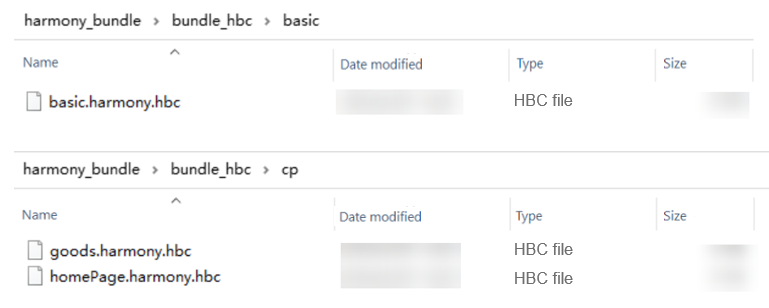

## Common Development Scenarios

### How Do I Use onForeGround and onBackGround?

`onForeground` and `onBackground` are used to solve the problem that `AppState.addEventListener('change', this.handleAppStateChange)` is not called back when the page redirects or returns. The following describes the usage:

- When `router` is used

  - If the `RNAbility` class is used, the implementation is as follows:

    1. Import the `RNAbility` class to the page decorated by `@Entry`.

       ```typescript
       import {RNAbility} from '@rnoh/react-native-openharmony';
       ...
       @Entry
       @Component
       export struct ComponentName{
       @StorageLink('RNAbility') rnAbility: RNAbility | undefined = undefined
       ...
       }
       ```

    2. Call `rnAbility?.onForeground()` and `rnAbility?.onBackground()` in lifecycle callbacks `onPageShow` and `onPageHide`.

       ```typescript
       onPageShow(){
         this.rnAbility?.onForeground();
       }
       onPageHide(){
         this.rnAbility?.onBackground();
       }
       ```

  - If `RNAbility` is not used, the implementation is as follows:

    1. Import the `RNInstancesCoordinator` class to the page decorated by `@Entry`.

       ```typescript
       import {RNInstancesCoordinator} from '@rnoh/react-native-openharmony';
       ...
       @Entry
       @Component
       export struct ComponentName{
       @StorageLink('RNInstancesCoordinator') private rninstancesCoordinator: RNInstancesCoordinator | undefined = undefined
       ...
       }
       ```

    2. Call `rninstancesCoordinator?.onForeground()` and `rninstancesCoordinator?.onBackground()` in lifecycle callbacks `onPageShow` and `onPageHide`.

       ```typescript
       onPageShow(){
        this.rninstancesCoordinator?.onForeground()
       }
       onPageHide(){
         this.rninstancesCoordinator?.onBackground()
       }
       ```

- When `Navigation` is used

  -  If the `RNAbility` class is used, the implementation is as follows:

    1. Import the `RNAbility` class to the custom component with `NavDestination`. This step is the same as that when `router` is used.

    2. Call `rnAbility?.onForeground()` in the `onShown` callback event of `NavDestination`, and call `rnAbility?.onBackground()` in the `onHidden` callback event.

       ```typescript
       ...
       build(){
         NavDestination(){
         ...
         }
         .onShown(() => {
           this.rnAbility?.onForeground();
         })
         .onHidden(() =>{
           this.rnAbility?.onBackground();
         })
       }
       ```

  - If `RNAbility` is not used, the implementation is as follows:

    1. Import the `RNInstancesCoordinator` class to the custom component with `NavDestination`. This step is the same as that when `router` is used.

    2. Call `rninstancesCoordinator?.onForeground()` in the `onShown` callback event of `NavDestination`, and call `rninstancesCoordinator?.onBackground()` in the `onHidden` callback event.

       ```typescript
       ...
       build(){
         NavDestination(){
         ...
         }
         .onShown(() => {
           this.rninstancesCoordinator?.onForeground()
         })
         .onHidden(() =>{
           this.rninstancesCoordinator?.onBackground()
         })
       }
       ```

### How Do I Use onBackPress?

`onBackPress` is used to handle a back press event. The basic principle is to call the `onBackPress` capability of the framework in the native `onBackPress` lifecycle callback, and ensure `return true`. (If `true` is returned, the page handles the back logic by itself, rather than call the native default back event capability. If `false` is returned, the native default route back logic is used. The default value is `false`.) Then, the back press event logic is handled by the framework, which further sends the event to the JS. Therefore, the final back press event logic is implemented in the JS.

- When `router` is used

  - Single-`RNInstance` scenario

    1. Import the `RNOHCoreContext` class to the page decorated by `@Entry`.

       ```TypeScript
       import {RNOHCoreContext} from '@rnoh/react-native-openharmony';
       ...
       @Entry
       @Component
       export struct ComponentName{
       @StorageLink('RNOHCoreContext') private rnohCoreContext: RNOHCoreContext | undefined = undefined
       ...
       }
       ```

    2. Call `this.rnohCoreContext!.dispatchBackPress()` in lifecycle callback `onBackPress` and `return true`.

       ```TypeScript
       onBackPress(): boolean | undefined{
          this.rnohCoreContext!.dispatchBackPress();
          return true;
       }
       ```

  - Multi-`RNInstance` scenario

    If the project has multiple `RNInstance`s, `rnohCoreContext!.dispatchBackPress()` cannot be called in the `onBackPressed` callback event. You need to obtain the `RNInstance` instance that responds to the back press event in the foreground based on the actual service scenario, and call the `onBackPress` method of the instance.

    ```TypeScript
    // router
    onBackPress(): boolean{
      // Obtain the rnInstance that responds to the back press event.
      ...
      rnInstance.onBackPress();
      return true;
    }
    ```

- When `Navigation` is used

  - Single-`RNInstance` scenario

    1. Import the `RNOHCoreContext` class to the custom component with `NavDestination`. This step is the same as that when `router` is used.

    2. Call `rnohCoreContext!.dispatchBackPress()` in the `onBackPressed` callback event of `NavDestination`.

       ```TypeScript
       ...
       build(){
         NavDestination(){
         ...
         }
         .onBackPressed(() => {
           this.rnohCoreContext!.dispatchBackPress();
           return true;
         })
       }
       ```

  - Multi-`RNInstance` scenario

    The method is the same as that when `router` is used. The `RNInstance` that responds to the back press event needs to be obtained.

    ```TypeScript
    // Navigation
    ...
    build(){
      NavDestination(){
      ...
      }
      .onBackPressed(() => {
        // Obtain the rnInstance that responds to the back press event.
        ...
        rnInstance.onBackPress();
        return true;
      })
    }
       ```

- Default back press of the React Native (RN) page
  - In `RNAbility`, there is a `defaultBackPressHandler` method, which will be used if no special handling is performed on the RN page or `exitApp` is called. You can override this method to customize the default back press.
  - If you do not use `RNAbility` but perform custom extension, you need to pass `defaultBackPressHandler` as a parameter to the framework when building the `RNInstancesCoordinator` object.

### How Do I Split Bundles by Using React Native?

To split bundles, you need to configure `createModuleIdFactory` and `processModuleFilter` in `serializer` of `metro.config`.

- `createModuleIdFactory`: Metro supports the configuration of custom module ID using this method. The string ID is also supported, which is used to generate a module ID of the `require` statement. The type is `() => (path: string) => number` (function with return parameters). `path` indicates the complete path of each module. Another purpose of this method is to generate the same ID for the same module during multiple bundling. In this way, the module can be found based on the ID when the version is updated next time.

- `processModuleFilter`: Filters out unnecessary modules based on the given conditions. The type is `(module: Array<Module>) => boolean`, where `module` indicates the output module, which contains the corresponding parameters. You can determine whether to filter the current module based on the returned Boolean value. `false` means that the module is filtered, and is not bundled.

For details, see [RN JS Bundle](rn-js-bundle.md).

### How Do I Load Multiple Bundles?

The procedure for loading multiple bundles is as follows:

1. A single bundle is split into basic bundle and service bundle.
2. During project initialization, create the required `RNInstance` instance and call the `runJSBundle` API to load the basic bundle.
3. When loading the corresponding service module, call the `runJSBundle` API to load the service bundle.

For details, see [RN Native Access > Single-Instance Single-Surface Multi-Bundle](../zh-cn/RN-Native接入.md).

### How Do I Use Components Based on the ArkUI Declarative Paradigm in the C-API Version?

To use components based on the ArkUI declarative paradigm in the C-API version, perform the following steps:

1. Use the ArkUI declarative paradigm to implement [custom components](custom-components.md).
2. Use custom components in the service code.
3. Complete the factory method of a custom component and pass it to `RNApp` or `RNSurface`.
4. Create `CustomRNComponentFrameNodeFactory` and pass it to `RNInstance`. For details, see [Usage of the C-API Component Hybrid Solution](usage-of-c-api-component-hybrid-solution.md).
5. Use `RNApp` or `RNSurface` to start React Native for OpenHarmony.

### How Do I Enable LogBox?

If you use the RN framework started by `RNApp`, `LogBox` is enabled by default. If you use the RN framework started by `RNSurface`, you need to create a `RNComponentContext` and a `LogBox` constructor, add the following event emitter to `devToolsController` of `context`, and start and close the `LogBox` pop-up window.

```TypeScript
this.logBoxDialogController = new CustomDialogController({
  cornerRadius: 0,
  customStyle: true,
  alignment: DialogAlignment.TopStart,
  backgroundColor: Color.Transparent,
  builder: LogBoxDialog({
    ctx: RNComponentContext,
    rnInstance: this.rnInstance,
    initialProps: this.initialProps,
    buildCustomComponent: this.buildCustomComponent,
  })
})
···
this.rnInstance.getTurboModule<LogBoxTurboModule>(LogBoxTurboModule.NAME).eventEmitter.subscribe("SHOW", () => {
  this.logBoxDialogController.open();
})
this.rnInstance.getTurboModule<LogBoxTurboModule>(LogBoxTurboModule.NAME).eventEmitter.subscribe("HIDE", () => {
  this.logBoxDialogController.close();
})
```

### How Do I Enable Metro?

1. Ensure that the OpenHarmony bundle parameters have been configured. For details, see [How Do I Set OpenHarmony Bundle Parameters?](#how-do-i-set-harmonyos-bundle-parameters).
2. If you use the RN framework started by `RNApp`, skip this step because Metro is enabled by default. If you use the RN framework started by `RNSurface`, you need to create a `RNComponentContext`, add the following event emitter to `devToolsController` of `context`, delete the original `RNInstance`, and restart a new `RNInstance` to enable the hot reloading function.

    ```js
    this.ctx.devToolsController.eventEmitter.subscribe("RELOAD", async () => {
      this.cleanUp();
      ths.init();
    })
    ```

3. Configure `jsBundleProvider` of Metro.

    ```TypeScript
    // index.ets Use RNApp to load MetroJSBundleProvider.
    build() {
      RNApp({
        ···
        jsBundleProvider: new TraceJSBundleProviderDecorator(
        new AnyJSBundleProvider([
            new MetroJSBundleProvider(),
            ···
        ]),
        this.rnohCoreContext.logger),
        ···
      })
    }
    ```

    ```TypeScript
    ···
    // Use RNInstance to load MetroJSBundleProvider.
    await RNInstance.runJSBundle(new MetroJSBundleProvider())
    .then(()->{
      isReady = true;
      ···
    })
    ···
    ```

4. Connect to a real device and run the following commands:

    ```PowerShell
    hdc rport tcp:8081 tcp:8081
    ```

    ```PowerShell
    npm run start
    ```

### How Do I Set OpenHarmony Bundle Parameters?

When running React Native, Metro Bundler packs JavaScript code into one or more bundles and provides them for devices to execute at runtime. To customize the behavior of Metro Bundler, you need to create a configuration file that tells Metro Bundler how to handle the project to be packaged.

1. Import two functions from `@react-native/metro-config`:

    ```JavaScript
    const {mergeConfig, getDefaultConfig} = require('@react-native/metro-config');
    ```

    - `mergeConfig`: merges multiple configurations.
    - `getDefaultConfig`: gets the default Metro configuration.

2. Import the `createHarmonyMetroConfig` function from `react-native-harmony/metro.config` to create specific configurations applicable to the OpenHarmony platform.

    ```JavaScript
    const {createHarmonyMetroConfig} = require('react-native-harmony/metro.config');
    ```

3. Use the `@type {import("metro-config").ConfigT}` comment to indicate that the file type is `ConfigT` of the `metro-config` module. This helps editors and code analysis tools understand the structure and type of the file.

    ```JavaScript
    /**

      * @type {import("metro-config").ConfigT}

    ​*/
    ```

4. Define a `config` object, in which `transformer` specifies the transform options.

    ```JavaScript
    const config = {
      transformer: {
        getTransformOptions: async () => ({
          transform: {
            experimentalImportSupport: false,
            inlineRequires: true,
          },
        }),
      },
    };
    ```

    `getTransformOptions`: gets transform options asynchronously. The following options are configured:

    - `experimentalImportSupport`: Set it to `false`, indicating that experimental import support is not used.
    - `inlineRequires`: Set it to `true`, indicating that the `require` statement is inlined to the bundle.

5. Call the `mergeConfig` function to merge the default configuration, OpenHarmony configuration, and custom configurations into a final configuration and export it for the Metro Bundler to use.

    The default metro-config is as follows:

      ```JavaSCript
      /* Import functions. */
      const {mergeConfig, getDefaultConfig} = require('@react-native/metro-config');
      const {createHarmonyMetroConfig} = require('react-native-harmony/metro.config');

      /**
       * @type {import("metro-config").ConfigT}
      */
      /* Define the configuration.*/
      const config = {
        transformer: {
          getTransformOptions: async () => ({
            transform: {
              experimentalImportSupport: false,
              inlineRequires: true,
            },
          }),
        },
      };
      /* Call the mergeConfig function to merge the default configuration, OpenHarmony configuration, and custom configurations into a final configuration and export it for the Metro Bundler to use.*/
      module.exports = mergeConfig(
        getDefaultConfig(__dirname),
        createHarmonyMetroConfig({
          reactNativeHarmonyPackageName: 'react-native-harmony',
        }),
        config,
      );
      ```

### How Do I Load a Bundle or Image from the Sandbox directory?

1. Loading a `bundle` from the sandbox directory

    [Application sandbox](https://gitee.com/openharmony/docs/blob/master/en/application-dev/file-management/app-sandbox-directory.md) is an isolation mechanism used to prevent malicious data access through path traversal. With this mechanism, only the application sandbox directory is visible to an application.

    During the development and debugging process of an application, you need to push files to the application sandbox directory for intra-application access or for testing purposes. You can use either of the following methods to push files:

    Method 1: Use DevEco Studio to push the files to the application installation directory. For details, see [Resource Categories and Access](https://developer.huawei.com/consumer/en/doc/harmonyos-guides-V5/resource-categories-and-access-V5).
    Method 2: Use the hdc tool to push files to the application sandbox directory on the device, which can be implemented using the following send command. This method is more flexible. The push command is as follows. The sandbox directory can be queried by pushing files to the [application sandbox](https://developer.huawei.com/consumer/en/doc/harmonyos-guides-V5/app-sandbox-directory-V5#%E5%BA%94%E7%94%A8%E6%B2%99%E7%AE%B1%E8%B7%AF%E5%BE%84%E5%92%8C%E7%9C%9F%E5%AE%9E%E7%89%A9%E7%90%86%E8%B7%AF%E5%BE%84%E7%9A%84%E5%AF%B9%E5%BA%94%E5%85%B3%E7%B3%BB).

    ```PowerShell
    hdc file send ${Local directory for pushing files} ${Sandbox directory}
    ```

    To load a `bundle` from the sandbox directory, you need to use `new FileJSBundleProvider('bundlePath')` in the `jsBundlePrivider` parameter of RNApp to register the `bundle` with the framework and run the `bundle`.

    In the `Index.ets` file under the `MyApplication/entry` directory, pass `jsBundleProvider` to load the bundle when creating an RNApp. As shown in the code, three `BundleProvider`s are passed in, indicating that the `bundle` is loaded by `Metro`, sandbox directory, and local mode respectively. If the `bundle` fails to be loaded by `Metro`, it should be loaded in the sequence of `JSBundleProvider`s until the loading is successful or fails in all modes.

    ```TypeScript
    // index.ets Use RNApp to load FileJSBundleProvider.
    build() {
      RNApp({
        ···
        jsBundleProvider: new TraceJSBundleProviderDecorator(
        new AnyJSBundleProvider([
            new FileJSBundleProvider('/data/storage/el2/base/files/bundle.harmony.js'),
            ···
        ]),
        this.rnohCoreContext.logger),
        ···
      })
    }
    ```

    ```TypeScript
    ···
    // Use RNInstance to load FileJSBundleProvider.
    await RNInstance.runJSBundle(new FileJSBundleProvider('/data/storage/el2/base/files/bundle.harmony.js'))
    .then(()->{
      isReady = true;
      ···
    })
    ···
    ```

2. Loading an image from the sandbox directory

    This involves how the sandbox mechanism processes and loads an image. Each application runs in its own sandbox environment. In the sandbox, applications can access their own files and directories.

    1. **Obtain the image directory**: Before loading an image from the sandbox directory, obtain the directory of the image in the sandbox. The directory usually starts with `file:///`.

        ```JavaScript
        const FILE_URI = 'file:///data/storage/el2/base/files/xxx.jpg';
        ```

    2. **Load an image**: Use `uri` of the `source` attribute of the `Image` component to specify the absolute path. Or use the corresponding API or library to load and display an image.

        ```JavaScript
        <Image
          style={{borderRadius: 8, borderWidth: 1, height: 150}}
          source={{uri: FILE_URI}}
        />
        ```
    3. **Precautions:**
      Currently, the directories for loading an image by local mode or sandbox are encoded in different ways. For an image loaded by local mode, the image is searched from the **rawfile/assets** directory, so the image resources need to be stored under this directory. For an image loaded by sandbox, the image is directly searched from the bundle directory at the same level, and no additional **assets** directory is required.

### How Do I Generate a .hbc Bundle?

To convert the bundle to .hbc format, perform the following steps:

1. Make sure you have installed the `Hermes` toolchain. The tool is provided in the `node_modules\react-native\sdks\hermesc` directory of the sample project by default. If it is not available, run the following command to install it on the terminal:

   ```PowerShell
   npm install -g hermes-engine
   ```

2. To convert the bundle to .hbc format, run the following command on the terminal:

   ```PowerShell
   hermesc --emit-binary input_bundle.jsbundle -out output_bytecode.hbc 
   ```

3. In the preceding command, `input_bundle.jsbundle` indicates the name of the bundle to be converted, and `output_bytecode.hbc` indicates the name of the converted .hbc file.

4. The following describes a demo script file for compiling `Hermes`.

   ```vim
   // Use Hermes to convert the bundle to .hbc format.
   echo "*************************** start hermesc *********************************"
   
   // Prompt the user to enter the directory of the JavaScript bundle, and save the entered directory in the dir variable.
   read -p "Enter the JS bundle directory:  "dir
   
   // Define a read-only variable bundle_hbc to store the directory of the translated Hermes bytecode file. It is used to create a folder named bundle_hbc in the parent directory of the input dir.
   readonly bundle_hbc=$dir/../bundle_hbc
   
   // Recursively delete the directory that stores the Hermes bytecode to ensure that a new bytecode file is generated from the beginning each time the script is executed.
   rm -rf $bundle_hbc
   // Create a directory for storing the Hermes bytecode file.
   mkdir -p $bundle_hbc
   // Create a file to store different types of bundles.
   mkdir -p $bundle_hbc/basic
   mkdir -p $bundle_hbc/cp
   
   // Run the hermesc command to convert the specified JavaScript bundle file into a Hermes bytecode file (.hbc format).
   hermesc --emit-binary $dir/basic/basic.harmony.bundle -out $bundle_hbc/basic/basic.harmony.hbc
   hermesc --emit-binary $dir/cp/goods.harmony.bundle -out $bundle_hbc/cp/goods.harmony.hbc
   hermesc --emit-binary $dir/cp/homepage.harmony.bundle -out $bundle_hbc/cp/homepage.harmony.hbc
   
   echo "*************************** end hermesc *********************************"
   echo "Bundle export directory: $bundle_hbc"
   ```

5. After the preceding steps are complete, the bundle is converted to .hbc format.

    

### How Do I Reduce the HAP Size?

A large OpenHarmony Ability Package (HAP) may occupy more resources during application download, installation, and running, affecting user experience. Therefore, when building or compiling a OpenHarmony application, you can adjust or change the compilation settings to reduce the size of the generated HAP.

1. Set a secure compilation parameter in the `CMakeLists.txt` file to reduce the HAP size.

    The secure compilation parameter is as follows:

      ```CMAKE
        set(CMAKE_CXX_FLAGS "-s")
      ```

    -**s**: tells the compiler to remove the symbol table and debugging information during linking to reduce the size of the executable file.

2. Set the parameters in the `build-profile.json5` file.

    ```json5
    /*
    path: path of the CMakeLists.txt file, which is usually used to specify the location of the CMake build file.
    arguments: empty, indicating that there are no additional build arguments.
    cppFlags: The C++ compilation option -s is set here, which can be used to remove the symbol table and debugging information to reduce the size of the generated executable file.
    */
    "buildOption": {
      "externalNativeOptions": {
        "path": "./src/main/cpp/CMakeLists.txt",
        "arguments": "",
        "cppFlags": "-s",
      },
    },
    ```

3. Modify the compilation option to reduce the HAP size.

    ​On the `Build Mode` tab page, select `release`.

    

4. Compress the .so file to reduce the HAP size.
   Modify the `compressNativeLibs` field in the `module.json5` configuration file of the application module by referring to [Reducing the Size of Application Packages](https://developer.huawei.com/consumer/cn/doc/best-practices-V5/bpta-decrease_pakage_size-V5#section1286810176182), set the value to **true**, and recompile and bundle the application.
   ```json5
   {
     "module": { 
       // ...
      "compressNativeLibs": true // Indicates that the libs are compressed for storage.
     }
   }
   ```

### How Do I Adapt to Foldable Screens?

For details, see [Multi-Screen Adaptation Guide](multi-screen-adaptation-guide.md).

### How Do I Enable Secure Compilation by Using a .so File?

Common parameters include `strip`, `NO Rpath/Runpath`, and `SP`.

- `strip coverage` (remove the symbol table): Symbols play an important role in the linking process. The essence of the linking process is to "stick" multiple different target files together. Symbols can be regarded as the adhesive of links. The entire linking process is completed based on symbols. After linking is complete, the symbol table will no longer affect the running of executable files. Instead, it can be exploited by attackers. Therefore, removing the symbol table can help defend against hacker attacks. In addition, it can help reduce the file size. 
Add the following code under `externalNativeOptions` of `build-profile.json5` in the `entry` module:

  ```json
  "cppFlags": "-s"
  ```

- `NO Rpath/Runpath coverage` (dynamic library search path): You can specify the search path of the dynamic link library during program running during compilation, to prevent attacks by malicious replacement of some dynamic libraries.
Add the following code to `CMakeLists.txt` in the `entry` module:

  ```CMAKE
  set(CMAKE_SKIP_BUILD_RPATH TRUE)
  ```

- `SP coverage` (stack protection): When a buffer overflow attack vulnerability exists, an attacker can override the return address on the stack to hijack the program control flow. When stack protection is enabled, a `canary word` is inserted between the buffer and the control flow. Generally, this `canary word` is overridden when the attacker overrides the return address. By checking the `canary word`, you can determine whether an overflow attack occurs. 
Add the following code to `CMakeLists.txt` in the `entry` module:

  ```CMAKE
  set(CMAKE_CXX_FLAGS "-fstack-protector-strong -Wl,-z,relro,-z,now,-z,noexecstack -s -fPIE -pie")
  ```

  - -**fstack-protector-strong**: enables the stack protection mechanism to help prevent buffer overflow attacks.
  - -**Wl,-z,relro,-z,now,-z,noexecstack**: sets some security options. These parameters are passed to the linker ID. Specifically:
    - -**z,relro**: changes the relocation table of the read-only segment to read-only.
    - -**z,now**: executes all dynamic links of the program immediately to reduce potential vulnerabilities.
    - -**z,noexecstack**: prevents code execution on the stack to reduce the attack surface of code execution.
    - -**s**: tells the compiler to remove the symbol table and debugging information during linking to reduce the size of the executable file.
    - -**fPIE -pie**: generates the position-independent executable (PIE) of an executable file. The PIE can improve program security, so that the loading address of the program in the memory is random, thereby increasing difficulty for attackers. 

  Note: False reports may occur during SP scanning. For example, the corresponding CPP code does not contain local arrays or local variables that are the R-values or function parameters of assignment statements, and no protection code is inserted.


### How Do I Set the Center Alignment of Text After Setting the lineHeight Attribute?

By default, the bottom-layer font engine does not apply center alignment based on the row height. You need to configure the following parameters in the `module.json5` file in the project entry directory to enable center alignment:
```json5
"metadata": [
    {
    "name": "half_leading",
    "value": "true"
    }
]
```

### How Do I Set TextInput to Display Pinyin?

Currently, you need to configure the following parameters in the `module.json5` file in the project entry directory to display pinyin:
```json5
"metadata": [
    {
    "name": "can_preview_text",
    "value": "true"
    }
]
```

### How Do I Control Whether the Page Avoids the Keyboard?

- Method 1: Use the component layout capability of RN to avoid the keyboard. Use the `KeyboardAvoidingView` component as the container so that the layout is automatically adjusted based on the keyboard pop-up height.

- Method 2: Use the default behavior of ArkUI to avoid the keyboard. Currently, the `expandSafeArea([SafeAreaType.KEYBOARD])` attribute is configured for `RNApp` by default. Therefore, you can only adjust the internal layout of the RN page to avoid the keyboard. There is no related configuration on `RNSurface`, and the ArkUI component automatically avoids the keyboard.

- You can integrate `RNSurface`/`RNApp` to set the `expandSafeArea([SafeAreaType.KEYBOARD])` attribute. Use different combinations of RN layout components to customize the keyboard avoidance effect.

### Precautions for Using a Custom Bundle Command

- The current version provides the `bundle-harmony` command to directly use the OpenHarmony-based RN bundle script. You only need to set correct parameters.

- If you want to eliminate command difference across platforms and use a custom bundle command instead of `bundle-harmony`, you can refer to the bundling process in the **react-native-harmony-cli/dist/commands/bundle-harmony.js** file, import the HarmonyOS bundle configuration through `createHarmonyMetroConfig`, and compile the bundle file based on the configuration. Then, you need to add operations related to `copyAssets`. Ensure that the path format of the image resource is the same as that of the image resource encoded in the bundle.
