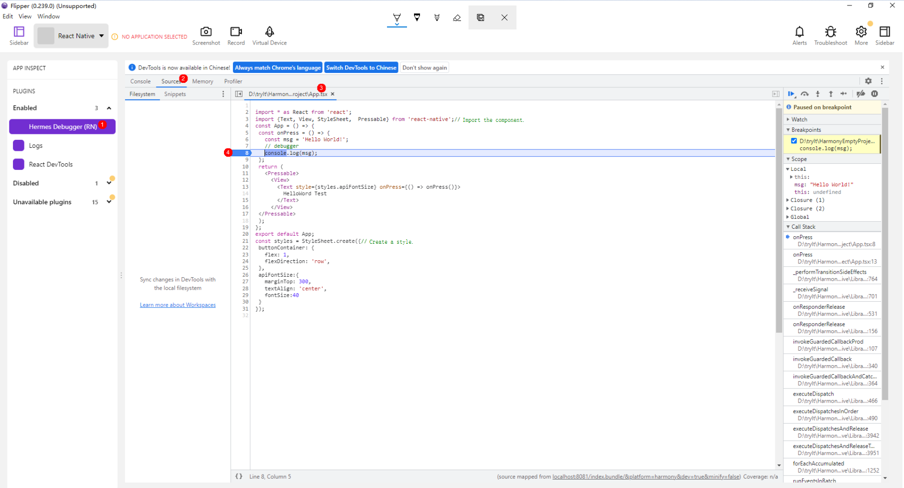

# Debugging

## Metro Hot Reloading

`React Native` uses [`Metro`](https://metrobundler.dev/) to build your `JavaScript` code and assets. This section describes how to configure and use Metro.

### Configuring Metro

OpenHarmony configuration options for Metro can be customized in your project's `metro.config.js` file. This can export either:

- **An object (recommended)** that will be merged on top of Metro's internal config defaults.
- **A function** that will be called with Metro's internal config defaults and should return a final config object.

In `React Native`, your Metro config should extend either [@react-native/metro-config](https://www.npmjs.com/package/@react-native/metro-config) or [@expo/metro-config](https://www.npmjs.com/package/@expo/metro-config). These packages contain essential defaults necessary to build and run `React Native` apps.

To configure Metro on OpenHarmony, you need to extend `react-native-harmony`, and use `createHarmonyMetroConfig` to create Metro on OpenHarmony.

Below is the default `metro.config.js` file in the [sample project](../Samples/Sample/SampleProject/MainProject/metro.config.js):

```JavaScript
// metro.config.js
const { mergeConfig, getDefaultConfig } = require('@react-native/metro-config');
const {
  createHarmonyMetroConfig,
} = require('react-native-harmony/metro.config');
/**
 * Metro configuration
 * https://metrobundler.dev/docs/configuration
 *
 * @type {import("metro-config").ConfigT}
 */
const config = {
  transformer: {
    getTransformOptions: async () => ({
      transform: { 
        experimentalImportSupport: false, 
        inlineRequires: true 
      },
    }),
  },
};
module.exports = mergeConfig(
  getDefaultConfig(__dirname),
  createHarmonyMetroConfig({
    reactNativeHarmonyPackageName: 'react-native-harmony',
  }),
  config
);
```

If you use the RN framework started by `RNApp`, skip this step. If you use the RN framework started by `RNSurface`, you need to create a `RNComponentContext`, add the following event emitter to `devToolsController` of `context`, delete the original `RNInstance` and restart a new `RNInstance` to enable the hot reloading function.

```TypeScript
this.ctx.devToolsController.eventEmitter.subscribe("RELOAD", async () => {
  this.cleanUp();
  ths.init();
})
```

### Using Metro

RNOH provides the `MetroJSBundleProvider` API to load the jsBundle provided by Metro. The methods are as follows:

- Scenario 1: `RNApp.ets` is used.

  If you use the `RNApp` component provided by RNOH, you only need to pass `new MetroJSBundleProvider()` to the `jsBundleProvider` attribute.

  ```ts
  RNApp({
    ...
    // Method 1
    // jsBundleProvider: new MetroJSBundleProvider()
    jsBundleProvider: new TraceJSBundleProviderDecorator(
      new AnyJSBundleProvider([
        // Method 2
        new MetroJSBundleProvider(),
      ]),
      this.rnohCoreContext.logger),
  })
  ```

- Scenario 2: `RNApp.ets` is not used.

  If `RNApp` is not used, you need to create and manage `RNInstance`. Assume that you have an `RNInstance` instance `rnInstance`. For details about how to load Metro, see the following code:

  ```ts
  rnInstance.runJSBundle(new MetroJSBundleProvider())
  ```

  After an OpenHarmony project is prepared, open the JS console and run the following command in the RN project directory to start the RN application:

  ```PowerShell
  npm run start
  ```

  Connect a real device to the computer by using a data cable, open the new command line tool, and run the following command:

  ```PowerShell
  hdc rport tcp:8081 tcp:8081
  ```

  You will see the following information if the command is successfully executed:

  

  The **start** command uses the default `metro.config.js` in the project directory. You can also configure the **start** command to use the custom config file.

  ```json
  // package.json
  ···
  "scripts": {
    ···
    "start": "react-native start --config metro.config.harmony.js",
    ···
  }
  ···
  ```

- Scenario 3: Metro on a LAN is accessed.

  The preceding solution requires a data cable to be connected and port 8081 to be forwarded. RNOH provides another API (`MetroJSBundleProvider.fromServerIp`), which takes three parameters:

  * `ip` - IP address of the Metro server.
  * `port` - Port number of Metro. Defaults to 8081.
  * `appKeys` - App name set. Defaults to an empty array.

  The method is to replace `new MetroJSBundleProvider()` with `MetroJSBundleProvider.fromServerIp`. For example:

  ```ts
  RNApp({
    ...
    jsBundleProvider: new TraceJSBundleProviderDecorator(
      new AnyJSBundleProvider([
        MetroJSBundleProvider.fromServerIp('192.168.43.14', 8081),
      ]),
      this.rnohCoreContext.logger),
  })
  ```

  When using this method, you only need to ensure that the mobile phone can be connected to the computer and access Metro after opening the app. You do not need to connect the data cable or forwarding port.


When Metro is used to load a bundle, application update can be triggered in the following scenarios:

- Edit the code in the compiler and save the code. The changes are automatically updated to the mobile phone.
- Enter **r** in the command line tool to trigger the application update.
- Enter **d** in the command line tool. In the displayed `React Native Dev Menu` dialog box, select **Reload** to trigger application update.

## JS Debugging

### Opening React Native Dev Menu

1. Run the following commands:

    ```PowerShell
    hdc rport tcp:8081 tcp:8081
    ```

    ```PowerShell
    npm run start
    ```

    You will see the following information if the command is successfully executed:

    

2. Open the app on your phone.
3. Enter `d` in the command line tool. The `React Native Dev Menu` dialog box is displayed on the mobile phone.

    

### Element Inspector

You can use `Element Inspector` to view the box model and style of the RN element. Do the following:

1. Load a bundle by using Metro. Open the `React Native Dev Menu` dialog box and select `Toggle Element Inspector`.
2. Select `Inspect` and click the element to inspect. The black mask displays the hierarchy, style, and box model of the element, as shown in the following figure.

    

3. Click other nodes of the breadcrumb in the mask to view the style of the parent or child element of the current element.
4. Click another element on the page to switch to the element.
5. Deselect `Inspect` in the mask to disable element inspection.

### React DevTools

`React DevTools` can be used to debug the React component hierarchy within your application. The standalone version of `React DevTools` allows connecting to `React Native` applications. To use it, [install or run the react-devtools package](https://reactnative.dev/docs/next/react-devtools). Do the following:

1. Create a command line tool and run it.

    ```PowerShell
    npx react-devtools
    ```

2. Create a command line tool and run the following command (`react-devtools` uses port 8097 by default):

    ```PowerShell
    hdc rport tcp:8097 tcp:8097
    ```

3. Load a bundle by using Metro. Open the `React Native Dev Menu` dialog box and select `Open React DevTools`.

    

### Breakpoint Debugging

Before enabling breakpoint debugging, enable the debugger when starting the RN instance. You can pass the `rnInstanceConfig` parameter in `RNApp`.

```TypeScript
// index.ets
RNApp({
  rnInstanceConfig: {
    enableDebugger: true,
    ···
  },
  ···
})
```

Use either of the following methods to set a breakpoint and debug your code.

#### Flipper

Flipper is a mobile application debugger. You can download and install it from the [official website](https://fbflipper.com/) or [github](https://github.com/facebook/flipper/releases).

1. (Optional) After the installation is complete, add `Flipper.exe` to the environment variable.
2. Load a bundle by using Metro and open the `React Native Dev Menu` dialog box on the mobile phone application page.
3. Choose `Open Debugger`. The debugger page is displayed, as shown in the following figure.

    

    If the environment variable is not configured, Flipper may fail to be opened. In this case, you can manually open Flipper and select `React Native` in the area marked with 1 to achieve the preceding effect.

4. Choose `Hermes Debugger (RN)` > `Sources`, press `Ctrl+P (or Command+P on macOS)`, enter the name of the file to be debugged, and select the file to open the source code. Click the line number to add a breakpoint. The code automatically stops when it reaches this line, as shown in the following figure.

    

5. You can also write the statement `debugger` in the code to connect to Flipper. When the code running reaches `debugger`, Flipper automatically opens the source code and locates `debugger` for debugging, as shown in the following figure.

    

#### Chrome DevTools

If Flipper is not installed, you can use `Chrome DevTools` to debug code. Do the following:

1. Load a bundle by using Metro.
2. Open the Chrome browser and enter `chrome://inspect` in the address box.
3. Click `Configure...`. In the displayed dialog box, enter `localhost:8081`, select `Enable port forwarding`, and click `Done`, as shown in the following figure.

    

4. After a while, you can see `Hermes React Native` on the `Remote Target` panel.
5. Click `inspect` under `Hermes React Native`. The `DevTools` window is displayed, as shown in the following figure.

    

6. Choose `Sources` > `Workspace` and click `Add folder`. In the displayed dialog box, select the source file of the current project and click **Select Folder**, as shown in the following figure.

    

7. The method of adding a breakpoint is the same as that of Flipper, as shown in the following figure.

    

#### Common Debugging Problems

1. If the breakpoint cannot be enabled in Chrome, restart `inspector`.
2. If `loading...` is displayed and the page is blank (as shown in the following figure), [OpenSSL](https://www.openssl.org/) is not installed. Install it so that Flipper can work properly.

    

## Error Information Output

### LogBox Logs

`LogBox` is a platform for displaying errors on the mobile phone. When an error occurs on JS, an error is displayed on the mobile phone application page, as shown in the following figure.


The right figure shows `LogBox`, which displays the error description, source code, and call stack information. If you load a bundle by using Metro, click the call stack in `LogBox` on the device. Then, you can use an editor (such as VSCode) on the computer to automatically open the corresponding file for you to view and locate the fault.

If you use the RN framework started by `RNApp`, skip this step. If you use the RN framework started by `RNSurface`, you need to create a `RNComponentContext` and a `LogBox` constructor, add the following event emitter to `devToolsController` of `context`, and start and close the `LogBox` pop-up window.

```TypeScript
this.logBoxDialogController = new CustomDialogController({
  cornerRadius: 0,
  customStyle: true,
  alignment: DialogAlignment.TopStart,
  backgroundColor: Color.Transparent,
  builder: LogBoxDialog({
    ctx: RNComponentContext,
    rnInstance: this.rnInstance,
    initialProps: this.initialProps,
    buildCustomComponent: this.buildCustomComponent,
  })
})
···
this.rnInstance.getTurboModule<LogBoxTurboModule>(LogBoxTurboModule.NAME).eventEmitter.subscribe("SHOW", () => {
  this.logBoxDialogController.open();
})
this.rnInstance.getTurboModule<LogBoxTurboModule>(LogBoxTurboModule.NAME).eventEmitter.subscribe("HIDE", () => {
  this.logBoxDialogController.close();
})
```

### Console Logs

#### DevEco Studio

When an error occurs on JS, you can view the error information in `DevEco Studio` by doing as follows:

1. Connect the mobile phone to the computer, open `DevEco Studio`, and open a project.
2. Click `Log` under `DevEco Studio`.
3. On the `HiLog` tab page, select the device to be connected, `All logs of selected app`, `App bundle name`, and `Warn` or `Error`.
4. After the setting, when a fault occurs on JS, the error information is displayed in `DevEco Studio` in real time, as shown in the following figure.

    

#### Command Line Tool

If you load a bundle by using Metro, when an error occurs on JS, the command line tool displays the cause and location of the error, as shown in the following figure.


#### Other

In `React Native`, you can also use `console.log`, `console.warn`, or `throw` to trigger a log or warning.

### Adding a Trace

#### JS Side

You can add a trace by importing `Systrace` provided by `react-native`.

For example, add a synchronization trace named `ONPRESS` to trace the `onPress` of a button.

```JavaScript
import {Systrace} from 'react-native';
...
<Button
  onPress={() => {
    Systrace.beginEvent('ONPRESS');
    // do something
    Systrace.endEvent();
  }}
/>
```

For example, to add an asynchronous trace named `ASYNC`, use the following two buttons to control the start and end of the trace:

```JavaScript
import {Systrace} from 'react-native';
...
let traceCookie = null;
...
<Button
  onPress={() => {
    if (traceCookie === null) {
      traceCookie =
      Systrace.beginAsyncEvent('ASYNC');
    }
  }}
/>
<Button
  onPress={() => {
    if (traceCookie !== null) {
      Systrace.endAsyncEvent('ASYNC', traceCookie);
    }
  }}
/>
/>
```

#### ArkTS Side

Most ArkTS classes and objects have a logger or ctx object. (The ctx object contains a logger, which provides the encapsulated **startTracing()** for adding a trace.)

For example, to add a trace named `myTrace`, use the following code:

```TypeScript
const stopTracing = this.logger.clone("myTrace").startTracing()
// do something
stopTracing()
```

You can also use the unencapsulated `@ohos.hiTraceMeter` capability to add a trace.

For example, add a trace named `myTrace` and use **0** as the identification flag (used to distinguish traces with the same name).

```TypeScript
import hiTrace from '@ohos.hiTraceMeter';
...
hiTrace.startTrace(`myTrace`, 0)
// do something
hiTrace.finishTrace(`myTrace`, 0)
```

#### C++ Side


You can include `react/renderer/debug/SystraceSection.h` to instantiate a `facebook::react::SystraceSection` object to add a trace.

The scope of the trace is the same as that of the lifecycle callback of the `facebook::react::SystraceSection` object. You can use braces to control the scope.

For example, to add a trace named `myTrace`, use the following code:

```CPP
#include <react/renderer/debug/SystraceSection.h>
...
{
  facebook::react::SystraceSection s("myTrace");
  // do something
}
```
