# Environment Setup

- Environment setup

  1. Install DevEco Studio. For details, see [Downloading Software](https://developer.huawei.com/consumer/en/doc/harmonyos-guides-V5/ide-software-download-V5) and [Installing Software](https://developer.huawei.com/consumer/en/doc/harmonyos-guides-V5/ide-software-install-V5).

  2. Set up the DevEco Studio development environment. This depends on the network access, which is required for running the tool properly. For details, see [Setting Up the Development Environment](https://developer.huawei.com/consumer/en/doc/harmonyos-guides-V5/ide-environment-config-V5).

  3. Configure app debugging by referring to the following links:

      - [Run Your App/Service on a Local Real Device](https://developer.huawei.com/consumer/en/doc/harmonyos-guides-V5/ide-run-device-V5)
      - [Debug Your App on the Emulator](https://developer.huawei.com/consumer/cn/doc/harmonyos-guides-V5/ide-run-emulator-0000001582636200-V5)

  4. Configure the hdc environment.

      OpenHarmony device connector (hdc) is a command line tool used for debugging. The OpenHarmony React Native project uses hdc for debugging on a real device. Obtain the hdc tool from the OpenHarmony SDK and store it in the `toolchains` directory of the SDK. Add the full path of `{DevEco Studio installation path}/sdk/{SDK version}/openharmony/toolchains` to the environment variable.

      - On Windows:

        a. Choose **This PC** > **Properties** > **Advanced system settings** > **Advances** > **Environment Variables** and add the hdc path to the system variable **path**.

        b. Choose **This PC** > **Properties** > **Advanced system settings** > **Advances** > **Environment Variables**, add the variable **HDC_SERVER_PORT**, and set its value to any port number not in use, such as **7035**.

        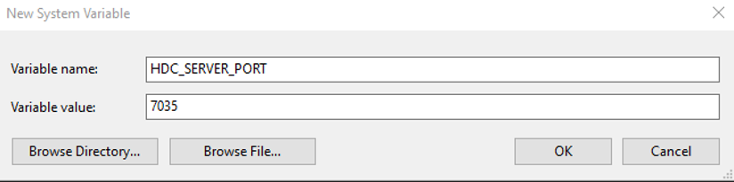
      - On macOS:

        a. Start the terminal tool and run the following command to open the **.bash_profile** file.

          ```bash
          vi ~/.bash_profile
          ```

          Enter the following content to add the hdc path to **PATH** and set `HDC_SERVER_PORT`.

          ```bash
          export PATH="/Applications/DevEco-Studio.app/Contents/sdk/{Version path}/openharmony/toolchains:$PATH" # Set this variable based on the actual SDK installation path. Select {Show Package Contents}.
          
          HDC_SERVER_PORT=7035 
          launchctl setenv HDC_SERVER_PORT $HDC_SERVER_PORT 
          export HDC_SERVER_PORT
          ```

          > The variable name of the hdc port is `HDC_SERVER_PORT`. The variable value can be any port not in use, for example, `7035`.

        b. Press **Esc** to exit the edit mode. Then enter **:wq** and press **Enter** to save the settings.

        c. Run the following command for the environment variable to take effect.

          ```bash
          source ~/.bash_profile
          ```

  5. <span id="set_capi_path">Configure the CAPI version environment variable.</span>

      By default, the demo project provided by the RN framework is in the CAPI version. You need to configure the environment variable `RNOH_C_API_ARCH = 1`.

      - On Windows:

        Choose **This PC** > **Properties** > **Advanced system settings** > **Advances** > **Environment Variables**. Add the variable name `RNOH_C_API_ARCH` and set its value to `1`.

        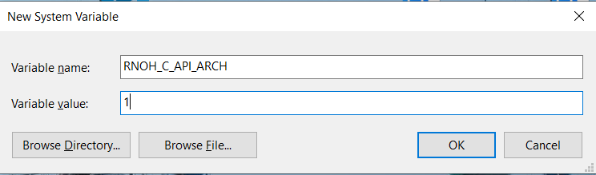

      - On macOS:

        a. Open Terminal. You can find it in the **/Applications/Utilities** folder In Terminal, enter the following command to set the environment variable:

          ```bash
          export RNOH_C_API_ARCH=1
          ```

          This creates the environment variable `RNOH_C_API_ARCH` and sets its value to `1`.

        b. Check whether the environment variable is set successfully. Enter the following command in Terminal:

          ```bash
          echo $RNOH_C_API_ARCH
          ```

          If the command output is **1**, the environment variable has been set successfully.

        c. If you want this environment variable to be automatically set each time you open Terminal, you can add the **export** command to your bash configuration file (for example, **~/.bash_profile**, **~/.bashrc**, or **~/.zshrc**). Edit the file and add the following line to the end of the file:

          ```bash
          export RNOH_C_API_ARCH=1
          ```

        d. Save the file and close the editor. Open Terminal again and check whether the environment variable is still set to **1**.

          ```bash
          echo $RNOH_C_API_ARCH
          ```

          If the command output is **1**, the environment variable has been set successfully.

  6. Constraints

      If you need to customize `CMakeLists.txt`, name the .so file `rnoh_app`.

      ```CMAKE
      add_library(rnoh_app SHARED
          ···
          "${RNOH_CPP_DIR}/RNOHAppNapiBridge.cpp"
      )
      ```

  7. Additional Information

      After the preceding environment configuration is complete, you are now ready to develop the React Native project on OpenHarmony. For details about how to set up the React Native environment on Android and iOS, go to the React Native official website and refer to [Environment Setup](https://reactnative.dev/docs/set-up-your-environment).

# Creating a React Native Project

​ This section describes how to initialize the React Native project, install the OpenHarmony dependency packages, and run the project.

## Creating a Project

​You can select a directory, for example, the root directory of drive D, and use the built-in command line tool of React Native to create a project named **AwesomeProject**. This command line tool does not need to be installed. You can directly use the **npx** command provided by the node to create a command line tool. Currently, React Native for OpenHarmony supports only version 0.72.5.

  ```bash
  npx react-native@0.72.5 init AwesomeProject --version 0.72.5
  ```

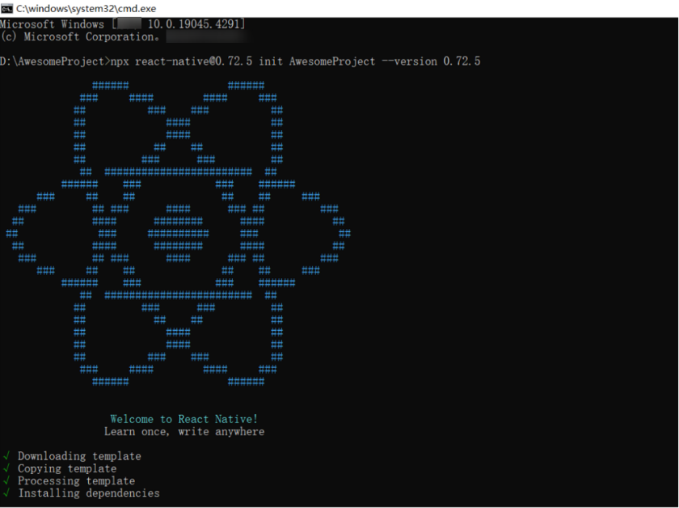

​ When this command is used to initialize the React Native project on macOS, the iOS dependency library is downloaded, which takes a long time. You can run the following command to skip this process and download the library as required. This does not affect the development of the OpenHarmony project.

  ```bash
  npx react-native@0.72.5 init AwesomeProject --version 0.72.5 --skip-install
  ```

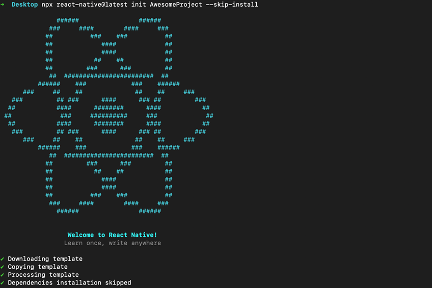

## Installing OpenHarmony Dependency Packages and Generating a Bundle

For details about the version mapping of the files used in this section, see [React Native for OpenHarmony Release Notes](release-notes.md).
> You can set up the environment step by step according to the operations in this section. You can also replace the corresponding files with the files in `AwesomeProjectReplace.zip`, modify the version information, and run the project.

### Downloading and Installing the OpenHarmony Dependencies

1. Open `package.json` in the `AwesomeProject` directory and add OpenHarmony dependencies under `scripts`.

   ```diff
   {
    "name": "AwesomeProject",
    "version": "0.0.1",
    "private": true,
    "scripts": {
      "android": "react-native run-android",
      "ios": "react-native run-ios",
      "lint": "eslint .",
      "start": "react-native start",
      "test": "jest",
   +    "dev": "react-native bundle-harmony --dev"
    },
    "dependencies": {
      "react": "18.2.0",
      "react-native": "0.72.5",
   +    "react-native-harmony": "file:../react-native-harmony/rnoh-react-native-harmony-xxx.tgz"
    },
    "devDependencies": {
      "@babel/core": "^7.20.0",
      "@babel/preset-env": "^7.20.0",
      "@babel/runtime": "^7.20.0",
      "@react-native/eslint-config": "^0.72.2",
      "@react-native/metro-config": "^0.72.11",
      "@tsconfig/react-native": "^3.0.0",
      "@types/react": "^18.0.24",
      "@types/react-test-renderer": "^18.0.0",
      "babel-jest": "^29.2.1",
      "eslint": "^8.19.0",
      "jest": "^29.2.1",
      "metro-react-native-babel-preset": "0.76.8",
      "prettier": "^2.4.1",
      "react-test-renderer": "18.2.0",
      "typescript": "4.8.4"
    },
   + "overrides": {
   +   "@react-native-community/cli": "11.3.6",
   +   "@react-native/codegen": "0.74.0"
   + },
   + "resolutions": {
   +   "@react-native-community/cli": "11.3.6"
   + },
    "engines": {
      "node": ">=16"
    }
   }
   ```
2. Run the following command in the `AwesomeProject` directory to install the dependency package:
  
    ```bash
    npm i @react-native-oh/react-native-harmony@x.x.x
    ```
    > In the command, *@x.x.x* indicates the version to be downloaded. If it is not specified, the latest version is downloaded by default.

    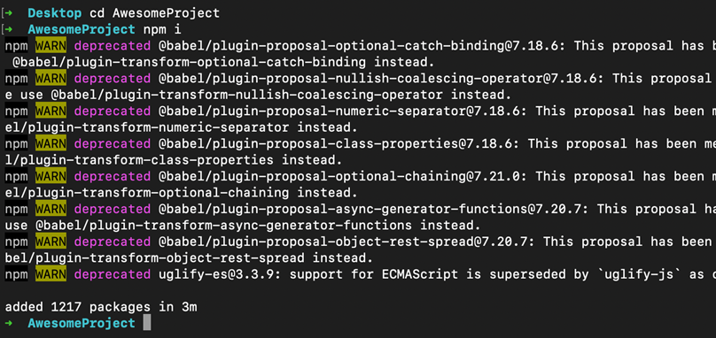

### Running the Command for Generating a Bundle

1. Open `AwsomeProject\metro.config.js` and add the OpenHarmony adaptation code. For details about the configuration file, see [React Native](https://reactnative.dev/docs/metro). The modified file content is as follows:

    ```JavaScript
    const {mergeConfig, getDefaultConfig} = require('@react-native/metro-config');
    const {createHarmonyMetroConfig} = require('@react-native-oh/react-native-harmony/metro.config');

    /**
    * @type {import("metro-config").ConfigT}
    */
    const config = {
      transformer: {
        getTransformOptions: async () => ({
          transform: {
            experimentalImportSupport: false,
            inlineRequires: true,
          },
        }),
      },
    };

    module.exports = mergeConfig(getDefaultConfig(__dirname), createHarmonyMetroConfig({
      reactNativeHarmonyPackageName: '@react-native-oh/react-native-harmony',
    }), config);
    ```
2. Run the command for generating a bundle file in the **AwesomeProject** directory. The `bundle.harmony.js` and `assets` folders are generated in the `AwesomeProject/harmony/entry/src/main/resources/rawfile` directory. The `assets` folder is used to store images. If no local image is involved in the `bundle`, the `assets` folder does not exist.
  
    ```bash
    npm run dev
    ```

    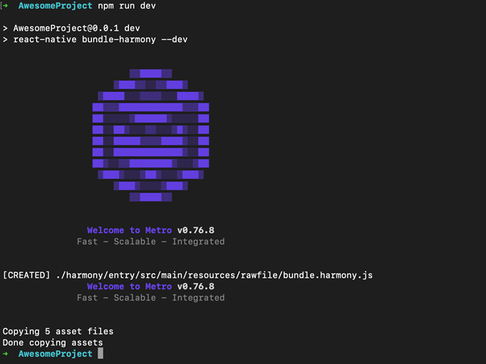

    > If you get the error "'react-native' is not recognized as an internal or external command, operable program or batch file" during the running, run the `npm install` command again.

3. You can also use Metro to load a bundle. For details, see [Metro Hot Reloading](debugging.md#metro-hot-reloading).

# Creating an OpenHarmony Project

This section describes how to create an OpenHarmony project, load the dependency packages and bundles related to React Native, and run the OpenHarmony project.
> You can set up the environment step by step according to the operations in this section. You can also replace the corresponding files with the files in `MyApplicationReplace.zip`, modify the version information, and run the project.

## Creating or Integrating a Project

​ The following demonstrates how to integrate a project. Click `File > New > Create Project` and create an `Empty Ability` project, as shown in the following figure.

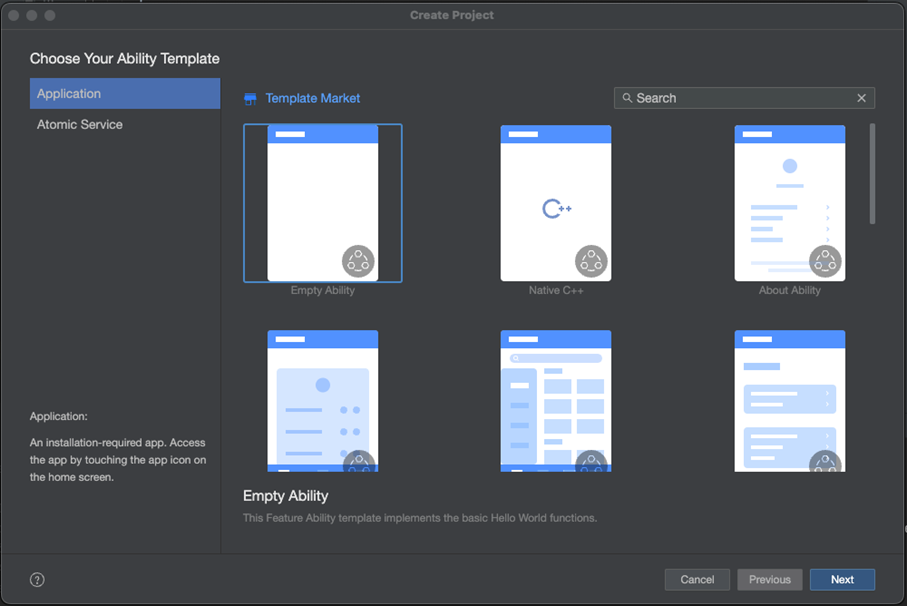

​ Click `Next` and select `API12` for `Compile SDK` to create a project named **MyApplication**. Note that the project path cannot be too long, as shown in the following figure.

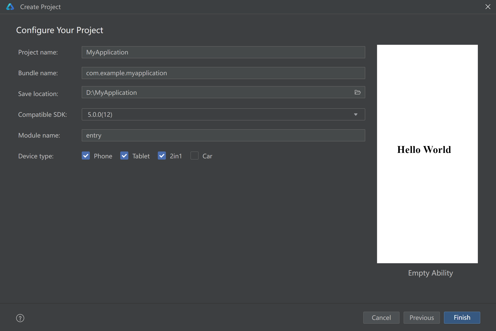

​ Connect to a real device and click `File > Project Structure`. In the dialog box that is displayed, click `Signing Configs`, select `Support OpenHarmony` and `Automatically generate signature`, and click `Sign In` to log in to the HUAWEI ID and sign.

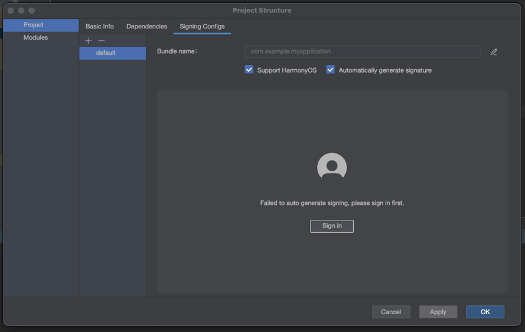

## Adding the React Native Configuration

Run the following command in the `entry` directory:

    ohpm i @rnoh/react-native-openharmony@x.x.x

After the execution is complete, the `oh_modules` folder is generated in the project-level directory and module-level directory.
> NOTE
> 1. In the command, *@x.x.x* indicates the version to be downloaded. If it is not specified, the latest version is downloaded by default.
> 2. This step takes a long time because the HAR package is large. Ensure that `ohpm install` and `SyncData` generated by the IDE are complete. Otherwise, a compilation error is reported.

## Integrating RNOH into a Native Project

### Adding CPP Code

1. Create the **cpp** folder in the `MyApplication/entry/src/main` directory.
2. Add `CMakeLists.txt` to the **cpp** directory and add the **RNOH** adaptation layer code to the compilation and building to generate `librnoh_app.so`.
    ```CMake
    project(rnapp)
    cmake_minimum_required(VERSION 3.4.1)
    set(CMAKE_SKIP_BUILD_RPATH TRUE)
    set(OH_MODULE_DIR "${CMAKE_CURRENT_SOURCE_DIR}/../../../oh_modules")
    set(RNOH_APP_DIR "${CMAKE_CURRENT_SOURCE_DIR}")

    set(RNOH_CPP_DIR "${OH_MODULE_DIR}/@rnoh/react-native-openharmony/src/main/cpp")
    set(RNOH_GENERATED_DIR "${CMAKE_CURRENT_SOURCE_DIR}/generated")
    set(CMAKE_ASM_FLAGS "-Wno-error=unused-command-line-argument -Qunused-arguments")
    set(CMAKE_CXX_FLAGS "-fstack-protector-strong -Wl,-z,relro,-z,now,-z,noexecstack -s -fPIE -pie")
    add_compile_definitions(WITH_HITRACE_SYSTRACE)
    set(WITH_HITRACE_SYSTRACE 1) # for other CMakeLists.txt files to use

    add_subdirectory("${RNOH_CPP_DIR}" ./rn)

    add_library(rnoh_app SHARED
        "./PackageProvider.cpp"
        "${RNOH_CPP_DIR}/RNOHAppNapiBridge.cpp"
    )

    target_link_libraries(rnoh_app PUBLIC rnoh)
    ```
3. Add the `PackageProvider.cpp` file to the **cpp** directory. The following is required:
   - Import `RNOH/PackageProvider`.
   - Implement the `getPackages` method to create a **package** object of a third-party library, custom TurboModule, or Fabric.
   > Here, third-party libraries, custom TurboModule, or other components are not involved, so an empty array needs to be returned.
    ```CPP
    #include "RNOH/PackageProvider.h"

    using namespace rnoh;

    std::vector<std::shared_ptr<Package>> PackageProvider::getPackages(Package::Context ctx) {
        return {};
    }
    ```
4. Open `MyApplicaton\entry\build-profile.json5` and add the code in the **cpp** directory to the build task file of OpenHarmony. For details, see the module-level [build-profile.json5](https://developer.huawei.com/consumer/en/doc/harmonyos-guides-V5/ide-hvigor-build-profile-V5).
   ```diff
   {
    "apiType": "stageMode",
    "buildOption": {
   +   "externalNativeOptions": {
   +      "path": "./src/main/cpp/CMakeLists.txt",
   +      "arguments": "",
   +      "cppFlags": "",
   +    }
    },
    "buildOptionSet": [
      {
        "name": "release",
        "arkOptions": {
          "obfuscation": {
            "ruleOptions": {
              "enable": true,
              "files": [
                "./obfuscation-rules.txt"
              ]
            }
          }
        }
      },
    ],
    "targets": [
      {
        "name": "default"
      },
      {
        "name": "ohosTest",
      }
    ]
   }
   ```

### Adding ArkTS Code

1. Open the `MyApplicaton\entry\src\main\ets\entryability\EntryAbility.ets` file and import `RNAbility`. The following is required:
   - Use **super** if the lifecycle callback needs to be used. `RNAbility` performs the corresponding operation in the lifecycle callback. Use **super** to ensure that the function is not lost.
   - Override `getPagePath` to return to the entry page of the program.
    ```TypeScript
    import { RNAbility } from '@rnoh/react-native-openharmony';

    export default class EntryAbility extends RNAbility {
      getPagePath() {
        return 'pages/Index';
      }
    }
    ```
2. Add the `RNPackagesFactory.ets` file to the `MyApplicaton\entry\src\main\ets` directory. The following is required:
   - Import `RNPackageContext` and `RNPackage` to `@rnoh/react-native-openharmony`.
   - Export the `createRNPackages` method from the file to create a **package** object of a third-party library, custom TurboModule, or Fabric.
    > Here, third-party libraries, custom TurboModule, or other components are not involved, so an empty array needs to be returned.
    ```TypeScript
    import { RNPackageContext, RNPackage } from '@rnoh/react-native-openharmony/ts';
    export function createRNPackages(ctx: RNPackageContext): RNPackage[] {
      return [];
    }
    ```
3. Open `MyApplicaton\entry\src\main\ets\pages\Index.ets` and add the RNOH code. The modified code is as follows.
   > The `appKey` parameter of `RNApp` must be the same as `appName` registered by `AppRegistry.registerComponent` in the RN project. Otherwise, a white screen occurs.
    ```TypeScript
    import {
      AnyJSBundleProvider,
      ComponentBuilderContext,
      FileJSBundleProvider,
      MetroJSBundleProvider,
      ResourceJSBundleProvider,
      RNApp,
      RNOHErrorDialog,
      RNOHLogger,
      TraceJSBundleProviderDecorator,
      RNOHCoreContext
    } from '@rnoh/react-native-openharmony';
    import { createRNPackages } from '../RNPackagesFactory';

    @Builder
    export function buildCustomRNComponent(ctx: ComponentBuilderContext) {}

    const wrappedCustomRNComponentBuilder = wrapBuilder(buildCustomRNComponent)

    @Entry
    @Component
    struct Index {
      @StorageLink('RNOHCoreContext') private rnohCoreContext: RNOHCoreContext | undefined = undefined
      @State shouldShow: boolean = false
      private logger!: RNOHLogger

      aboutToAppear() {
        this.logger = this.rnohCoreContext!.logger.clone("Index")
        const stopTracing = this.logger.clone("aboutToAppear").startTracing();

        this.shouldShow = true
        stopTracing();
      }

      onBackPress(): boolean | undefined {
        // NOTE: this is required since `Ability`'s `onBackPressed` function always
        // terminates or puts the app in the background, but we want Ark to ignore it completely
        // when handled by RN
        this.rnohCoreContext!.dispatchBackPress()
        return true
      }

      build() {
        Column() {
          if (this.rnohCoreContext && this.shouldShow) {
            if (this.rnohCoreContext?.isDebugModeEnabled) {
              RNOHErrorDialog({ ctx: this.rnohCoreContext })
            }
            RNApp({
              rnInstanceConfig: {
                createRNPackages,
                enableNDKTextMeasuring: true, // Must be true to enable NDK text measuring.
                enableBackgroundExecutor: false,
                enableCAPIArchitecture: true, // Must be true to enable CAPI.
                arkTsComponentNames: []
              },
              initialProps: { "foo": "bar" } as Record<string, string>,
              appKey: "AwesomeProject",
              wrappedCustomRNComponentBuilder: wrappedCustomRNComponentBuilder,
              onSetUp: (rnInstance) => {
                rnInstance.enableFeatureFlag("ENABLE_RN_INSTANCE_CLEAN_UP")
              },
              jsBundleProvider: new TraceJSBundleProviderDecorator(
                new AnyJSBundleProvider([
                  new MetroJSBundleProvider(),
                  // NOTE: to load the bundle from file, place it in
                  // `/data/app/el2/100/base/com.rnoh.tester/files/bundle.harmony.js`
                  // on your device. The path mismatch is due to app sandboxing on OpenHarmony
                  new FileJSBundleProvider('/data/storage/el2/base/files/bundle.harmony.js'),
                  new ResourceJSBundleProvider(this.rnohCoreContext.uiAbilityContext.resourceManager, 'hermes_bundle.hbc'),
                  new ResourceJSBundleProvider(this.rnohCoreContext.uiAbilityContext.resourceManager, 'bundle.harmony.js')
                ]),
                this.rnohCoreContext.logger),
            })
          }
        }
        .height('100%')
        .width('100%')
      }
    }
    ```

## Loading a Bundle

​ After a bundle is generated (as described in the previous section), load it to DevEco Studio to run the **MyApplication** project. You can load a bundle by using any of the following methods:
- Method 1: Load the bundle locally. Place the bundle file and assets images in the `entry/src/main/resources/rawfile` directory and use them in `entry/src/main/ets/pages/Index.ets`.
- Method 2: Load the bundle by using Metro. For details, see [Metro Hot Reloading](debugging.md#metro-hot-reloading).
- Method 3: Load the bundle of the sandbox directory.
  
  - [Application sandbox](https://gitee.com/openharmony/docs/blob/master/en/application-dev/file-management/app-sandbox-directory.md) is an isolation mechanism used to prevent malicious data access through path traversal. With this mechanism, only the application sandbox directory is visible to an application.
  - During the development and debugging process of an application, you need to push files to the application sandbox directory for intra-application access or for testing purposes. You can use either of the following methods to push files:

    −     Method 1: Use DevEco Studio to place the target file in the application installation path. For details, see [Resource Categories and Access](https://gitee.com/openharmony/docs/blob/master/en/application-dev/quick-start/resource-categories-and-access.md).

    −     Method 2: Use the hdc tool to push files to the application sandbox directory on the device, which can be implemented using the following send command. This method is more flexible. The push command is as follows. The sandbox directory can be queried by [pushing files to the application sandbox](https://gitee.com/openharmony/docs/blob/master/en/application-dev/file-management/send-file-to-app-sandbox.md):

    ```bash
    hdc file send ${Local directory for pushing files} ${Sandbox directory}
    ```

  - To load a bundle from the sandbox directory, you need to use `new FileJSBundleProvider('bundlePath')` in the `jsBundlePrivider` parameter of RNApp to register the bundle with the framework and run the bundle.

In the `Index.ets` file under the `MyApplication/entry` directory, pass `jsBundleProvider` to load the bundle when creating an `RNApp`. As shown in the code, three **BundleProvider**s are passed in, indicating that the bundle is loaded by Metro, sandbox directory, and local mode respectively. If the bundle fails to be loaded by Metro, it should be loaded in the sequence of **JSBundleProvider**s until the loading is successful or fails in all modes.

## Starting and Running a Project

​ Use DevEco Studio to run the **MyApplication** project. After the execution is complete, the console displays the following information:

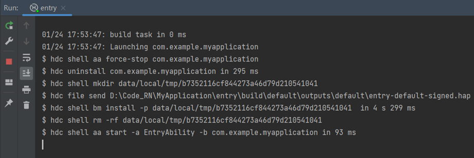

> It takes a long time to completely compile C++ code. Please wait.

## Using the Release Package
1. Create a **libs** folder in the `MyApplication` directory and store the `react_native_openharmony-xxx-release.har` file to the **libs** folder.

2. Open `oh-package.json5` under `MyApplication/entry` and replace the dependency of the HAR package with the release package.
    ```diff
    {
      "name": "entry",
      "version": "1.0.0",
      "description": "Please describe the basic information.",
      "main": "",
      "author": "",
      "license": "",
      "dependencies": {
    +     "@rnoh/react-native-openharmony": "file:../libs/react_native_openharmony-xxx-release.har"
      }
    }
    ```

3. Change the code in `MyApplication\entry\src\main\cpp\CMakeLists.txt` to the following:


```cmake
project(rnapp)
cmake_minimum_required(VERSION 3.4.1)
set(CMAKE_SKIP_BUILD_RPATH TRUE)
set(NATIVERENDER_ROOT_PATH "${CMAKE_CURRENT_SOURCE_DIR}")
set(OH_MODULE_DIR "${CMAKE_CURRENT_SOURCE_DIR}/../../../oh_modules")
set(RNOH_CPP_DIR "${OH_MODULE_DIR}/@rnoh/react-native-openharmony/src/main/include")
set(REACT_COMMON_PATCH_DIR "${RNOH_CPP_DIR}/patches/react_native_core")

set(CMAKE_CXX_STANDARD 17)
set(LOG_VERBOSITY_LEVEL 1)
set(CMAKE_ASM_FLAGS "-Wno-error=unused-command-line-argument -Qunused-arguments")
set(RNOH_GENERATED_DIR "${CMAKE_CURRENT_SOURCE_DIR}/generated")
set(CMAKE_CXX_FLAGS "-fstack-protector-strong -Wl,-z,relro,-z,now,-z,noexecstack -s -fPIE -pie -DNDEBUG")
set(WITH_HITRACE_SYSTRACE 1) # for other CMakeLists.txt files to use
add_compile_definitions(WITH_HITRACE_SYSTRACE)
# Folly compilation options
set(folly_compile_options
    -DFOLLY_NO_CONFIG=1
    -DFOLLY_MOBILE=1
    -DFOLLY_USE_LIBCPP=1
    -DFOLLY_HAVE_RECVMMSG=1
    -DFOLLY_HAVE_PTHREAD=1
    -Wno-comma
    -Wno-shorten-64-to-32
    -Wno-documentation
    -faligned-new
)
add_compile_options("-Wno-unused-command-line-argument")
# Add a header file directory.
include_directories(${NATIVERENDER_ROOT_PATH}
                    ${RNOH_CPP_DIR}
                    ${REACT_COMMON_PATCH_DIR}
                    ${RNOH_CPP_DIR}/third-party/folly
                    ${RNOH_CPP_DIR}/third-party/rn/ReactCommon
                    ${RNOH_CPP_DIR}/third-party/rn/ReactCommon/react/nativemodule/core
                    ${RNOH_CPP_DIR}/third-party/rn/ReactCommon/jsi
                    ${RNOH_CPP_DIR}/third-party/rn/ReactCommon/callinvoker
                    ${RNOH_CPP_DIR}/third-party/boost/libs/utility/include
                    ${RNOH_CPP_DIR}/third-party/boost/libs/stacktrace/include
                    ${RNOH_CPP_DIR}/third-party/boost/libs/predef/include
                    ${RNOH_CPP_DIR}/third-party/boost/libs/array/include
                    ${RNOH_CPP_DIR}/third-party/boost/libs/throw_exception/include
                    ${RNOH_CPP_DIR}/third-party/boost/libs/config/include
                    ${RNOH_CPP_DIR}/third-party/boost/libs/core/include
                    ${RNOH_CPP_DIR}/third-party/boost/libs/preprocessor/include
                    ${RNOH_CPP_DIR}/third-party/double-conversion
                    ${RNOH_CPP_DIR}/third-party/rn/ReactCommon/react/renderer/graphics/platform/cxx
                    ${RNOH_CPP_DIR}/third-party/rn/ReactCommon/runtimeexecutor
                    ${RNOH_CPP_DIR}/third-party/glog/src
                    ${RNOH_CPP_DIR}/third-party/boost/libs/mpl/include
                    ${RNOH_CPP_DIR}/third-party/boost/libs/type_traits/include
                    ${RNOH_CPP_DIR}/third-party/rn/ReactCommon/yoga
                    ${RNOH_CPP_DIR}/third-party/boost/libs/intrusive/include
                    ${RNOH_CPP_DIR}/third-party/boost/libs/assert/include
                    ${RNOH_CPP_DIR}/third-party/boost/libs/move/include
                    ${RNOH_CPP_DIR}/third-party/boost/libs/static_assert/include
                    ${RNOH_CPP_DIR}/third-party/boost/libs/container_hash/include
                    ${RNOH_CPP_DIR}/third-party/boost/libs/describe/include
                    ${RNOH_CPP_DIR}/third-party/boost/libs/mp11/include
                    ${RNOH_CPP_DIR}/third-party/boost/libs/iterator/include
                    ${RNOH_CPP_DIR}/third-party/boost/libs/detail/include
                    ${RNOH_CPP_DIR}/patches/react_native_core/react/renderer/textlayoutmanager/platform/harmony
                    )

configure_file(
  ${RNOH_CPP_DIR}/third-party/folly/CMake/folly-config.h.cmake
  ${RNOH_CPP_DIR}/third-party/folly/folly/folly-config.h
)
file(GLOB GENERATED_CPP_FILES "./generated/*.cpp")
# Add a dynamic shared package of RNOH.
add_library(rnoh SHARED
    "${RNOH_CPP_DIR}/RNOHOther.cpp"
    "${RNOH_CPP_DIR}/third-party/folly/folly/lang/SafeAssert.cpp"
    )
# Link to other .so files.
target_link_directories(rnoh PUBLIC ${OH_MODULE_DIR}/@rnoh/react-native-openharmony/libs/arm64-v8a)
target_link_libraries(rnoh PUBLIC
    rnoh_semi
    libace_napi.z.so
    libace_ndk.z.so
    librawfile.z.so
    libhilog_ndk.z.so
    libnative_vsync.so
    libnative_drawing.so
    libc++_shared.so
    libhitrace_ndk.z.so
    react_render_scheduler
    rrc_image
    rrc_text
    rrc_textinput
    rrc_scrollview
    react_nativemodule_core
    react_render_animations
    jsinspector
    hermes
    jsi
    logger
    react_config
    react_debug
    react_render_attributedstring
    react_render_componentregistry
    react_render_core
    react_render_debug
    react_render_graphics
    react_render_imagemanager
    react_render_mapbuffer
    react_render_mounting
    react_render_templateprocessor
    react_render_textlayoutmanager
    react_render_telemetry
    react_render_uimanager
    react_utils
    rrc_root
    rrc_view
    react_render_leakchecker
    react_render_runtimescheduler
    runtimeexecutor
    )

if("$ENV{RNOH_C_API_ARCH}" STREQUAL "1")
    message("Experimental C-API architecture enabled")
    target_link_libraries(rnoh PUBLIC libqos.so)
    target_compile_definitions(rnoh PUBLIC C_API_ARCH)
endif()
# RNOH_END: add_package_subdirectories

# Add a shared rnoh_app package.
add_library(rnoh_app SHARED
    ${GENERATED_CPP_FILES}
    "./PackageProvider.cpp"
    "${RNOH_CPP_DIR}/RNOHOther.cpp"
    "${RNOH_CPP_DIR}/RNOHAppNapiBridge.cpp"
)

target_link_libraries(rnoh_app PUBLIC rnoh)

target_compile_options(rnoh_app PUBLIC ${folly_compile_options} -DRAW_PROPS_ENABLED -std=c++17)


```

3. Delete the `oh_modules` folder from `MyApplication/entry`, click the `entry` folder, and choose `build` > `Clean Project` on the top menu bar to clear the project cache.
4. Choose `File` > `Sync and Refresh Project` on the top menu bar to run `ohpm install`. After the execution is complete, the `oh_modules` folder is generated in the `entry` directory.
5. Choose `Run` > `Run 'entry'` on the top menu bar to run the project. After the project is successfully run, you will see information similar to the following:
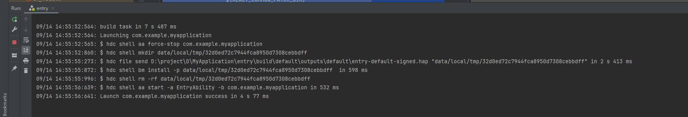
