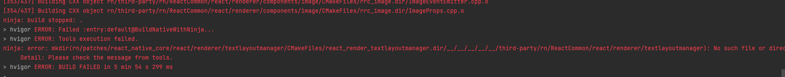
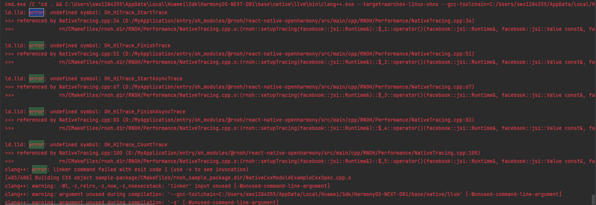
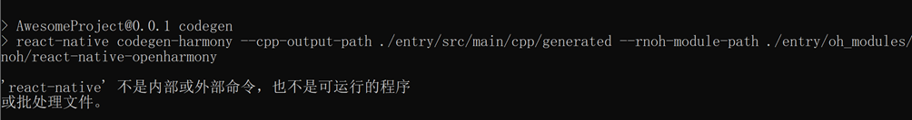
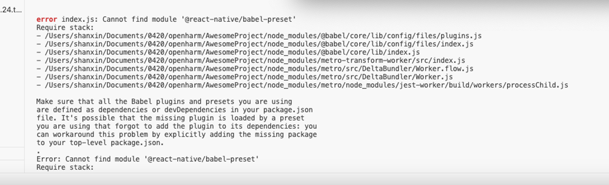
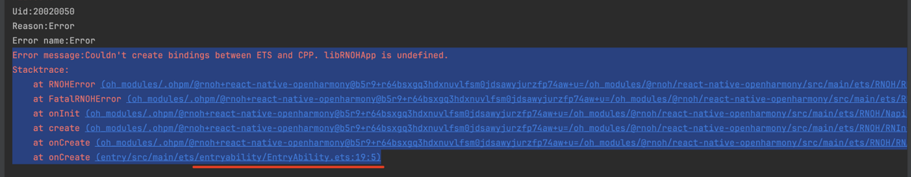
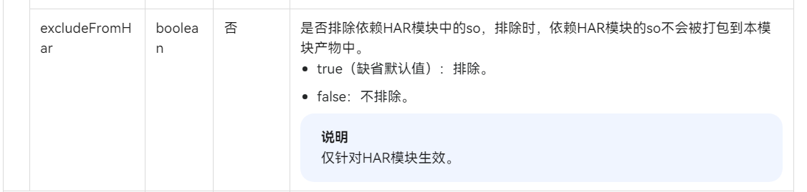
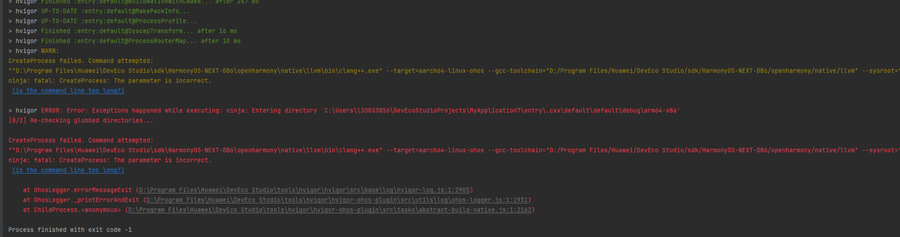

# Compilation FAQs

## Compilation Error, Indicating That TextLayoutManager Cannot Be Found
- Error message
An error is reported during CPP compilation. Search for `error` in the error information. It is found that the `TextLayoutManager.cpp` file cannot be found. The error information is as follows.
  
- Cause 
This problem occurs because the project path is too long. In this case, shorten the project path.

## Cannot Find Files Such as generated
- Error message 
The error information indicates that the `react_native_openharmony/generated/ts` file cannot be found. The file in `react_native_openharmony/generated` is generated by Codegen.
- Error screenshot 
  
- Causes
1. Codegen is not executed.
2. The file generated by Codegen is not stored in a correct location.
- Solutions 
Solution 1:
    Codegen automatically generates the cpp and ets code based on the API declaration. The location of the generated code can be adjusted by the `--cpp-output-path` and `--rnoh-module-path` parameters. The values of the two parameters can be obtained by comparing the relative paths of the RN project and OpenHarmony project. 
Solution 2:
    Specify the values of `--cpp-output-path` and `--rnoh-module-path`, and then copy the generated folders to the OpenHarmony project. For example, copy ets to `entry/oh_modules/react_native_openharmony` and cpp to `entry/src/main/cpp`.

## Bundling or Metro Startup Error, Indicating That DrawerLayoutAndroid Cannot Be Found
- Error screenshot 
A bundling or Metro startup error occurs, reporting `None of these files exist`, shown in the following figure.
  
- Cause 
This problem occurs because the OpenHarmony bundle parameters are not configured. For details, see [How Do I Set OpenHarmony Bundle Parameters?](common-development-scenarios.md#How Do I Set OpenHarmony Bundle Parameters?). After the configuration is complete, repack the package.

### Cannot Find the HiTrace Compilation Option
- Error screenshot 
  
- Cause 
This problem occurs because `WITH_HITRACE_SYSTRACE` is not set to **1** in the compilation option. You can add the compilation option to CMakeLists. Note that the `WITH_HITRACE_SYSTRACE` compilation option must be set before `add_subdirectory()`. Otherwise, the setting does not take effect.

    ```CMAKE
    # CMakeLists.txt
    ···
    set(WITH_HITRACE_SYSTRACE 1)
    add_compile_definitions(WITH_HITRACE_SYSTRACE)

    add_subdirectory(...)
    ···
    ```

### react-native Is Not an Internal or External Command
- Solution 
  
This problem occurs when `npm install` is run. Ensure that `package.json` is correct and run the following command again:

    ```PowerShell
    npm install
    ```

### Cannot Find Module '@react-native/babel-preset' in MAC
- Error screenshot 
  
 - Cause 
This problem occurs because redundant symbols are added when the project creation command is copied in the editor.
- Solution 
Format the copied command and then run it, or manually enter the command for creating a project.

### Cannot Find libhermes.so
 
This problem may occur in the following situations:
 
1. Hilog shows that **libhermes.so** is not found: "can't find library libhermes.so in namespace: moduleNs_default".
 
     
 
2. The **libhermes.so** file is not found in `\entry\build\default\outputs\default\entry-default-signed.hap` of the native project.
 
3. Check the [incompatible changes](https://developer.huawei.com/consumer/en/doc/harmonyos-releases-V5/ide-changelogs-db5-V5) in the DevEco Studio change description. For example, there are two HARs, and the .so file of HAR A depends on the .so file of HAR B. In earlier versions, the .so file of the HAR B is packed into the HAR A. However, this has been changed in the latest version.
 
Solution:
 
Add the following code to `entry/build-profile.json5`:
 
```json5
"nativeLib": { // Same level as apiType
   "excludeFromHar": false
}
```
 
  

### Error Related to the RNOH_CAPI_ARCH Environment Variable

- Symptom

    An error message is displayed during RNOH compilation, indicating CustomComponentArkUINodeHandleFactory.h:62:12: error: no viable conversion from returned value of type 'std::nullptr_t' to function return type 'std::pair<ArkUI_NodeHandle, napi_ref>' (aka 'pair<ArkUI_Node *, napi_ref__ *>').

- Cause

    The problem is caused by the `RNOH_CAPI_ARCH` environment variable.

- Solutions

    1. This error is caused by the **C API** version. You need to set `RNOH_C_API_ARCH=1` in the environment variable, restart DevEco Studio, choose **Build** > **Clean Project**, and recompile the code.
    2. If the preceding settings do not take effect, delete the `.cxx` directory and recompile and run the code.
    3. If the problem still persists, set the following parameter in `CMakeLists.txt`:

    ```CMAKE
    set(RNOH_C_API_ARCH, 1)
    ```

### C++ Compilation Problems in the Release Version

- Background

    Currently, there are two sets of compilation HARs and `CMakeLists.txt` files for the RNOH version. One is the debug version, and the other is the release version (with the **-release** suffix). The differences are as follows:

    - Size: In the release version, the C++ source code is converted into the dynamic library `.so` file, reducing the package size.
    - Build speed: The main application build speed is significantly accelerated because the HAR of the release version is referenced during precompilation.
    - Debugging: The debugging function is removed from the release version. Therefore, if you want to use the JS breakpoint for debugging, you are advised to use the debug version first.

- Symptom

    After `CMakeLists - release.txt` is replaced with `CMakeLists.txt`, some compilation errors occur.
    - Error 1: Undefined identifiers
    - Error 2: Undefined symbol: folly
        -   ld.lld: error: undefined symbol: folly::f14::detail::kEmptyTagVector
            ld.lld: error: undefined symbol: folly::f14::detail::F14LinkCheck<(folly::f14::detail::F14IntrinsicsMode)1>::check()

- Causes

    - Error 1: The header file path of the third-party library is not included in `CMakeLists.txt`.
    - Error 2: Currently, the `folly` header file is introduced during the development of many third-party libraries. Therefore, you need to add the `folly` configuration when compiling the third-party library package. Otherwise, undefined symbols may occur.

- Solutions

    - Error 1: Add the header file path of the third-party library to `include_directories` as prompted.
    - Error 2: Add the `folly` compilation configuration to the third-party package, for example, `target_compile_options` (third-party library bundle name: PUBLIC${folly_compile_options}).

### hvigor ERROR: Exceptions happened while executing: ninja: Entering directory...

- Symptom
	
    An error message is displayed during RNOH compilation, shown as follows.
    

- Cause

    Check the message in blue: `is the command line too long?` This indicates that it may take a long time to execute commands and the **ninja** compilation command cannot be executed. (Note: Currently, the maximum length of a command in Windows is 8191 characters.)

- Solution

    The root directory of the native project is too deep or the project name is too long. You are advised to shorten the directory level of the native project or shorten the project name.

### hvigor ERROR: Failed :entry:default@HotReloadArkTS...

- Symptom
	
    An error occurs when the 5.0.0.500 release version is used for RNOH.har compilation and build, as shown in the following:
    ```PowerShell
    > hvigor ERROR: Failed :entry:default@HotReloadArkTS...
    > hvigor ERROR: ArkTS:ERROR File: /Users/aigcheng/work/codespace/app-harmony/huazhuhui/oh_modules/.ohpm/@rnoh+react-native-openharmony@pr5doejn6e1pdvw0glvewknk+eemfkhfs1ilfycgfmw=/oh_modules/@rnoh/react-native-openharmony/src/main/ets/RNOH/RNAbility.ets:112:35
    Argument of type '{ logger: RNOHLogger; }' is not assignable to parameter of type '{ baseRequestOptions?: RequestOptions; responseInterceptors?: ResponseInterceptor[]; requestInterceptors?: RequestInterceptor[]; }'.
    Object literal may only specify known properties, and 'logger' does not exist in type '{ baseRequestOptions?: RequestOptions; responseInterceptors?: ResponseInterceptor[]; requestInterceptors?: RequestInterceptor[]; }'.

    > hvigor ERROR: BUILD FAILED in 36 s 337 ms

    The error is in the @rnoh\react-native-openharmony\src\main\ets\RNOH\RNAbility.ets file.
    Change return new DefaultHttpClient ({logger: this.logger}); to return new DefaultHttpClient();.
    ```
- Cause

    The **logger** parameter is missing in the constructor function of **HttpClient.ts** in the source code, but is contained in the source code parsed by the release package.

- Solution

    Delete the `oh_modules` folder in the project and click **Synchronize** to reload the folder.
