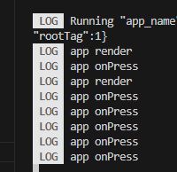

# Performance Optimization

## Page Lifecycle Management

In `RNAbility`, the `onBackground` and `onForeground` APIs are provided to listen on the page lifecycle management. By default, these two APIs are called when an application is switched between the foreground and background. However, you need to adapt the routing between pages.
Currently, OpenHarmony supports two page routing modes: `router` and `Navigation`, which require different adaptation modes of page lifecycle management.

- Adaptation in `router`:
    1. Import the `RNAbility` class to the page decorated by `@Entry`.

        ```javascript
        import {RNAbility} from '@rnoh/react-native-openharmony';
        ...
        @Entry
        @Component
        export struct ComponentName{
        @StorageLink('RNAbility') rnAbility: RNAbility | undefined = undefined
        ...
        }
        ```

    2. Call `rnAbility?.onForeground()` and `rnAbility?.onBackground()` in lifecycle callbacks `onPageShow` and `onPageHide`.

        ```javascript
        onPageShow(){
            this.rnAbility?.onForeground();
        }
        onPageHide(){
            this.rnAbility?.onBackground();
        }
        ```

- Adaptation in `Navigation`:
    1. Import the `RNAbility` class to the custom component with `NavDestination`. This step is the same as that when `router` is used.

    2. Call `rnAbility?.onForeground()` in the `onShown` callback event of `NavDestination`, and call `rnAbility?.onBackground()` in the `onHidden` callback event.

        ```javascript
        ...
        build(){
            NavDestination(){
            ...
            }
            .onShown(() => {
            this.rnAbility?.onForeground();
            })
            .onHidden(() =>{
            this.rnAbility?.onBackground();
            })
        }
        ```

## Page Monitoring

Before using traces to optimize performance, pay attention to the following prerequisites:

- The HAP must be a release build, rather than a debug build.
- The bundle must be in bytecode. That is, set `dev=false` when packing a bundle.

### Memory Monitoring

React Native for OpenHarmony uses `onMemoryLevel` to listen on the program memory status. When the memory usage is high, GC is automatically triggered to free the memory. Ensure the normal running of the application.

### Monitoring the Completion of Bundle Loading

1. In the code, you can use the `rnInstance.getBundleExecutionStatus(bundleURL: string)` method to obtain the loading status of the bundle of a specified URL. If the obtained status is `DONE`, the current bundle has been loaded. For example:

    ```javascript
    rnInstance.getBundleExecutionStatus(jsBundleProvider?.getURL());
    if (jsBundleExecutionStatus === "DONE") {
        ···
    }
    ```

2. You can also use trace [optimization](https://developer.huawei.com/consumer/cn/doc/harmonyos-guides-V5/bpta-optimization-overview-0000001869609160-V5) to monitor the time when the bundle is loaded. Use the [Smartperf-Host](https://gitee.com/openharmony-sig/smartperf#smartperf-host) tool to open the trace and search for `loadBundle` in the trace. Then, you will be redirected to the corresponding location of the `RNOH_JS` thread of the process (for example, `com.rnoh.tester` in the figure).


### Monitoring of the First Frame on a Page

You can use trace [optimization](https://developer.huawei.com/consumer/cn/doc/harmonyos-guides-V5/bpta-optimization-overview-0000001869609160-V5) to monitor the time when the first frame of the page is loaded. Use the [Smartperf-Host](https://gitee.com/openharmony-sig/smartperf#smartperf-host) tool to open the trace and find the loading time of the first frame based on the following characteristics:

- `loadBundle` has been completed.
- At **1**, you can see the operations related to constructing the node tree on the `RNOH_JS` thread, such as `cloneNode`.
- At **2**, you can see `ShadowTree::commit`, indicating that commit in the rendering is complete.
- At **3**, although no trace is displayed, it does not mean that the thread is idle. The `ComponentInstance` component is created during a period of time.
- At **4**, the native API `FlushVsync` of the system is called on the main thread to refresh the view synchronization event, including recording the frame information, refreshing the task, drawing the rendering context, and completing the final rendering.


### React Marker
#### React Marker

React Marker is used to listen for various events in the lifecycle of RN applications, and add trace points to the following eight core scenarios: event creation, package processing, native module registration, Catalyst instance creation, JavaScript package loading and running, content display, reloading and debugging, and download. It uses unified tags to output logs, add trace points, and provide logs for performance problem analysis.

##### React Markers supported in the current version
|ReactMarkerId|Description|
|---|---|
|RUN_JS_BUNDLE_START|Indicates that JS_Bundle running starts.|
|RUN_JS_BUNDLE_STOP|Indicates that JS_Bundle running stops.|
|CREATE_REACT_CONTEXT_START|Indicates that React context creation starts.|
|CREATE_REACT_CONTEXT_STOP|Indicates that React context creation stops.|
|NATIVE_MODULE_SETUP_START|Indicates that native module initialization starts.|
|NATIVE_MODULE_SETUP_STOP|Indicates that native module initialization stops.|
|REACT_INSTANCE_INIT_START|Indicates that React instance initialization starts.|
|REACT_INSTANCE_INIT_STOP|Indicates that React instance initialization stops.|
|CONTENT_APPEARED|Indicates that application content has been successfully rendered and displayed to users.|
|CHANGE_THREAD_PRIORITY|Changes thread priority.|
|DOWNLOAD_START|Indicates that JS_Bundle download starts.|
|DOWNLOAD_END|Indicates that JS_Bundle download ends.|
|REACT_BRIDGE_LOADING_START|Indicates that React bridge module loading starts.|
|REACT_BRIDGE_LOADING_END|Indicates that React bridge module loading ends.|
|INITIALIZE_MODULE_START|Indicates that React module initialization starts.|
|INITIALIZE_MODULE_END|Indicates that React module initialization ends.|
|PROCESS_PACKAGES_START|Indicates that JS package processing starts.|
|PROCESS_PACKAGES_END|Indicates that JS package processing ends.|
|CREATE_UI_MANAGER_MODULE_START|Indicates that UI_Manager module creation starts.|
|CREATE_UI_MANAGER_MODULE_END|Indicates that UI_Manager module creation ends.|
|CREATE_MODULE_START|Indicates that React module creation starts.|
|CREATE_MODULE_END|Indicates that React module creation ends.|
|PROCESS_CORE_REACT_PACKAGE_START|Indicates that React Native core package Loading starts.|
|PROCESS_CORE_REACT_PACKAGE_END|Indicates that React Native core package Loading ends.|
|FABRIC_COMMIT_START|Indicates that the submission of the Fabric rendering engine starts.|
|FABRIC_COMMIT_END|Indicates that the submission of the Fabric rendering engine ends.|
|FABRIC_FINISH_TRANSACTION_START| Indicates that Fabric finish transaction starts.|
|FABRIC_FINISH_TRANSACTION_END|Indicates that Fabric finish transaction ends.|
|FABRIC_DIFF_START|Indicates that Fabric difference calculation starts.|
|FABRIC_DIFF_END|Indicates that Fabric difference calculation ends.|
|FABRIC_LAYOUT_START|Indicates that Fabric layout starts.|
|FABRIC_LAYOUT_END|Indicates that Fabric layout ends.|
|FABRIC_BATCH_EXECUTION_START|Indicates that Fabric batch execution starts.|
|FABRIC_BATCH_EXECUTION_END|Indicates that Fabric batch execution ends.|
|FABRIC_UPDATE_UI_MAIN_THREAD_START|Indicates that Fabric UI update on the main thread starts.|
|FABRIC_UPDATE_UI_MAIN_THREAD_END|Indicates that Fabric UI update on the main thread ends.|

#### Trace Logging of React Marker
1. Capture the trace of the corresponding application.
> Note: Start the trace operation before the application is started.

2. Use [SmartPerf](https://gitee.com/openharmony-sig/smartperf) to enable the corresponding trace function.

  - The following is an example of the application trace.

  In the preceding figure, red box 1 indicates the application process, and red box 2 indicates the React Marker information printed during application running. 

> Note: The names of React Markers displayed on the trace are different. For example, the names of `RUN_JS_BUNDLE_START` and `RUN_JS_BUNDLE_STOP` are `H:ReactMarker::RUN_JS_BUNDLE::tag::<message>`, and START and STOP indicate the start and end of the time bar.

#### Listening Implementation of React Marker
> Note: To implement the listening function of React Marker, you need to [implementation a custom TurboModule](./TurboModule.md). The following content is also written based on this document.
1. Create a TurboModule in the OpenHarmony project. For details, see [Implementation of a Custom TurboModule](./TurboModule.md). If the TurboModule already exists in the project, go to the next step.

2. Declare a method for processing the React Marker event in the `NativeCalculator.ts` file on the JS side in the React Native project.
   
   Add the following code to `RTNCalculator/src/specs/v2/NativeCalculator.ts`:
    ```diff
    // NativeCalculator.ts
    import type {TurboModule} from 'react-native/Libraries/TurboModule/RCTExport';
    import {TurboModuleRegistry} from 'react-native';

    export interface Spec extends TurboModule {
      add(a: number, b: number): Promise<number>;
    +  handleReactMarkerEvent(
    +    markerId: string,
    +    tag: string,
    +    timestamp: string,
    +  ): void;
    }

    export default TurboModuleRegistry.get<Spec>(
      'RTNCalculator',
    ) as Spec | null;
   ```
    - handleReactMarkerEvent: name of the method, indicating that the method is used to process an event related to the React Marker. 
    - markerId: unique ID used to identify a specific event of the React Marker. 
    - tag: used to further describe the type or source of the React Marker event. 
    - timestamp: indicates the time when an event occurs. It is usually used to record the timestamp of the React Marker event.
  3. Use Codegen to generate native code in the React Native project, and copy the generated glue code to your OpenHarmony project. For details, see [Implementation of a Custom TurboModule](./TurboModule.md).
  4. Implement the method for processing the React Marker event in the `CalculatorModule.ts` file on the ArkTS side in the OpenHarmony project.

     Add the following code to `entry/src/main/ets/turbomodule/CalculatorModule.ts`:
      ```diff
      // entry/src/main/ets/turbomodule/CalculatorModule.ts
      import { TurboModule } from '@rnoh/react-native-openharmony/ts';
      import { TM } from '@rnoh/react-native-openharmony/generated/ts';

      export class CalculatorModule extends TurboModule implements TM.RTNCalculator.Spec {
        add(a: number, b: number): Promise<number>{
          return Promise.resolve(a+b);
        }
      + handleReactMarkerEvent(
      +    markerId: string,
      +    tag: string,
      +    timestamp: string,
      +  ): void {
      +    console.log(`RNOH CalculatorTurboModule::handleReactMarkerEvent(${markerId} ${tag} ${timestamp})`);
      +  }
      }
      ```
      Print the information in this method about the React Marker event listened for on the C++ side. 

5. Create the `TMHarmonyReactMarker.h` file on the C++ side in the OpenHarmony project.

   Add the `TMHarmonyReactMarker.h` file to the `entry/src/main/cpp` directory and add the following code:
    ```cpp
    #include "RNOH/Performance/HarmonyReactMarker.h"
    #include "RNOH/RNInstance.h"
    #include "RNOH/LogSink.h"
  
    namespace rnoh {
    class TMHarmonyReactMarker
        : public HarmonyReactMarker::HarmonyReactMarkerListener {
    public:
        TMHarmonyReactMarker() {};
      
        static TMHarmonyReactMarker& getInstance() {
            static TMHarmonyReactMarker tmHarmonyReactMarker;
            return tmHarmonyReactMarker;
        }
  
        static void setTurboModuleRef(std::shared_ptr<ArkTSTurboModule> turboModule) {
            getInstance().turboModuleRef = turboModule;
        }
      
        static std::shared_ptr<ArkTSTurboModule> turboModuleRef;
      
    using HarmonyReactMarkerId = HarmonyReactMarker::HarmonyReactMarkerId;
  
    void logMarker(
        const HarmonyReactMarkerId markerId,
        const char* tag,
        const double timestamp) override {
            switch (markerId) { 
                case HarmonyReactMarkerId::FABRIC_COMMIT_START: 
                    turboModuleRef->callSync("handleReactMarkerEvent", {"FABRIC_COMMIT_START", std::string(tag), std::to_string(timestamp)});
                break;
              
                // ...
              
                default:
                  break;
            };
        };
    };
    
    std::shared_ptr<ArkTSTurboModule> TMHarmonyReactMarker::turboModuleRef;
    } // namespace rnoh 
    ```
      The `logMarker` method overrides the method with the same name in the `HarmonyReactMarkerListener` API. When the `logMarker` method is called on the C++ side, the `handleReactMarkerEvent` method on the JS side is triggered.
    > Note: In the `logMarker` function, only `FABRIC_COMMIT_START` is written in the switch statement. Therefore, only `FABRIC_COMMIT_START` is listened for on the JS side. To listen for other React Markers, you only need to add other React Markers to the switch statement.
  
6. Modify the following code in the `entry\src\main\cpp\generated\rtn_calculator\RNOH\generated\BaseRtnCalculatorPackage.h` file in the OpenHarmony project:

    ```diff
    #pragma once

    #include "RNOH/Package.h"
    #include "RNOH/ArkTSTurboModule.h"
    #include "RNOH/generated/turbo_modules/RTNCalculator.h"
    + #include "RNOH/Performance/HarmonyReactMarker.h"
    + #include "TMHarmonyReactMarker.h"

    namespace rnoh {

    class BaseRtnCalculatorPackageTurboModuleFactoryDelegate : public TurboModuleFactoryDelegate {
      public:
        SharedTurboModule createTurboModule(Context ctx, const std::string &name) const override {
            if (name == "RTNCalculator") {
   -            return std::make_shared<RTNCalculator>(ctx, name);
   +            auto calculatorTurboModule = std::make_shared<RTNCalculator>(ctx, name);
   +            TMHarmonyReactMarker::setTurboModuleRef(calculatorTurboModule);      
   +            HarmonyReactMarker::addListener(TMHarmonyReactMarker::getInstance());
   +            return calculatorTurboModule;
            }
            return nullptr;
        };
    };

    ...
    } // namespace rnoh

    ```   
    Create a CalculatorTurboModule instance and set the created instance as the reference of TMHarmonyReactMarker.
    This enables TMHarmonyReactMarker to interact with the CalculatorTurboModule.
 
    Add the TMHarmonyReactMarker instance as the event listener of HarmonyReactMarker, indicating that TMHarmonyReactMarker will receive and process all related performance marker events.

7. In the `App.tsx` file of the React Native project, call the method in `CalculatorTurboModule` to trigger the listening function of the React Marker. The following is an example:

   ```javascript
    import React from 'react';
    import {useState} from 'react';
    import type {Node} from 'react';
    import {
      SafeAreaView,
      StatusBar,
      Text,
      Button,
    } from 'react-native';
    import { RTNCalculator } from 'rtn-calculator';

    const App: () => Node = () => {
      const [result, setResult] = useState<number | null>(null);
      return (
        <SafeAreaView>
          <StatusBar barStyle={'dark-content'} />
          <Text style={{marginLeft: 20, marginTop: 20}}>
            3+7={result ?? '??'}
          </Text>
          <Button
            title="Compute"
            onPress={async () => {
              const value = await RTNCalculator.add(3, 7);
              setResult(value);
            }}
          />
        </SafeAreaView>
      );
    };
    export default App;
   ```
8. After the application is run, if the log information in the `handleReactMarkerEvent` method is successfully printed, the listening is implemented, as shown in the following figure.


# Application Performance Optimization

Application performance optimization requires a performance version application package of the production environment. You need to configure the environment and use the profiler tool for debugging. This document describes how to obtain the application performance optimization configuration, profiler, and the latest CAPI version of a third-party library.

### 1. Release Environment Configuration on JS

The performance optimization on JS is configured by using the environment command during bundling.

In a common debug environment, you can run the following bundle command:

```cmd
npm run codegen && react-native bundle-harmony --dev --minify=false
```


- **npm run codegen**: runs the code generation tool, which is used to generate some necessary files and data structures.
- **--dev**: enables the development mode. Compression and optimization are not performed during bundling to facilitate debugging.
- **--minify=false**: disables code compression so that the code is more readable but larger.

You can run the following command to optimize the performance for bundling:

```cmd
npm run codegen && react-native bundle-harmony --dev=false --minify=true
```


- **--dev=false**: disables the development mode and enables the production mode. Optimization and compression are performed during bundling.
- **--minify=true**: enables code compression to reduce the bundle size and optimize the performance.

### 2. Native Environment Configuration

When configuring the native environment for performance optimization, you can perform the following operations:

#### (1) Setting the Build Mode to Release in the IDE

In DevEco IDE, set the build mode. Click **Product** in the upper right corner, set **Build Mode** to **release**, and click **Apply**. During compilation, bundling, and running, the IDE uses the release mode to build an application so that the performance of the bundled application can be optimized.


#### (2) Setting LOG_VERBOSITY_LEVEL in CMakeList.txt

By default, you can set `LOG_VERBOSITY_LEVEL` in the CMakeList configuration file to `1`, which means to enable low-level log output. These logs are used to display key information or basic debugging output.

```cmake
set(LOG_VERBOSITY_LEVEL 1)
```

Specifically, `LOG_VERBOSITY_LEVEL=1` has the following functions:

- Enabling basic log output:
When `LOG_VERBOSITY_LEVEL` is set to `1`, CMake outputs additional log information that is not too detailed. It is usually used to display key information, such as key build steps, major status updates, warnings, and errors. Logs of this level are applicable to common development or debugging. They can capture important events and problems without overwhelming key information due to a large amount of detailed information.

- Filtering out log information that is too detailed:
Compared with a higher log level (such as `LOG_VERBOSITY_LEVEL=2` or higher), `LOG_VERBOSITY_LEVEL=1` filters out a large amount of low-priority information to avoid outputting debugging information that is too detailed (such as function calls and variable statuses). In this way, unnecessary log information is avoided, ensuring concise output.

- Applicable scenario:
This log level is suitable for developers who need extra context to understand problems during build or configuration, but do not need very in-depth debugging information. For common debugging and troubleshooting, this setting will suffice to provide appropriate information.

In a specific CMake project, `LOG_VERBOSITY_LEVEL=1` may display the following types of information:
- Key configuration status, such as changes of compilers and build options.
- Loading status of project dependencies.
- Warning and error information.

It does not output detailed debugging information (such as detailed compiler options and values of internal variables). The information can be viewed only when `LOG_VERBOSITY_LEVEL` is set to a larger value.

Therefore, `LOG_VERBOSITY_LEVEL=1` is a setting that balances log detail and readability and is used to obtain appropriate build feedback.

During performance optimization, excessive logs affect application performance. Therefore, you can comment out this setting in the CMakeList file or set its value to **0** to disable log printing.

```cmake
set(LOG_VERBOSITY_LEVEL 0)
```

### Bytecode (HBC)

During performance optimization, you can compile the JavaScript bundle into a Hermes bytecode binary file and convert the JavaScript code into Hermes bytecode, that is, an HBC file. The Hermes binary bundle (by compiling JavaScript code into Hermes bytecode) has the following key performance advantages:

- **Faster launch**: Hermes precompiles JavaScript code into bytecode instead of dynamically parsing it at runtime. Compared with standard JavaScript engines (such as JSC or V8), Hermes can skip the parsing and compilation steps, significantly shortening the application launch time. For mobile devices, the reduced launch time improves user experience, especially when the application is loaded for the first time.
- **Less memory usage**: The bytecode generated by Hermes compilation is smaller and more efficient than that generated by the standard JavaScript engine, and occupies less memory. Hermes optimizes the bytecode representation, removing unnecessary symbols and debugging information and focusing on execution efficiency. Reduced memory usage enables applications to run more smoothly on low-memory devices.
- **More efficient garbage collection mechanism**: Hermes' garbage collector is optimized for mobile devices. It uses the generational garbage collection strategy to distinguish the memory between different generations to manage the lifecycles of objects. This mechanism can significantly reduce the pause time and memory fragments, thereby improving the response speed of applications and effectively utilizing the limited resources of mobile devices.
- **Reduced JavaScript compilation time**: Hermes moves JavaScript code compilation to the build phase and uses the `hermesc` tool to precompile JavaScript code into bytecode. Therefore, you do not need to compile JavaScript code when an application is at runtime. This reduces the CPU load at runtime and improves performance, especially in complex applications or applications with a large amount of JavaScript code.

You can run the following bundle command to convert a JavaScript bundle into an HBC bundle:

```cmd
npm run codegen && react-native bundle-harmony --dev=false --minify=true --bundle-output /tmp/bundle.harmony.js && hermesc --emit-binary /tmp/bundle.harmony.js -out ./harmony/entry/src/main/resources/rawfile/hermes_bundle.hbc
```

- **hermesc**: compiles the generated JavaScript bundle into a Hermes bytecode binary file. The Hermes engine reduces the launch time by pre-compiling the bytecode.
- **--dev**: enables the development mode, which may affect the performance optimization of Hermes.

### TurboModule Running in a Child Thread
In the development of React Native, TurboModule is a module system used to optimize the communication performance between JavaScript and native code. In Android or iOS, TurboModule runs in a child thread. This document describes how to run TurboModule in a child thread in the OpenHarmony project.

#### Why Should TurboModule Run in a Child Thread?
Currently, the TurboModule of the OpenHarmony RN runs in the main thread, and the TurboModule logic and the UI drawing logic of the main thread compete for limited main thread resources. If the main thread is under UI drawing and rendering, the TurboModule initiated from the JS side will be blocked by the main thread. As a result, the user interaction response is not timely. Similarly, if a TurboModule method takes a long time, when it is executed, a frame loss will occur when the main thread performs UI rendering.

#### Implementation
Starting TurboModule child threads: As the threads on which TurboModule runs are continuous tasks, you are advised to use the worker thread to start TurboModule child threads.
When to start TurboModule child threads: As the JS thread calls the TurboModule system such as Networking and UIManager when parsing the bundle, you need to start TurboModule child threads when the application is launched.
When to switch TurboModule child threads: You need to switch to TurboModule child threads or main threads based on your configuration in `callSync` and `callAsync` of `ArkTSTurboModule.cpp`.

#### When to Use
Tasks that need to process a large amount of data in the background, such as JSON parsing, encryption and decryption, and image processing;
Tasks involving a large number of mathematical calculations, algorithms, or data processing;
Tasks that require high-performance real-time computing, such as audio and video processing;
Network requests and corresponding processing tasks;
I/O operations such as file reading, writing, and processing.

#### Scenario to Be Avoided
If the TurboModule running on a child thread needs to frequently switch to other threads to call the APIs of other threads or send a large amount of data to other threads, the performance loss caused by the communication may be much greater than the positive benefits brought by the TruboModule running on the child thread.
For example, `ImageLoaderTurboModule` is initiated by the UI thread. When running on a child thread, it needs to switches to other threads frequently, causing negative benefits.

#### Implementation Procedure
TurboMoudule uses the worker thread provided by ArkTS to run in child threads. Therefore, you need to create a file path for executing the worker thread.
If `RNAbility` is inherited, the `getRNOHWorkerScriptUrl` method needs to be reloaded to return a path in the following format:
`@har/ets/workers/worker.ets`, where @har indicates the module where the corresponding worker thread execution file is located.
In the following code, **entry/ets/workers/RNOHWorker.ets** is used, where **entry** is the module where the `RNOHWorker.ets` worker thread execution file is located.

```typescript
// entry/src/main/ets/entryability/EntryAbility.ets
import {RNAbility} from 'rnoh';

export default class EntryAbility extends RNAbility {
+  override getRNOHWorkerScriptUrl() {
+    return "entry/ets/workers/RNOHWorker.ets"
+  }
...
}
```
After configuring the file path for worker thread execution, you need to set TurboMoudule to run on child threads.
For details about other steps, see `Setting the Custom TurboModule to Run in the Worker Thread` in `TurboMoule.md`.

#### Summary
When TruboModule properly runs in child threads, heavy computing and data processing tasks can be placed in child threads. In this way, the multi-core capability of the CPU can be properly used to reduce the pressure on the main thread, ensuring UI smoothness and timely response to user interaction.

### Profiler

You can use the Profiler in DevEco IDE to analyze application performance. For details about how to use Profiler, see [Using DevEco Profiler](https://developer.huawei.com/consumer/en/doc/harmonyos-guides-V5/ide-profiler-introduction-V5).


### Latest CAPI Version of a Third-Party Library

During application development, if a third-party library is used, ensure that its latest version is used. This not only facilitates function update, but also improves performance and security. For details about how to obtain the latest **CAPI** version of a third-party library, refer to the [official documentation of third-party libraries](https://gitee.com/react-native-oh-library/usage-docs/tree/master/zh-cn) and related resources.

## Application Scenario Optimization
The purpose of the React rendering mechanism is to efficiently update the DOM to respond to data changes. To achieve this goal, React uses the diff algorithm in the virtual DOM and updates the actual DOM at a proper time.

The React rendering mechanism can be summarized as follows:

1. When the state or properties of a component are updated, React creates a new virtual DOM tree with new properties and states.

2. React compares the differences between the old and new virtual DOM trees using the diff algorithm.

3. Based on the diff result, React updates only the parts that need to be changed in the actual DOM.

The following is a simple example of the **React** component:

```javascript
import React from 'react'
import {Text, Button} from 'react-native'

export default class App extends React.Component<Props, State> {
    state = { count: 0 }
    increment = () => {
        const { count } = this.state
        const newCount = count < 5 ? count + 1 : count
        console.log('App Button click newCount', newCount)
        this.setState({ count: newCount })
    };
    render(): React.ReactNode {
        const { count } = this.state
        console.log('render')
        return (
            <>
                <Text>{count}</Text>
                <Button title={'Increment'} onPress={this.increment} />
            </>
        )
    }
}
```

In this example, if you click the increment button for multiple times, the following result is displayed.


As shown in the preceding figure, when count does not change, the **render** function continues to be executed, causing performance deterioration. Therefore, rendering in the same state should be avoided.

### Rendering Optimization

#### Using PureComponent

#### Principle

`PureComponent` is used to optimize the `shouldComponentUpdate` method of react, and compares `props` and `state`. When `props` and `state` change, rendering is triggered.

The following is a demo using PureComponent:
```javascript
import React from 'react'
import {Text, Button} from 'react-native'

export default class App extends React.PureComponent<Props, State> {
    state = { count: 0 }
    increment = () => {
        const { count } = this.state
        const newCount = count < 5 ? count + 1 : count
        console.log('App Button click newCount', newCount)
        this.setState({ count: newCount })
    };
    render(): React.ReactNode {
        const { count } = this.state
        console.log('render')
        return (
            <>
                <Text>{count}</Text>
                <Button title={'Increment'} onPress={this.increment} />
            </>
        )
    }
}
```
The figure shows the execution result.


As shown in the figure, when count does not change, rendering is not triggered.

#### PureComponent Fault

1. **Deep data invariance**: `PureComponent` uses shallow comparison to determine whether data changes. If some deep data in an object changes, re-rendering may not be triggered.
2. **No update when the object reference changes**: Even if the content of an object changes, **PureComponent** does not re-render the object if its reference does not change (that is, it always points to the same object).

```javascript
import React from 'react'
import { Text, Button } from 'react-native'

class Child extends React.PureComponent<Props, State> {
    render(): React.ReactNode {
        console.log('child render')
        return (
            <Text>{this.props.person.age}</Text>
        )
    }
}

export default class App extends React.PureComponent<Props, State> {
    person = { age: 25, count: 0 }
    state = { count: 0, person: this.person }
    increment = () => {
        const { count } = this.state
        const newCount = count < 5 ? count + 1 : count
        console.log('App Button click newCount', newCount, this.person)
        this.person.age++ // The child does not trigger rendering.
        // this.person = { age: 26 } // The child triggers rendering.
        this.setState({ count: newCount })
    };
    render(): React.ReactNode {
        const { count } = this.state
        console.log('render')
        return (
            <>
                <Text>{count}</Text>
                <Button title={'Increment'} onPress={this.increment} />
                <Child person={this.person}/>
            </>
        )
    }
}
```

#### Overriding shouldComponentUpdate

If you define `shouldComponentUpdate`, React will call it to determine whether re-rendering can be skipped.

```javascript
import React from 'react'
import { Text, Button } from 'react-native'

export default class App extends React.Component<Props, State> {
    state = { count: 0 }
    increment = () => {
        const { count } = this.state
        const newCount = count < 5 ? count + 1 : count
        console.log('App Button click newCount', newCount)
        this.setState({ count: newCount })
    };
    shouldComponentUpdate(nextProps: Props, nextState: State, nextContext: any): boolean {
        console.log('shouldComponentUpdate')
        return nextState.count !== this.state.count
    }
    render(): React.ReactNode {
        const { count } = this.state
        console.log('render')
        return (
            <>
                <Text>{count}</Text>
                <Button title={'Increment'} onPress={this.increment} />
            </>
        )
    }
}
```
The figure shows the execution result. 


#### Using React.memo

`memo` allows your component to skip re-rendering without changing properties.

See the following demo:

```javascript
import React from 'react'
import { Text, Button } from 'react-native'

class Child extends React.Component<Props, State> {
    render(): React.ReactNode {
        console.log('child render');
        
        return <Text>{this.props.text}</Text>
    }
}

export default class App extends React.Component<Props, State> {
    state = { count: 0 }
    increment = () => {
        const { count } = this.state
        const newCount = count < 5 ? count + 1 : count
        console.log('App Button click newCount', newCount)
        this.setState({ count: newCount })
    };
    render(): React.ReactNode {
        const { count } = this.state
        console.log('render')
        return (
            <>
                <Text>{count}</Text>
                <Button title={'Increment'} onPress={this.increment} />
                <Child text={"child text"} />
            </>
        )
    }
}
```
The execution result is as follows. Even if **props** of the **Child** component does not change, the component is re-rendered.


Using memo ensures that the **Child** component is not rendered when **props** does not change. The demo is as follows:
```javascript
import React from 'react'
import { Text, Button } from 'react-native'

const isEqual = (prevProps:Props, nextProps:Props) => {
    return prevProps.text === nextProps.text
}

const Child = React.memo((props:Props) => {
    console.log('Child render');
    return (
        <Text>{props.text}</Text>
    )
}, isEqual)

export default class App extends React.Component<Props, State> {
    state = { count: 0 }
    increment = () => {
        const { count } = this.state
        const newCount = count < 5 ? count + 1 : count
        console.log('App Button click newCount', newCount)
        this.setState({ count: newCount })
    };
    render(): React.ReactNode {
        const { count } = this.state
        console.log('render')
        return (
            <>
                <Text>{count}</Text>
                <Button title={'Increment'} onPress={this.increment} />
                <Child text={"child text"} />
            </>
        )
    }
}
```

The execution result is as follows. The **Child** component is not re-rendered. 


#### Using Functional Components

A React functional component is a simple function that receives **props** as a parameter and returns a React element. It does not have lifecycle methods and states in class components and is therefore generally considered lightweight.

The following is a demo for a functional component:

```javascript
import React, { useState } from 'react'
import { Text, Button } from 'react-native'


export default function App() {
    const [count, setCount] = useState(0)
    const increment = () => {
        const newCount = count < 5 ? count + 1 : count
        console.log('App Button click newCount', count, newCount)
        setCount(newCount)
    }
    console.log('App render');
    
    return (
        <>
            <Text>{count}</Text>
            <Button title={'Increment'} onPress={increment} />
        </>
    )
}
```
The figure shows the execution result. 


#### Creating the Property Object Once

```javascript
import React from 'react'
import { Text, Button } from 'react-native'

class Child extends React.PureComponent<Props, State> {
    render(): React.ReactNode {
        console.log(`${this.props.text} render`)
        return (
            <Button title={this.props.text} onPress={this.props.click}></Button>
        )
    }
}

export default class App extends React.PureComponent<Props, State> {
    constructor(props) {
        super(props)
        this.state = { count: 0}
        console.log("app constructor");
        this.onBindClick = this.clickAction.bind(this)

    }
    clickAction = () => {
        console.log("clickAction");
    }
    increment = () => {
        const { count } = this.state
        const newCount = count < 5 ? count + 1 : count
        console.log('App Button click newCount', newCount)
        this.setState({ count: newCount })
    }

    render(): React.ReactNode {
        const { count } = this.state
        console.log('render')
        return (
            <>
                <Text>{count}</Text>
                <Button title={'Increment'} onPress={this.increment} />
                {/* If the parent render changes, the child render must change. */}
                <Child text={"Child_1"} click={() => console.log("clickAction")} />
                {/* The parent render changes, but the child render does not change. */}
                <Child text={"Child_2"} click={this.clickAction} />
                {/* The parent render does not change, and the child render must change. */}
                <Child text={"Child_3"} click={this.clickAction.bind(this)} />
            </>
        )
    }
}

```
The execution result is as follows. 


#### Rendering in the Child Component

If there are too many elements in an application, the elements will be rendered each time the application component is re-rendered, which is unnecessary. You can split an independent render into the child component. 


The independent part can be split into a child component. 

```javascript
import React from 'react'
import { Text, Button, View } from 'react-native'

class Child extends React.PureComponent<Props, State> {
    state = { count: 0 }
    increment = () => {
        const { count } = this.state
        const newCount = count + 1
        console.log('Child Button click newCount', newCount)
        this.setState({ count: newCount })
    }
    render(): React.ReactNode {
        const { count } = this.state
        console.log("Child render")
        return (
            <View>
                <Text>{count}</Text>
                <Button title={'Increment'} onPress={this.increment} />
            </View>
        )
    }
}

export default class App extends React.PureComponent<Props, State> {

    render(): React.ReactNode {
        console.log('render')
        return (
            <>
                <Text>App Page</Text>
                <Child />
            </>
        )
    }
}
```
The following figure shows the execution result. The application is rendered only once. 


#### Merging setState
In actual services, you may need to set the state for multiple times before or after data request. The code is as follows:
```javascript
this.setState(state => {
    totalLength: 0
}, () => {
    this.setState({
        loading: true
    })
    getData().then(res => {
        ...
    })
})
```

The format can be modified as follows:
```javascript
this.setState(state => {
    totalLength: 0,
    loading: true
}, () => {
    getData().then(res => {
        ...
    })
})
```
In the multiple asynchronous setState execution scenarios, you can use a promise to merge the methods. The code is as follows:
```javascript
getMeeting().then(info => this.setState({info}))
getUserList().then(userList => this.setState({userList}))
```
The value can be changed as follows:
```javascript
Promise.all([
    getMeeting(),
    getUserList()
]).then([info, userList] => {
    this.setState({
        info,
        userList
    })
})
```

#### setState Not Using Objects

Object properties should be used as state variables instead of the object itself. The following code shows that directly changing the age in the person does not trigger the rendering of the child component. Although the value of age increases, the value is always 25.

```javascript
import React from 'react'
import { Text, Button } from 'react-native'

class Child extends React.PureComponent<Props, State> {
    render(): React.ReactNode {
        console.log('child render')
        return (
            <Text>{this.props.person.age}</Text>
        )
    }
}

export default class App extends React.PureComponent<Props, State> {
    person = { age: 25, count: 0 }
    state = { count: 0, person: this.person }
    increment = () => {
        const { count } = this.state
        const newCount = count < 5 ? count + 1 : count
        console.log('App Button click newCount', newCount, this.person)
        this.person.age++ 
        this.setState({ count: newCount })
    };
    render(): React.ReactNode {
        const { count } = this.state
        console.log('render')
        return (
            <>
                <Text>{count}</Text>
                <Button title={'Increment'} onPress={this.increment} />
                <Child person={this.person}/>
            </>
        )
    }
}
```

#### Adding Keys to List Items

Generally, if there are multiple uncertain child components, the map loop is used to traverse and render the child component. The code is as follows:

```javascript
import React from 'react'
import { Text, Button, View } from 'react-native'

class Child extends React.PureComponent<Props, State> {
    render(): React.ReactNode {
        console.log("Child render")
        return (
            <View>
                <Text>{this.props.age}</Text>
            </View>
        )
    }
}

export default class App extends React.PureComponent<Props, State> {
    items = [0]
    state = { count: 0, items: this.items }

    increment = () => {
        this.items.unshift(this.items.length)
        const { count } = this.state
        const newCount = count < 5 ? count + 1 : count
        console.log('App Button click, items: ', this.items)
        this.setState({ count: newCount, items: this.items })
    }
    render(): React.ReactNode {
        const { items } = this.state
        console.log('app render')
        return (
            <>
                <Text>App Page</Text>
                <Button title={'Increment'} onPress={this.increment} />
                {
                    items.map((item) => {
                        return <Child age={25 + item} />

                    })
                }
            </>
        )
    }
}
```

The following figure shows the execution result. Each time the parent component changes, all child components need to be re-rendered.


To avoid unnecessary updates, add keys to the child component:
```typescript
return <Child key={item} age={25 + item} />
```
The following figure shows the execution result after the modification. Only the new child is rendered each time. 


#### Condition Rendering Optimization

Condition rendering can be extracted and optimized based on condition judgment, as shown in the following code:
```javascript
import React from 'react'
import { Text, Button, View } from 'react-native'

class Child extends React.PureComponent<Props, State> {
    render(): React.ReactNode {
        console.log("Child render age: ", this.props.age)
        return (
            <View>
                <Text>{this.props.age}</Text>
            </View>
        )
    }
}

export default class App extends React.PureComponent<Props, State> {
    state = { count: 0 }

    increment = () => {
        const { count } = this.state
        const newCount = count < 5 ? count + 1 : count
        console.log('App Button click')
        this.setState({ count: newCount })
    }
    render(): React.ReactNode {
        console.log('app render')
        return (
            <>
                <Text>App Page</Text>
                <Button title={'Increment'} onPress={this.increment} />
                {
                    this.state.count % 2 === 0 ? (
                        <>
                            <Child age={25} />
                            <Child age={26} />
                            <Child age={27} />
                        </>
                    ) : (
                        <>
                            <Child age={26} />
                            <Child age={27} />
                        </>
                    )
                }
            </>
        )
    }
}
```
The execution result is as follows. 


Each time the condition judgment changes, all internal child components are re-rendered. You can perform proper extraction to optimize the rendering.

```typescript
return (
    <>
        <Text>App Page</Text>
        <Button title={'Increment'} onPress={this.increment} />
        <>
            {this.state.count % 2 === 0 && <Child age={25} />}
            <Child age={26} />
            <Child age={27} />
        </>
    </>
)
```

The execution result is as follows. Only the switched part is rendered. 


#### No Rendering in Specific Conditions

You can use `setNativeProps` properly to avoid frequent rendering.

The official `TouchableOpacity` component uses the `setNativeProps` method to update the transparency of its child components.
```javascript
const viewRef = useRef<View>();
const setOpacityTo = useCallback(value => {
  // Redacted: animation related code
  viewRef.current.setNativeProps({
    opacity: value,
  });
}, []);
```
The following is a demo for `TouchableOpacity`:
```javascript
export default class App extends React.PureComponent<Props, State> {
    constructor(props) {
        super(props)
        this.state = { myButtonOpacity: 1 }
    }
    render(): React.ReactNode {
        console.log('app render')
        return (
            <TouchableOpacity
                onPress={() => {
                    console.log("app onPress");
                    this.setState({ myButtonOpacity: 0.5 })
                }}
                onPressOut={() => this.setState({ myButtonOpacity: 1 })}
            >
                <View style={{height: 100}}>
                    <Text>App Page</Text>
                </View>
            </TouchableOpacity>
        )
    }
}
```

The figure shows the execution result. 



### Preloading

##### Preloading an RN Page

Ark TypeScript (ArkTS) is an efficient optimization method to preload pages in OpenHarmony. It is the programming language of OpenHarmony. It works with the capabilities of OpenHarmony to provide smoother user experience during page switching. This section describes how to use ArkTS to preload pages in OpenHarmony.

##### Why Is Page Preloading Required?

In OpenHarmony applications, page switching may involve a large number of operations such as resource loading and layout calculation. Without preloading, you may encounter obvious latency in page switching. By preloading pages, you can load resources before accessing the page, reducing the waiting time for page switching.

##### Implementation Procedure

1. Initializing the ArkTS page

    First, ensure that your OpenHarmony application is written based on ArkTS. The following is an example of the basic page structure:

    ```javascript
    @Entry
    @Component
    struct MainPage {
    build() {
        Column() {
        Button("Go to Preloaded Page")
            .onClick(() => {
            // Jump to the preload page.
            router.push({ url: "pages/PreloadedPage" });
            });
        }
    }
    }
    ```

2. Creating the preloading logic

    In ArkTS, resources of the target page can be loaded in advance during application startup or page initialization. This can be achieved by initializing the page component or performing some calculation in advance.

    ```typescript
    @Component
    struct PreloadedPage {
    @State data: string = "";

    // Preload data during page initialization.
    aboutToAppear() {
        this.preloadData();
    }

    preloadData() {
        // Preload data, for example, request data or load resources.
        ...
    }

    build() {
        Column() {
        Text(this.data.isEmpty() ? "Loading..." : this.data);
        }
    }
    }
    ```

3. Preloading the application during startup

    The page preloading logic can be invoked on the home page of the application or during application startup. In this way, when you actually switch to the page, the resources are ready.

    ```javascript
    @Entry
    @Component
    struct MainPage {
    @State isPreloaded: boolean = false;

    build() {
        Column() {
        Button(this.isPreloaded ? "Go to Preloaded Page" : "Preloading...")
            .onClick(() => {
            if (this.isPreloaded) {
                router.push({ url: "pages/PreloadedPage" });
            }
            });
        }
    }

    // Preload the target page during page loading.
    aboutToAppear() {
        this.preloadPage();
    }

    preloadPage() {
        // Simulate page preloading.
        setTimeout(() => {
        this.isPreloaded = true;
        console.log("Page preloaded");
        }, 1000);
    }
    }
    ```

    For details, see the example on the FrameNode preloading RN page.

4. Optimizing performance during page switching

    After page resources are preloaded, the loaded content can be directly displayed during page switching, reducing the latency. You can use transition animations or other optimization technologies during page switching to further improve user experience.

    ```typescript
    router.push({
    url: "pages/PreloadedPage",
    transition: { type: "slide", duration: 300 }
    });
    ```

##### Summary

By using ArkTS to preload pages in OpenHarmony, you can significantly improve the performance and response speed of applications. Preloading not only reduces the page switching latency, but also improves the overall user experience. In practice, you can flexibly adjust the preloading policy based on service requirements to achieve the optimal effect.

#### Precreating an RN Instance

Using ArkTS to precreate a React Native instance in OpenHarmony can effectively improve the performance of application startup and page switching. By initializing a React Native instance in advance during application startup, you can access the page with a lower latency. This section describes how to precreate a React Native instance in ArkTS.

##### Why Do I Need to Precreate an RN Instance?

ArkTS is the main development language of OpenHarmony. With the capabilities of OpenHarmony, ArkTS can better manage application resources and tasks. With ArkTS, you can precreate a React Native instance and use the multi-task and resource management capabilities of OpenHarmony to ensure smoother application startup.

##### Implementation Procedure

1. Creating the preloading logic


    ```javascript
    @Entry
    @Component
    struct MainAbility {
    @State reactInstanceReady: boolean = false;

    build() {
        Column() {
        if (this.reactInstanceReady) {
            // The React Native instance is ready.
            Button("Go to React Native Page")
            .onClick(() => {
                // Redirect to the React Native page.
                router.push({ url: "pages/ReactNativePage" });
            });
        } else {
            // Display the message indicating that the loading is in progress.
            Text("Loading React Native instance...");
        }
        }
    }

    aboutToAppear() {
        // Precreate a React Native instance during application startup.
        this.preCreateReactNativeInstance();
    }

    preCreateReactNativeInstance() {
        // Initialize the React Native instance.
        ...
    }
    }
    ```
    For details, see the example on the FrameNode preloading RN page.


2. Creating an RN page

    In ArkTS, you can manage React Native pages as part of your application. You can use the precreated instance before the page is displayed to speed up the page display.

    ```typescript
    @Component
    struct ReactNativePage {
    build() {
        Column() {
        Text("This is a React Native Page")
            .fontSize(20)
            .fontWeight(FontWeight.Bold);
        // Load and display the React Native view.
        }
    }

    // Use the precreated instance when loading the React Native view.
    aboutToAppear() {
        console.log("React Native Page initialized with preloaded instance");
    }
    }
    ```

3. Optimizing page switching

    During page switching, the animation and transition effects of OpenHarmony can be used to further improve user experience. For example, adding a smooth transition animation during page switching brings more natural experience.

    ```typescript
    router.push({
    url: "pages/ReactNativePage",
    transition: { type: "slide", duration: 300 }
    });
    ```

##### Summary

Using ArkTS to precreate a React Native instance in OpenHarmony significantly improves the application startup speed and page switching smoothness. With the powerful features of OpenHarmony, ArkTS enables you to flexibly manage the lifecycle of React Native instances. In real-world development, you can adjust the precreation policy as required to ensure the balance between application performance and resource usage.

#### Preloading an RN page By FrameNode

In React Native development, bundle preloading is a common optimization method. It loads resources in advance during application startup and page switching, improving user experience. This section describes how to use FrameNode to preload React Native pages in OpenHarmony.

##### What Is FrameNode?
For the third-party framework React Native with custom frontend definitions, converting specific DSL to ArkUI declarative descriptions is required. This conversion process depends on additional data drivers bound to the builder. The conversion is complex and results in low performance. Such a framework typically leverages ArkUI's layout and event handling, as well as basic node operations and customization capabilities. While most components are customized, some built-in components are needed for mixed display. That is where FrameNode comes in to solve the problems.

A FrameNode indicates an entity node of the component tree. It works with the custom placeholder container **NodeContainer** to mount a custom node tree, enabling you to dynamically add, modify, and delete nodes in the node tree. Basic FrameNodes enable universal attribute setting, event callback setting, and full customization for measurement, layout, and rendering.

Moreover, the ArkUI framework enables obtaining and traversing proxy FrameNode objects for built-in components, known as proxy nodes, which facilitate UI tree traversal and allow for obtaining specific information about built-in components or registering additional event listeners.

For details, see the OpenHarmony official document: https://developer.huawei.com/consumer/en/doc/harmonyos-guides-V5/arkts-user-defined-arktsnode-framenode-V5.


##### When to Use
The page switching performance is critical to the development of complex applications. If a large number of resources (such as images and texts) need to be loaded to the target page, you can use FrameNode to load and render the resources in advance to reduce the page switching latency.

##### Implementation Procedure
The following uses [Preloading a bundle by FrameNode](../Samples/FrameNodeSample) as an example to describe how to load a FrameNode. This example shows you how to build a simple React Native page, which contains two pages: home page and React Native page. The home page is compiled using ArkTS, and the other page is a React Native page that needs a bundle to be loaded.

The detailed process is as follows.


First, initialize `prepareRNEnv()` in `Index.est` on the home page and load the basic bundle. Use `createRNController` in `common.est` to create `NodeControllerd` and bind the corresponding `instanceKey`. The `build` method of `BuilderNode` is also executed to create and return `FrameNode`.


```typescript
// prepareRNEnv() in index.est
async prepareRNEnv(): Promise<Map<string, RNInstance>> {
    this.rnohCoreContext = AppStorage.get('RNOHCoreContext');
    let instanceMap: Map<string, RNInstance> = new Map();

    const cpInstance: RNInstance = await this.rnohCoreContext!.createAndRegisterRNInstance({
      createRNPackages: createRNPackages,
      enableNDKTextMeasuring: true,
      enableBackgroundExecutor: false,
      enableCAPIArchitecture: true,
      arkTsComponentNames: arkTsComponentNames
    }
    );
    const ctxCp: RNComponentContext = new RNComponentContext(
      RNOHContext.fromCoreContext(this.rnohCoreContext!, cpInstance),
      wrapBuilder(buildCustomComponent),
      wrapBuilder(buildRNComponentForTag),
      new Map()
    );

    LoadManager.cpInstance = cpInstance;
    await cpInstance.runJSBundle(new ResourceJSBundleProvider(getContext().resourceManager,
      'bundle/bundle.harmony.js'));
    instanceMap.set('CPReactInstance', cpInstance);

    return instanceMap;
  }
```

```typescript
// MyNodeController in common.ets, which is used to create and return a FrameNode.
class MyNodeController extends NodeController {
  private rootNode: BuilderNode<[Params]> | null = null;
  private isRemove: boolean = false;

  aboutToAppear(): void {
  }

  aboutToResize(size: Size): void {
  }

  setRemove(status: boolean) {
    this.isRemove = status;
  }

  makeNode(uiContext: UIContext): FrameNode | null {
    if (this.isRemove) {
      return null;
    }

    if (this.rootNode === null) {
      this.rootNode = new BuilderNode(uiContext);
      this.rootNode.build(wrapBuilder<BuilderData[]>(myRNPageBuilder), { text: 'This is a Text' })
    }

    return this.rootNode.getFrameNode();
  }

  rebuild(): void {
    super.rebuild();
  }

  update(message: string) {
    if (this.rootNode !== null) {
      this.rootNode.update({ text: message });
    }
  }

  init(instanceKey: string, uiContext: UIContext) {
    if (this.rootNode != null) {
      return;
    }
    this.rootNode = new BuilderNode(uiContext)
    this.rootNode.build(wrapBuilder<BuilderData[]>(myRNPageBuilder), { text: 'This is a Text' })
  }
}
```

Use the `FrameNodeRNPage` constructor in `common.est` to pass in the corresponding instance and bundle for preloading.

```typescript
// build() in FrameNodePage.ets
build() {
    Stack() {
      BaseRN({
        rnInstance: this.instance,
        moduleName: this.moduleName,
        bundlePath: this.bundlePath,
      }).align(Alignment.Top).margin({ top: 0 })
    }
  }
```

After the preceding steps are performed, the page that requires bundle loading can be preloaded when `index.ets` is loaded. When you tap a button on the home page, the corresponding `RNPage.est` page has been loaded and can be rendered more quickly.

##### Summary
Using FrameNode to preload a bundle can significantly improve the startup and page switching of OpenHarmony applications. The preceding instructions step you through the process of implementing this function in your application. You can flexibly adjust the steps as required.
