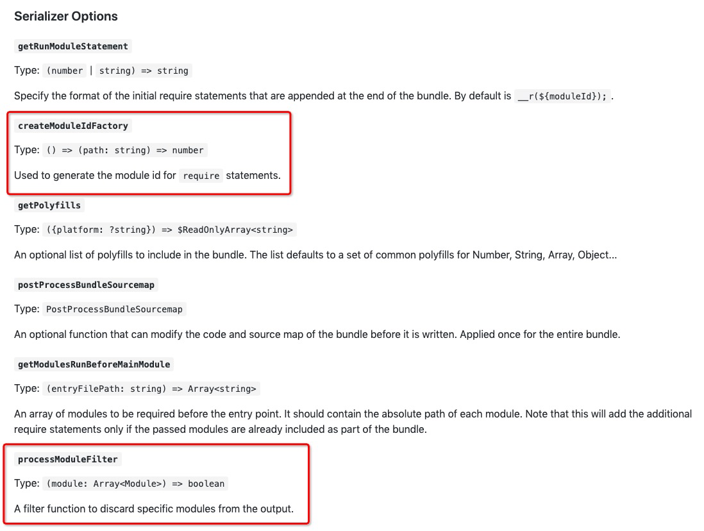

# RN-JS Bundle

​
In React Native, the JavaScript code and resources of your applications need to run on the device. To improve the loading speed and performance of applications and reduce network requests, React Native applications are usually packaged before being released. All code and resources are packaged into one or more files.

​ This section describes how to package bundles in a ReactJS project after React Native for HarmonyOS is implemented. The HarmonyOS-based bundling process involves `react-native-harmony.tgz`, `react-native-harmony-cli.tgz`, and `metro.config.js`. For details about how to set up a basic ReactJs HarmonyOS environment, see [Environment Setup](../en/environment-setup.md).

## HarmonyOS-based Packaging Process

This section describes the configuration options and commands required for HarmonyOS packaging, helping you quickly understand the HarmonyOS-based packaging process.

- `react-native-harmony.tgz` contains the Metro packaging configuration options that adapt to HarmonyOS, which is critical. It enables the project to identify the HarmonyOS platform during packaging and preferentially search for the dependency files that have been adapted to HarmonyOS in the project based on the configured path for loading and packaging. If you have configured `react-native-harmony.tgz` as a dependency in your JS project, the project contains the Metro configuration option file that adapts to HarmonyOS when you build the JS project.

  File path: `node_modules/@react-native-oh/react-native-harmony/metro.config.js`.
  
- To use the configuration options for HarmonyOS Metro packaging, you need to import the `react-native-harmony/metro.config.js` file to the `metro.config.js` file at the outermost layer of the JS project, modify the `transformer` configuration option of `config`, and use the `mergeConfig` method provided by Metro to integrate the configuration options for HarmonyOS packaging.
  
  ```javascript
  // AwesomeProject/metro.config.js
  
  const {mergeConfig, getDefaultConfig} = require('@react-native/metro-config');
  const {createHarmonyMetroConfig} = require('@react-native-oh/react-native-harmony/metro.config');
  
  /**
   * @type {import("metro-config").ConfigT}
   */
  const config = {
    transformer: {
      getTransformOptions: async () => ({
        transform: {
          experimentalImportSupport: false,
          inlineRequires: true,
        },
      }),
    },
  };
  
  module.exports = mergeConfig(
    getDefaultConfig(__dirname),
    createHarmonyMetroConfig({
      reactNativeHarmonyPackageName: '@react-native-oh/react-native-harmony',
    }),
    config,
  );
  ```

- `react-native-harmony-cli.tgz` contains the HarmonyOS bundle command, and the file path is `node_modules/@react-native-oh//react-native-harmony-cli/dist/commands/bundle-harmony.js`.
  
  The following is an example of the HarmonyOS bundle command:
  
  ```powershell
  react-native bundle-harmony --entry-file index.harmony.js --dev false
  ```
  
  The HarmonyOS bundle command supports the following configuration options:
  
  ```javascript
  options: [
      {
          name: '--dev [boolean]',
          description: 'If false, warnings are disabled and the bundle is minified',
          parse: (val) => val !== 'false',
          default: true,
      },
      {
          name: '--entry-file <path>',
          description: 'Path to the root JS file, either absolute or relative to JS root',
          default: 'index.js',
      },
      {
          name: '--config <path>',
          description: 'Path to the Metro configuration file',
      },
      {
          name: '--bundle-output <path>',
          description: 'File name where to store the resulting bundle, ex. /tmp/groups.bundle',
          default: ARK_RESOURCE_PATH + '/bundle.harmony.js',
      },
      {
          name: '--assets-dest <path>',
          description: 'Directory name where to store assets referenced in the bundle',
          default: ASSETS_DEFAULT_DEST_PATH,
      },
      {
          name: '--sourcemap-output <path>',
          description: 'File name where to store the resulting source map, ex. /tmp/groups.map',
      },
      {
          name: '--minify [boolean]',
          description: 'Allows overriding whether bundle is minified',
          parse: (val) => val !== 'false',
      },
  ]
  ```
  
  --**dev**: product package (when **false**), or dev package (when **true**)
  --**entry-file**: entry file
  --**config**: additional configuration
  --**bundle-output**: output path of the bundle
  --**assets-dest**: output path of assets such as images
  --**sourcemap-output**: output path of the source map
  --**minify**: whether to compress

## Single-Bundle

​ After setting up the basic ReactJs HarmonyOS environment, run the `react-native bundle-harmony` command to configure the input file path and output file path. The default input file is `index.js` in the root directory of the JS project, and the default output file path is `./harmony/entry/src/main/resources/rawfile/bundle.harmony.js`.

## Multi-bundle

​ In some development scenario, the bundles are too large to load. In this case, the bundles need to be split and packed to generate multiple bundles. This can be done by using Metro.

A bundle can be split into basic bundle and service bundle.

- Basic bundle: This bundle contains the common JS code and third-party dependency libraries.
- Service bundle: One or more service bundles are produced based on the service logic in an application.

### Installing Metro

​ If you run `npm install`, you will find that Metro has been installed on React Native. Its version is related to React Native. If you need to install the latest Metro, run the following command:

```powershell
npm install --save-dev metro metro-core
```

or

```powershell
yarn add --dev metro metro-core
```

### Configuring Metro

​ You can add the `metro` field to `metro.config.js`, `metro.config.json`, and `package.json` respectively to configure Metro. The most used is `metro.config.js`.

For details about the internal structure of the Metro configuration, see [Metro official website](https://facebook.github.io/metro/docs/configuration).

```javascript
module.exports = {
  resolver: {
    /* resolver options */
  },
  transformer: {
    /* transformer options */
  },
  serializer: {
    /* serializer options */
  },
  server: {
    /* server options */
  }

  /* general options */
};
```

​ Each of the **options** parameters has many configuration options. As for splitting and packing bundles, the most important are `createModuleIdFactory` and `processModuleFilter` in the `serializer` option.



- `createModuleIdFactory`: Metro supports the configuration of a custom module ID using this method. The module ID can be a string, used to generate `require` statements. The type is `() => (path: string) => number`, where `path` indicates the complete path of each module. Another purpose of this method is to generate the same ID for the same module during multiple bundling. In this way, the module can be found based on the ID when the version is updated next time.
- `processModuleFilter`: Filters out unnecessary modules based on the given conditions. The type is `(module: Array<Module>) => boolean`, where `module` indicates the output module, which contains the corresponding parameters. You can determine whether to filter the current module based on the returned Boolean value. `false` means that the module is filtered, and is not bundled.

​ The following describes how to configure and use `createModuleIdFactory` and `processModuleFilter` by referring to the `SampleProject`.

1. Create a `SampleProject/MainProject/build/multibundle/moduleId.js` file, in which the `createModuleIdFactoryWrap` and `postProcessModulesFilterWrap` methods are customized, corresponding to the `createModuleIdFactory` and `processModuleFilter` configuration options.

   - `createModuleIdFactoryWrap` is used to determine whether a module is a basic bundle or service bundle, and then store the obtained `ModuleId` in the `basicNameMap.json` and `pageNameMap.json` files for the `postProcessModulesFilterWrap` method to use.

     `basicNameMap.json` indicates the `ModuleId` set involved in the basic bundle, and `pageNameMap.json` indicates the `ModuleId` set involved in the service bundle. The two files are stored in the `map` folder in the same directory as `moduleId.js`.
   - `postProcessModulesFilterWrap` needs to be configured only in `metro.config.js` of the service bundle. The main function is to determine whether the module to be bundled exists in the `basicNameMap.json` file through a series of judgment conditions. If yes, `false` is returned and the module is not bundled. Otherwise, the module needs to be bundled.

     ```javascript
     // SampleProject/MainProject/build/multibundle/moduleId.js
     ...
     
     function getModuleId(projectRootPath, modulePath, ...bundles) {
       let startIndex = modulePath.indexOf(projectRootPath);
       let pathRelative = modulePath.substr(startIndex + projectRootPath.length + 1);
       return String(SHA256(pathRelative));
     }
     
     function createModuleIdFactoryWrap(projectRootPath, ...bundles) {
       return () => {
         return (path) => {
           let moduleId = getModuleId(projectRootPath, path);
           let jsItem = path + ' ---> ' + moduleId;
           if ('basic' == bundles[0]) {
             if (!basicNameArray.includes(jsItem)) {
               basicNameArray.push(jsItem);
               fs.writeFileSync(
                 __dirname + pathSep + 'map' + pathSep + 'basicNameMap.json',
                 JSON.stringify(basicNameArray),
               );
             }
           } else {
             if (!homepageArray.includes(jsItem)) {
               homepageArray.push(jsItem);
               fs.writeFileSync(
                 __dirname + pathSep + 'map' + pathSep + 'pageNameMap.json',
                 JSON.stringify(homepageArray),
               );
             }
           }
     
           return moduleId;
         };
       };
     }
     
     function postProcessModulesFilterWrap(projectRootPath) {
       // If false is returned, the module is not bundled.
       console.log('----------postProcessModulesFilterWrap');
       return (module) => {
         const path = module.path;
         if (
           path.indexOf('__prelude__') >= 0 ||
           path.indexOf(
             pathSep +
               'node_modules' +
               pathSep +
               '@react-native' +
               pathSep +
               // 'js-polyfills',
               'polyfills',
           ) >= 0 ||
           path.indexOf(
             pathSep +
               'node_modules' +
               pathSep +
               'metro-runtime' +
               pathSep +
               'src' +
               pathSep +
               'polyfills',
           ) >= 0
         ) {
           return false;
         }
     
         const moduleId = getModuleId(projectRootPath, path);
         let jsItem = path + ' ---> ' + moduleId;
         if (path.indexOf(pathSep + 'node_modules' + pathSep) > 0) {
           if (
             'js' + pathSep + 'script' + pathSep + 'virtual' == module.output[0].type
           ) {
             return true;
           }
         }
     
         // The service bundle is being packed.
         if (
           basicNameArray.includes(jsItem)
         ) {
           return false;
         }
     
         return true;
       };
     }
     ```

2. The following uses the `Basic` and `HomePage` modules as examples, which are the basic bundle and service bundle respectively.

   - Create the `metro.config.js` files (`basic.config.js` and `homepage.config.js`) for the two modules respectively. When running the bundle command, you need to set it in the `--config` option.
   - For the `config` object in `basic.config.js`, set `createModuleIdFactory` of the `serializer` attribute to the `createModuleIdFactoryWrap` method customized in the previous step, pass the project root directory and module name, and pass the `config` object as the input parameter when `mergeConfig` is used.

     ```javascript
     // SampleProject/MainProject/basic.config.js
     
     const {mergeConfig, getDefaultConfig} = require('@react-native/metro-config');
     const {createHarmonyMetroConfig} = require('@react-native-oh/react-native-harmony/metro.config');
     const path = require('path');
     const projectRootPath = path.join(__dirname);
     const moduleId = require('./build/multibundle/moduleId');
     
     const config = {
         serializer: {
             createModuleIdFactory: moduleId.createModuleIdFactoryWrap(
                 projectRootPath,
                 'basic',
             ),
         },
     };
     
     module.exports = mergeConfig(getDefaultConfig(__dirname), createHarmonyMetroConfig({
         reactNativeHarmonyPackageName: '@react-native-oh/react-native-harmony',
     }), config);
     ```

   - `homepage.config.js` is handled in a similar way. The difference is that when configuring the `serializer` attribute of the `config` object, you need to set `processModuleFilter` to the customized `postProcessModulesFilterWrap` method and pass the parameter to the project root directory.

     ```javascript
     // SampleProject/MainProject/homepage.config.js
     
     const {mergeConfig, getDefaultConfig} = require('@react-native/metro-config');
     const {createHarmonyMetroConfig} = require('@react-native-oh/react-native-harmony/metro.config');
     const path = require('path');
     const projectRootPath = path.join(__dirname);
     const moduleId = require('./build/multibundle/moduleId');
     
     const config = {
         serializer: {
             createModuleIdFactory: moduleId.createModuleIdFactoryWrap(
                 projectRootPath,
                 'homepage',
             ),
             processModuleFilter: moduleId.postProcessModulesFilterWrap(
                 projectRootPath,
             ),
         },
     };
     
     module.exports = mergeConfig(getDefaultConfig(__dirname), createHarmonyMetroConfig({
         reactNativeHarmonyPackageName: '@react-native-oh/react-native-harmony',
     }), config);
     ```

3. For details about how to compile and use the split and pack commands, see [Using Metro](#using-metro) and the `SampleProject\MainProject\package.json` file.

### Using Metro

Add the `--config <path/to/config>` option to package the corresponding entry file based on the basic bundle and service bundle.

- Basic bundle `basic`:
  
  Import the required third-party dependency packages, React Native packages, and JS files to a JS file, for example, `SampleProject/MainProject/src/bundles/basic/basic.js`. Then, pass the ready `basics.config.js` to `--config`. Use the terminal to switch to the root directory of the project and run the following command:
  
  ```powershell
  react-native bundle-harmony --dev false --entry-file ./src/bundles/basic/basic.js  --bundle-output ../../SampleApp/entry/src/main/resources/rawfile/bundle/basic/basic.harmony.bundle  --config ./basic.config.js
  ```

- Service bundle `homepage`:
  Determine service entries based on the service logic of the application. Use `AppRegistry` to register the main component of the service, for example, `SampleProject/MainProject/src/bundles/HomePage/index.js`. Then, pass the ready `homepage.config.js` to `--config`.
  
  The command is as follows:
  
  ```powershell
  react-native bundle-harmony --dev false --entry-file ./src/bundles/HomePage/index.js --bundle-output ../../SampleApp/entry/src/main/resources/rawfile/bundle/cp/homepage.harmony.bundle  --config ./homepage.config.js
  ```

You can also configure the paths in the preceding two commands in the `SampleProject/MainProject/package.json` file.The number of commands to be executed depends on the number of service bundles. The commands can be concatenated by `&&` into one command for execution.

```json
...
    "dev:basic":    "react-native bundle-harmony --dev false --entry-file ./src/bundles/basic/basic.js    --bundle-output ../../SampleApp/entry/src/main/resources/rawfile/bundle/basic/basic.harmony.bundle  --config ./basic.config.js",
    "dev:homepage": "react-native bundle-harmony --dev false --entry-file ./src/bundles/HomePage/index.js --bundle-output ../../SampleApp/entry/src/main/resources/rawfile/bundle/cp/homepage.harmony.bundle  --config ./homepage.config.js",
    "dev:goods":    "react-native bundle-harmony --dev false --entry-file ./src/bundles/Goods/index.js    --bundle-output ../../SampleApp/entry/src/main/resources/rawfile/bundle/cp/goods.harmony.bundle     --config ./goods.config.js",
    "dev:details":  "react-native bundle-harmony --dev false --entry-file ./src/bundles/Details/index.js  --bundle-output ../../SampleApp/entry/src/main/resources/rawfile/bundle/bp/details.harmony.bundle   --config ./details.config.js",
    "dev:test":     "react-native bundle-harmony --dev false --entry-file ./src/bundles/test/index.js     --bundle-output ../../SampleApp/entry/src/main/resources/rawfile/bundle/bp/test.harmony.bundle      --assets-dest ../../SampleApp/entry/src/main/resources/rawfile/assets --config ./test.config.js",
    "dev:sandbox":  "react-native bundle-harmony --dev false --entry-file ./src/bundles/Sandbox/index.js  --bundle-output ../../SampleApp/entry/src/main/resources/rawfile/bundle/bp/sandbox.harmony.bundle   --assets-dest ../../SampleApp/entry/src/main/resources/rawfile/assets --config ./sandbox.config.js",
    "dev:all":      "npm run dev:basic && npm run dev:homepage && npm run dev:goods && npm run dev:details && npm run dev:test && npm run dev:sandbox"
...
```

## Bundle to Bytecode

​ You can convert the bundle file into bytecode for loading. Loading bytecode improves execution efficiency and optimizes performance. The conversion tool is downloaded to the `node_modules` directory when the `npm install` command is executed in the React Native project.

1. Save the result bundle file to the `node_modules/react-native/sdks/hermesc/win64-bin` directory.
2. Open the terminal console in the directory and enter the bytecode conversion command.

   ```powershell
   hermesc --emit-binary "Name of the input bundle file" -out "Name of the output file"
   ```

   Example:

   ```PowerShell
   hermesc --emit-binary bundle.harmony.js -out hermes_bundle.hbc
   ```

3. Save the generated `.hbc` file to the directory where the bundle is generated so that the native project can find the bytecode file when loading the bundle.

## Starting Metro

You can use Metro to update bundles in real time. Connect to a real device and run the following commands:

```PowerShell
hdc rport tcp:8081 tcp:8081
```

```PowerShell
npm run start
```

You will see the following information if the commands are successfully executed:


