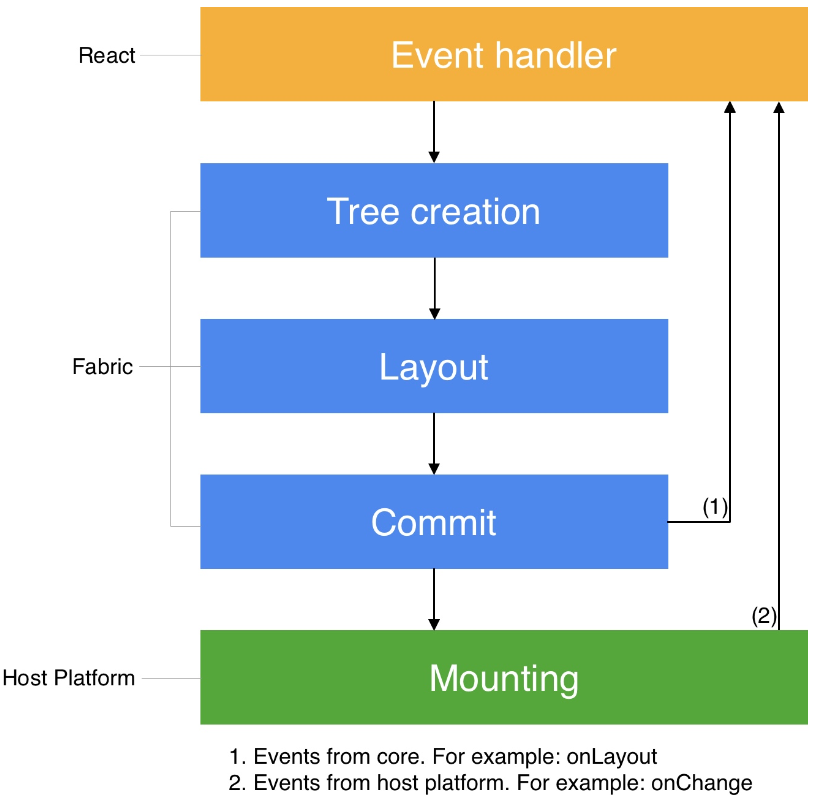
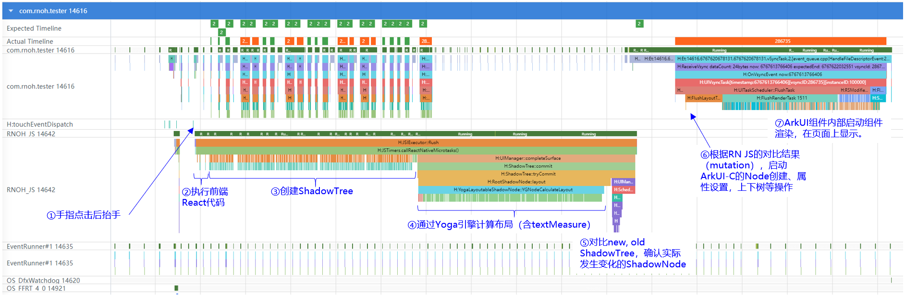

This documentation is based on React Native documentation licensed under the [CC-BY-4.0](https://creativecommons.org/licenses/by/4.0/) license at https://reactnative.dev/architecture/render-pipeline. © Meta Platforms Inc. Added the description of the three rendering phases in RNOH.

# React Native Render Pipeline

## Three Phases of the Render Pipeline

- **Render**: In JavaScript, React executes the product logic code which creates React Element Trees. From this tree, the renderer creates a React Shadow Tree in C++.
- **Commit**: After a React Shadow Tree is fully created, the renderer triggers a commit. This promotes both the React Element Tree and the newly created React Shadow Tree as the "next tree" to be mounted. This also schedules calculation of its layout information.
- **Mount**: The React Shadow Tree, now with the results of layout calculation, is transformed into a Host View Tree.

The phases of the render pipeline may occur on different threads.

There are three different scenarios for the render pipeline:

1. Initialize rendering.
2. Update the React status.
3. Update the status of the React Native renderer.

 

## RNOH-based Three-Phase Rendering

In **RNOH**, a typical rendering process (tapping a button to jump to a page containing 1500 text components) is used as an example to describe the three rendering phases from the perspective of trace.

### Render

1. Tap the UI control and lift the finger (step 1 in the preceding figure). The gesture tap event is transferred to the RNOH JS thread. The thread responds to the tap event and starts to execute the frontend React code in the JS VM. The React code loads and executes some dependency functions required by the frontend service logic (step 2 in the preceding figure).
2. When creating a component, the React service code invokes the creation of ShadowTree in RN Common through the JSI, which an API layer for mutual invoking between JavaScript and native C++ code (step 3 in the preceding figure).

### Commit

1. Once the ShadowTree is built, the Yoga engine is used for layout calculation (step 4 in the preceding figure). The layout calculation of UI components is directly completed in the Yoga engine. The layout calculation of text is completed by the native side through the callback `TextMeasurer::measure()`. The calculation result is returned to Yoga through the `AttributedString`, ` ParagraphAttributes`, and ` LayoutConstraints` objects.
2. After the ShadowTree is created and laid out (new tree), it is compared with the ShadowTree (old tree) created last time. The core function for comparison is `calculateShadowViewMutationsV2()` (step 5 in the preceding figure).
3. After the old and new ShadowTrees are compared, the difference result is generated. RN JS calls the main thread function to send the difference result to the main thread for rendering (step 6 in the preceding figure).

### Mount

1. Components that need to be rendered on the native end are represented by mutation objects. Each mutation object is processed in the main thread.
2. Mutation is handled using `MountingManagerCAPI::handleMutation()`. The methods include `CREATE`, `DELETE`, `UPDATE`,` INSERT`, `REMOVE`, `REMOVE_DELETE_TREE` (deleting by subtree, which is not supported currently).
3. The `REMOVE` method removes the ArkUI component node from the component tree. In this case, the UI is refreshed, and the corresponding component is not displayed anymore. The `DELETE` method triggers the deletion of the component node.
4. The `CREATE` method creates the ArkUI component node, but does not refresh the UI. The `INSERT` method mounts the component node to the component tree, refreshing the UI. The `UPDATE` method updates the attributes of the node and triggers the UI refresh.
