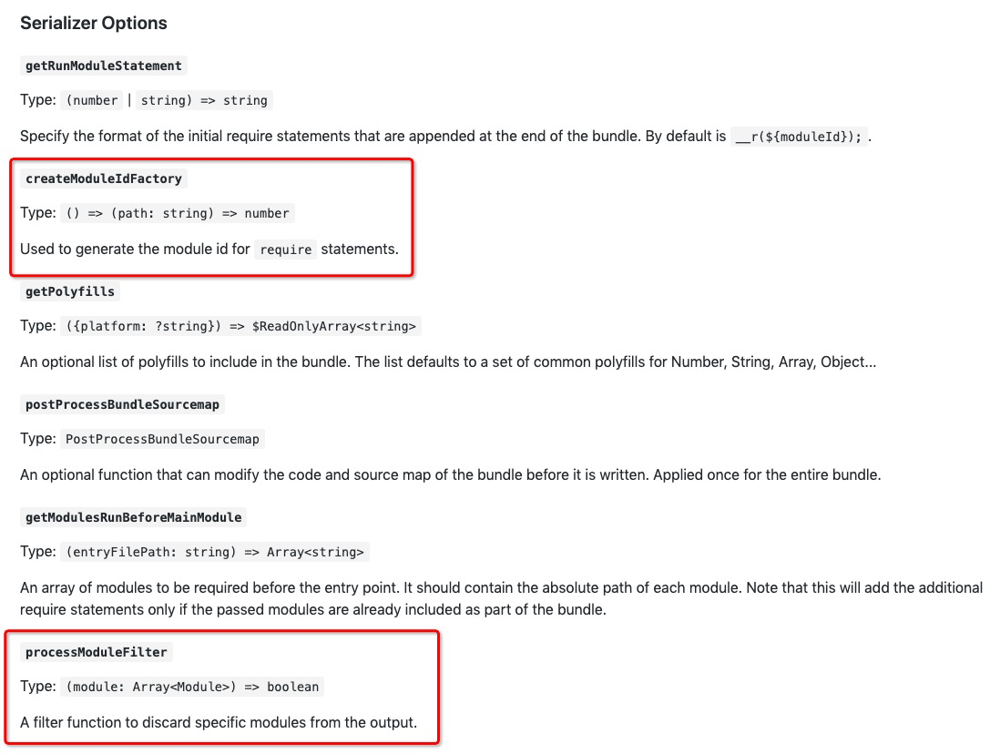

# RN-JS打包

​
在 React Native 中，应用的 JavaScript 代码和资源需要在设备上运行。为了提高应用的加载速度和性能，以及减少网络请求，React Native 应用通常会在发布前进行打包处理，将所有的代码和资源打包成一个或多个文件。

​ 本章节主要介绍 React Native OpenHarmony 化后，如何在 ReactJs 工程中打包 bundle 文件。OpenHarmony 打包 Bundle 的过程涉及 `react-native-harmony.tgz`、`react-native-harmony-cli.tgz` 和 `metro.config.js`，请参考[环境搭建](./环境搭建.md)文档，初步构建基本 ReactJs OpenHarmony 化环境。

## 打包流程OpenHarmony化

本节会简单介绍有关 OpenHarmony 打包所需的配置项及 OpenHarmony 打包命令，帮助您更快速了解打包流程的 OpenHarmony 化。

- `react-native-harmony.tgz` 中包含了适配 OpenHarmony 的 Metro 打包配置项，这是至关重要的，能让工程在打包的过程中识别 OpenHarmony 平台，同时按照配置的路径优先寻找项目中已进行 OpenHarmony 化适配的依赖文件去加载打包。若您已在您的 JS 工程中依赖 `react-native-harmony.tgz`，那么在编译构建 JS 工程时，工程内就会带有适配 OpenHarmony 的 Metro 打包配置项文件。

  文件路径：`node_modules/@react-native-oh/react-native-harmony/metro.config.js`。
  
- 要想应用 OpenHarmony Metro 打包配置项，需要在 JS 工程最外层的 `metro.config.js` 文件中引入 `@react-native-oh/react-native-harmony/metro.config.js` 配置文件，自定义修改 `config` 的 `transformer` 配置选项，通过 Metro 自带的 `mergeConfig` 方法，融合 OpenHarmony 打包配置项。
  
  ```javascript
  // AwesomeProject/metro.config.js
  
  const {mergeConfig, getDefaultConfig} = require('@react-native/metro-config');
  const {createHarmonyMetroConfig} = require('@react-native-oh/react-native-harmony/metro.config');
  
  /**
   * @type {import("metro-config").ConfigT}
   */
  const config = {
    transformer: {
      getTransformOptions: async () => ({
        transform: {
          experimentalImportSupport: false,
          inlineRequires: true,
        },
      }),
    },
  };
  
  module.exports = mergeConfig(
    getDefaultConfig(__dirname),
    createHarmonyMetroConfig({
      reactNativeHarmonyPackageName: '@react-native-oh/react-native-harmony',
    }),
    config,
  );
  ```

- `react-native-harmony-cli.tgz` 中包含了 OpenHarmony 打包命令，其文件路径为 `node_modules/@react-native-oh/react-native-harmony-cli/dist/commands/bundle-harmony.js`。
  
  OpenHarmony 打包命令示例如下：
  
  ```powershell
  react-native bundle-harmony --entry-file index.harmony.js --dev false
  ```
  
  OpenHarmony 打包命令所支持的配置项如下：
  
  ```javascript
  options: [
      {
          name: '--dev [boolean]',
          description: 'If false, warnings are disabled and the bundle is minified',
          parse: (val) => val !== 'false',
          default: true,
      },
      {
          name: '--entry-file <path>',
          description: 'Path to the root JS file, either absolute or relative to JS root',
          default: 'index.js',
      },
      {
          name: '--config <path>',
          description: 'Path to the Metro configuration file',
      },
      {
          name: '--bundle-output <path>',
          description: 'File name where to store the resulting bundle, ex. /tmp/groups.bundle',
          default: ARK_RESOURCE_PATH + '/bundle.harmony.js',
      },
      {
          name: '--assets-dest <path>',
          description: 'Directory name where to store assets referenced in the bundle',
          default: ASSETS_DEFAULT_DEST_PATH,
      },
      {
          name: '--sourcemap-output <path>',
          description: 'File name where to store the resulting source map, ex. /tmp/groups.map',
      },
      {
          name: '--minify [boolean]',
          description: 'Allows overriding whether bundle is minified',
          parse: (val) => val !== 'false',
      },
  ]
  ```
  
  --dev：    false：product 包    true：dev包
  --entry-file：入口文件
  --config：额外配置
  --bundle-output：生成的 bundle 文件输出位置
  --assets-dest：图片等资源输出的位置
  --sourcemap-output：映射文件输出的位置
  --minify：是否压缩打包

## 单Bundle打包

​ 在构建基本 ReactJs OpenHarmony 化环境后使用打包命令 `react-native bundle-harmony`，通过打包配置项配置输入文件路径、输出文件路径等。默认输入文件路径为 JS 项目根目录的 `index.js` 文件，默认输出文件路径为 `./harmony/entry/src/main/resources/rawfile/bundle.harmony.js`。

## 多Bundle打包

​ 在开发过程中，有些开发场景应用的 bundle 文件过大，出现 bundle 文件加载缓慢，无法按需加载 bundle 等情况，这时就需要进行拆包打包，生成多 bundle 的过程。为了实现多 bundle 打包的过程，我们选择使用 Metro 工具对工程进行拆包打包。

bundle 代码拆分类型：基础包与业务包。

- 基础包：将一些重复的 JS 代码与第三方依赖库打成一个包。
- 业务包：根据应用内的不同业务逻辑，拆分出一个或多个包。

### Metro安装

​ 在运行 `npm install` 时 React Native 已经安装 Metro 了，其版本跟 React Native 版本有关，如果需要单独安装最新版 Metro，可以执行以下命令：

```powershell
npm install --save-dev metro metro-core
```

或

```powershell
yarn add --dev metro metro-core
```

### Metro配置

​ 配置 Metro 有三种方法，分别为 `metro.config.js`、`metro.config.json` 和 `package.json` 中添加 `metro` 字段，常用的方式为 `metro.config.js`。

Metro 配置内部结构请参考[Metro官网](https://facebook.github.io/metro/docs/configuration)。

```javascript
module.exports = {
  resolver: {
    /* resolver options */
  },
  transformer: {
    /* transformer options */
  },
  serializer: {
    /* serializer options */
  },
  server: {
    /* server options */
  }

  /* general options */
};
```

​ 每个 options 内都有很多配置选项，而对于拆包打包来说，最重要的是 `serializer` 选项内的 `createModuleIdFactory` 与 `processModuleFilter`。



- `createModuleIdFactory` ：Metro 支持了通过此方法配置自定义模块 ID，同样支持字符串类型 ID，用于生成 `require` 语句的模块 ID，其类型为 `() => (path: string) => number`，其中`path` 为各个 module 的完整路径。此方法的另一个用途就是多次打包时，对于同一个模块生成相同的 ID，下次更新发版时，不会因 ID 不同找不到 Module。
- `processModuleFilter`：根据给出的条件，对 Module 进行过滤，将不需要的模块过滤掉。其类型为 `(module: Array<Module>) => boolean`，其中 `module` 为输出的模块，里面带着相应的参数，根据返回的波尔值判断是否过滤当前模块。返回 `false` 为过滤，不打入 bundle。

​ 下面参考配套的 Demo 工程 `SampleProject` 来具体说明一下该如何配置和使用 `createModuleIdFactory` 与 `processModuleFilter`。

1. 首先创建一个 `SampleProject/MainProject/build/multibundle/moduleId.js` 文件，其中自定义了 `createModuleIdFactoryWrap` 和 `postProcessModulesFilterWrap` 两个方法，用于对应 `createModuleIdFactory` 与 `processModuleFilter` 两个配置选项。

   - `createModuleIdFactoryWrap` 主要作用是判断模块是基础包还是业务包，然后将获取到的 `ModuleId` 分别存放到 `basicNameMap.json` 和 `pageNameMap.json` 文件中，留给 `postProcessModulesFilterWrap` 方法备用。

     `basicNameMap.json` 代表基础包所涉及到的 `ModuleId` 集合，`pageNameMap.json` 代表业务包所涉及到的 `ModuleId` 集合，这两个文件位于 `moduleId.js` 同目录的 `map` 文件夹下。
   - `postProcessModulesFilterWrap` 方法只需要在业务包的 `metro.config.js` 中配置，主要作用是通过一系列判断条件来判断需要打包的模块是否已经存在于 `basicNameMap.json` 文件中，如果存在，则返回 `false`，不进行打包；反之，则该模块需要进行打包。

     ```javascript
     // SampleProject/MainProject/build/multibundle/moduleId.js

     const pathSep = require('path').sep;
     const fs = require('fs');
     const SHA256 = require('crypto-js/sha256');
     const basicNameArray = require('./map/basicNameMap.json');
     const homepageArray = require('./map/pageNameMap.jsno');

     function getModuleId(projectRootPath, modulePath, ...bundles) {
       let startIndex = modulePath.indexOf(projectRootPath);
       let pathRelative = modulePath.substr(startIndex + projectRootPath.length + 1);
       return String(SHA256(pathRelative));
     }
     
     function createModuleIdFactoryWrap(projectRootPath, ...bundles) {
       return () => {
         return (path) => {
           let moduleId = getModuleId(projectRootPath, path);
           let jsItem = path + ' ---> ' + moduleId;
           if ('basic' == bundles[0]) {
             if (!basicNameArray.includes(jsItem)) {
               basicNameArray.push(jsItem);
               fs.writeFileSync(
                 __dirname + pathSep + 'map' + pathSep + 'basicNameMap.json',
                 JSON.stringify(basicNameArray),
               );
             }
           } else {
             if (!homepageArray.includes(jsItem)) {
               homepageArray.push(jsItem);
               fs.writeFileSync(
                 __dirname + pathSep + 'map' + pathSep + 'pageNameMap.json',
                 JSON.stringify(homepageArray),
               );
             }
           }
     
           return moduleId;
         };
       };
     }
     
     function postProcessModulesFilterWrap(projectRootPath) {
       // 返回false则不打入bundle中
       console.log('----------postProcessModulesFilterWrap');
       return (module) => {
         const path = module.path;
         if (
           path.indexOf('__prelude__') >= 0 ||
           path.indexOf(
             pathSep +
               'node_modules' +
               pathSep +
               '@react-native' +
               pathSep +
               // 'js-polyfills',
               'polyfills',
           ) >= 0 ||
           path.indexOf(
             pathSep +
               'node_modules' +
               pathSep +
               'metro-runtime' +
               pathSep +
               'src' +
               pathSep +
               'polyfills',
           ) >= 0
         ) {
           return false;
         }
     
         const moduleId = getModuleId(projectRootPath, path);
         let jsItem = path + ' ---> ' + moduleId;
         if (path.indexOf(pathSep + 'node_modules' + pathSep) > 0) {
           if (
             'js' + pathSep + 'script' + pathSep + 'virtual' == module.output[0].type
           ) {
             return true;
           }
         }
     
         // 正在打业务包
         if (
           basicNameArray.includes(jsItem)
         ) {
           return false;
         }
     
         return true;
       };
     }

     module.exports = {createModuleIdFactoryWrap,postProcessModulesFilterWrap};
     ```

2. 通过 `Basic` 模块和 `HomePage` 模块举例说明，基础包为 `Basic` 模块，业务包为 `HomePage` 模块。

   - 首先需要创建两个模块各自的 `metro.config.js` 文件：`basic.config.js` 和 `homepage.config.js`。在执行打包命令的时候需要配置到 `--config` 配置选项中。
   - `basic.config.js` 中的 `config` 对象需要配置 `serializer` 属性的 `createModuleIdFactory` 为上一步自定义的 `createModuleIdFactoryWrap` 方法，传入project根目录和模块名，最后在使用 `mergeConfig` 方式时将 `config` 对象作为入参传进去。

     ```javascript
     // SampleProject/MainProject/basic.config.js
     
     const {mergeConfig, getDefaultConfig} = require('@react-native/metro-config');
     const {createHarmonyMetroConfig} = require('@react-native-oh/react-native-harmony/metro.config');
     const path = require('path');
     const projectRootPath = path.join(__dirname);
     const moduleId = require('./build/multibundle/moduleId');
     
     const config = {
         serializer: {
             createModuleIdFactory: moduleId.createModuleIdFactoryWrap(
                 projectRootPath,
                 'basic',
             ),
         },
     };
     
     module.exports = mergeConfig(getDefaultConfig(__dirname), createHarmonyMetroConfig({
         reactNativeHarmonyPackageName: '@react-native-oh/react-native-harmony',
     }), config);
     ```

   - `homepage.config.js` 同理，区别在于，在配置 `config` 对象 `serializer` 属性时，需要将 `processModuleFilter` 配置为自定义的 `postProcessModulesFilterWrap` 方法，传参传入 project 根目录。

     ```javascript
     // SampleProject/MainProject/homepage.config.js
     
     const {mergeConfig, getDefaultConfig} = require('@react-native/metro-config');
     const {createHarmonyMetroConfig} = require('@react-native-oh/react-native-harmony/metro.config');
     const path = require('path');
     const projectRootPath = path.join(__dirname);
     const moduleId = require('./build/multibundle/moduleId');
     
     const config = {
         serializer: {
             createModuleIdFactory: moduleId.createModuleIdFactoryWrap(
                 projectRootPath,
                 'homepage',
             ),
             processModuleFilter: moduleId.postProcessModulesFilterWrap(
                 projectRootPath,
             ),
         },
     };
     
     module.exports = mergeConfig(getDefaultConfig(__dirname), createHarmonyMetroConfig({
         reactNativeHarmonyPackageName: '@react-native-oh/react-native-harmony',
     }), config);
     ```

3. 正确编写和使用分包打包命令，请参考[Metro使用](#metro使用)和 `SampleProject\MainProject\package.json` 文件。

### Metro使用

根据基础包业务包的不同，添加 `--config <path/to/config>` 参数对相应入口文件打包。

- 基础包 `basic`：
  
  将需要的第三方依赖包与 React Native 的包、JS 文件等，可以通过 `import` 方式引入到一个 JS 文件内，如 `SampleProject/MainProject/src/bundles/basic/basic.js`，再使用先前写好的`basics.config.js` 当做参数传入到 `--config` 后。使用终端切换到项目根目录，执行命令：
  
  ```powershell
  react-native bundle-harmony --dev false --entry-file ./src/bundles/basic/basic.js  --bundle-output ../../SampleApp/entry/src/main/resources/rawfile/bundle/basic/basic.harmony.bundle  --config ./basic.config.js
  ```

- 业务包 `homepage`：
  根据自己应用的业务逻辑，分出不同的业务入口，并使用 `AppRegistry` 注册业务的主 Component，如 `SampleProject/MainProject/src/bundles/HomePage/index.js`，使用先前写好的 `homepage.config.js` 传入到 `--config` 后。
  
  命令如下：
  
  ```powershell
  react-native bundle-harmony --dev false --entry-file ./src/bundles/HomePage/index.js --bundle-output ../../SampleApp/entry/src/main/resources/rawfile/bundle/cp/homepage.harmony.bundle  --config ./homepage.config.js
  ```

也可以在 `SampleProject/MainProject/package.json` 文件中将上述两种命令中的路径，替换为自己实际项目的路径，分了几个业务包就需要执行几次命令，可以将命令使用 `&&` 连接，汇总成一条命令去执行：

```json
...
    "dev:basic":    "react-native bundle-harmony --dev false --entry-file ./src/bundles/basic/basic.js    --bundle-output ../../SampleApp/entry/src/main/resources/rawfile/bundle/basic/basic.harmony.bundle  --config ./basic.config.js",
    "dev:homepage": "react-native bundle-harmony --dev false --entry-file ./src/bundles/HomePage/index.js --bundle-output ../../SampleApp/entry/src/main/resources/rawfile/bundle/cp/homepage.harmony.bundle  --config ./homepage.config.js",
    "dev:goods":    "react-native bundle-harmony --dev false --entry-file ./src/bundles/Goods/index.js    --bundle-output ../../SampleApp/entry/src/main/resources/rawfile/bundle/cp/goods.harmony.bundle     --config ./goods.config.js",
    "dev:details":  "react-native bundle-harmony --dev false --entry-file ./src/bundles/Details/index.js  --bundle-output ../../SampleApp/entry/src/main/resources/rawfile/bundle/bp/details.harmony.bundle   --config ./details.config.js",
    "dev:test":     "react-native bundle-harmony --dev false --entry-file ./src/bundles/test/index.js     --bundle-output ../../SampleApp/entry/src/main/resources/rawfile/bundle/bp/test.harmony.bundle      --assets-dest ../../SampleApp/entry/src/main/resources/rawfile/assets --config ./test.config.js",
    "dev:sandbox":  "react-native bundle-harmony --dev false --entry-file ./src/bundles/Sandbox/index.js  --bundle-output ../../SampleApp/entry/src/main/resources/rawfile/bundle/bp/sandbox.harmony.bundle   --assets-dest ../../SampleApp/entry/src/main/resources/rawfile/assets --config ./sandbox.config.js",
    "dev:all":      "npm run dev:basic && npm run dev:homepage && npm run dev:goods && npm run dev:details && npm run dev:test && npm run dev:sandbox"
...
```

## Bundle转字节码

​ 您可以将打包生成的 bundle 文件转换成字节码的形式进行加载，加载字节码具有提高执行效率、优化性能等优点。其转换工具在 React Native 工程执行 `npm install` 指令时就已下载在 `node_modules` 目录下。

1. 将打包出来的 bundle 文件放到 `node_modules/react-native/sdks/hermesc/win64-bin` 目录下。
2. 在该目录下打开终端控制台，输入转字节码命令。

   ```powershell
   hermesc --emit-binary "输入的Bundle文件名" -out "输出文件名"
   ```

   例如：

   ```PowerShell
   hermesc --emit-binary bundle.harmony.js -out hermes_bundle.hbc
   ```

3. 将生成的 `.hbc` 文件放回生成 bundle 的目录下，方便 native 工程在加载 bundle 时可以找到该字节码文件。

## Metro启动

您可以使用 Metro 服务实时更新 bundle，请连接真机，并分别执行以下命令：

```PowerShell
hdc rport tcp:8081 tcp:8081
```

```PowerShell
npm run start
```

执行成功后显示以下的内容： 


