# RN升级需要开发者适配整理

## 重点变更

1. **RN** 新架构中的 `NativeModules` 改为 `TurboModule`，其他调用地方统一改为调用 RNBridge 中封装的该方法。

2. **RN** 中 `Dimensions`，`DeviceEventEmitter`，`Appstate`，`Appearance`，`Keyboard`， `AccessibilityInfo`，`NativeEventEmitter`，`Linking` 等 `removeEventListener` 或  `removeListener` 在新版本已经废弃，更改为 `remove()`。

3. 增加 OpenHarmony 判断方法 `PlatformUtils.isHarmony()`，`PlatformUtils.isAPP()` 已经包含OpenHarmony 判断，如果要写单独的 OpenHarmony RN 文件，文件后缀改为 `index.harmony.tsx`。

4. 由于 **RN** 新架构上 native 和 js 通讯效率提高，`setnativeprops` 方法在新架构上已废弃，迁移到 `state` 上实现。

5. **RN** 新架构上用的 `hermes` 引擎，`new Date('2023/08/08 00:00:00').getTime()` 报错 `NaN`，改为 `new Date('2023-08-08 00:00:00').getTime()`。

### v0.59.0

删除 react-native-git-upgrade。

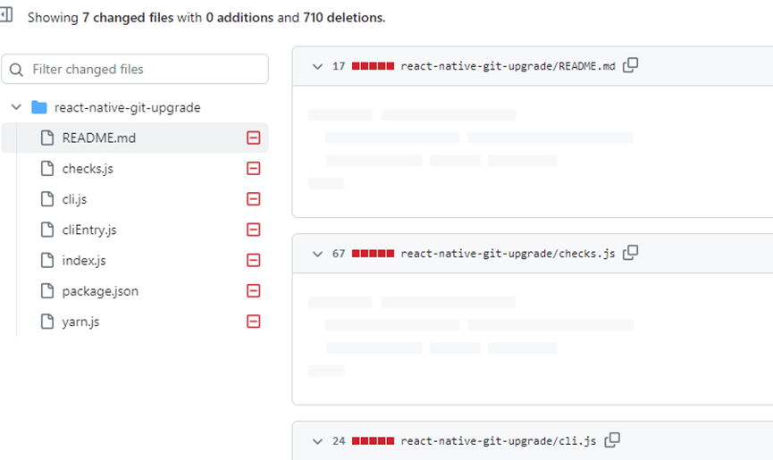

### v0.59.8

`Libraries/Animated/src/createAnimatedComponent.js` 默认设置滚动视图节流。

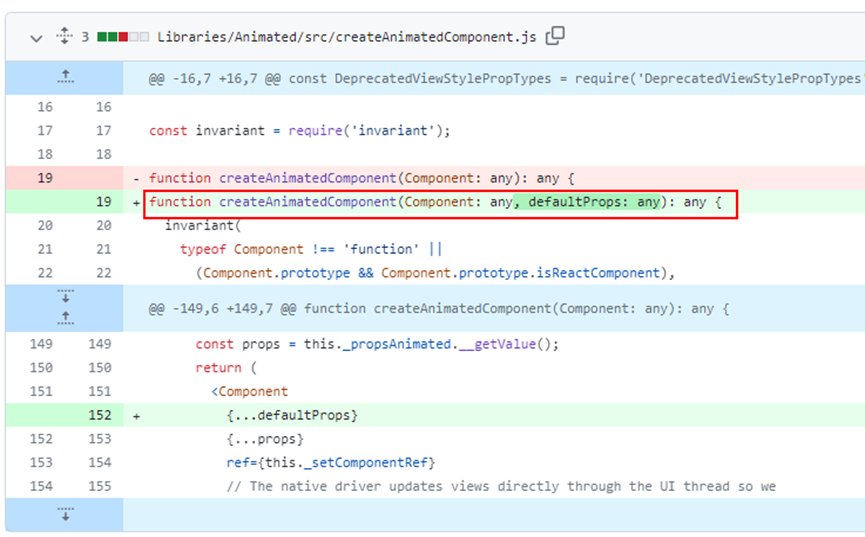
### v0.60.0

1. Auto-linking for Native Modules: 自动链接原生模块，简化了原生模块的配置。
2. Android X 支持: React Native 完全迁移到 Android X，开发者需要更新依赖。
3. 新的useWindowDimensions Hook: 更简便的方式来监听窗口尺寸的变化。
4. CocoaPods 成为默认管理方式: iOS 项目使用 CocoaPods 作为默认的依赖管理工具。

### v0.61.0

1. 废弃 `UIManagerModule.playTouchSound()` 方法，用 `SoundManager.playTouchSound()` 替代。
2. 废弃 `UIManager.measureLayoutRelativeToParent`。
3. Fast Refresh: 引入了 Fast Refresh，结合了 “live reloading” 和 “hot reloading” 的优势，提升了开发体验。

### v0.62.0

1. 删除没有实际使用的 `TextInput::onTextInput` 事件。

    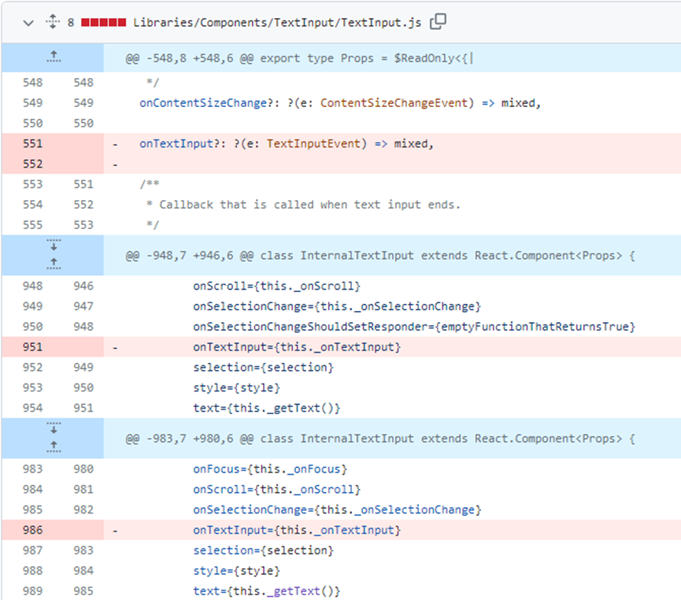

2. `createAnimatedComponent` 删除第二个参数 `defaultProps`，通过删除 `defaultProps` 以支持合成，并对滚动组件进行更孤立的修复，简化了 `Animated`。

    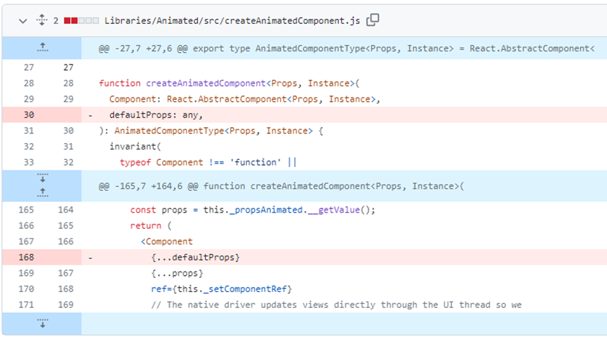

3. `TextInput.js` 删除 `selectionState`，用 `onBlur`，`onFocus`，`onUpdate` 代替。

4. ScrollView 中删除 `scrollWithoutAnimationTo()`，此函数在 2016 年 12 月被弃用。

    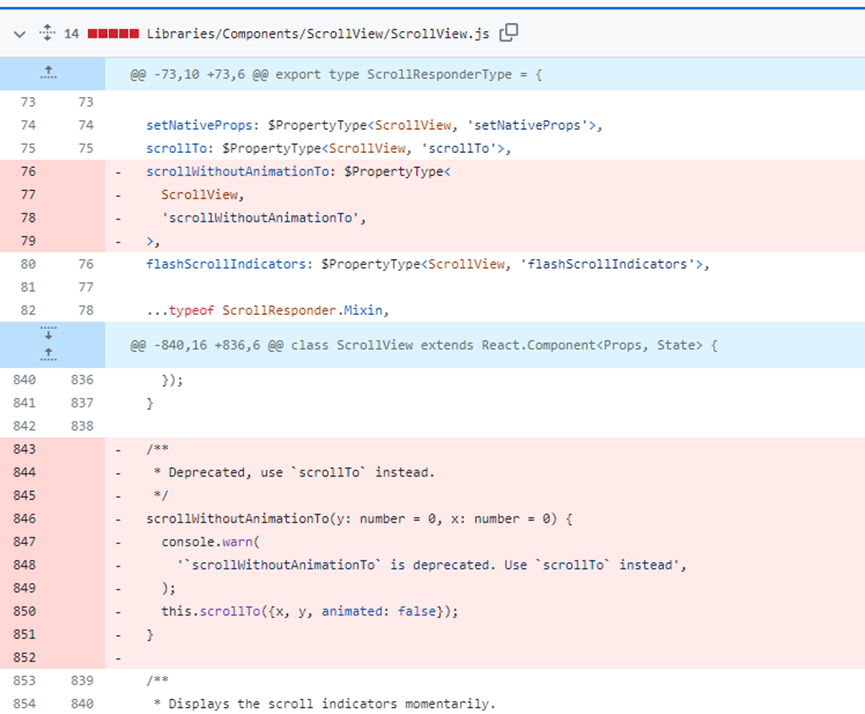

5. **RN 团队修改了 `accessibilityState` 属性，作为组件向可访问性服务描述有关其状态的信息的语义更丰富的方式。

    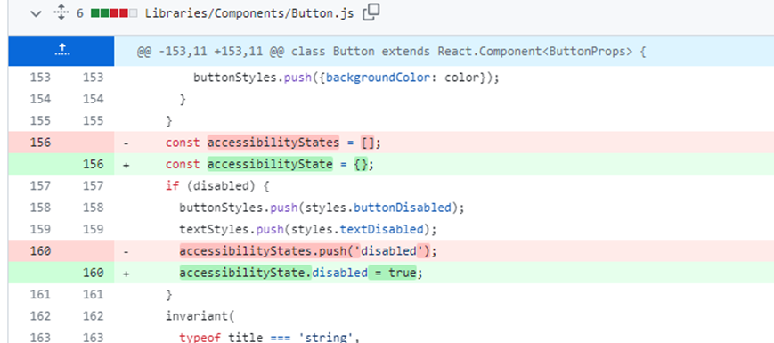

6. `AnimatedEvent.js` 中设置 `useNativeDriver` 为必填项。

    - **RN** 团队发现存在许多 callsites 可以使用本机驱动程序，但没有。为了帮助人们在适当的时候使用它，并最终切换默认值，**RN** 团队要求 `useNativeDriver` 是显式的，即使设置为 `false`。

    - 如果未指定 `useNativeDriver`，此更改会添加运行时警告，希望能提供一些轻松的反馈，以便在可以的时候记住使用本机驱动程序。如果没有它是明确的，很容易忘记设置它。

        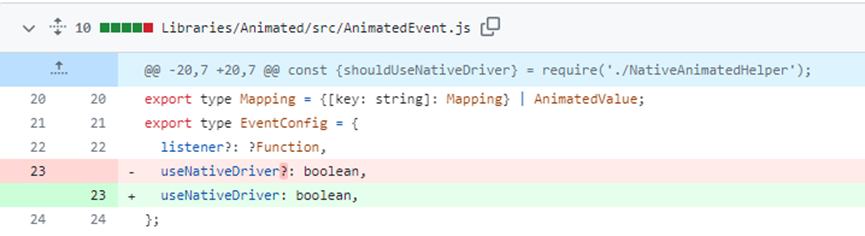

7. 删除 `IncrementalPresenter` 组件。

    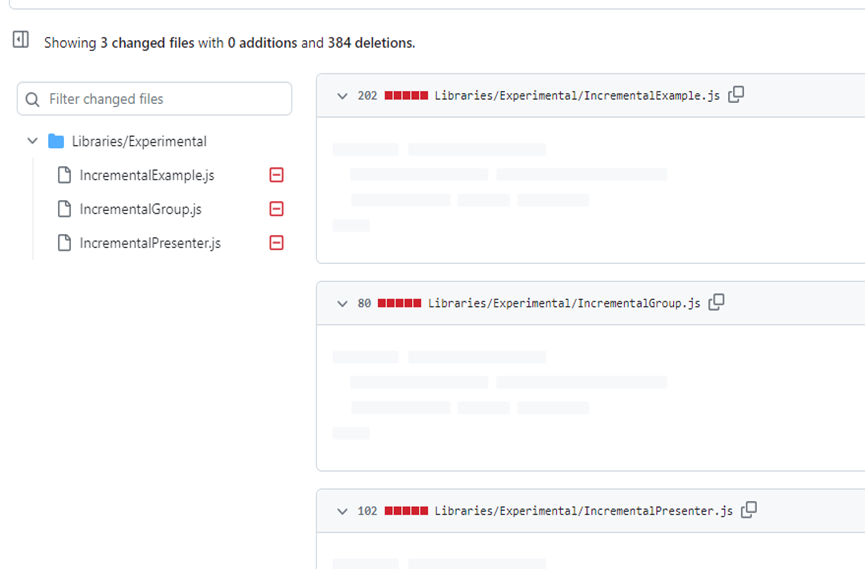

8. `TouchableWithoutFeedback` 不在作为 `export props`，使用 `React.ElementConfig` 代替。

    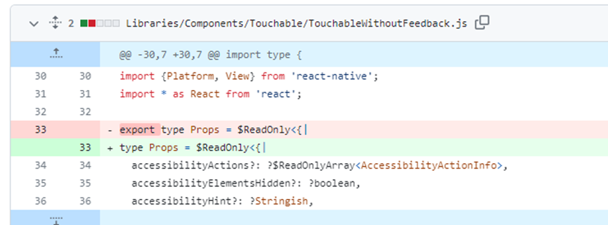
    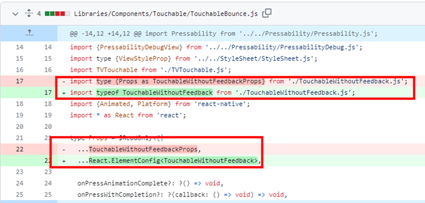

9. 删除 `Sample` 和 `CrashyCrash`，这些 NativeModules 不是必需的，因此React Native将它们删除了。

### v0.63.0

1. **RN** 团队想摆脱对 `prop-types` 包的使用，删除剩余的 `Incremental` 组件，以使用现在的 `React.createContext API`。
2. **RN** 团队不再需要从 JS 调用 `focus on mount`，因为 iOS 和 Android 现在都在本机实现它，所以从 `TextInput.js` 移除 `useFocusOnMount` 自动对焦实现。

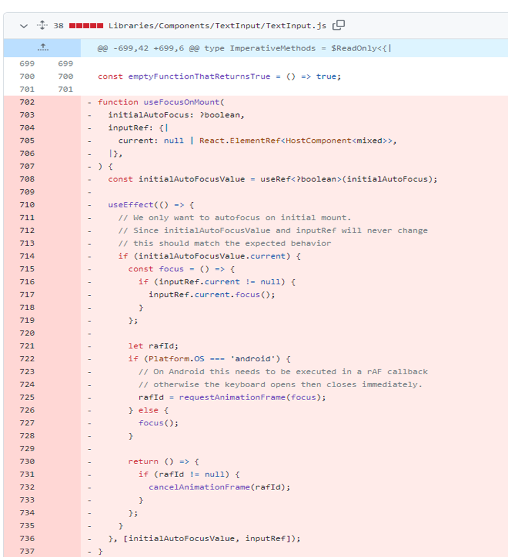

3. TextInput Placeholder 文本样式支持：新增了对 TextInput 组件的 placeholderTextColor 和 placeholderTextStyle 属性的支持。
4. 默认启用 LogBox: LogBox 成为默认的错误和警告处理机制。
5. Pressable 组件: 新的 Pressable 组件用于替代 Touchable 系列组件，提供了更灵活的触摸事件处理。

### v0.64.0

1. 将 `Image` 上的 `onLoad` 和 `onError` 事件更改为彼此一致，并与 `ImageSource` 类型一致。`Image` 的 `onload` 事件间对象上将 `source.url` 重命名为 `source.uri`。

    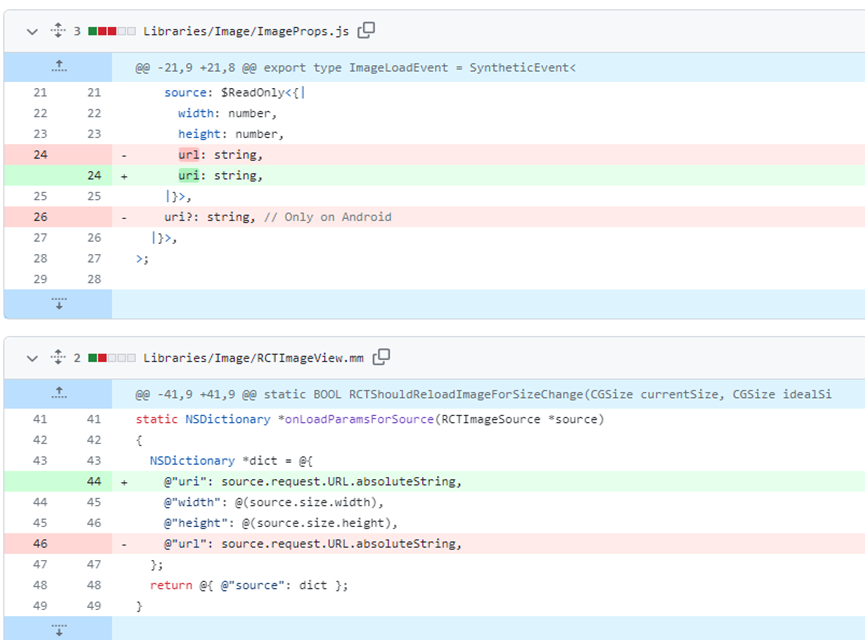

2. 通过创建 `VirtualizedListContext` 将 `VirtualizedList` 从旧上下文中迁移到 `React.Context`。
3. 修改 `BackHandler` 函数的 `flowtype`，使其具有更具体的返回类型。

    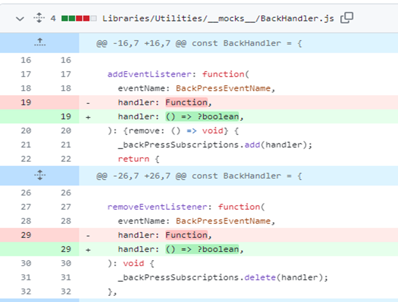

4. `Text.viewConfig` 不再导出，因为 `viewConfig` 早就不再是其他核心组件（例如 `View`）上的导出道具了。
5. 为了简化和清理 React Native 中的 “EventEmitter” 抽象，从 `DeviceEventEmitter` 和 `NativeEventEmitter` 中移除 `once()` 和 `removeCurrentListener()`。

### v0.64.2

重构 `UIManagerHelper.getUIManager` 以在未注册 `UIManager` 时返回 `null`。

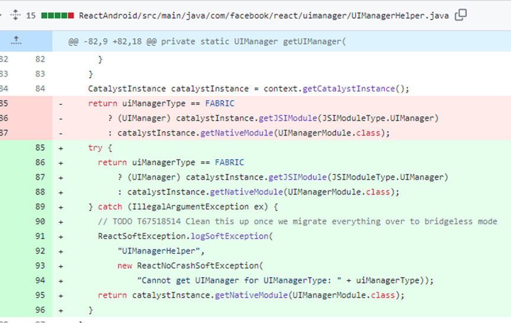

### v0.65.0

1. `renderApplication` 中添加参数 `debugName` 用作为 `React root tree` 的显示名称。

    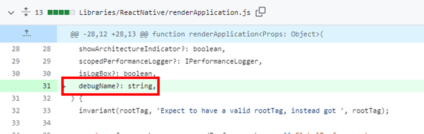

2. 废弃 `EventEmitter#removeSubscription` 用 `__removeSubscription` 代替。

    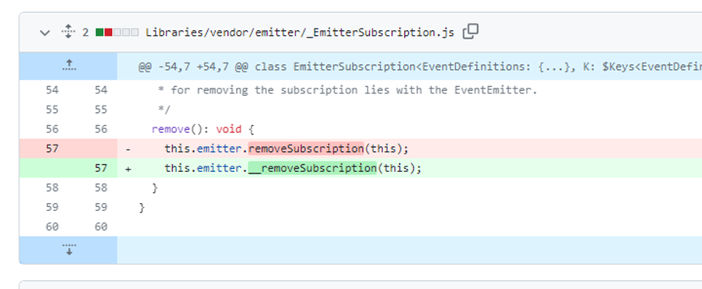

3. 删除 `Linking.removeEventListener`，使用对 `Linking.addEventListener` 返回的订阅调用 `remove()` 来替代。

    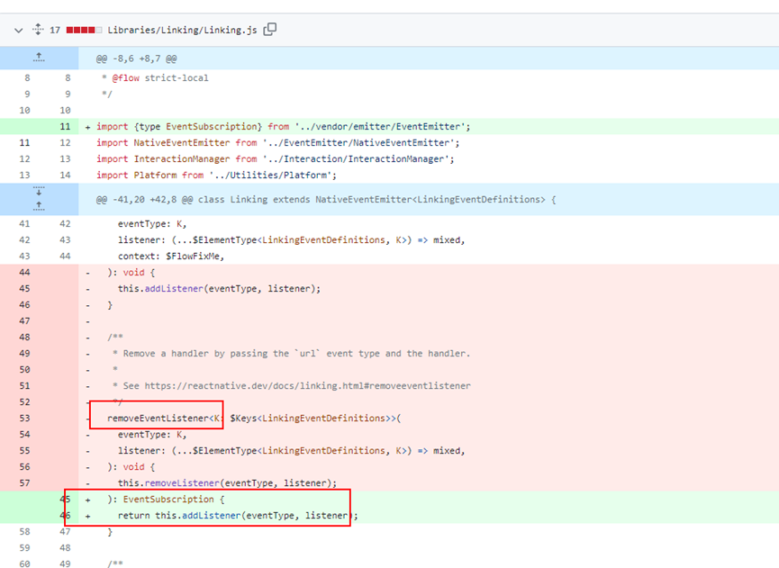

4. `AccessibilityInfo.removeEventListener` 标注废弃，但当前版本未删除该方法。

5. 已从 animated 组件引用中删除 `getNode()`，在 0.62 中，`createAnimatedComponent` 被改为使用 `forwardRef`，而不是要求调用者使用 `ref.getNode()`。为了保持向后兼容性，`ref.getnode()` 被 monkey-patched 到返回的 `ref` 上。

    .png)

6. 将 `RCTDeviceEventEmitter` 简化为简单的 `EventEmitter`，删除 `RCTDeviceEventEmitter.sharedSubscribers`。

    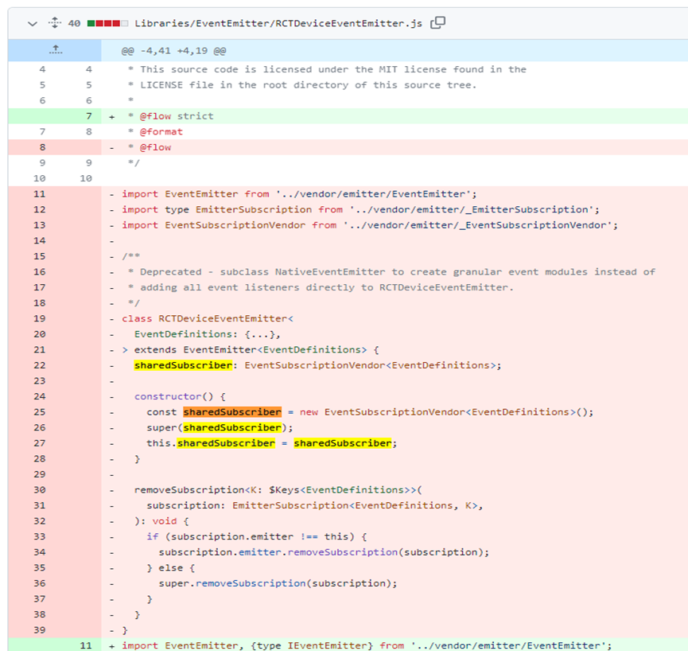

7. 将 `ScrollResponder.Mixin` 方法移动到 ScrollView 中，以删除 `ScrollResponder.js`。

    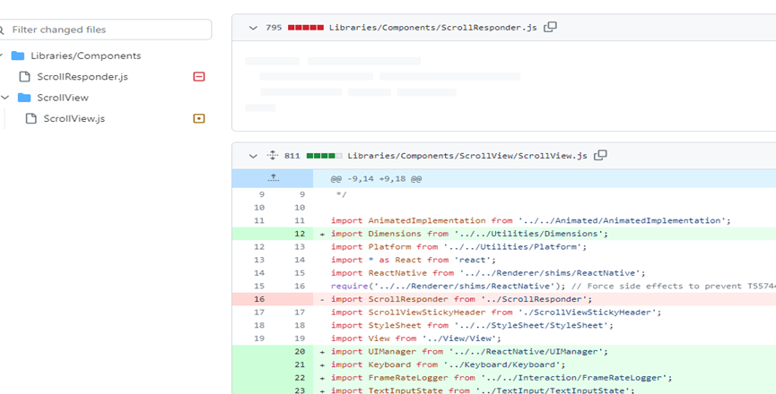

8. `NativeEventEmitter` 不再继承 `EventEmitter`，因此它不再实现 `removeListener` 和 `removeSubscription`。相反，在 `addListener` 返回的订阅对象上使用 `remove()` 方法。

    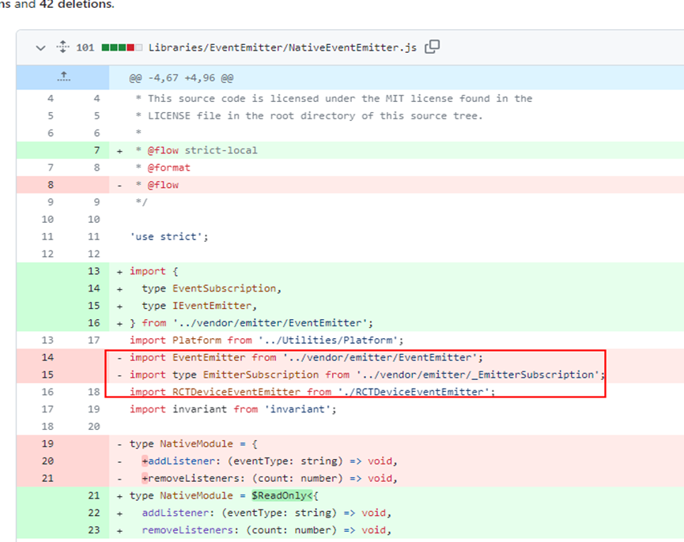

    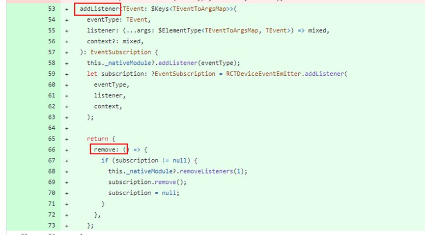

### v.0.66.0

移除 `Picker` 组件。

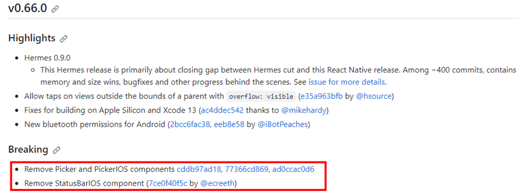

### v0.67.0

1. 已废弃的 `Keyboard.removeEventListener` 重命名为 `Keyboard.removeListener`。

    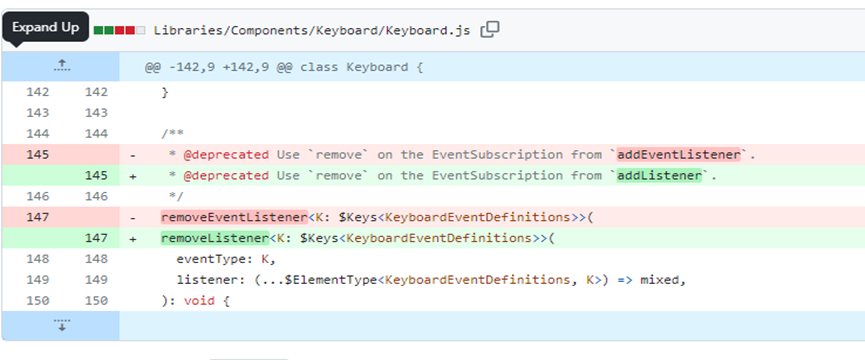

2. 删除未使用的文件：`StaticContainer.react.js`，`ensurePositiveDelayProps.js`，`InteractionMixin.js`，`queryLayoutByID.js`。

3. 删除 `Libraries/Core/setUpGlobals.js` 中未使用的全局变量 `GLOBAL`。**RN** 团队正在为 React Native 中的全局变量定义一个别名，名为 `GLOBAL`，Facebook 根本没有使用该别名，而且它似乎也没有在外部使用。这个别名在 JS 生态系统中并不标准，也不常见，所以可以直接删除它，以减少全局范围的污染。

    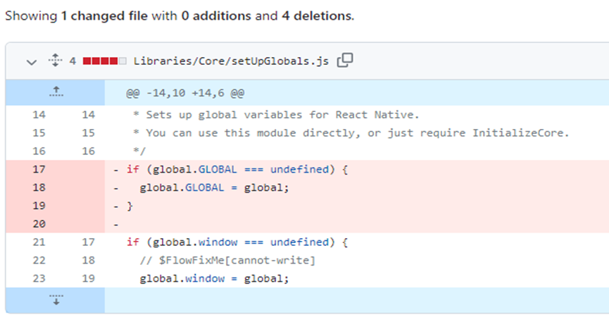

### v0.69.0

1. 将 `Animated.interpolate` 的参数键入为只读。
2. React 18 支持: 完全支持 React 18，包括 Concurrent Mode 和 Suspense 的功能。

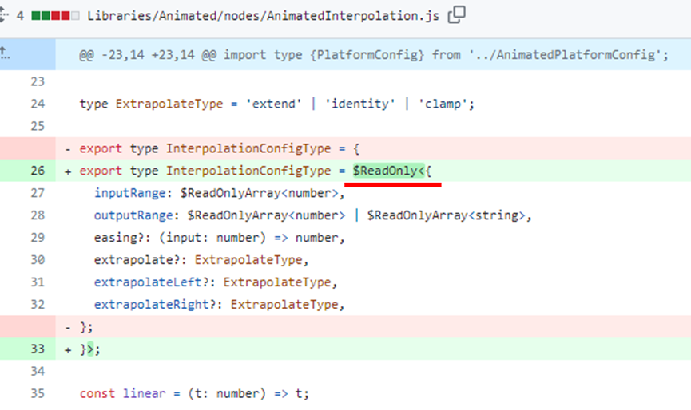

### v0.70.0

1. 在 `AnimatedColor`、`AnimatedValue`、`AnimatedValueXY` 中将 `useNativeDriver` 添加为 `setValue` 的参数。

    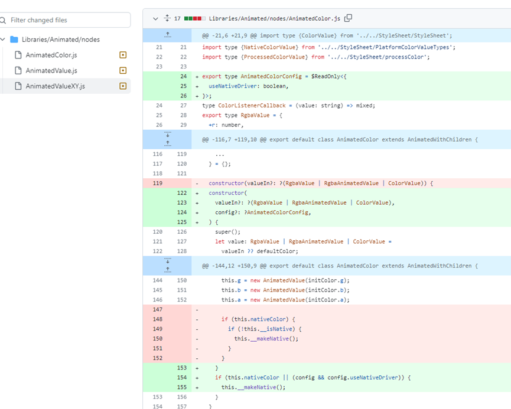

2. 删除旧的已弃的模块中的 `removeListener` 方法，这些模块会导致恼人的警告。对于某些第三方模块来说，这可能是一个突破性的变化，包括：

    - `Libraries/AppState/AppState.js`

    - `Libraries/Components/AccessibilityInfo/AccessibilityInfo.js`

    - `Libraries/Components/Keyboard/Keyboard.js`

    - `Libraries/EventEmitter/NativeEventEmitter.js`

    - `Libraries/Linking/Linking.js`

    - `Libraries/Utilities/Dimensions.js`

    - `Libraries/vendor/emitter/_EventEmitter.js`

    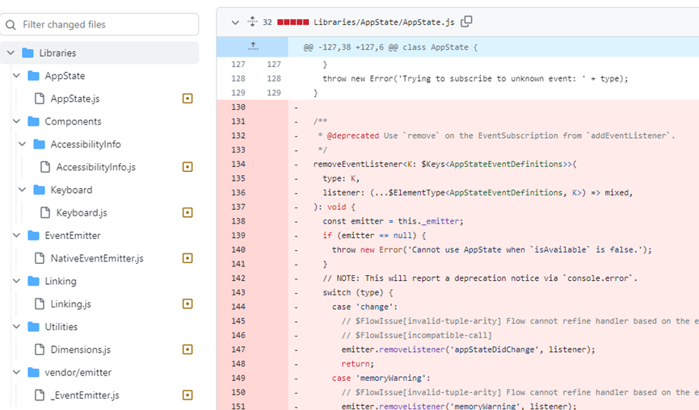

3. 删除已经弃用 `EventEmitter.prototype.removeSubscription` 方法。

    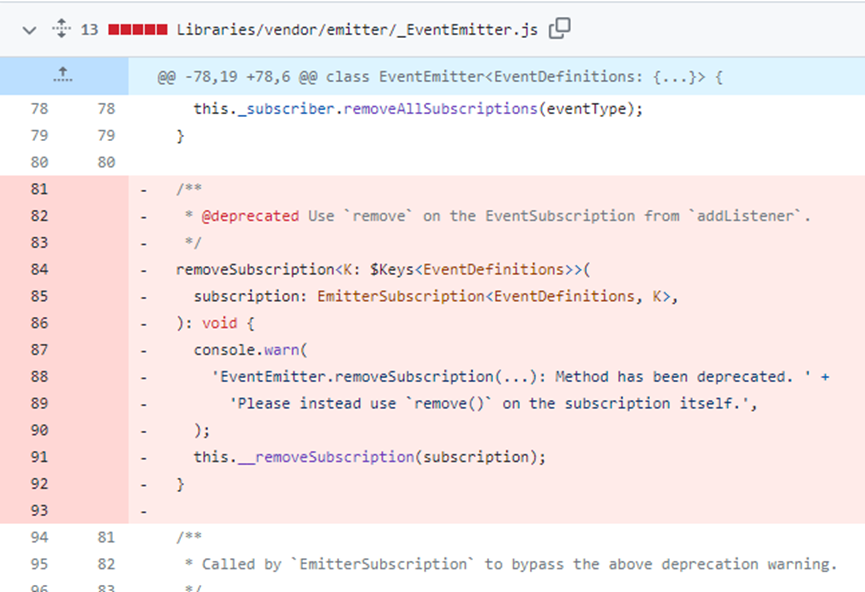

4. Hermes 成为默认 JS 引擎: Hermes 现在是默认的 JavaScript 引擎，这为大多数应用带来了性能上的提升。    

### v0.70.1

在 `turbo` 模块中接受 `TypeScript` 类型 `T | null | undefined` 作为可能的 `T` 类型。

根据 `Flow` 的文档，`T` 的可能类型意味着 `T | null | undefined`，而不是 `T | null | void`。

我认为保持 `TypeScript` 和 `Flow` 彼此一致更好。

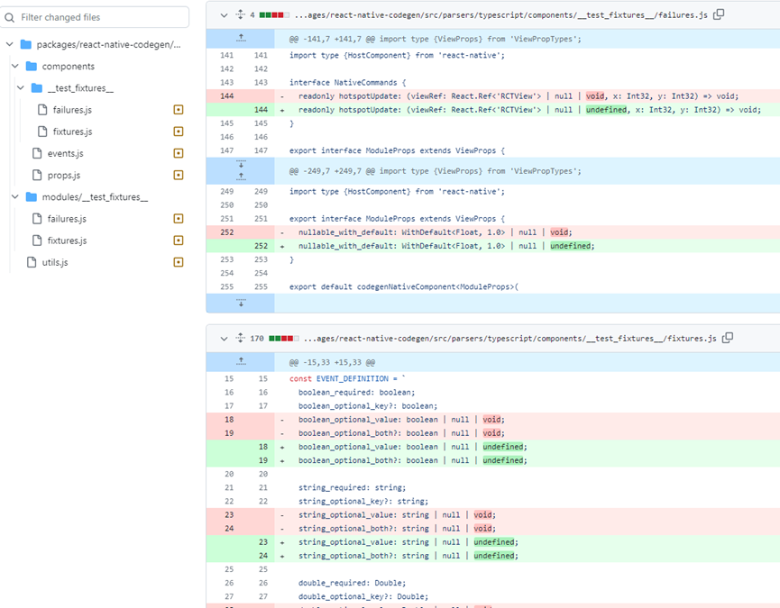

### v0.71.0

1. 从 react-native 中删除 `AsyncStorage` 模块。

2. 删除 `VirtualizedList listKey prop`。（注：<https://github.com/facebook/react-native/commit/010da67bef0c22418d0d41b7c2eae664672a4a27>）

3. **RN** 团队已经决定不继续在 react-native 中使用 `flexlayout`，将暂时删除它。

### v0.72.0

1. 将 `VirtualizedList`、`VirtualizedSectionList` 及其文件移动到一个名为 `react-native/virtualized-lists` 的单独软件包中，该软件包位于 `packages/virtualized-lists` 下。

    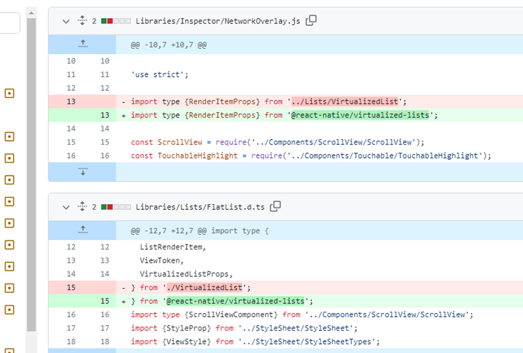

2. 删除 `Libraries/Components/ActivityIndicator/ActivityIndicator.flow.js`。

3. `polyfills` 重命名为 `js-polyfills`。

    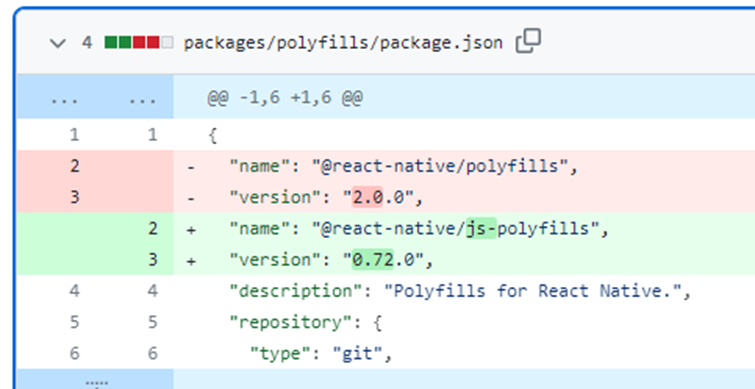

    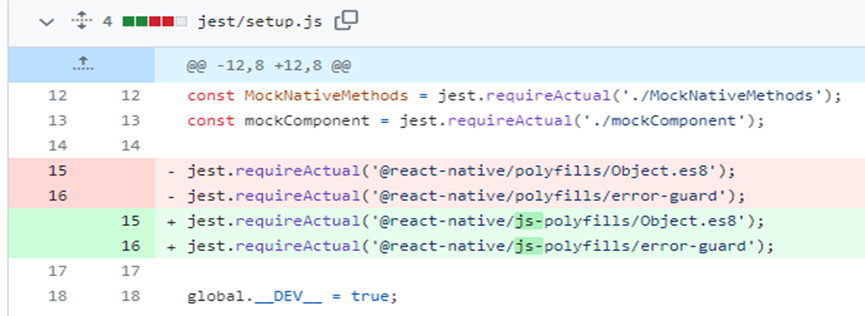

4. `Libraries/Lists/FlatList.d.ts` 中 `scrollToItem` 添加 `viewOffset` 参数。

    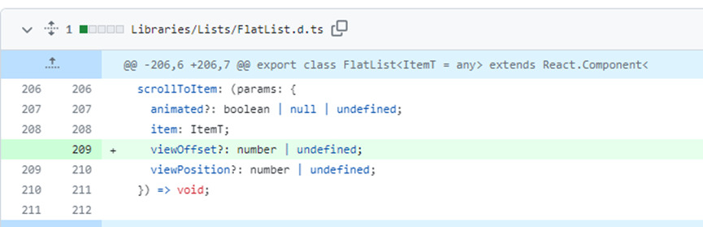

5. `onStartRached` 和 `onStartRachedThreshold` 添加到 `VirtualizedList` 中。这允许实现双向分页。

    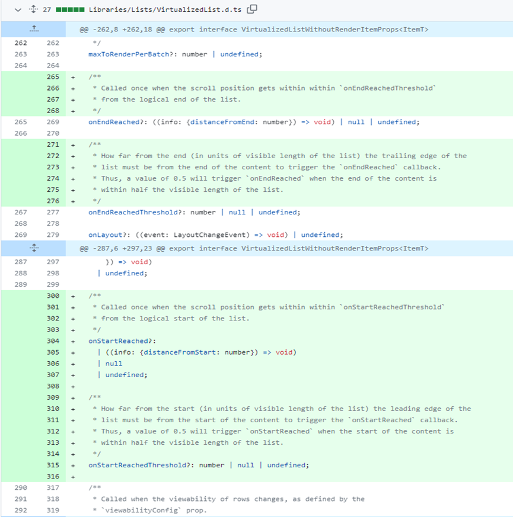

### v0.72.1

`react-native/metro-config` 现在包含 `metro-config` 中的所有基本配置值。

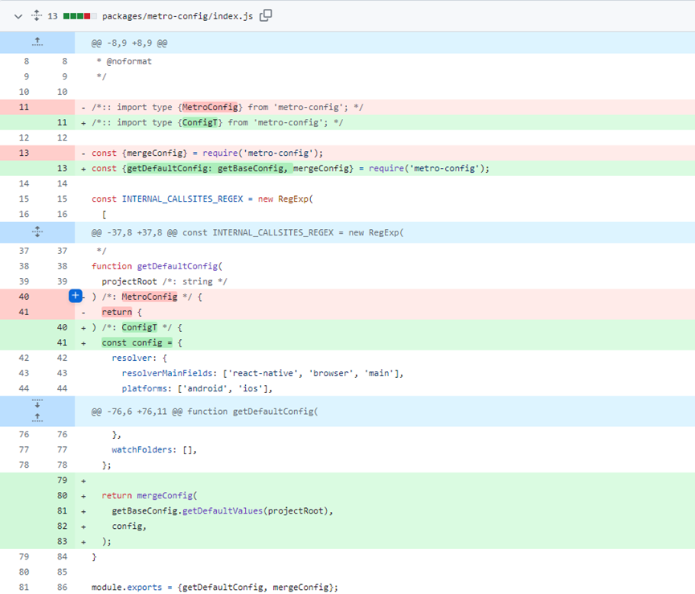

### v0.72.2

从模板中删除弃用的存根类型 `@types/metro-config`。

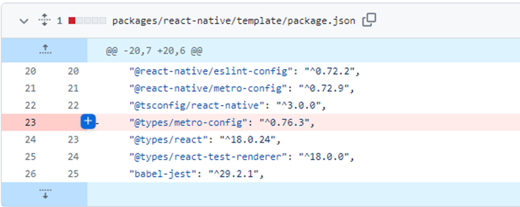
