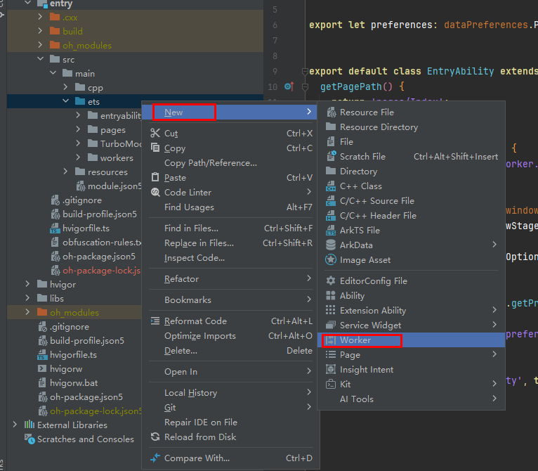

This documentation is based on React Native documentation licensed under the [CC-BY-4.0](https://creativecommons.org/licenses/by/4.0/) license at https://reactnative.cn/docs/0.72/the-new-architecture/pillars-turbomodules. © Meta Platforms Inc. Changed to How to create a TurboModule on HarmonyOS.

# 自定义TurboModule的实现

## ArkTS TurboModule的实现

### 目录结构

您可以将 TurboModule 声明为一个模块，并作为一个依赖的方式添加到您的项目中。

您可以在 React Native 工程 MyApp 的同级创建一个名为 `RTNCalculator` 的目录，并创建一个 `src/specs` 子目录，并根据使用的 Codegen 的版本不同，分别创建 `v1`、`v2` 子目录，创建后的目录结构是这样的：
```
├── MyApp
└── RTNCalculator
    └── src
        └── specs
            ├── v1
            └── v2
```

### 声明 JavaScript 接口

在 `RTNCalculator` 目录下新建 `index.ts`，并导出接口声明文件。接口声明文件 NativeCalculator.ts 根据您的需要，放置在 `v1` 或 `v2` 目录下，本示例放在了 `V2` 路径下。接口声明文件可以使用[Flow](https://flow.org/) 或 [TypeScript](https://www.typescriptlang.org/)语言编写。

```typescript
// index.ts
import NativeCalculator from "./src/specs/v2/NativeCalculator";

export const RTNCalculator = NativeCalculator;
```

> npm 不会打包空文件夹，需要通过在 v1 中实现 `.gitkeep` 的方式保留该目录。

需要注意的是，文件必须满足以下两点要求，更详细的说明可以参考[React Native 中文网](https://reactnative.cn/docs/0.72/the-new-architecture/pillars-turbomodules#2-%E5%A3%B0%E6%98%8E-javascript-%E6%8E%A5%E5%8F%A3)：

- 文件必须使用 `Native<MODULE_NAME>` 命名。Codegen 只会找到匹配这些命名规则的文件；
- 代码中必须要输出 `TurboModuleRegistrySpec` 对象。

```javascript
// NativeCalculator.ts
import type {TurboModule} from 'react-native/Libraries/TurboModule/RCTExport';
import {TurboModuleRegistry} from 'react-native';

export interface Spec extends TurboModule {
  add(a: number, b: number): Promise<number>;
}

export default TurboModuleRegistry.get<Spec>(
  'RTNCalculator',
) as Spec | null;
```

### 模块配置
在 `RTNCalculator` 目录下新增 `package.json`：
```json
{
  "name": "rtn-calculator",
  "version": "1.0.0",
  "description": "Add numbers with TurboModules",
  "main": "index.ts",
  "keywords": [],
  "author": "<Your Name> <your_email@your_provider.com> (https://github.com/<your_github_handle>)",
  "license": "ISC",
  "harmony": {
    "alias": "rtn-calculator",
    "codegenConfig": [
      {
        "version": 1,
        "specPaths": [
            "./src/specs/v1"
        ]
      },
      {
        "version": 2,
        "specPaths": [
          "./src/specs/v2"
        ]
      }
    ]
  },
  "files": [
    "index.ts",
    "src/*",
    "harmony.tar.gz"
  ],
  "peerDependencies": {
    "react": "*",
    "react-native": "*"
  },
  "devDependencies": {
    "@types/react": "^18.2.47",
    "react": "18.2.0",
    "react-native": "0.72.5"
  },
  "dependencies": {}
}
```
上面的文件中包含了一些通用的描述性信息，如包名，版本，作者信息等。在使用的时候，需要设置<>包裹的占位符。
同时，OpenHarmony 平台的配置声明使用的是 `harmony` 字段，里面包含两个字段：
  - `alias`：模块的别名
  - `codegenConfig`：存放要生成的第三方库的对象数组，每个对象又包含两个字段：
    - `version`：该三方库使用的Codegen版本，取值：{1，2}
    - `specPaths`：用于找到接口声明文件的相对路径


### 原生代码

#### 使用Codegen生成原生代码

Codegen 的详细使用方法，可以参考[Codegen](Codegen.md)文档。

1. 原工程添加命令
   
    需要在 `MyApp` 的 `package.json` 中，添加 Codegen 相关 Script：
    ```diff
    {
      "name": "MyApp",
      "version": "0.0.1",
      "private": true,
      "scripts": {
        ···
    +  "codegen": "react-native codegen-harmony --cpp-output-path ./entry/src/main/cpp/generated --rnoh-module-path ./entry/oh_modules/@rnoh/react-native-openharmony"
      },
      ···
    }
    ```
2. 调用脚本生成代码。

    > npm 不会打包空文件夹，可以通过在空目录中实现 `.gitkeep` 的方式保留该目录。
    ```bash
    cd RTNCalculator
    npm pack
    cd ../MyApp
    npm i file:../RTNCalculator/rtn-calculator-1.0.0.tgz
    npm run codegen
    ```
      
   执行成功后，将生成的胶水代码拷贝到您的harmony工程中即可。


#### 编写HarmonyOS原生代码

1. 创建用于实现模块的 `CalculatorModule.ts`。

    在 `entry/src/main/ets` 路径下新建文件夹 `turbomodule`，并在文件夹中新增`CalculatorModule.ts`。
    如果是 ArkTSTurboModule，需要在此处实现：

    ```typescript
    // entry/src/main/ets/turbomodule/CalculatorModule.ts
    import { TurboModule } from '@rnoh/react-native-openharmony/ts';
    import { TM } from '@rnoh/react-native-openharmony/generated/ts';

    export class CalculatorModule extends TurboModule implements TM.RTNCalculator.Spec {
      add(a: number, b: number): Promise<number>{
        return Promise.resolve(a+b);
      }
    }
    ```
    如果是 cxxTurboModule，不需要在此处实现，只需保证函数的参数类型和返回类型正确即可：

    ```typescript
    // entry/src/main/ets/turbomodule/CalculatorModule.ts
    import { TurboModule } from '@rnoh/react-native-openharmony/ts';
    import { TM } from '@rnoh/react-native-openharmony/generated/ts';

    export class CalculatorModule extends TurboModule implements TM.RTNCalculator.Spec {
      add(a: number, b: number): Promise<number>{
        return Promise.resolve(123456);
      }
    }
    ```
2. 创建 Package 的实现文件 `GeneratedPackage.ets`。

    在 `entry/src/main/ets` 路径下新建 `GeneratedPackage.ets`，并添加对应的实现代码：
    ```typescript
    // entry/src/main/ets/GeneratedPackage.ets
    import { RNPackage, TurboModulesFactory } from '@rnoh/react-native-openharmony/ts';
    import type {
      TurboModule,
      TurboModuleContext
    } from '@rnoh/react-native-openharmony/ts';
    import { TM } from "@rnoh/react-native-openharmony/generated/ts"
    import { CalculatorModule } from './turbomodule/CalculatorModule';
    class GeneratedTurboModulesFactory extends TurboModulesFactory {
      createTurboModule(name: string): TurboModule | null {
        if (name === TM.RTNCalculator.NAME) {
          return new CalculatorModule(this.ctx);
        }
        return null;
      }
      hasTurboModule(name: string): boolean {
        return name === TM.RTNCalculator.NAME;
      }
    }
    export class GeneratedPackage extends RNPackage {
      createTurboModulesFactory(ctx: TurboModuleContext): TurboModulesFactory {
        return new GeneratedTurboModulesFactory(ctx);
      }
    }
    ```
    需要注意的是：

    - 文件中应该 export 一个继承了 `RNPackage` 的类，里面实现 `createTurboModulesFactory`，用于创建 TurboModule 的工厂类；
    - 工程类中应该实现两个方法：
      - `createTurboModule`：用于根据 name 创建对应的 TurboModule 类；
      - `hasTurboModule`：用于判断改 name 对应的 TurboModule 是否存在；
    - 需要在 `entry/src/main/ets/RNPackagesFactory.ets` 中添加创建该 Package 的方法：
    ```diff
    import { RNPackageContext, RNPackage } from '@rnoh/react-native-openharmony/ts';
    import {SamplePackage} from '@rnoh/sample-package/src/main/ets/SamplePackage';
    + import { GeneratedPackage } from './GeneratedPackage';

    export function createRNPackages(ctx: RNPackageContext): RNPackage[] {
      return [
        new SamplePackage(ctx),
    +    new GeneratedPackage(ctx)
      ];
    }
    ```
3. 如果是 CxxTurboModule，需要一些额外步骤：

   什么是：CxxTurbomodule，请参考[React Native 中文网](https://reactnative.cn/docs/0.72/the-new-architecture/cxx-cxxturbomodules)。

   以 CalculatorModule 为例，展开胶水代码文件 `RTNCalculator.cpp` 中的宏 ARK_ASYNC_METHOD_METADATA：

    ```diff
    #include "RTNCalculator.h"

    namespace rnoh {
    using namespace facebook;

    RTNCalculator::RTNCalculator(const ArkTSTurboModule::Context ctx, const std::string name) : ArkTSTurboModule(ctx, name) {
        methodMap_ = {
    -       ARK_ASYNC_METHOD_METADATA(add, 2),
    +       { "add",
    +         { 2,
    +           [] (facebook::jsi::Runtime& rt, facebook::react::TurboModule& turboModule, const facebook::jsi::Value* args, size_t count) {
    +             return static_cast<ArkTSTurboModule&>(turboModule).callAsync(rt, "add", args, count);
    +           } 
    +         } 
    +       }
        };
    }

    } // namespace rnoh

    ```

    删除 lambda 表达式中对 ArkTSTurboModule 的异步桥接调用，改为直接实现。

    ```diff
    #include "RTNCalculator.h"

    namespace rnoh {
    using namespace facebook;

    RTNCalculator::RTNCalculator(const ArkTSTurboModule::Context ctx, const std::string name) : ArkTSTurboModule(ctx, name) {
        methodMap_ = {
           { "add",
             { 2,
               [] (facebook::jsi::Runtime& rt, facebook::react::TurboModule& turboModule, const facebook::jsi::Value* args, size_t count) {
    -             return static_cast<ArkTSTurboModule&>(turboModule).callAsync(rt, "add", args, count);
    +             return jsi::Value(args[0].asNumber() + args[1].asNumber());
               } 
             } 
           }
        };
    }

    } // namespace rnoh

    ```

4. 后续的步骤根据您所使用的的 Codegen 版本不同，会有不同的操作：
#### v1版本
1. 在 `CMakeLists.txt` 中添加新增的胶水代码文件
   
    在 `entry/src/main/cpp/CMakeLists.txt` 中定义 cpp 的 generated 路径，并添加到编译构建中：
    ```diff
    project(rnapp)
    cmake_minimum_required(VERSION 3.4.1)
    set(CMAKE_SKIP_BUILD_RPATH TRUE)
    set(OH_MODULE_DIR "${CMAKE_CURRENT_SOURCE_DIR}/../../../oh_modules")
    set(RNOH_APP_DIR "${CMAKE_CURRENT_SOURCE_DIR}")

    set(RNOH_CPP_DIR "${OH_MODULE_DIR}/@rnoh/react-native-openharmony/src/main/cpp")
    set(RNOH_GENERATED_DIR "${CMAKE_CURRENT_SOURCE_DIR}/generated")
    set(CMAKE_ASM_FLAGS "-Wno-error=unused-command-line-argument -Qunused-arguments")
    set(CMAKE_CXX_FLAGS "-fstack-protector-strong -Wl,-z,relro,-z,now,-z,noexecstack -s -fPIE -pie")
    add_compile_definitions(WITH_HITRACE_SYSTRACE)
    set(WITH_HITRACE_SYSTRACE 1) # for other CMakeLists.txt files to use

    add_subdirectory("${RNOH_CPP_DIR}" ./rn)

    # RNOH_BEGIN: add_package_subdirectories
    add_subdirectory("${OH_MODULE_DIR}/@rnoh/sample-package/src/main/cpp" ./sample-package)
    # RNOH_END: add_package_subdirectories

    + file(GLOB GENERATED_CPP_FILES "./generated/*.cpp")
    add_library(rnoh_app SHARED
    +     ${GENERATED_CPP_FILES}
        "./PackageProvider.cpp"
        "${RNOH_CPP_DIR}/RNOHAppNapiBridge.cpp"
    )

    target_link_libraries(rnoh_app PUBLIC rnoh)

    # RNOH_BEGIN: link_packages
    target_link_libraries(rnoh_app PUBLIC rnoh_sample_package)
    # RNOH_END: link_packages
    ```
2. 在 `entry/src/main/cpp/PackageProvider.cpp` 中创建 cpp 侧的 package 对象：
    ```diff
    #include "RNOH/PackageProvider.h"
    #include "SamplePackage.h"
    + #include "generated/RNOHGeneratedPackage.h"

    using namespace rnoh;

    std::vector<std::shared_ptr<Package>> PackageProvider::getPackages(Package::Context ctx) {
        return {
    +         std::make_shared<RNOHGeneratedPackage>(ctx), 
            std::make_shared<SamplePackage>(ctx)
        };
    }
    ```
#### v2版本

1. 在 `CMakeLists.txt` 中添加新增的胶水代码文件
   
   在这一步，需要在 CMake 文件中把 Codegen 生成的文件分别使用 `add_library` 和 `target_include_directories` 添加到编译构建的任务中：
    ```diff
    project(rnapp)
    cmake_minimum_required(VERSION 3.4.1)
    set(CMAKE_SKIP_BUILD_RPATH TRUE)
    set(OH_MODULE_DIR "${CMAKE_CURRENT_SOURCE_DIR}/../../../oh_modules")
    set(RNOH_APP_DIR "${CMAKE_CURRENT_SOURCE_DIR}")

    set(RNOH_CPP_DIR "${OH_MODULE_DIR}/@rnoh/react-native-openharmony/src/main/cpp")
    + set(RNOH_GENERATED_DIR "${CMAKE_CURRENT_SOURCE_DIR}/generated")
    set(CMAKE_ASM_FLAGS "-Wno-error=unused-command-line-argument -Qunused-arguments")
    set(CMAKE_CXX_FLAGS "-fstack-protector-strong -Wl,-z,relro,-z,now,-z,noexecstack -s -fPIE -pie")
    add_compile_definitions(WITH_HITRACE_SYSTRACE)
    set(WITH_HITRACE_SYSTRACE 1) # for other CMakeLists.txt files to use

    add_subdirectory("${RNOH_CPP_DIR}" ./rn)

    # RNOH_BEGIN: add_package_subdirectories
    add_subdirectory("${OH_MODULE_DIR}/@rnoh/sample-package/src/main/cpp" ./sample-package)
    # RNOH_END: add_package_subdirectories

    + set(rtn_calculator_generated_dir "${RNOH_GENERATED_DIR}/rtn_calculator")
    + file(GLOB_RECURSE rtn_calculator_generated_dir_SRC "${rtn_calculator_generated_dir}/**/*.cpp")
    + file(GLOB rtn_calculator_package_SRC CONFIGURE_DEPENDS *.cpp)
    add_library(rnoh_app SHARED
    +     ${rtn_calculator_generated_dir_SRC}
    +     ${rtn_calculator_package_SRC}
        "./PackageProvider.cpp"
        "${RNOH_CPP_DIR}/RNOHAppNapiBridge.cpp"
    )

    + target_include_directories(rnoh_app PUBLIC ${rtn_calculator_generated_dir})

    target_link_libraries(rnoh_app PUBLIC rnoh)

    # RNOH_BEGIN: link_packages
    target_link_libraries(rnoh_app PUBLIC rnoh_sample_package)
    # RNOH_END: link_packages
    ```
2. 在 `entry/src/main/cpp/PackageProvider.cpp` 中创建 cpp 侧的 package 对象：
   
    ```diff
    #include "RNOH/PackageProvider.h"
    #include "SamplePackage.h"
    + #include "generated/rtn_calculator/RNOH/generated/BaseRtnCalculatorPackage.h"

    using namespace rnoh;

    std::vector<std::shared_ptr<Package>> PackageProvider::getPackages(Package::Context ctx) {
        return {
            std::make_shared<SamplePackage>(ctx),
    +         std::make_shared<BaseRtnCalculatorPackage>(ctx)
        };
    }
    ```

#### 设置自定义Turbomodule运行在worker线程

1. 创建运行在 woker 线程的 Turbomodule，需要采用下列方式修改：

    ```typescript
    // entry/src/main/ets/GeneratedPackage.ets
    import { RNPackage, AnyThreadTurboModuleFactory } from '@rnoh/react-native-openharmony/ts';
    import type {
      AnyThreadTurboModule,
      AnyThreadTurboModuleContext
    } from '@rnoh/react-native-openharmony/ts';
    import { TM } from "@rnoh/react-native-openharmony/generated/ts"
    import { CalculatorModule } from './turbomodule/CalculatorModule';
    class GeneratedTurboModulesFactory extends AnyThreadTurboModuleFactory {
      createTurboModule(name: string): AnyThreadTurboModule | null {
        if (name === TM.RTNCalculator.NAME) {
          return new CalculatorModule(this.ctx);
        }
        return null;
      }
      hasTurboModule(name: string): boolean {
        return name === TM.RTNCalculator.NAME;
      }
    }
    export class GeneratedPackage extends RNPackage {
      createAnyThreadTurboModuleFactory(ctx: AnyThreadTurboModuleContext): AnyThreadTurboModuleFactory {
        return new GeneratedTurboModulesFactory(ctx);
      }
    }
    ```
    其中 `CalculatorModule.ets` 的方法如果要能运行在 worker 线程上，需要添加对应的实现代码：

    ```typescript
    // entry/src/main/ets/turbomodule/CalculatorModule.ets
    import { AnyThreadTurboModule } from '@rnoh/react-native-openharmony/ts';
    import { TM } from '@rnoh/react-native-openharmony/generated/ts';

    export class CalculatorModule extends AnyThreadTurboModule implements TM.RTNCalculator.Spec {
      add(a: number, b: number): Promise<number>{
        return Promise.resolve(a+b);
      }
      ...
    }
    ```
    需要注意的是：

   - `GeneratedPackage` 中应该继承 `RNPackage` 的类，里面实现 `createAnyThreadTurboModuleFactory`，用于创建 `AnyThreadTurboModuleFactory` 的工厂类；
      - `createAnyThreadTurboModuleFactory` 方法的参数 ctx 的类型应该设为 `AnyThreadTurboModuleContext`,返回值类型为 `AnyThreadTurboModuleFactory`;
   - 工程类 `GeneratedTurboModulesFactory` 应该继承 `AnyThreadTurboModuleFactory`;
   - 工程类 `GeneratedTurboModulesFactory` 中应该实现两个方法：
      - `createTurboModule`：用于根据 name 创建对应的 `AnyThreadTurboModule` 类，或者返回`null`
      - `hasTurboModule`：用于判断该 name 对应的 TurboModule 是否存在；
   - TurboModule 类 `CalculatorModule` 应该继承 `AnyThreadTurboModule`；

2. 配置TurboModule运行在worker线程,需要继承RNability后重载`getRNOHWorkerScriptUrl`，代码修改方式如下所示：
    ```typescript
    // entry/src/main/ets/entryability/EntryAbility.ets
    import {RNAbility} from '@rnoh/react-native-openharmony';

    export default class EntryAbility extends RNAbility {
    +  override getRNOHWorkerScriptUrl() {
    +    return "entry/ets/workers/RNOHWorker.ets"
    +  }
    ...
    }
    ```
   在ets路径下右击，选择`New`选项，右侧展开菜单选择`Woker`选项：
   
   选择后在弹出的窗口中取名`RNOHWorker.ets`：
   
   此时目录结构为:
    ```
    └── ets
        ├── entryability
        ├── page
        ├── rn
        └── workers
            └── RNOHWorker.ets         
    ```
    修改 `RNOHWorker.ets` 为下列代码：
    ```typescript
    // entry/src/main/ets/worker/RNOHWorker.ets
    import { setupRNOHWorker } from "@rnoh/react-native-openharmony/src/main/ets/setupRNOHWorker";
    import { createRNPackages } from '../RNPackagesFactory';

    setupRNOHWorker({
      createWorkerRNInstanceConfig: (_rnInstanceName) => {
        return { thirdPartyPackagesFactory: createRNPackages }
      }
    })
    ```

### 使用TurboModule

现在就可以在您的 App 中使用 TurboModule 了，下面是一个使用的例子：
```javascript
/**
 * Sample React Native App
 * https://github.com/facebook/react-native
 *
 * @format
 * @flow strict-local
 */
import React from 'react';
import {useState} from 'react';
import type {Node} from 'react';
import {
  SafeAreaView,
  StatusBar,
  Text,
  Button,
} from 'react-native';
import { RTNCalculator } from 'rtn-calculator';

const App: () => Node = () => {
  const [result, setResult] = useState<number | null>(null);
  return (
    <SafeAreaView>
      <StatusBar barStyle={'dark-content'} />
      <Text style={{marginLeft: 20, marginTop: 20}}>
        3+7={result ?? '??'}
      </Text>
      <Button
        title="Compute"
        onPress={async () => {
          const value = await RTNCalculator.add(3, 7);
          setResult(value);
        }}
      />
    </SafeAreaView>
  );
};
export default App;
```
