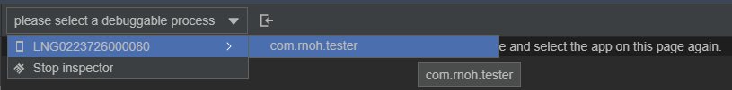
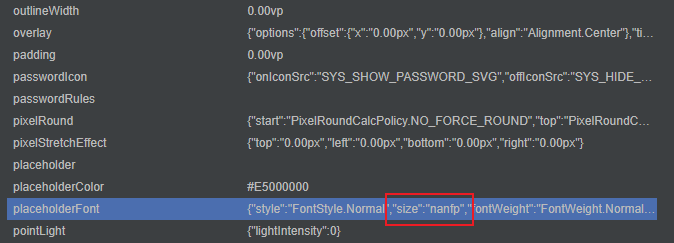

# 定位定界指导类FAQ

### 常见属性效果设置不正确的时候排查方法
- 方法
1. 打开位于 DevEco Studio 底部的`ArkUI Inspecetor`，选择出现问题的应用，具体的使用方法可以参考[布局分析](https://developer.huawei.com/consumer/cn/doc/harmonyos-guides-V5/ide-arkui-inspector-V5)：
   
2. 在打开的页面上找到出现问题的组件，如果组件没有显示出来，也可以使用页面左侧的组件树，根据Text文本，组件类型，tag（如果没有设置过nativeId等属性，会默认设置为id）等信息，找到对应的组件。
3. 选中该组件，在页面右侧打开的属性中查看属性，并找到出现问题的属性。  
   
4. 根据属性，判断原因：
   - ArkUI无法处理该异常值，需要适配处理；
   - 传入的值存在错误，需要找到哪里传的值是错误的。
5. 传入的属性值有两个来源：
   - 通过对组件树进行操作，修改组件的属性。可以在`src/main/cpp/RNOH/SchedulerDelegateCAPI.h`中的`handleMutation`函数中打印对应的操作，可以在这里判断组件是否创建顺序存在问题。
   - 通过Animated的NativeDriver修改组件的属性，可以在`src/main/cpp/RNOH/SchedulerDelegateCAPI.cpp`中的`synchronouslyUpdateViewOnUIThread`函数中打印修改的属性，进一步的判断到底是哪一步出现了问题。
   - 这两种方式都会走到`xxxComponentInstance`的`onPropsChanged`中，也可以在这里打印对应的属性，通过`getTag`可以获取当前组件的tag信息，进而根据属性信息定位问题。
6. 根据出现问题的属性，进一步判断问题的原因，并进行对应的修改。
7. 如果存在闪退的情况，可以参考FAQ中的闪退进行排查。如果非常见问题，可以参考[CppCrash故障定位指导](https://developer.huawei.com/consumer/cn/doc/best-practices-V5/bpta-cppcrash-guidance-V5)进行分析。

### 常见图片加载不出来的时候排查方法
- 方法
1. 检查本地图片加载和沙箱图片加载的路径是否正确
   当前本地加载图片和沙箱加载图片的路径采用不同的编码方式，本地加载的图片资源会从rawfile/assets目录下开始找对应的资源，需要将图片资源放在assets目录下；沙箱加载的图片则是会从bundle同级目录直接寻找图片，不需要额外增加一层assets目录。
2. 检查图片的名称与加载的图片名称是否一致
   - 可以在`src/main/cpp/RNOHCorePackage/ComponentInstances/ImageComponentInstance.cpp`中的`onPropsChanged`中打印传过来的图片资源的路径与文件名信息，并与assets目录或者沙箱目录中的图片进行比对，需要保证这两个地方是一致的。
   - 如果这两个地方不一致，需要确认下在自定义打包指令的时候，是否使用了`copyAssets`相关操作，如果没有，需要补充这部分内容，来保证图片资源文件路径格式与bundle中编码的图片资源一致。
3. 基于[常见属性效果设置不正确的时候排查方法](#常见属性效果设置不正确的时候排查方法)，排查是否是哪个属性导致的图片无法加载。

