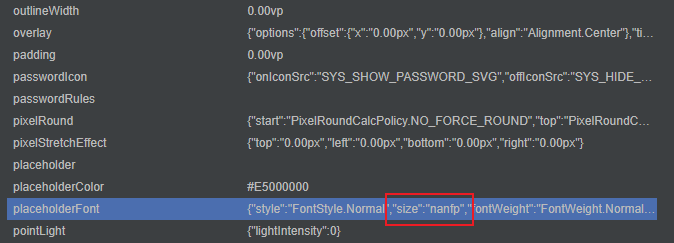

# 定位定界指导类FAQ

### 常见属性效果设置不正确的时候排查方法
- 方法
1. 打开位于 DevEco Studio 底部的 `ArkUI Inspecetor`，选择出现问题的应用，具体的使用方法可以参考[布局分析](https://developer.huawei.com/consumer/cn/doc/harmonyos-guides-V5/ide-arkui-inspector-V5)：
   
2. 在打开的页面上找到出现问题的组件，如果组件没有显示出来，也可以使用页面左侧的组件树，根据 Text 文本，组件类型，tag（如果没有设置过 nativeId 等属性，会默认设置为 id ）等信息，找到对应的组件。
3. 选中该组件，在页面右侧打开的属性中查看属性，并找到出现问题的属性。  
   
4. 根据属性，判断原因：
   - ArkUI 无法处理该异常值，需要适配处理；
   - 传入的值存在错误，需要找到哪里传的值是错误的。
5. 传入的属性值有两个来源：
   - 通过对组件树进行操作，修改组件的属性。可以在`src/main/cpp/RNOH/SchedulerDelegateCAPI.h`中的`handleMutation`函数中打印对应的操作，可以在这里判断组件是否创建顺序存在问题。
   - 通过Animated的NativeDriver 修改组件的属性，可以在`src/main/cpp/RNOH/SchedulerDelegateCAPI.cpp`中的`synchronouslyUpdateViewOnUIThread`函数中打印修改的属性，进一步的判断到底是哪一步出现了问题。
   - 这两种方式都会走到 `xxxComponentInstance` 的 `onPropsChanged` 中，也可以在这里打印对应的属性，通过 `getTag` 可以获取当前组件的 tag 信息，进而根据属性信息定位问题。
6. 根据出现问题的属性，进一步判断问题的原因，并进行对应的修改。
7. 如果存在闪退的情况，可以参考FAQ中的闪退进行排查。如果非常见问题，可以参考[CppCrash故障定位指导](https://developer.huawei.com/consumer/cn/doc/best-practices-V5/bpta-cppcrash-guidance-V5)进行分析。

### 常见图片加载不出来的时候排查方法
- 方法
1. 检查本地图片加载和沙箱图片加载的路径是否正确
   当前本地加载图片和沙箱加载图片的路径采用不同的编码方式，本地加载的图片资源会从 `rawfile/assets` 目录下开始找对应的资源，需要将图片资源放在 assets 目录下；沙箱加载的图片则是会从 bundle 同级目录直接寻找图片，不需要额外增加一层 assets 目录。
2. 检查图片的名称与加载的图片名称是否一致
   - 可以在 `src/main/cpp/RNOHCorePackage/ComponentInstances/ImageComponentInstance.cpp` 中的 `onPropsChanged` 中打印传过来的图片资源的路径与文件名信息，并与 assets 目录或者沙箱目录中的图片进行比对，需要保证这两个地方是一致的。
   - 如果这两个地方不一致，需要确认下在自定义打包指令的时候，是否使用了 `copyAssets` 相关操作，如果没有，需要补充这部分内容，来保证图片资源文件路径格式与 bundle 中编码的图片资源一致。
3. 基于[常见属性效果设置不正确的时候排查方法](#常见属性效果设置不正确的时候排查方法)，排查是否是哪个属性导致的图片无法加载。

### 常见更新环境后运行报错的时候排查方法
- 方法
   
   检查是否由缓存未清理干净导致:
   1. 点击 `build` -> `clean project`
   2. 手动删除项目生成的临时文件目录（ `.cxx`， `oh_modules`）
   3. 点击 `File` -> `Sync and Refresh Project`

### 常见事件设置不生效的时候排查方法
- 事例

   **RN** 侧无法接收到 Codegen 生成的 Fabric 组件 `emitComponentEvent` 事件的问题。

- 现象
   
   使用 Codegen 实现一个和 SampleApp 里一样的 MarqueeView 组件，调用 `emitComponentEvent` 向 **RN** 侧发送 `onStop` 事件，发现 **RN** 侧该事件未执行：
   
    ```javascript
    this.ctx.rnInstance.emitComponentEvent(
         this.descriptor.tag,
         "onStop",
         { isStop: !this.start, type: "custom" }
      )
    ```

- 原因

   观察 Codegen 生成的文件结构，会发现其中缺少 `EventEmitter` 和 `EventEmitRequestHandler` 文件。实际上并非没有生成相关代码，而是生成的代码被包含在 `RNOHGeneratedPackage.h` 文件中：

    ```cpp
    class GeneratedEventEmitRequestHandler : public EventEmitRequestHandler {
         public:
            void handleEvent(Context const &ctx) override {
               auto eventEmitter = 
               ctx.shadowViewRegistry->getEventEmitter<facebook::react::EventEmitter>(ctx.tag);
               if (eventEmitter == nullptr) {
                     return;
               }
         
               std::vector<std::string> supportedEventNames = {
                     ...
                     "stop",
               };
               if (std::find(supportedEventNames.begin(), supportedEventNames.end(), ctx.eventName) != supportedEventNames.end()) {
                     eventEmitter->dispatchEvent(ctx.eventName, ArkJS(ctx.env).getDynamic(ctx.payload));
               }
            }
         };

      class RNOHGeneratedPackage : public Package {
            EventEmitRequestHandlers createEventEmitRequestHandlers() override {
               return {
                     std::make_shared<GeneratedEventEmitRequestHandler>(),
               };
            }
      };
    ```

    所有的 Codegen 生成的 Fabric 组件都使用相同的一个 `GeneratedEventEmitRequestHandler` 。注意 `supportedEventNames` 中的事件名是 `stop` ，后面在 JSI 层会自动映射成 `onStop` ，所以如果使用 `onStop` 作为发送事件名，会在上面的代码中无法识别。

- 解决

   将第二个参数改为 `stop` 即可：
   
    ```javascript
    this.ctx.rnInstance.emitComponentEvent(
         this.descriptor.tag,
         "stop",
         { isStop: !this.start, type: "custom" }
      )
    ```       
   