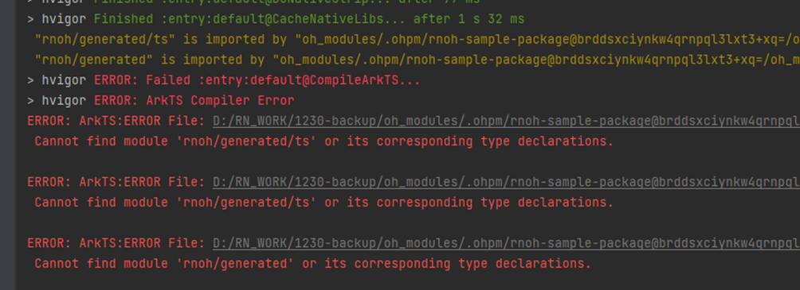
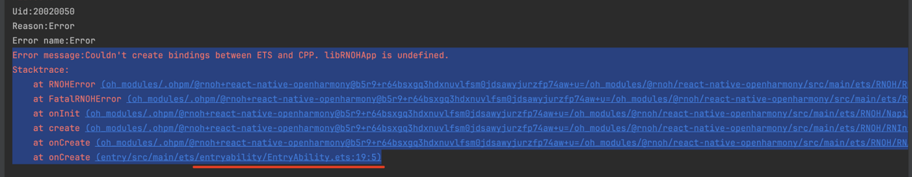

# 编译类FAQ

## 编译时报错，找不到TextLayoutManager 
- 错误提示  
编译CPP的时候报错，在报错信息中搜索`error`，发现是`TextLayoutManager.cpp`文件找不到了。截图如下:

- 原因  
该问题是由于工程的路径太长导致的，请缩短工程的路径。

## 找不到generated等文件
- 错误提示  
错信息意思是说找不到`react_native_openharmony/generated/ts`文件，`react_native_openharmony/generated`里面的文件是由Codegen。
- 错误截图

- 原因
1. 未执行Codegen；
2. Codegen生成的文件未能放到正确的位置。
- 解决:  
方案1：
    Codegen会根据接口声明自动生成cpp和ets代码，生成代码的位置可通过`--cpp-output-path`、`--rnoh-module-path`两个参数调整，这两个参数具体的值可通过对比rn工程与HarmonyOS工程的相对路径得出。  
方案2：
    先任意指定一下`--cpp-output-path`、`--rnoh-module-path`两个参数的值，然后将生成的generated文件夹分别复制到HarmonyOS工程中（如：ets复制到`entry/oh_modules/react_native_openharmony`中，cpp复制到`entry/src/main/cpp`中）

## 打包时或启动Metro时报错，找不到DrawerLayoutAndroid
- 错误截图  
当打包或者运行Metro服务的时候，报`None of these files exist`，报错截图如下：

- 原因  
该问题是没有配置HarmonyOS打包参数导致的，请参考[如何配置HarmonyOS打包参数](常见开发场景.md#如何配置harmonyos打包参数)，配置完成后重新打包。

### 找不到HiTrace编译选项
- 错误截图

- 原因  
该问题是编译选项中没有设置`WITH_HITRACE_SYSTRACE`为`1`导致的，您可以在CMakeLists中添加该编译选项，需要注意的是，设置`WITH_HITRACE_SYSTRACE`编译选项需要写在`add_subdirectory()`之前，否则将不会生效：

    ```CMAKE
    # CMakeLists.txt
    ···
    set(WITH_HITRACE_SYSTRACE 1)
    add_compile_definitions(WITH_HITRACE_SYSTRACE)

    add_subdirectory(...)
    ···
    ```

### react-native不是内部或外部命令
- 解决  

该问题为`npm install`的时候存在问题，请确认`package.json`的正确性，并重新执行以下命令：

    ```PowerShell
    npm install
    ```

### MAC环境下Cannot find module ‘@react-native/babel-preset’
- 错误截图

 - 原因  
该问题是从编辑器复制创建工程命令的时候，添加了多余的符号导致的。
- 解决  
您可以将复制的命令格式化之后再执行，或者手动输入创建工程的命令。

### 找不到libhermes.so
 
该问题可能会分为以下三种表现情况：
 
1. Hilog日志提示，libhermes.so没有找到，can't find library libhermes.so in namespace: moduleNs_default。
 
   
 
2. native工程`\entry\build\default\outputs\default\entry-default-signed.hap`包中查找，没有发现libhermes.so。
 
3. DevEco Studio变更说明上有一个[不兼容变更](https://developer.huawei.com/consumer/cn/doc/harmonyos-releases-V5/ide-changelogs-db5-V5)，举例说明该变更：如果存在2个har包，且har包A的so依赖了har包B的so。在之前的版本中，har包A在打包过程中会将har包B的so打包到har包A里，变更后，har包A打包时将不会携带har包B的so。
 
该问题的解决方法：
 
需要在`entry/build-profile.json5`中增加：
 
```json5
"nativeLib": { // apiType字段同级别 
   "excludeFromHar": false
}
```
 
