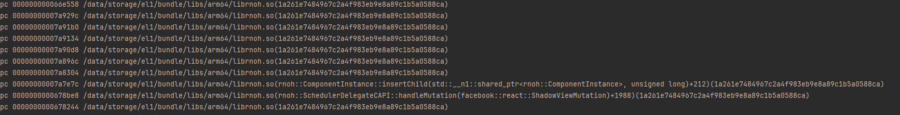
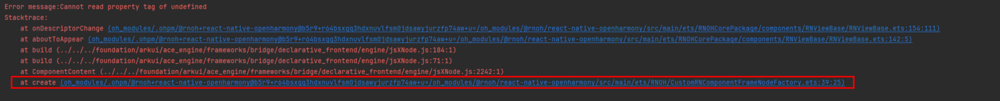

# 运行类FAQ

## 启动后闪退，提示没有设置RNOH_C_API_ARCH
- 查看闪退日志  
程序编译运行，并且正常安装到手机上，但是一旦运行就闪退。在**DevEco Studio > Log > FaultLog**中查看闪退日志。
- 出错截图  

- 解决
1. 此报错是CAPI版本的错误，需要您在环境变量中设置`RNOH_C_API_ARCH=1`，重启DevEco Studio，并运行**Build > Clean Project**，重新编译后即可解决。
2. 如果上述设置不生效，可以请删除`.cxx`目录，重新编译运行。
3. 如果上述操作还不生效，可以在您自己的`CMakeLists.txt`中设置：

    ```CMAKE
    set(RNOH_C_API_ARCH, 1)
    ```
4. 其余闪退问题可以参考[CppCrash故障定位指导](https://developer.huawei.com/consumer/cn/doc/best-practices-V5/bpta-cppcrash-guidance-V5)进行分析。

### 混合方案闪退时报错insertChild
- 错误截图  

- crash  
当使用功能混合方案的时候遇到闪退，闪退的调用栈中存在`ComponentInstance::insertChild`的调用栈，需要排查创建`RNInstance`的时候，`CustomRNComponentFrameNodeFactory`是否被正确创建。需要正确创建该工厂方法，或升级RNOH版本来解决。

### 混合方案闪退时报错：Cannot read property tag of undefined
- 错误截图  

- crash
当使用混合方案的时候遇到闪退，闪退的调用栈栈底显示`CustomRNComponentFrameNodeFactory`中时，需要排查一下是否在创建`RNApp`或`RNInstance`的时候，将组件的name放到数组中，并作为`arkTsComponentNames`的参数传入。


