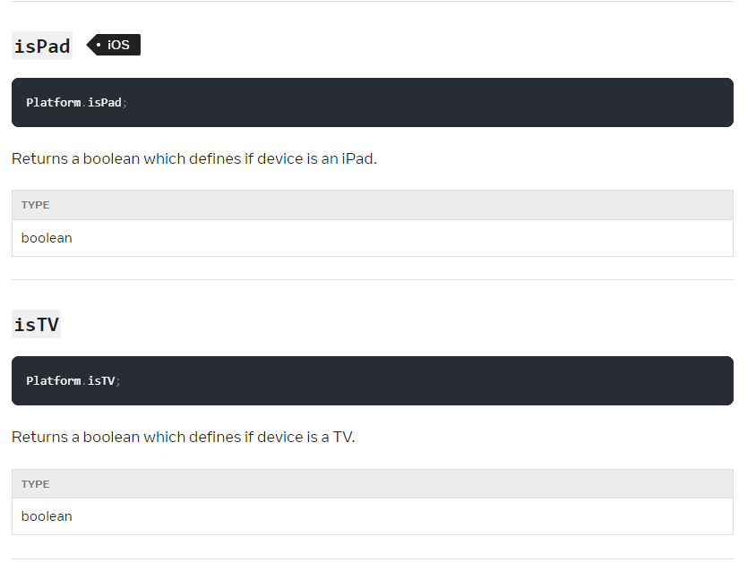

This documentation is based on React Native documentation licensed under the [CC-BY-4.0](https://creativecommons.org/licenses/by/4.0/) license at   
https://reactnative.cn/docs/0.72/flexbox  
https://reactnative.cn/docs/0.72/platform  
https://reactnative.cn/docs/0.72/pixelratio  
https://reactnative.cn/docs/0.72/dimensions  
https://reactnative.cn/docs/0.72/usewindowdimensions   
© Meta Platforms Inc.

#  RN框架多屏适配指导

​	我们在这里所提到的多屏适配是指：在进行移动端应用软件开发的过程中，当应用需要在多个设备上运行时，需要适配不同的屏幕尺寸和分辨率，以及不同的交互方式。开发人员需要应用工程的UI以及显示能够适配各种不同形状与尺寸的手机屏幕，使得应用在不同的平台以及不同的手机上的元素显示一致，拥有统一的用户视觉和操作体验。

​	以鸿蒙生态设备为例，不同的设备拥有各不相同的屏幕尺寸与形状，若在进行界面渲染的时候对尺寸的设置不够灵活，就会导致在不同机型的界面视觉与操作体验不统一。而如果对不同的设备进行不同的代码编写以及开发，就会导致开发成本的增加。因此，鸿蒙系统希望能对多端开发能力进行支持，从而降低多设备应用的开发成本。为了能够实现这一目标，鸿蒙系统集成了React Native(RN)框架的多端UI适配，以及交互事件的支持，帮助开发者降低开发与维护成本，提高代码复用率。

​	在UI适配方面，React Native提供了几种不同的方法来设置UI组件的高度和宽度，下面主要从FlexBox布局，像素密度与设备类型、`Dimensions API`以及`useWindowDimensions Hook API`这四个重点适配方式进行详细介绍。

## Flexbox布局

**官方文档介绍：[使用Flexbox布局](https://reactnative.cn/docs/0.72/flexbox)**

 弹性盒（Flexbox）是一种CSS布局模型，旨在为网页提供灵活的、自适应的排列方式。它通过定义容器和内部项目的行为，使得页面元素能够以可预测的方式在容器中进行排列和分布。在React Native中使用Flexbox规则来指定某个组件的子元素的布局。Flexbox可以在不同屏幕尺寸上提供一致的布局结构。React Native中的Flexbox的工作原理和web上的CSS基本一致，也存在少许差异，详细差异点请参考官方文档。

一般来说，使用`flexDirection`、`alignItems`和`justifyContent`三个样式属性就已经能满足大多数布局需求。

### Flex Direction

在组件的`style`中指定`flexDirection`可以决定布局的**主轴**。主轴决定了子元素应该沿着哪个方向的轴进行排列，默认值是**竖直轴(`column`)**方向。

- `column`（**默认值**）：将子元素从上到下对齐。如果启用换行，则下一行将从容器顶部的第一个项目右侧开始。
- `row`：将子元素从左到右对齐。如果启用换行，则下一行将在容器左侧的第一个项目下方开始。
- `column-reverse`：将子元素从底部向上对齐。如果启用换行，则下一行将从容器底部的第一个项目右侧开始。
- `row-reverse`：将子元素从右到左对齐。如果启用换行，则下一行将在容器右侧的第一个项目下方开始。

### Align Items

在组件的`style`中指定`alignItems`可以决定其子元素沿着**次轴**（与主轴垂直的轴，比如若主轴方向为`row`，则次轴方向为`column`）的**排列方式**。子元素是应该靠近次轴的起始端还是末尾段分布呢？亦或应该均匀分布？可用的选项有：

- `stretch`（**默认值**）：将容器的子元素拉伸以匹配容器次轴的高度。
- `flex-start`：将容器的子元素对齐到容器次轴的起始位置。
- `flex-end`：将容器的子元素对齐到容器次轴的末尾位置。
- `center`：将容器的子元素居中对齐于容器次轴上。
- `baseline`：沿着公共基线对齐容器的子元素。可以为各个子元素设置参考基线，作为其父级基线。

### Justify Content

在组件的 `style` 中指定 `justifyContent` 可以决定其子元素沿着 **主轴** 的 **排列方式**。子元素是应该靠近主轴的起始端还是末尾段分布呢？亦或应该均匀分布？可用的选项有：

- `flex-start`（**默认值**）将容器中的子元素沿主轴起始位置对齐。
- `flex-end` 将容器中的子元素沿主轴末尾位置对齐。
- `center` 将容器中的子元素在主轴上居中对齐。
- `space-between` 在容器的主轴上均匀分布子元素，将剩余空间平均分配给子元素之间。
- `space-around` 在容器的主轴上均匀分布子元素，将剩余空间围绕在每个子元素周围。与 `space-between` 相比，使用 `space-around` 会导致空间被分配到第一个子元素和最后一个子元素之前和之后。
- `space-evenly` 在对齐容器内沿着主轴均匀分布子项。每一对相邻项、主开始边缘和第一项以及主结束边缘和最后一项之间的间距都完全相同。

更多的布局属性及示例代码请参考[官方文档](https://reactnative.cn/docs/0.72/flexbox)。

## 设备类型+像素密度

### isPad、isTV

**官方文档介绍：[Platform API](https://reactnative.cn/docs/0.72/platform#ispad-ios)**

`Platform API` 中包含了 `isPad` 和 `isTV` 两个方法，它会返回一个布尔值，用于确定当前设备是否为 iPad 或者是否为 TV。



### PixelRatio

**官方文档介绍：[PixelRatio API](https://reactnative.cn/docs/0.72/pixelratio)**

`PixelRatio` 可以获取到设备的像素密度和字体缩放比。

- `get()` 方法：可以返回设备的像素密度。

  返回设备的像素密度，例如：

  - `PixelRatio.get() === 1`

    - [mdpi Android devices](https://material.io/tools/devices/)

  - `PixelRatio.get() === 1.5`

    - [hdpi Android devices](https://material.io/tools/devices/)

  - `PixelRatio.get() === 2`
    
    - iPhone SE, 6S, 7, 8
    - iPhone XR
    - iPhone 11
    - [xhdpi Android devices](https://material.io/tools/devices/)

  - `PixelRatio.get() === 3`

    - iPhone 6S Plus, 7 Plus, 8 Plus
    - iPhone X, XS, XS Max
    - iPhone 11 Pro, 11 Pro Max
    - Pixel, Pixel 2
    - [xxhdpi Android devices](https://material.io/tools/devices/)

  - `PixelRatio.get() === 3.5`

    - Nexus 6
    - Pixel XL, Pixel 2 XL
    - [xxxhdpi Android devices](https://material.io/tools/devices/)

- `getPixelSizeForLayoutSize()` 方法

  将一个布局尺寸(dp)转换为像素尺寸(px)，一定会返回一个整数数值。

  ```javascript
  static getPixelSizeForLayoutSize(layoutSize: number): number
  ```

示例：根据像素密度获取指定大小的图片

如果应用运行在一个高像素密度的设备上，显示的图片也应当分辨率更高。一个取得缩略图的好规则就是将显示尺寸乘以像素密度比：

```javascript
const image = getImage({
  width: PixelRatio.getPixelSizeForLayoutSize(200),
  height: PixelRatio.getPixelSizeForLayoutSize(100),
});
<Image source={image} style={{width: 200, height: 100}} />
```

`PixelRatio.getPixelSizeForLayoutSize(200)` 方法会根据当前设备的 pixelratio 返回对应值，如当前设备的 pixelratio 为 2，则返回 `200 \* 2 = 400`，最后生成的参数为 `{ width: 400, height: 200 }`。`getImage` 方法是需要开发者自己实现的，根据传入的不同尺寸的宽高参数，返回不同分辨率尺寸的图片地址。

## Dimensions API

**官方文档介绍：[Dimensions API](https://reactnative.cn/docs/0.72/dimensions)**

在获取设备屏幕独立像素方面，React Native 提供了 `Dimensions API` 来进行设备信息获取。通过调用 `Dimensions.get()` 方法，可以取得一个包含屏幕长宽信息的对象，来把握当前用户的设备的屏幕大小，并且以此来简易推测用户是否处于横屏状态。

```javascript
import { Dimensions } from 'react-native';

const windowWidth = Dimensions.get('window').width;
const windowHeight = Dimensions.get('window').height;
```

`Dimensions API` 具有两个方法：

- `addEventListener()`

  ```javascript
  static addEventListener(
    type: 'change',
    handler: ({
      window,
      screen,
    }: DimensionsValue) => void,
  ): EmitterSubscription;
  ```

  添加一个事件监听函数。目前支持的事件有：

  `change`：在 `Dimensions` 对象内部的属性发生变化时触发。事件处理程序的参数是一个[`DimensionsValue`](https://reactnative.cn/docs/0.72/dimensions#dimensionsvalue)类型的对象。

- `get()`

  ```javascript
  static get(dim: 'window' | 'screen'): ScaledSize;
  ```

  初始尺寸在调用 `runApplication` 之前设置，因此在运行任何其他 require 之前应该可用，但可能会在之后更新。

  示例：`const {height, width} = Dimensions.get('window');`

## useWindowDimensions Hook API

**官方文档介绍：[useWindowDimensions](https://reactnative.cn/docs/0.72/usewindowdimensions)**

`useWindowDimensions` 会根据用户状态栏，虚拟菜单栏，以及用户手机是否横置来返回相应的屏幕长宽。基于该 API 封装多个屏幕断点，可在断点变化时自适应调整界面布局。会在屏幕尺寸变化时自动更新获取到的设备 `width` 和 `height` 值。使用方法如下：

```javascript
import { useWindowDimensions } from 'react-native';

const windowWidth = useWindowDimensions().width;
const windowHeight = useWindowDimensions().height;
```

`useWindowDimensions` 具有的属性有四个：

- `fontScale`

  获取当前使用的字体比例。

  ```javascript
  useWindowDimensions().fontScale;
  ```

- `scale`

  运行应用的设备的像素比率。

  ```javascript
  useWindowDimensions().scale;
  ```

- `height`

  应用所占用的窗口或屏幕的高度（以像素为单位）。

  ```javascript
  useWindowDimensions().height;
  ```

- `width`

  应用所占用的窗口或屏幕的宽度（以像素为单位）。

  ```javascript
  useWindowDimensions().width;
  ```

## 如何适配折叠屏

如果要考虑可折叠的设备，或者其他屏幕尺寸可变的设备，可以参考下面例子中所使用的事件监听函数或是[`useWindowDimensions`](https://reactnative.cn/docs/0.72/usewindowdimensions)：

1. 如何感知屏幕的变化

   开发者可以通过注册 `Dimensions.addEventListener("change")` 监听来感知屏幕的变化，不想感知屏幕的变化的时候可以取消监听 `remove`。

2. 如何获取屏幕和窗口参数

   可以通过 `Dimensions.get('window')` 或者 `Dimensions.get('screen')` 来获取窗口和屏幕的参数，包括 `width`、`height`、`scale` 和 `fontscale` 参数。

   ```javascript
   import React, {useState, useEffect} from 'react';
   import { Dimensions } from 'react-native';
   
   const windowDimensions = Dimensions.get('window');
   const screenDimensions = Dimensions.get('screen');
   
   const App = () => {
     const [dimensions, setDimensions] = useState({
       window: windowDimensions,
       screen: screenDimensions,
     });
     useEffect(() => {
       const subscription = Dimensions.addEventListener(
         'change',
         ({window, screen}) => {
           setDimensions({window, screen});
         },
       );
       return () => subscription?.remove();
     });
     ...
   }
   ```

   

