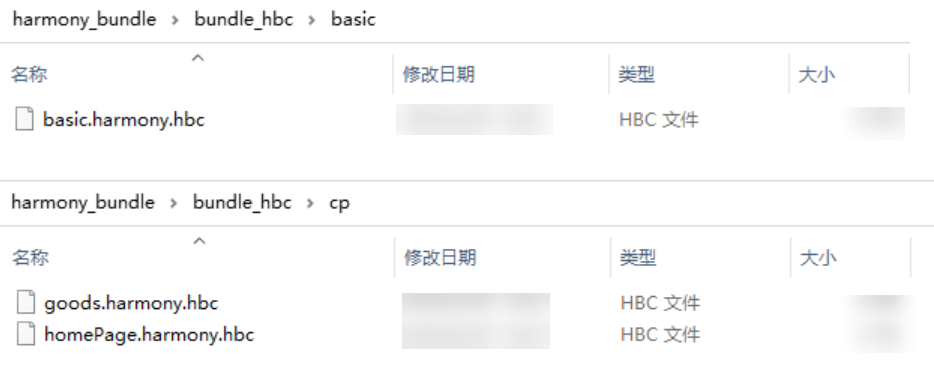
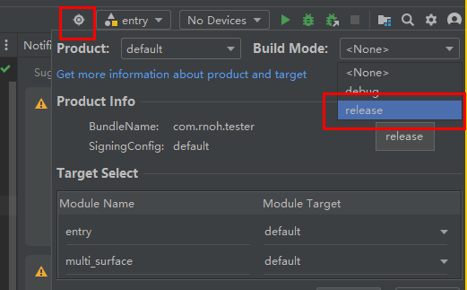

## 常见开发场景

### 如何使用onForeGround和onBackGround

`onForeground`、`onBackground`主要用于解决页面离开或返回不回调`AppState.addEventListener('change', this.handleAppStateChange)`的问题。具体用法如下：

- 在使用`router`路由时的调用方式

  - 使用`RNAbility`类时，实现方式如下：

    1. 在`@Entry`装饰的页面中，引入`RNAbility`类：

       ```typescript
       import {RNAbility} from '@rnoh/react-native-openharmony';
       ...
       @Entry
       @Component
       export struct ComponentName{
       @StorageLink('RNAbility') rnAbility: RNAbility | undefined = undefined
       ...
       }
       ```

    2. 在生命周期`onPageShow`和`onPageHide`中调用`rnAbility?.onForeground()`和`rnAbility?.onBackground()`：

       ```typescript
       onPageShow(){
         this.rnAbility?.onForeground();
       }
       onPageHide(){
         this.rnAbility?.onBackground();
       }
       ```

  - 不使用`RNAbility`时，实现方式如下：

    1. 在`@Entry`装饰的页面中，引入`RNInstancesCoordinator`类：

       ```typescript
       import {RNInstancesCoordinator} from '@rnoh/react-native-openharmony';
       ...
       @Entry
       @Component
       export struct ComponentName{
       @StorageLink('RNInstancesCoordinator') private rninstancesCoordinator: RNInstancesCoordinator | undefined = undefined
       ...
       }
       ```

    2. 在生命周期`onPageShow`和`onPageHide`中调用`rninstancesCoordinator?.onForeground()`和`rninstancesCoordinator?.onBackground()`：

       ```typescript
       onPageShow(){
        this.rninstancesCoordinator?.onForeground()
       }
       onPageHide(){
         this.rninstancesCoordinator?.onBackground()
       }
       ```

- 在`Navigation`路由中的调用方式

  -  使用`RNAbility`类时，实现方式如下：

    1. 在具有`NavDestination`的自定义组件中，引入`RNAbility`类，该步骤同`router`路由。

    2. 在`NavDestination`的`onShown`回调事件中调用`rnAbility?.onForeground()`，`在onHidden`回调事件中调用`rnAbility?.onBackground()`。

       ```typescript
       ...
       build(){
         NavDestination(){
         ...
         }
         .onShown(() => {
           this.rnAbility?.onForeground();
         })
         .onHidden(() =>{
           this.rnAbility?.onBackground();
         })
       }
       ```

  - 不使用`RNAbility`时，实现方式如下：

    1. 在具有`NavDestination`的自定义组件中，引入`RNInstancesCoordinator`类，该步骤同`router`路由。

    2. 在`NavDestination`的`onShown`回调事件中调用`rninstancesCoordinator?.onForeground()`，`在onHidden`回调事件中调用`rninstancesCoordinator?.onBackground()`。

       ```typescript
       ...
       build(){
         NavDestination(){
         ...
         }
         .onShown(() => {
           this.rninstancesCoordinator?.onForeground()
         })
         .onHidden(() =>{
           this.rninstancesCoordinator?.onBackground()
         })
       }
       ```

### 如何使用onBackPress

`onBackPress`主要用于处理手势返回事件，其基本原理是在原生`onBackPress`生命周期中调用框架的`onBackPress`能力，并且`return true`（返回`true`表示页面自己处理返回逻辑，不调用原生默认的返回事件能力；返回`false`表示使用原生默认的路由返回逻辑，默认值为`false`），将手势返回事件逻辑交给框架来处理，框架会将该事件发送给JS侧，最终手势返回事件逻辑将在JS侧实现。

- 在使用`router`路由时的调用方式

  - 单`RNInstance`场景

    1. 在`@Entry`装饰的页面中，引入`RNOHCoreContext`类：

       ```TypeScript
       import {RNOHCoreContext} from '@rnoh/react-native-openharmony';
       ...
       @Entry
       @Component
       export struct ComponentName{
       @StorageLink('RNOHCoreContext') private rnohCoreContext: RNOHCoreContext | undefined = undefined
       ...
       }
       ```

    2. 在生命周期`onBackPress`中调用`this.rnohCoreContext!.dispatchBackPress()`并`return true`。

       ```TypeScript
       onBackPress(): boolean | undefined{
          this.rnohCoreContext!.dispatchBackPress();
          return true;
       }
       ```

  - 多`RNInstance`场景

    若工程中存在多`RNInstance`的场景，便不能在`onBackPressed`回调事件中调用`rnohCoreContext!.dispatchBackPress()`，应根据实际业务场景，获取位于前台的响应手势返回事件的`RNInstance`实例，调用该实例的`onBackPress`方法。

    ```TypeScript
    // router路由
    onBackPress(): boolean{
      // 获取响应手势返回事件的rnInstance
      ...
      rnInstance.onBackPress();
      return true;
    }
    ```

- 在`Navigation`路由中的调用方式

  - 单`RNInstance`场景

    1. 在具有`NavDestination`的自定义组件中，引入`RNOHCoreContext`类，该步骤同`router`路由。

    2. 在`NavDestination`的`onBackPressed`回调事件中调用`rnohCoreContext!.dispatchBackPress()`。

       ```TypeScript
       ...
       build(){
         NavDestination(){
         ...
         }
         .onBackPressed(() => {
           this.rnohCoreContext!.dispatchBackPress();
           return true;
         })
       }
       ```

  - 多`RNInstance`场景

    方法同`router`路由，需要获取用于响应手势返回事件的`RNInstance`。

    ```TypeScript
    // Navigation路由
    ...
    build(){
      NavDestination(){
      ...
      }
      .onBackPressed(() => {
        // 获取响应手势返回事件的rnInstance
        ...
        rnInstance.onBackPress();
        return true;
      })
    }
       ```

- RN页面的默认返回方式
  - 在`RNAbility`中，有一个`defaultBackPressHandler`方法，如果在RN页面中没有做特殊处理，或调用了`exitApp`，最终会调用到这个方法中。开发者可以通过重写这个方法，实现自定义的默认返回。
  - 如果不使用`RNAbility`，而是进行自定义的拓展，需要在构建`RNInstancesCoordinator`对象的时候，把`defaultBackPressHandler`作为参数传入框架中。

### 如何使用 React Native 分包拆包

想要实现分包拆包，需要配置`metro.config`中`serializer`选项内的`createModuleIdFactory`与`processModuleFilter`。

- `createModuleIdFactory`：Metro支持了通过此方法配置自定义模块ID，同样支持字符串类型ID，用于生成`require`语句的模块ID，其类型为`() => (path: string) => number`（带有返回参数的返回函数的函数），其中`path`为各个module的完整路径。此方法的另一个用途就是多次打包时，对于同一个模块生成相同的ID，下次更新发版时，不会因ID不同找不到Module。

- `processModuleFilter`：根据给出的条件，对Module进行过滤，将不需要的模块过滤掉。其类型为`(module: Array<Module>) => boolean`，其中`module`为输出的模块，里面带着相应的参数，根据返回的波尔值判断是否过滤当前模块。返回`false`为过滤，不打入bundle。

详细的使用方法，可以参考[RN JS打包](RN-JS打包.md)

### 如何使用多bundle加载

多bundle加载主要包括以下几个步骤：

1. 先进行拆包打包流程，将单bundle拆分成基础包bundle和业务包bundle；
2. 在工程运行初始化阶段，创建需要使用的`RNInstance`实例，调用`runJSBundle`接口加载基础包bundle；
3. 之后在加载对应业务模块时，调用`runJSBundle`接口加载业务包bundle。

详细的使用方法，可以参考[RN Native接入 > 单实例单surface多bundle](RN-Native接入.md#单实例单surface多bundle)

### 如何在C-API版本中使用基于ArkUI声明式范式的组件

要在C-API版本中使用基于ArkUI声明式范式的组件，主要包括了以下几个步骤：

1. 使用ArkUI的声明式范式实现[自定义的组件](自定义组件.md)；
2. 在业务代码中使用自定义的组件；
3. 完成自定义组件的工厂方法，并传给`RNApp`或`RNSurface`；
4. 创建`CustomRNComponentFrameNodeFactory`，并传给`RNInstance`，具体可以参考[C-API组件混合方案的使用](C-API组件混合方案的使用.md)；
5. 使用`RNApp`或`RNSurface`启动 React Native for OpenHarmony。

### 如何启用LogBox日志

如果您使用的是`RNApp`启动的RN框架，默认是启用了`LogBox`的。如果您使用的是`RNSurface`启动的RN框架，您就需要创建一个`RNComponentContext`并创建`LogBox`的构造器，并在`context`的`devToolsController`中增加如下的事件监听，并进行对应的启动和关闭`LogBox`弹窗的操作：

```TypeScript
this.logBoxDialogController = new CustomDialogController({
  cornerRadius: 0,
  customStyle: true,
  alignment: DialogAlignment.TopStart,
  backgroundColor: Color.Transparent,
  builder: LogBoxDialog({
    ctx: RNComponentContext,
    rnInstance: this.rnInstance,
    initialProps: this.initialProps,
    buildCustomComponent: this.buildCustomComponent,
  })
})
···
this.rnInstance.getTurboModule<LogBoxTurboModule>(LogBoxTurboModule.NAME).eventEmitter.subscribe("SHOW", () => {
  this.logBoxDialogController.open();
})
this.rnInstance.getTurboModule<LogBoxTurboModule>(LogBoxTurboModule.NAME).eventEmitter.subscribe("HIDE", () => {
  this.logBoxDialogController.close();
})
```

### 如何启用Metro服务

1. 请确保HarmonyOS的打包参数已经配置，详细的配置方法请参考[如何配置HarmonyOS打包参数](#如何配置harmonyos打包参数)。
2. 如果您使用的是`RNApp`启动的RN框架，那么这一步可以跳过，`RNApp`默认开启了Metro。如果您使用的是`RNSurface`启动的RN框架，您就需要创建一个`RNComponentContext`，并在`context`的`devToolsController`中增加如下的事件监听，并删除原有的`RNInstance`实例，重新启动一个新的`RNInstance`s实例，即可启用热加载的功能：

    ```js
    this.ctx.devToolsController.eventEmitter.subscribe("RELOAD", async () => {
      this.cleanUp();
      ths.init();
    })
    ```

3. 配置Metro的`jsBundleProvider`：

    ```TypeScript
    // index.ets 使用RNApp加载MetroJSBundleProvider
    build() {
      RNApp({
        ···
        jsBundleProvider: new TraceJSBundleProviderDecorator(
        new AnyJSBundleProvider([
            new MetroJSBundleProvider(),
            ···
        ]),
        this.rnohCoreContext.logger),
        ···
      })
    }
    ```

    ```TypeScript
    ···
    // 使用RNInstance加载MetroJSBundleProvider
    await RNInstance.runJSBundle(new MetroJSBundleProvider())
    .then(()->{
      isReady = true;
      ···
    })
    ···
    ```

4. 连接真机，并分别执行以下命令：

    ```PowerShell
    hdc rport tcp:8081 tcp:8081
    ```

    ```PowerShell
    npm run start
    ```

### 如何配置HarmonyOS打包参数

当运行React Native应用时，Metro Bundler负责将JavaScript代码打包成一个或多个bundle文件，并在运行时提供给设备执行。为了定制Metro Bundler的行为，需要创建一个配置文件，这个配置文件告诉Metro Bundler如何处理当前需要打包的项目。

1. 首先，从`@react-native/metro-config`中导入了两个函数：

    ```JavaScript
    const {mergeConfig, getDefaultConfig} = require('@react-native/metro-config');
    ```

    - `mergeConfig`：用于合并多个配置对象。
    - `getDefaultConfig`：用于获取默认的Metro配置。

2. 从`react-native-harmony/metro.config`中导入了`createHarmonyMetroConfig`函数，用于创建适用于HarmonyOS平台的特定配置：

    ```JavaScript
    const {createHarmonyMetroConfig} = require('react-native-harmony/metro.config');
    ```

3. 通过注释 `@type {import("metro-config").ConfigT}` 声明了该文件的类型为`metro-config`模块的`ConfigT`类型。这有助于编辑器和代码分析工具理解该文件的结构和类型。

    ```JavaScript
    /**

      * @type {import("metro-config").ConfigT}

    ​*/
    ```

4. 定义了一个名为`config`的对象，其中的`transformer`部分指定了转换选项：

    ```JavaScript
    const config = {
      transformer: {
        getTransformOptions: async () => ({
          transform: {
            experimentalImportSupport: false,
            inlineRequires: true,
          },
        }),
      },
    };
    ```

    `getTransformOptions`：异步获取转换选项。这里配置了两个选项：

    - `experimentalImportSupport`：设置为`false`，表示不使用实验性的导入支持。
    - `inlineRequires`：设置为`true`，表示将`require`语句内联到bundle中。

5. 通过调用`mergeConfig`函数，将默认配置、HarmonyOS配置和自定义配置对象合并成一个最终的配置对象，并将其导出供Metro Bundler使用。

    metro-config默认配置如下：

      ```JavaSCript
      /*导入函数*/
      const {mergeConfig, getDefaultConfig} = require('@react-native/metro-config');
      const {createHarmonyMetroConfig} = require('react-native-harmony/metro.config');

      /**
       * @type {import("metro-config").ConfigT}
      */
      /*定义配置对象*/
      const config = {
        transformer: {
          getTransformOptions: async () => ({
            transform: {
              experimentalImportSupport: false,
              inlineRequires: true,
            },
          }),
        },
      };
      /*调用mergeConfig函数，将默认配置、HarmonyOS配置和自定义配置对象合并成一个最终的配置对象，并将其导出供Metro Bundler使用*/
      module.exports = mergeConfig(
        getDefaultConfig(__dirname),
        createHarmonyMetroConfig({
          reactNativeHarmonyPackageName: 'react-native-harmony',
        }),
        config,
      );
      ```

### 如何加载沙箱路径bundle和图片

1. 沙箱路径加载`bundle`

    [应用沙箱](https://gitee.com/openharmony/docs/blob/master/zh-cn/application-dev/file-management/app-sandbox-directory.md)是一种以安全防护为目的的隔离机制，避免数据受到恶意路径穿越访问。在这种沙箱的保护机制下，应用可见的目录范围即为“应用沙箱目录”。

    开发者在应用开发调试时，需要向应用沙箱下推送一些文件以期望在应用内访问或测试，此时有两种方式：

    第一种：可以通过DevEco Studio向应用安装路径中放入目标文件，详见[应用安装资源访问。](https://developer.huawei.com/consumer/cn/doc/harmonyos-guides-V5/resource-categories-and-access-V5)
    第二种：在具备设备环境时，可以使用另一种更为灵活的方式，通过hdc工具来向设备中应用沙箱路径推送文件。推送命令如下，其中，沙箱路径可通过向应用[沙箱推送文件查询](https://developer.huawei.com/consumer/cn/doc/harmonyos-guides-V5/app-sandbox-directory-V5#应用沙箱路径和真实物理路径的对应关系)：

    ```PowerShell
    hdc file send ${待推送文件的本地路径} ${沙箱路径}
    ```

    加载沙箱目录`bundle`，需要在`RNApp的jsBundlePrivider`参数中使用`new FileJSBundleProvider('bundlePath')`将`bundle`注册进框架，并运行`bundle`。

    在`MyApplication/entry`目录下`Index.ets`文件中，创建RNApp时传入`jsBundleProvider`用于加载bundle。如图所示这里传入了四个`BundleProvider`，分别表示`Metro`方式加载`bundle`，沙箱目录加载`bundle`和本地方式加载`bundle`，如果`Metro`方式加载`bundle`失败，按照`JSBundleProvider`的顺序依次加载`bundle`，直到加载成功，或者所有的方式都加载失败。

    ```TypeScript
    // index.ets 使用RNApp加载FileJSBundleProvider
    build() {
      RNApp({
        ···
        jsBundleProvider: new TraceJSBundleProviderDecorator(
        new AnyJSBundleProvider([
            new FileJSBundleProvider('/data/storage/el2/base/files/bundle.harmony.js'),
            ···
        ]),
        this.rnohCoreContext.logger),
        ···
      })
    }
    ```

    ```TypeScript
    ···
    // 使用RNInstance加载FileJSBundleProvider
    await RNInstance.runJSBundle(new FileJSBundleProvider('/data/storage/el2/base/files/bundle.harmony.js'))
    .then(()->{
      isReady = true;
      ···
    })
    ···
    ```

2. 沙箱路径加载图片

    沙箱加载图片涉及沙盒机制如何处理和加载图片，每个应用都运行在其自己的沙盒环境中。在沙盒内部，应用可以访问其自己的文件和目录。

    1. **获取图片路径**：在沙箱路径下加载图片，你通常需要先获取到图片在沙盒中的路径（这个路径通常以`file:///`开头）。

        ```JavaScript
        const FILE_URI = 'file:///data/storage/el2/base/files/xxx.jpg';
        ```

    2. **加载图片**：根据绝对路径，使用`Image`组件的`source`属性，通过`uri`来指定这个路径。也可以使用相应的API或库来加载和显示图片。

        ```JavaScript
        <Image
          style={{borderRadius: 8, borderWidth: 1, height: 150}}
          source={{uri: FILE_URI}}
        />
        ```
    3. **注意事项**：
      当前本地加载图片和沙箱加载图片的路径采用不同的编码方式，本地加载的图片资源会从rawfile/assets目录下开始找对应的资源，需要将图片资源放在assets目录下；沙箱加载的图片则是会从bundle同级目录直接寻找图片，不需要额外增加一层assets目录。
      
      	关于沙箱文件读取的简单示例，具体可以参考[沙箱Sample](../Samples/Sandbox/沙箱加载bundle.md)。
        
 
### 如何生成hbc格式的bundle包

要将bundle包转换成hbc格式，可以按照以下步骤操作：

1. 首先，确保你已经安装了`Hermes`工具链，在示例项目的`node_modules\react-native\sdks\hermesc`目录下会默认自带`hermesc`工具。如果没有也可以通过以下命令在终端中安装：

   ```PowerShell
   npm install -g hermes-engine
   ```

2. 将bundle包转换成hbc格式，需要在终端中输入以下命令：

   ```PowerShell
   hermesc --emit-binary input_bundle.jsbundle -out output_bytecode.hbc 
   ```

3. 其中，`input_bundle.jsbundle`是你要转换的bundle包文件名，`output_bytecode.hbc`是转换后的hbc文件名。

4. 接下来介绍一个编译`Hermes`的demo脚本文件：

   ```vim
   //开始使用Hermes工具转译bundle包为hbc格式
   echo "*************************** start hermesc *********************************"
   
   //提示用户输入JavaScript bundle的路径，并将输入的路径保存在变量 dir 中。
   read -p "输入js bundle 路径:  " dir
   
   //定义了一个只读变量 bundle_hbc，用于存储转译后的Hermes字节码文件的目录路径。它是在输入的路径 dir 的父目录下创建一个名为 bundle_hbc 的文件夹。
   readonly bundle_hbc=$dir/../bundle_hbc
   
   //递归地删除之前存储Hermes字节码的目录，以确保每次运行脚本时都是从头开始生成新的字节码文件。
   rm -rf $bundle_hbc
   //创建存储Hermes字节码文件的目录。
   mkdir -p $bundle_hbc
   //创建文件存储不同类型的bundle。
   mkdir -p $bundle_hbc/basic
   mkdir -p $bundle_hbc/cp
   
   //使用 hermesc 命令将指定的JavaScript bundle文件转译为Hermes字节码文件（.hbc格式）。
   hermesc --emit-binary $dir/basic/basic.harmony.bundle -out $bundle_hbc/basic/basic.harmony.hbc
   hermesc --emit-binary $dir/cp/goods.harmony.bundle -out $bundle_hbc/cp/goods.harmony.hbc
   hermesc --emit-binary $dir/cp/homepage.harmony.bundle -out $bundle_hbc/cp/homepage.harmony.hbc
   
   echo "*************************** end hermesc *********************************"
   echo "bundle导出路径：$bundle_hbc"
   ```

5. 完成以上步骤后，即可成功地将bundle包转换成了hbc格式。

    

### 如何减少hap包的体积

较大的HAP包可能导致应用程序在下载、安装和运行时占用更多资源，影响用户体验。因此，在构建或编译HarmonyOS应用程序时，可以通过调整或更改编译设置，以减少最终生成的HAP包的文件大小。

1. 通过在`CMakeLists.txt`文件中设置安全编译参数可以减少hap包的体积

    其中，安全编译参数如下：

      ```CMAKE
        set(CMAKE_CXX_FLAGS "-s")
      ```

    -s：这个选项告诉编译器在链接过程中剔除符号表和调试信息，以减小可执行文件的大小。

2. 在`build-profile.json5`文件中也可以设置

    ```json5
    /*
    path: CMakeLists.txt 文件的路径，通常用于指定CMake项目的构建文件位置。
    arguments: 这里是空的，表示没有额外的构建参数。
    cppFlags: 这里设置了C++的编译选项 -s，可用于剔除符号表和调试信息，以减小生成的可执行文件的大小。
    */
    "buildOption": {
      "externalNativeOptions": {
        "path": "./src/main/cpp/CMakeLists.txt",
        "arguments": "",
        "cppFlags": "-s",
      },
    },
    ```

3. 通过修改编译选项的方式来减少hap包的体积

    ​在`Build Mode`选项卡里选择`release`选项：

    

4. 可以通过压缩so的方式减少hap包的体积
   参考[应用包大小优化](https://developer.huawei.com/consumer/cn/doc/best-practices-V5/bpta-decrease_pakage_size-V5#section1286810176182)，修改应用模块配置文件`module.json5`中的`compressNativeLibs`字段，将值配置为true，重新编译、打包应用。
   ```json5
   {
     "module": { 
       // ...
      "compressNativeLibs": true // 标识libs库以压缩存储方式打包
     }
   }
   ```

### 如何适配折叠屏

相关内容可以参考[多屏适配指导](多屏适配指导.md)。

### 如何开启so安全编译

常见的有`strip`、`NO Rpath/Runpath`、`SP`三类

- `strip coverage`（删除符号表）：符号在链接过程中，发挥着至关重要的作用，链接过程的本质就是把多个不同的目标文件“粘”到一起，符号可看作链接的粘合剂，整个链接过程正是基于符号才正确完成的。链接完成后，符号表对可执行文件运行已经无任何作用，反而会成为攻击者构造攻击的工具，因此删除符号表可防御黑客攻击。事实上删除符号表除防攻击外，还可对文件减肥，降低文件大小。  
在`entry`模块下的`build-profile.json5`中的`externalNativeOptions`下添加：

  ```json
  "cppFlags": "-s"
  ```

- `NO Rpath/Runpath coverage`（动态库搜索路径）：可以在编译时指定程序运行时动态链接库的搜寻路径，防止将一些动态库恶意替换，以达到攻击目的。
在`entry`模块下的`CMakeLists.txt`中添加：

  ```CMAKE
  set(CMAKE_SKIP_BUILD_RPATH TRUE)
  ```

- `SP coverage`（栈保护）： 当存在缓冲区溢出攻击漏洞时，攻击者可以覆盖栈上的返回地址来劫持程序控制流。启用栈保护后，在缓冲区和控制信息间插入一个`canary word`。攻击者在覆盖返回地址的时候，往往也会覆盖`canary word`。通过检查`canary word`的值是否被修改，就可以判断是否发生了溢出攻击。  
在`entry`模块下的`CMakeLists.txt`中添加：

  ```CMAKE
  set(CMAKE_CXX_FLAGS "-fstack-protector-strong -Wl,-z,relro,-z,now,-z,noexecstack -s -fPIE -pie")
  ```

  - -fstack-protector-strong：这个选项启用了堆栈保护机制，可以帮助防止缓冲区溢出攻击。
  - -Wl,-z,relro,-z,now,-z,noexecstack：这一长串参数传递给链接器Id，用于设置一些安全选项。其中：
    - -z,relro：使得只读段的重定位表变为只读；
    - -z,now：立即执行程序的所有动态链接，以减少潜在的漏洞；
    - -z,noexecstack：阻止栈上的代码执行，以减少栈上执行代码的攻击表面。
    - -s：这个选项告诉编译器在链接过程中剔除符号表和调试信息，以减小可执行文件的大小。
    - -fPIE -pie：这两个选项用于生成可执行文件的位置独立代码（PIE）。PIE可以提高程序的安全性，使得它在内存中的加载地址是随机的，从而增加攻击者的难度。  

  注意：sp扫描会出现误报的情况，如：对应的cpp代码没有局部数组及局部变量为赋值语句右值/函数参数的情况，没有插入保护代码。


### 设置lineHeight属性后如何设置文本居中

当前底层字体引擎默认排版不按照行高居中，需要在工程入口目录的`module.json5`文件配置如下参数开启居中：
```json5
"metadata": [
    {
    "name": "half_leading",
    "value": "true"
    }
]
```

### 如何设置TextInput显示拼音

当前需要在工程入口目录的`module.json5`文件配置如下参数显示拼音：
```json5
"metadata": [
    {
    "name": "can_preview_text",
    "value": "true"
    }
]
```

### 如何控制页面是否避让键盘的行为

- 方式一：通过RN的组件布局能力避让键盘：使用`KeyboardAvoidingView`组件作为容器，会根据键盘弹起高度自动调整布局。

- 方式二：通过ArkUI原生的默认行为避让键盘：当前`RNApp`默认配置了`expandSafeArea([SafeAreaType.KEYBOARD])`属性，因此只能通过RN页面内部布局调整避让键盘；在`RNSurface`上则没有相关配置，ArkUI组件会自行避让键盘。

- 可以通过集成`RNSurface`/`RNApp`，设置`expandSafeArea([SafeAreaType.KEYBOARD])`属性；使用不同的RN布局组件等方式之间的不同组合，用户可以自定义组合出自己希望的避让键盘效果。

### 自定义打包指令的注意事项

- 当前外发的版本中提供了`bundle-harmony`指令可以直接使用鸿蒙版的RN打包脚本，只需配置正确的参数即可。

- 如希望摒除平台指令差异不使用`bundle-harmony`而是自定义打包指令，可以参考react-native-harmony-cli/dist/commands/bundle-harmony.js文件中的打包流程，通过`createHarmonyMetroConfig`导入鸿蒙打包配置，通过此配置编译bundle文件。之后需补充`copyAssets`相关操作，保证图片资源文件路径格式与bundle中编码的图片资源一致。