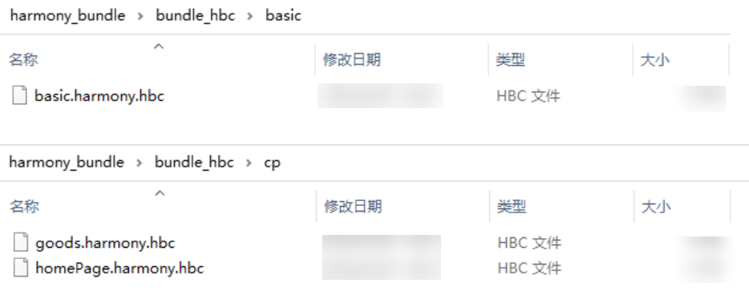
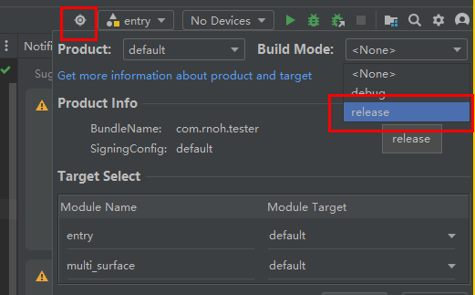
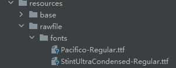
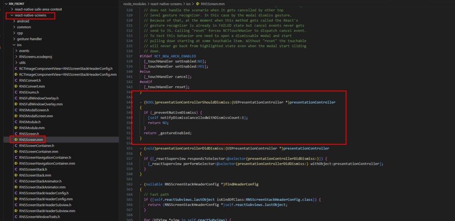

## 常见开发场景

### 如何不使用RNAbility集成RN框架
1. 导入需要用到的依赖模块
  ```javascript
    //从指定路径导入类型定义`RNOHLogger`,这是一个用于日志记录的接口或类型。
    import type {RNOHLogger} from `@rnoh/react-native-openharmony/src/main/ets/RNOH/RNOHLogger`;
    //导入`StandardRNOHLogger`类，他是实现'RNOHLogger'接口的日志记录器的具体实现。
    import {StandardRNOHLogger} from `@rnoh/react-native-openharmony/src/main/ets/RNOH/RNOHLogger`;
    //导入`Want类`，表示启动应用程序时传递的意图，包含了启动应用所需的信息。
    import  Want from '@ohos.app.ability.Want';
    //导入`RNInstanceCoordinator`类，它协调React Native实例的行为。
    import{RNInstanceCoordinator} from "@rnoh/react-native-openharmony/src/main/ets/RNOH/RNInstancesCoordinator"
    //导入`HttpClient`接口和它的默认实现'DefaultHttpClient',用于网络请求。
    import {HttpClient,DefaultHttpClient} from "@rnoh/react-native-openharmony/src/main/ets/HttpClient"
    //导入`EnvironmentCallback`接口，它允许监听环境变化如配置更新或内存级别变化。
    import {EnvironmentCallback} from '@kit.AbilityKit';
    //导入'BusinessError'类，它表示业务逻辑错误。
    import {BusinessError} from '@kit.BasicServicesKit';
    //导入'common'模块，它包含了一些通用的API和服务。
    import common from '@ohos.app.ability.common';
  ```

2. 创建上下文
启动UIAbility时，保存一个context对象，context对象包含应用运行需要的各种上下信息，在初始化rnInstancesCoordinator的时候context作为参数传入。
```javascript
this.rnInstanceCoordinator = RNImstancesCoordinator,create({
  ...
  uiAbilityContext:this.context//上下文
  ...
})
```

3. 配置监听器
在构造函数中，配置环境变化的监听器(EnvironmentCallback)，用来相应设备配置的变化(例如字体大小，内存状态的变化)。
```javascript
//监听器：监听字体的大小，内存状态的变化。
let envCallback = {
  //当配置更新时，并设置字体缩放比例到AppStorage。
  onConfigurationUpdate(config)
  {
    //字体大小
    let fontSizeScale = config.fontScale
    //将"fontSizeScale"存储到应用全家，后续可以通过AppStorage.get方法获取"fontSizeScale"实例对象。
    AppStorage.setOrCreate('fontSizeScale',fontSizeScale)
  },
  //内存状态
  onMemoryLevel(level){
    console.log('onMemoryLevel level:${level}');
  }
};
```
尝试获取应用程序上下文并注册环境变化监听器，如果发生错误则捕获并输出错误信息。
```javascript
try{
  ...
  let callbackld = applicationContextCallback.on('environment',envCallback);
  ...
}catch(paramError){
  console.error(`error:${(paramError as BusinessError).code},
  ${(paramError as BusinessError).message}`),
}
```

4. 日志记录器初始化创建一个日志实例，用来输出日志，帮助开发者调试和问题排除。
```javascript
protected createLogger():
RNOHLogger{
  return new StandardRNOHLogger();
}
```

5. 网络客户端初始化获取一个DefaultHttpClient一个实例，处理RN应用需要的网络请求。
```javascript
protected onCreateDefaultHttpClient():
undefined | HttpClient{
  return new DefaultHttpClient{
    return new DefaultHttpClient({logger:this.logger});
  }
}
```

6. 存储上下文
在创建RNInstance实例的时候，需要获取到`RNOHCoreContext`对象，该对象可通过rnInstanceCoordinator.getRNOHCoreContext()获取。具体业务逻辑请开发者自行实现。

7. 窗口阶段设置
调用[WindowStage.getMainWindow](https://developer.huawei.com/consumer/cn/doc/harmonyos-references-V5/js-apis-window-V5#getmainwindow9-1)获取WindowStage实例的主窗口。设置监听响应窗口大小的变化，确保RN应用可以适当地调动布局。
```javascript
//获取该WindowStage实例下的主窗口，此接口仅可在Stage模型下使用。
const mainWindow = awaitwindowStage.getMainWindow();
//定义一个回调函数，在窗口大小发生变化时调用`rnInstanceCoordinator`上的方法来响应变化。
const onWindowSizeChange = (windowSize : window.Size)
=>{
  this.rnInstancesCoordinator?.onWindowSizeChange(windowSize)
}
//在主窗口上监听窗口大小变化事件，并关联上述定义的回调函数。
mainWindow.on('windowSizeChange',onWindowSizeChange)
```

8. RNInstancesCoordinator实例初始化
使用RNInstanceCoordinator.create方法创建一个RNInstanceCoordinator实例，管理RNInstance的生命周期，处理字体缩放，默认返回按键等设置。
```javascript
    //创建一个rnInstancesCoordinator实例对象，负责管理React Native实例的生命周期，并处理诸如字体缩放，日志，上下文，默认返回键行为等设置。
    this.rnInstancesCoordinator = RNInstanceCoordinator,create({
    //字体缩放。
    fontSizeScale:this.context.config.fontSizeScale,
    //日志记录器。
    logger:this.createLogger(),
    //上下文。
    uiAbilityContext:this.context,
    //默认返回按键处理程序。
    defaultBackPressHandler:()
    =>{
    this.defaultBackPressHandler()
    },
    },{
    launchURI:want.uri,
    onGetPackagerClientCofig:
    (buildMode)=>buildMode === "DEBUG"?{
      host:"localhost",
      port:8081
    }:undefined,
    defaultHttpClient:this.onCreateDefaultHttpClient()
    })
```

### 如何使用onForeGround和onBackGround

`onForeground`、`onBackground` 主要用于解决页面离开或返回不回调 `AppState.addEventListener('change', this.handleAppStateChange)` 的问题。具体用法如下：

- 在使用 `router` 路由时的调用方式

  - 使用 `RNAbility` 类时，实现方式如下：

    1. 在 `@Entry` 装饰的页面中，引入 `RNAbility` 类：

       ```typescript
       import {RNAbility} from '@rnoh/react-native-openharmony';
       ...
       @Entry
       @Component
       export struct ComponentName{
       @StorageLink('RNAbility') rnAbility: RNAbility | undefined = undefined
       ...
       }
       ```

    2. 在生命周期 `onPageShow` 和 `onPageHide` 中调用 `rnAbility?.onForeground()` 和 `rnAbility?.onBackground()`：

       ```typescript
       onPageShow(){
         this.rnAbility?.onForeground();
       }
       onPageHide(){
         this.rnAbility?.onBackground();
       }
       ```

  - 不使用 `RNAbility` 时，实现方式如下：

    1. 在 `@Entry` 装饰的页面中，引入 `RNInstancesCoordinator` 类：

       ```typescript
       import {RNInstancesCoordinator} from '@rnoh/react-native-openharmony';
       ...
       @Entry
       @Component
       export struct ComponentName{
       @StorageLink('RNInstancesCoordinator') private rninstancesCoordinator: RNInstancesCoordinator | undefined = undefined
       ...
       }
       ```

    2. 在生命周期 `onPageShow` 和 `onPageHide` 中调用 `rninstancesCoordinator?.onForeground()` 和 `rninstancesCoordinator?.onBackground()`：

       ```javascript
       onPageShow(){
        this.rninstancesCoordinator?.onForeground()
       }
       onPageHide(){
         this.rninstancesCoordinator?.onBackground()
       }
       ```

- 在 `Navigation` 路由中的调用方式

  -  使用 `RNAbility` 类时，实现方式如下：

    1. 在具有 `NavDestination` 的自定义组件中，引入 `RNAbility` 类，该步骤同 `router` 路由。

    2. 在 `NavDestination` 的 `onShown` 回调事件中调用 `rnAbility?.onForeground()`，`在onHidden` 回调事件中调用 `rnAbility?.onBackground()`。

       ```javascript
       ...
       build(){
         NavDestination(){
         ...
         }
         .onShown(() => {
           this.rnAbility?.onForeground();
         })
         .onHidden(() =>{
           this.rnAbility?.onBackground();
         })
       }
       ```

  - 不使用 `RNAbility` 时，实现方式如下：

    1. 在具有 `NavDestination` 的自定义组件中，引入 `RNInstancesCoordinator` 类，该步骤同 `router` 路由。

    2. 在 `NavDestination` 的 `onShown` 回调事件中调用 `rninstancesCoordinator?.onForeground()`，`在onHidden` 回调事件中调用 `rninstancesCoordinator?.onBackground()`。

       ```javascript
       ...
       build(){
         NavDestination(){
         ...
         }
         .onShown(() => {
           this.rninstancesCoordinator?.onForeground()
         })
         .onHidden(() =>{
           this.rninstancesCoordinator?.onBackground()
         })
       }
       ```

### 如何处理手势返回事件

`onBackPress` 主要用于处理手势返回事件，其基本原理是在原生 `onBackPress` 生命周期中调用框架的 `onBackPress` 能力，并且 `return true` （返回 `true` 表示页面自己处理返回逻辑，不调用原生默认的返回事件能力；返回 `false` 表示使用原生默认的路由返回逻辑，默认值为 `false`），将手势返回事件逻辑交给框架来处理，框架会将该事件发送给 JS 侧，最终手势返回事件逻辑将在 JS 侧实现。

- 在使用 `router` 路由时的调用方式

  - 单 `RNInstance` 场景

    1. 在 `@Entry` 装饰的页面中，引入 `RNOHCoreContext` 类：

       ```typescript
       import {RNOHCoreContext} from '@rnoh/react-native-openharmony';
       ...
       @Entry
       @Component
       export struct ComponentName{
       @StorageLink('RNOHCoreContext') private rnohCoreContext: RNOHCoreContext | undefined = undefined
       ...
       }
       ```

    2. 在生命周期 `onBackPress` 中调用 `this.rnohCoreContext!.dispatchBackPress()` 并 `return true`。

       ```typescript
       onBackPress(): boolean | undefined{
          this.rnohCoreContext!.dispatchBackPress();
          return true;
       }
       ```

  - 多 `RNInstance` 场景

    若工程中存在多 `RNInstance` 的场景，便不能在 `onBackPressed` 回调事件中调用 `rnohCoreContext!.dispatchBackPress()`，应根据实际业务场景，获取位于前台的响应手势返回事件的 `RNInstance` 实例，调用该实例的 `onBackPress` 方法。

    ```typescript
    // router路由
    onBackPress(): boolean{
      // 获取响应手势返回事件的rnInstance
      ...
      rnInstance.onBackPress();
      return true;
    }
    ```

- 在 `Navigation` 路由中的调用方式

  - 单 `RNInstance` 场景

    1. 在具有 `NavDestination` 的自定义组件中，引入 `RNOHCoreContext` 类，该步骤同 `router` 路由。

    2. 在 `NavDestination` 的 `onBackPressed` 回调事件中调用 `rnohCoreContext!.dispatchBackPress()`。

       ```javascript
       ...
       build(){
         NavDestination(){
         ...
         }
         .onBackPressed(() => {
           this.rnohCoreContext!.dispatchBackPress();
           return true;
         })
       }
       ```

  - 多 `RNInstance` 场景

    方法同 `router` 路由，需要获取用于响应手势返回事件的 `RNInstance`。

    ```javascript
    // Navigation路由
    ...
    build(){
      NavDestination(){
      ...
      }
      .onBackPressed(() => {
        // 获取响应手势返回事件的rnInstance
        ...
        rnInstance.onBackPress();
        return true;
      })
    }
    ```

- **RN** 页面的默认返回方式
  - 在 `RNAbility` 中，有一个 `defaultBackPressHandler` 方法，如果在 **RN** 页面中没有做特殊处理，或调用了 `exitApp`，最终会调用到这个方法中。开发者可以通过重写这个方法，实现自定义的默认返回。
  - 如果不使用 `RNAbility`，而是进行自定义的拓展，需要在构建 `RNInstancesCoordinator` 对象的时候，把 `defaultBackPressHandler` 作为参数传入框架中。

### 如何使用 React Native 分包拆包

想要实现分包拆包，需要配置 `metro.config` 中 `serializer` 选项内的 `createModuleIdFactory` 与 `processModuleFilter`。

- `createModuleIdFactory`：Metro 支持了通过此方法配置自定义模块 ID，同样支持字符串类型 ID，用于生成 `require` 语句的模块 ID，其类型为 `() => (path: string) => number`（带有返回参数的返回函数的函数），其中 `path` 为各个 module 的完整路径。此方法的另一个用途就是多次打包时，对于同一个模块生成相同的 ID，下次更新发版时，不会因 ID 不同找不到 Module。

- `processModuleFilter`：根据给出的条件，对 Module 进行过滤，将不需要的模块过滤掉。其类型为 `(module: Array<Module>) => boolean`，其中 `module` 为输出的模块，里面带着相应的参数，根据返回的波尔值判断是否过滤当前模块。返回 `false` 为过滤，不打入 bundle。

详细的使用方法，可以参考[RN JS打包](RN-JS打包.md)

### 如何使用多bundle加载

多 bundle 加载主要包括以下几个步骤：

1. 先进行拆包打包流程，将单 bundle 拆分成基础包 bundle 和业务包 bundle；
2. 在工程运行初始化阶段，创建需要使用的 `RNInstance` 实例，调用 `runJSBundle` 接口加载基础包 bundle；
3. 之后在加载对应业务模块时，调用 `runJSBundle` 接口加载业务包 bundle。

详细的使用方法，可以参考[RN Native接入 > 单实例单surface多bundle](RN-Native接入.md#单实例单surface多bundle)

### 如何在C-API版本中使用基于ArkUI声明式范式的组件

要在 C-API 版本中使用基于 ArkUI 声明式范式的组件，主要包括了以下几个步骤：

1. 使用 ArkUI 的声明式范式实现[自定义的组件](自定义组件.md)；
2. 在业务代码中使用自定义的组件；
3. 完成自定义组件的工厂方法，并传给 `RNApp` 或 `RNSurface`；
4. 创建 `CustomRNComponentFrameNodeFactory`，并传给 `RNInstance`，具体可以参考[C-API组件混合方案的使用](C-API组件混合方案的使用.md)；
5. 使用 `RNApp` 或 `RNSurface` 启动 React Native for OpenHarmony。

### 如何启用LogBox日志

如果您使用的是 `RNApp` 启动的 **RN** 框架，默认是启用了 `LogBox` 的。如果您使用的是 `RNSurface` 启动的 **RN** 框架，您就需要创建一个 `RNComponentContext` 并创建 `LogBox` 的构造器，并在 `context` 的 `devToolsController` 中增加如下的事件监听，并进行对应的启动和关闭 `LogBox` 弹窗的操作：

```javascript
this.logBoxDialogController = new CustomDialogController({
  cornerRadius: 0,
  customStyle: true,
  alignment: DialogAlignment.TopStart,
  backgroundColor: Color.Transparent,
  builder: LogBoxDialog({
    ctx: RNComponentContext,
    rnInstance: this.rnInstance,
    initialProps: this.initialProps,
    buildCustomComponent: this.buildCustomComponent,
  })
})
···
this.rnInstance.getTurboModule<LogBoxTurboModule>(LogBoxTurboModule.NAME).eventEmitter.subscribe("SHOW", () => {
  this.logBoxDialogController.open();
})
this.rnInstance.getTurboModule<LogBoxTurboModule>(LogBoxTurboModule.NAME).eventEmitter.subscribe("HIDE", () => {
  this.logBoxDialogController.close();
})
```

### 如何启用Metro服务

1. 请确保 OpenHarmony 的打包参数已经配置，详细的配置方法请参考[如何配置OpenHarmony打包参数](#如何配置harmonyos打包参数)。
2. 如果您使用的是 `RNApp` 启动的 **RN** 框架，那么这一步可以跳过，`RNApp` 默认开启了 Metro。如果您使用的是 `RNSurface` 启动的 **RN** 框架，您就需要创建一个 `RNComponentContext`，并在 `context` 的 `devToolsController` 中增加如下的事件监听，并删除原有的 `RNInstance` 实例，重新启动一个新的 `RNInstance` 实例，即可启用热加载的功能：

    ```javascript
    this.ctx.devToolsController.eventEmitter.subscribe("RELOAD", async () => {
      this.cleanUp();
      ths.init();
    })
    ```

3. 配置 Metro 的 `jsBundleProvider`：

    ```javascript
    // index.ets 使用RNApp加载MetroJSBundleProvider
    build() {
      RNApp({
        ···
        jsBundleProvider: new TraceJSBundleProviderDecorator(
        new AnyJSBundleProvider([
            new MetroJSBundleProvider(),
            ···
        ]),
        this.rnohCoreContext.logger),
        ···
      })
    }
    ```

    ```javascript
    ···
    // 使用RNInstance加载MetroJSBundleProvider
    await RNInstance.runJSBundle(new MetroJSBundleProvider())
    .then(()->{
      isReady = true;
      ···
    })
    ···
    ```

4. 连接真机，并分别执行以下命令：

    ```PowerShell
    hdc rport tcp:8081 tcp:8081
    ```

    ```PowerShell
    npm run start
    ```

### 如何配置OpenHarmony打包参数

当运行 React Native 应用时，Metro Bundler 负责将 JavaScript 代码打包成一个或多个 bundle 文件，并在运行时提供给设备执行。为了定制 Metro Bundler 的行为，需要创建一个配置文件，这个配置文件告诉 Metro Bundler 如何处理当前需要打包的项目。

1. 首先，从 `@react-native/metro-config` 中导入了两个函数：

    ```javascript
    const {mergeConfig, getDefaultConfig} = require('@react-native/metro-config');
    ```

    - `mergeConfig`：用于合并多个配置对象。
    - `getDefaultConfig`：用于获取默认的Metro配置。

2. 从 `react-native-harmony/metro.config` 中导入了 `createHarmonyMetroConfig` 函数，用于创建适用于 OpenHarmony 平台的特定配置：

    ```javascript
    const {createHarmonyMetroConfig} = require('@react-native-oh/react-native-harmony/metro.config');
    ```

3. 通过注释 `@type {import("metro-config").ConfigT}` 声明了该文件的类型为 `metro-config` 模块的 `ConfigT` 类型。这有助于编辑器和代码分析工具理解该文件的结构和类型。

    ```javascript
    /**

      * @type {import("metro-config").ConfigT}

    ​*/
    ```

4. 定义了一个名为 `config` 的对象，其中的 `transformer` 部分指定了转换选项：

    ```javascript
    const config = {
      transformer: {
        getTransformOptions: async () => ({
          transform: {
            experimentalImportSupport: false,
            inlineRequires: true,
          },
        }),
      },
    };
    ```

    `getTransformOptions`：异步获取转换选项。这里配置了两个选项：

    - `experimentalImportSupport`：设置为 `false`，表示不使用实验性的导入支持。
    - `inlineRequires`：设置为 `true`，表示将 `require` 语句内联到bundle中。

5. 通过调用 `mergeConfig` 函数，将默认配置、 配置和自定义配置对象合并成一个最终的配置对象，并将其导出供 Metro Bundler 使用。

    metro-config 默认配置如下：

      ```javascript
      /*导入函数*/
      const {mergeConfig, getDefaultConfig} = require('@react-native/metro-config');
      const {createHarmonyMetroConfig} = require('@react-native-oh/react-native-harmony/metro.config');

      /**
       * @type {import("metro-config").ConfigT}
      */
      /*定义配置对象*/
      const config = {
        transformer: {
          getTransformOptions: async () => ({
            transform: {
              experimentalImportSupport: false,
              inlineRequires: true,
            },
          }),
        },
      };
      /*调用mergeConfig函数，将默认配置、OpenHarmony配置和自定义配置对象合并成一个最终的配置对象，并将其导出供Metro Bundler使用*/
      module.exports = mergeConfig(
        getDefaultConfig(__dirname),
        createHarmonyMetroConfig({
          reactNativeHarmonyPackageName: '@react-native-oh/react-native-harmony',
        }),
        config,
      );
      ```

### 如何加载沙箱路径bundle和图片

1. 沙箱路径加载 `bundle`

    [应用沙箱](https://gitee.com/openharmony/docs/blob/master/zh-cn/application-dev/file-management/app-sandbox-directory.md)是一种以安全防护为目的的隔离机制，避免数据受到恶意路径穿越访问。在这种沙箱的保护机制下，应用可见的目录范围即为“应用沙箱目录”。

    开发者在应用开发调试时，需要向应用沙箱下推送一些文件以期望在应用内访问或测试，此时有两种方式：

    第一种：可以通过DevEco Studio向应用安装路径中放入目标文件，详见[应用安装资源访问。](https://developer.huawei.com/consumer/cn/doc/harmonyos-guides-V5/resource-categories-and-access-V5)
    第二种：在具备设备环境时，可以使用另一种更为灵活的方式，通过hdc工具来向设备中应用沙箱路径推送文件。推送命令如下，其中，沙箱路径可通过向应用[沙箱推送文件查询](https://developer.huawei.com/consumer/cn/doc/harmonyos-guides-V5/app-sandbox-directory-V5#应用沙箱路径和真实物理路径的对应关系)：

    ```PowerShell
    hdc file send ${待推送文件的本地路径} ${沙箱路径}
    ```

    加载沙箱目录 `bundle`，需要在 `RNApp的jsBundlePrivider` 参数中使用 `new FileJSBundleProvider('bundlePath')` 将 `bundle` 注册进框架，并运行 `bundle`。

    在 `MyApplication/entry` 目录下 `Index.ets` 文件中，创建 `RNApp` 时传入 `jsBundleProvider` 用于加载 bundle。如图所示这里传入了四个 `BundleProvider`，分别表示 `Metro` 方式加载 `bundle`，沙箱目录加载 `bundle` 和本地方式加载 `bundle`，如果 `Metro` 方式加载 `bundle` 失败，按照 `JSBundleProvider` 的顺序依次加载 `bundle`，直到加载成功，或者所有的方式都加载失败。

    ```javascript
    // index.ets 使用RNApp加载FileJSBundleProvider
    build() {
      RNApp({
        ···
        jsBundleProvider: new TraceJSBundleProviderDecorator(
        new AnyJSBundleProvider([
            new FileJSBundleProvider('/data/storage/el2/base/files/bundle.harmony.js'),
            ···
        ]),
        this.rnohCoreContext.logger),
        ···
      })
    }
    ```

    ```javascript
    ···
    // 使用RNInstance加载FileJSBundleProvider
    await RNInstance.runJSBundle(new FileJSBundleProvider('/data/storage/el2/base/files/bundle.harmony.js'))
    .then(()->{
      isReady = true;
      ···
    })
    ···
    ```

2. 沙箱路径加载图片

    沙箱加载图片涉及沙盒机制如何处理和加载图片，每个应用都运行在其自己的沙盒环境中。在沙盒内部，应用可以访问其自己的文件和目录。

    1. **获取图片路径**：在沙箱路径下加载图片，你通常需要先获取到图片在沙盒中的路径（这个路径通常以`file:///`开头）。

        ```javascript
        const FILE_URI = 'file:///data/storage/el2/base/files/xxx.jpg';
        ```

    2. **加载图片**：根据绝对路径，使用 `Image` 组件的 `source` 属性，通过 `uri` 来指定这个路径。也可以使用相应的 API 或库来加载和显示图片。

        ```javascript
        <Image
          style={{borderRadius: 8, borderWidth: 1, height: 150}}
          source={{uri: FILE_URI}}
        />
        ```
    3. **注意事项**：
      当前本地加载图片和沙箱加载图片的路径采用不同的编码方式，本地加载的图片资源会从 `rawfile/assets` 目录下开始找对应的资源，需要将图片资源放在 assets 目录下；沙箱加载的图片则是会从 bundle 同级目录直接寻找图片，不需要额外增加一层 assets 目录。
      
        关于沙箱文件读取的简单示例，具体可以参考[沙箱Sample](../Samples/Sandbox)。
 
### 如何生成hbc格式的bundle包

要将 bundle 包转换成 hbc 格式，可以按照以下步骤操作：

1. 首先，确保你已经安装了 `Hermes` 工具链，在示例项目的 `node_modules\react-native\sdks\hermesc` 目录下会默认自带 `hermesc` 工具。如果没有也可以通过以下命令在终端中安装：

   ```PowerShell
   npm install -g hermes-engine
   ```

2. 将 bundle 包转换成 hbc 格式，需要在终端中输入以下命令：

   ```PowerShell
   hermesc --emit-binary input_bundle.jsbundle -out output_bytecode.hbc 
   ```

3. 其中，`input_bundle.jsbundle` 是你要转换的bundle包文件名，`output_bytecode.hbc` 是转换后的 hbc 文件名。

4. 接下来介绍一个编译 `Hermes` 的 demo 脚本文件：

   ```vim
   //开始使用Hermes工具转译bundle包为hbc格式
   echo "*************************** start hermesc *********************************"
   
   //提示用户输入JavaScript bundle的路径，并将输入的路径保存在变量 dir 中。
   read -p "输入js bundle 路径:  " dir
   
   //定义了一个只读变量 bundle_hbc，用于存储转译后的Hermes字节码文件的目录路径。它是在输入的路径 dir 的父目录下创建一个名为 bundle_hbc 的文件夹。
   readonly bundle_hbc=$dir/../bundle_hbc
   
   //递归地删除之前存储Hermes字节码的目录，以确保每次运行脚本时都是从头开始生成新的字节码文件。
   rm -rf $bundle_hbc
   //创建存储Hermes字节码文件的目录。
   mkdir -p $bundle_hbc
   //创建文件存储不同类型的bundle。
   mkdir -p $bundle_hbc/basic
   mkdir -p $bundle_hbc/cp
   
   //使用 hermesc 命令将指定的JavaScript bundle文件转译为Hermes字节码文件（.hbc格式）。
   hermesc --emit-binary $dir/basic/basic.harmony.bundle -out $bundle_hbc/basic/basic.harmony.hbc
   hermesc --emit-binary $dir/cp/goods.harmony.bundle -out $bundle_hbc/cp/goods.harmony.hbc
   hermesc --emit-binary $dir/cp/homepage.harmony.bundle -out $bundle_hbc/cp/homepage.harmony.hbc
   
   echo "*************************** end hermesc *********************************"
   echo "bundle导出路径：$bundle_hbc"
   ```

5. 完成以上步骤后，即可成功地将 bundle 包转换成了 hbc 格式。

    

> [注意] hbc 只使用于Hermes JS 引擎，JSVM 引擎无法加载hbc。

### 由Hermes 引擎切换成 JSVM 引擎

目前RNOH默认使用的是Hermes引擎，无需用户额外配置。如果想切换成JSVM 引擎，可遵循以下步骤操作：

到应用模块的CMakeLists.txt文件中添加 `set(USE_HERMES 0)`:

```diff
  set(LOG_VERBOSITY_LEVEL 1)
+ set(USE_HERMES 0)
```

有时可能会因缓存原因导致以上方式不生效，此时可将 `set(USE_HERMES 0)` 改成 `set(USE_HERMES OFF CACHE BOOL "enables JSVM" FORCE)`。

如果您使用的是RNOH 0.72.57及之前的版本，还需在应用模块的CMakeLists.txt文件中为rnoh添加USE_HERMES的编译定义，具体如下：

```diff
  if("$ENV{RNOH_C_API_ARCH}" STREQUAL "1")
      message("Experimental C-API architecture enabled")
      target_link_libraries(rnoh PUBLIC libqos.so)
      target_compile_definitions(rnoh PUBLIC C_API_ARCH)
  endif()

+ if(USE_HERMES)
+     target_compile_definitions(rnoh PUBLIC USE_HERMES=1)
+ else()
+     target_compile_definitions(rnoh PUBLIC USE_HERMES=0)
+ endif()
```

### 移除libhermes_executor.so或libjsvm_executor.so等非必要的so文件

RNOH 0.72.57及之前的版本或者RNOH源码包不涉及这个场景，可忽略。  
当使用JSVM引擎时，libhermes_executor.so和libhermes.so可移除；当使用Hermes引擎时，libjsvm_executor.so可移除。移除的方式是通过模块中build-profile.json5的nativeLib.filter.excludes字段进行移除。以使用JSVM引擎为例：
```diff
  {
    "apiType": "stageMode",
    "buildOption": {
      // ...
+     "nativeLib": {
+       "filter": {
+         "excludes": [
+           "**/libhermes_executor.so",
+           "**/libhermes.so"
+         ]
+       }
+     }
```

### 如何减少hap包的体积

较大的 HAP 包可能导致应用程序在下载、安装和运行时占用更多资源，影响用户体验。因此，在构建或编译 OpenHarmony 应用程序时，可以通过调整或更改编译设置，以减少最终生成的 HAP 包的文件大小。

1. 通过在 `CMakeLists.txt` 文件中设置安全编译参数可以减少 hap 包的体积

    其中，安全编译参数如下：

      ```CMAKE
      set(CMAKE_CXX_FLAGS "-s")
      ```

    -s：这个选项告诉编译器在链接过程中剔除符号表和调试信息，以减小可执行文件的大小。

2. 在 `build-profile.json5` 文件中也可以设置

    ```json5
    /*
    path: CMakeLists.txt 文件的路径，通常用于指定CMake项目的构建文件位置。
    arguments: 这里是空的，表示没有额外的构建参数。
    cppFlags: 这里设置了C++的编译选项 -s，可用于剔除符号表和调试信息，以减小生成的可执行文件的大小。
    */
    "buildOption": {
      "externalNativeOptions": {
        "path": "./src/main/cpp/CMakeLists.txt",
        "arguments": "",
        "cppFlags": "-s",
      },
    },
    ```

3. 通过修改编译选项的方式来减少 hap 包的体积

    ​在 `Build Mode` 选项卡里选择 `release` 选项：

    

4. 可以通过压缩 so 的方式减少 hap 包的体积
   参考[应用包大小优化](https://developer.huawei.com/consumer/cn/doc/best-practices-V5/bpta-decrease_pakage_size-V5#section1286810176182)，修改应用模块配置文件`module.json5`中的`compressNativeLibs`字段，将值配置为true，重新编译、打包应用。
   ```json5
   {
     "module": { 
       // ...
      "compressNativeLibs": true // 标识libs库以压缩存储方式打包
     }
   }
   ```

### 如何适配折叠屏

相关内容可以参考[多屏适配指导](多屏适配指导.md)。

### 如何开启so安全编译

常见的有 `strip`、`NO Rpath/Runpath`、`SP` 三类:

- `strip coverage`（删除符号表）：符号在链接过程中，发挥着至关重要的作用，链接过程的本质就是把多个不同的目标文件“粘”到一起，符号可看作链接的粘合剂，整个链接过程正是基于符号才正确完成的。链接完成后，符号表对可执行文件运行已经无任何作用，反而会成为攻击者构造攻击的工具，因此删除符号表可防御黑客攻击。事实上删除符号表除防攻击外，还可对文件减肥，降低文件大小。  
在 `entry` 模块下的 `build-profile.json5` 中的 `externalNativeOptions` 下添加：

  ```json5
  "cppFlags": "-s"
  ```

- `NO Rpath/Runpath coverage`（动态库搜索路径）：可以在编译时指定程序运行时动态链接库的搜寻路径，防止将一些动态库恶意替换，以达到攻击目的。
在 `entry` 模块下的 `CMakeLists.txt` 中添加：

  ```CMAKE
  set(CMAKE_SKIP_BUILD_RPATH TRUE)
  ```

- `SP coverage`（栈保护）：当存在缓冲区溢出攻击漏洞时，攻击者可以覆盖栈上的返回地址来劫持程序控制流。启用栈保护后，在缓冲区和控制信息间插入一个 `canary word`。攻击者在覆盖返回地址的时候，往往也会覆盖 `canary word`。通过检查 `canary word` 的值是否被修改，就可以判断是否发生了溢出攻击。  
在 `entry` 模块下的 `CMakeLists.txt` 中添加：

  ```CMAKE
  set(CMAKE_CXX_FLAGS "-fstack-protector-strong -Wl,-z,relro,-z,now,-z,noexecstack -s -fPIE -pie")
  ```

  - -fstack-protector-strong：这个选项启用了堆栈保护机制，可以帮助防止缓冲区溢出攻击。
  - -Wl,-z,relro,-z,now,-z,noexecstack：这一长串参数传递给链接器Id，用于设置一些安全选项。其中：
    - -z,relro：使得只读段的重定位表变为只读；
    - -z,now：立即执行程序的所有动态链接，以减少潜在的漏洞；
    - -z,noexecstack：阻止栈上的代码执行，以减少栈上执行代码的攻击表面。
    - -s：这个选项告诉编译器在链接过程中剔除符号表和调试信息，以减小可执行文件的大小。
    - -fPIE -pie：这两个选项用于生成可执行文件的位置独立代码（PIE）。PIE可以提高程序的安全性，使得它在内存中的加载地址是随机的，从而增加攻击者的难度。  

  注意：sp 扫描会出现误报的情况，如：对应的 cpp 代码没有局部数组及局部变量为赋值语句右值/函数参数的情况，没有插入保护代码。


### 设置lineHeight属性后如何设置文本居中

当前底层字体引擎默认排版不按照行高居中，需要在工程入口目录的 `module.json5` 文件配置如下参数开启居中：
```json5
"metadata": [
  {
    "name": "half_leading",
    "value": "true"
  }
]
```

### 如何设置TextInput显示拼音

当前需要在工程入口目录的 `module.json5` 文件配置如下参数显示拼音：
```json5
"metadata": [
  {
    "name": "can_preview_text",
    "value": "true"
  }
]
```

### 如何控制页面是否避让键盘的行为

- 方式一：通过 **RN** 的组件布局能力避让键盘：使用 `KeyboardAvoidingView` 组件作为容器，会根据键盘弹起高度自动调整布局。

- 方式二：通过ArkUI原生的默认行为避让键盘：当前 `RNApp` 默认配置了 `expandSafeArea([SafeAreaType.KEYBOARD])` 属性，因此只能通过 **RN** 页面内部布局调整避让键盘；在 `RNSurface` 上则没有相关配置，ArkUI 组件会自行避让键盘。

- 可以通过集成 `RNSurface`/`RNApp`，设置 `expandSafeArea([SafeAreaType.KEYBOARD])` 属性；使用不同的 **RN** 布局组件等方式之间的不同组合，用户可以自定义组合出自己希望的避让键盘效果。

### 如何获取RNSurface对应RNInstance与rootTag

可通过RNSurface中的`updateViewRootTag`回调函数获取。
在如下的例子中，我们构建了一个RN页面，其中有两个RNSurface，两个RNSurface使用相同的RNInstance，但是有不同的RootTag。两个RNSurface中间有一个Button。我们在这里简称第一个RNSurface为S1，第二个RNSurface为S2。通过使用updateViewRootTag接口，我们想要达成：在点击Button的时候，会向所有的RNInstance发送一条消息，我们希望只有发送的消息中指定的RNSurface的rootTag相符的时候，该消息才会被对应的RNSurface处理。


我们通过如下代码构建这个 **RN** 页面：
```javascript
build() {
  NavDestination() {
    if (this.isBundleReady) {
    Column() {
      Row() {
        RNSurface({
          surfaceConfig: {
            appKey: 'Hotel_Page',
          },
          ctx: new RNComponentContext(
            RNOHContext.fromCoreContext(this.rnohCoreContext!, this.instance),
            wrappedCustomRNComponentBuilder,
            wrapBuilder(buildRNComponentForTag),
            new Map()
          ),
          updateViewRootTag: (rnInstance: RNInstance, rootViewTag: Tag) => {
            // 将当前RNSurface的RNInstance和rootTag保存起来。
            this.receivedRootTag = rootViewTag;
            this.receivedInstance = rnInstance;
          }
        })
      }
      .height("45%")
      Row() {
        Button("CLICK ME")
          .onClick(() => {
            // 向RN发送消息。
            this.instance?.emitDeviceEvent("clickEvent", { params: ({
              rootTag: this.receivedRootTag
            } as Params) })
          })
      }
      .height("10%")
      Row() {
        RNSurface({
          surfaceConfig: {
            appKey: 'Ticket_Page',
          },
          ctx: new RNComponentContext(
            RNOHContext.fromCoreContext(this.rnohCoreContext!, this.instance),
            wrappedCustomRNComponentBuilder,
            wrapBuilder(buildRNComponentForTag),
            new Map()
          ),
        })
      }
      .height("45%")
    }
    .width('100%')
    .height('100%')
    }
  }
}
```
可以看到，我们在 S1 构建的时候通过 `updateViewRootTag` 拿到该 `RNSurface`对应的 `RNInstance` 和 rootTag，之后通过 Button 绑定 `Click` 事件，并在其中传入对应的 rootTag。
同时，我们在前端代码中对拿到的原生的 `Click` 事件中的 rootTag进行对比，当这个 rootTag 和当前的 rootTag 相同的时候，我们才对这个消息进行处理。
```tsx
const rootTag = useContext(RootTagContext);
const [msg, setMsg] = useState('');
DeviceEventEmitter.addListener('clickEvent', e => {
  setMsg(`The message was ${e.params.rootTag === rootTag ? '' : 'not'} sent to me.`);
  const timer = setTimeout(() => {
    setMsg('');
    clearTimeout(timer);
  }, 1000)
})
```
最终的结果如图所示，在我们点击了 Button 之后，S1 和 S2 都收到了该消息，但是经过 rootTag 的对比之后，只有在 S1 的 rootTag 符合我们需要的，因此正确回复了消息。


> 以上代码片段截取自[RootTagSample 工程](../Samples/RootTagSample/README.md)

### 自定义打包指令的注意事项

- 当前外发的版本中提供了 `bundle-harmony` 指令可以直接使用鸿蒙版的 **RN** 打包脚本，只需配置正确的参数即可。

- 如希望摒除平台指令差异不使用 `bundle-harmony` 而是自定义打包指令，可以参考 `react-native-harmony-cli/dist/commands/bundle-harmony.js` 文件中的打包流程，通过 `createHarmonyMetroConfig` 导入鸿蒙打包配置，通过此配置编译 bundle 文件。之后需补充 `copyAssets` 相关操作，保证图片资源文件路径格式与 bundle 中编码的图片资源一致。

### 采用RNApp方式如何实现bundle只加载1次
- 现象

    鸿蒙原生+ **RN** 混编，采用 `RNApp` 创建一个 **RN** 的页面，**RN** 容器都是同一个，但是每次经过这个 **RN** 容器跳转到不同的 **RN** 页面，都会重新加载一次 bundle，这个有什么办法能只加载一次，每次加载都要耗费很长时间？

- 原因

    **RNAPP** 会自动销毁 `RNInstance`。

- 解决

- 方案 1：不要使用 **RNAPP**，**RNAPP** 会自动销毁 `RNInstance`，可以使用 `RNSurface` 结合`createAndRegisterRNInstance`去管理 `RNInstance`，只要 `RNInstance` 存在就不会重新加载 bundle。
- 方案 2：可以把 rawfile 中的 bundle 推入沙箱中，每次页面加载可以判断沙箱中的 bundle 是否存在，可以参考 `SampleAPP` 的 `sanbdox` 文件。

> 注意：使用 `RNSurface` 时，`init()` 方法要在 `rnInstancesCoordinator?.onWindowSizeChange` 创建之后初始化，否则 `windowsize` 变化了，`RNOHCoreContext` 有问题，可能会导致文字显示问题。

### 如何使用代码刷新 RN 页面

当使用 Metro 服务加载 **RN** 的 bundle 时，可根据菜单中的指令强制重新加载整个 bundle。有时候再开发中需要在某个业务完成之后，希望重新加载当前的 **RN** bundle 页面，就可以参考 Reload 的功能重新加载 bundle。

Metro 的Reload 功能默认针对 `RNApp` 提供了实现，如果开发中使用的是 `RNSurface` 加载 **RN** 页面，Reload 是不起作用的。可以参考 `RNApp` 里的 Reload 实现逻辑，来实现自定义的 Reload 功能。

下面以 `RNApp` 的源码为例，讲解 Reload 的实现逻辑。
1. 绑定`shouldShow`参数

    ArkUI 作为声明式 `UI` 框架，通过状态绑定来决定 `UI` 组件的创建、销毁与更新。**RN** 页面的入口组件是 `RNSurface`，想要刷新页面，可以使用一个 `@State` 装饰的 `shouldShow` 变量，通过 if 判断来决定 `RNSurface` 的展示和销毁。

    ```typescript
    build() {
      Stack() {
        if (this.shouldShow) {
          RNSurface({
            ctx: this.ctx,
            surfaceConfig: {
              initialProps: this.initialProps ?? {},
              appKey: this.appKey,
            } as SurfaceConfig2,
          })
        }
      }  
    }
    ```
    当要刷新 **RN** 页面的时候，只要先将 `shouldShow` 设为 `false`，重新加载完 bundle 后，再将 `shouldShow` 重置为 `true` 即可。

    ```typescript
    private async cleanUp() {
        const stopTracing = this.logger.clone("cleanUp").startTracing()
        this.shouldShow = false
        ...
    }
    ```

2. 清理 RNInstance

    **RNOH** 提供了清理 `RNInstance` 的方法，`this.rnohCoreContext!.destroyAndUnregisterRNInstance(this.rnInstance)` 会调用 `RNInstance` 的 `onDestroy` 方法以及将 `RNInstance` 从 `RNInstanceRegistry` 存储中清除。

    ```typescript
    private async cleanUp() {
      const stopTracing = this.logger.clone("cleanUp").startTracing()
      this.shouldShow = false
      if (this.shouldDestroyRNInstance) {
        this.rnohCoreContext!.destroyAndUnregisterRNInstance(this.rnInstance)
      }
      ...
    }
    ```    

3. 重新创建 RNInstance，加载 bundle

    `RNApp` 的 **RELOAD** 通过订阅 devToolsController 的 **RELOAD** 事件来执行刷新操作，在清理完 `RNInstance` 之后，立刻调用了 `init` 方法重新创建了 `RNInstance`，并执行 `runJSBundle`。

    ```javascript
    this.cleanUpCallbacks.push(this.ctx.devToolsController.eventEmitter.subscribe("RELOAD", async () => {
      await this.cleanUp()
      this.init()
    }))
    ``` 

4.  刷新页面

    刷新页面就是在 bundle 加载完成后，重新创建 `RNSurface`。在前面的步骤中，`shouldShow` 已设为 `false`，此时重新设置为 `shouldShow` 为 `true`，ArkUI会重新创建一个 `RNSurface`组件。
    
### 当前鸿蒙RN是否支持迁移老架构的native module到turbo module？

- **Q**：当前鸿蒙 **RN** 是否支持迁移老架构的 native module 到 turbo module？

- **A**：鸿蒙 **RN** 是基于 **RN** 新架构上进行的适配，原本基于 **RN** 老架构开发的 native module（适配 Android 和 iOS ）的模块无法迁移到鸿蒙 **RN** 新架构的 turbo module 上，需要开发者修改适配。

### 如何使用自定义字体

- 现象
    
    ArkUI中使用自定义字体通过[字体注册](https://developer.huawei.com/consumer/cn/doc/harmonyos-references/js-apis-font-0000001821000745)的方式，但是在页面中注册完字体后，会发现在 **RN** 代码中使用fontFamily设置字体并不能生效。

- 原因

    **RN** 的组件是通过 XComponent 加载在原生容器中的，需要在 **CAPI** 代码中进行字体注册。**RNOH** 提供了专门的注册字体入口，需要开发者针对 **RN** 传递自定义字体数据。

- 解决

    （1）在资源文件或沙箱中添加字体文件
    
     **RN** 字体文件的存放位置和图片一样，都是在 `resources/rawfile/` 目录下，为了便于区分，建议在 rawfile 下新建一个 fonts 文件夹，目录如下图所示：

    

    如果使用沙箱存放，略过此步骤。
    
    （2）创建字体配置

      上一步中，项目里添加了一个 SFMono-Bold.ttf 的字体文件，接下来创建一个 `Record` 对象：
    ```typescript
    const fontsFamily: Record<string, Resource | string> = {
      'SFMono': $rawfile('fonts/SFMono-Bold.ttf'),
    }
    ```

    键为字体名，需要与JS侧的fontFamily匹配。
    值为资源对象或者沙箱路径字符串。

    （3）注册字体

     **RNOH** 在  `RNInstance` 的构建参数中提供了 `fontResourceByFontFamily` 用于开发者配置自定义字体信息：

    ```typescript
    this.rnInstance = await rnohCoreContext.createAndRegisterRNInstance({
      createRNPackages: createRNPackages,
      enableNDKTextMeasuring: true,
      enableBackgroundExecutor: true,
      enableCAPIArchitecture: ENABLE_CAPI_ARCHITECTURE,
      enableDebugger: true,
      arkTsComponentNames: arkTsComponentNames,
      fontResourceByFontFamily: fontsFamily
    });
    ```
    如果使用的是 `RNApp`，请在 `RNInstanceConfig` 中配置该参数：

    ```typescript
    RNApp({
      rnInstanceConfig: {
        createRNPackages,
        enableNDKTextMeasuring: true,
        enableBackgroundExecutor: true,
        enableCAPIArchitecture: true,
        arkTsComponentNames: arkTsComponentNames,
        fontResourceByFontFamily: fontsFamily
      },
    })
    ...
    ```

    另外，也可以调用RNInstance.registerFont方法在运行期间注册字体。详见[registerFont](API接口说明.md#registerFont)。

    （4）在RN侧指定fontFamily
    
    **RN** 侧的代码和 iOS、Android 一致，使用 fontFamily 指定 Text 的自定义字体：
     
    ```typescript
    <Text style={{ fontFamily: "SFMono" }}>
      Hello World
    </Text>
    ``` 

### Navigation页面禁用侧滑返回手势gestureEnabled:false不生效

- 现象

    **RN** 使用 `react-navigation` 库设置某个子页面的 `gestureEnabled: false` 后，依然可以在该页面中使用侧滑手势返回。
    
    ```typescript
    <NavigationContainer ref={navigationRef}>
      <Stack.Navigator 
      initialRouteName="Page1">
        <Stack.Screen name="Page1" component={Page1} />
        <Stack.Screen name="Page2" component={Page2} 
        options={{ 
          gestureEnabled: false,
        }}/>
      </Stack.Navigator>
    </NavigationContainer>
    ```

- 原因

    `@react-navigation/stack` 库依赖了 `react-native-screens` 库，设置禁用侧滑手势实际上是通过 `react-native-screens` 调用原生方法禁用返回手势，例如 iOS 中，原生禁用手势代码如下：

    

    `react-native-screens` 库尚未进行鸿蒙化，所以设置 `gestureEnabled:false` 无效。

- 解决

    在未来 `react-native-screens` 实现鸿蒙化之前，可以使用 BackHanlder 监听侧滑返回事件，以达到相同的效果。

    例如有一个 Navigation 路由栈中，有 Home 和 Details 两个页面，点击 Home 跳转到 Details 后，禁止从 Details 侧滑返回 Home。那么就可以在 Details 中添加监听，在监听的回调中返回 `true`，表示禁用默认的返回行为。

    ```javascript
    // DetailsScreen.js
    import React, { useEffect } from 'react';
    import { Button, View, BackHandler } from 'react-native';
    
    function DetailsScreen({ route, navigation }) {
    
      useEffect(() => {
        const backHandlerListener = BackHandler.addEventListener('hardwareBackPress', () => {
          console.log('detail back')
          return true
        })
    
        return () => {
          backHandlerListener.remove();
        }
      })
    
      return (
        <View style={{ flex: 1, alignItems: 'center', justifyContent: 'center' }}>
          {/* <StatusBar backgroundColor={'blue'} hidden={false}/> */}
          <Button
            title="Go back"
            onPress={() => navigation.goBack()} />
        </View>
      );
    }
    
    export default DetailsScreen;
    ```
    
### 如何在三方库或自定义module中引入rnoh的依赖

- **Q**：有些第三方库或自定义 module 也依赖 rnoh，此时如何配置？

- **A**：在工程级 `oh-package.json5` 文件下添加以下依赖：

  ```json5
  {
    ...
    "overrides":{
      "@rnoh/react-native-openharmony":"^X.X.X"
    }
  }
  ```
  同时，需要在自定义module下的 `oh-package.json5` 文件下添加以下依赖：

  ```json5
  {
    ...
    "dependencies": {
      "@rnoh/react-native-openharmony": "^X.X.X"
    }
  }
  ```

### 如何解决同名依赖解析错误问题？

- **Q**：出于开发调试需要，本地项目工程目录存在跟依赖包中的同名目录，导致打bundle时依赖路径解析错误，如何解决？

- **A**：Metro 会优先解析项目根目录中的文件，如果你有相同名字的文件夹或者模块，会导致冲突。通过修改 `metro.config.js` 或 `babel.config.js` 配置，可以控制打包时的模块解析顺序，确保使用正确的依赖项。
- 方法 1：使用 `metro.config.js` 配置别名  
  您可以在项目中创建或修改 `metro.config.js` 文件，使用 `resolver` 的 `extraNodeModules` 配置来强制指定要使用的模块路径。这样可以确保 Metro 使用 `node_modules` 中的依赖项，而不是项目中的同名目录。

  ```javascript
  const path = require('path');

  module.exports = {
    resolver: {
      extraNodeModules: {
        'your-module-name': path.resolve(__dirname, 'node_modules/your-module-name'),
      },
    },
    watchFolders: [
      path.resolve(__dirname, 'node_modules'),
    ],
  };
  ```
- 方法 2：通过模块路径控制  
如果您的调试代码是暂时的，可以考虑临时重命名项目中的调试文件夹以避免冲突，或者将调试代码放在不与 `node_modules` 中依赖项冲突的路径中，打包时会避免不必要的冲突。
- 方法 3：通过 `.babelrc` 或 `babel.config.js` 配置别名  
您可以通过 Babel 配置别名，使得在开发和打包时可以明确区分不同路径的模块：

  ```javascript
  module.exports = {
    presets: ['module:metro-react-native-babel-preset'],
    plugins: [
      [
        'module-resolver',
        {
          alias: {
            'your-module-name': './node_modules/your-module-name',
          },
        },
      ],
    ],
  };
  ```

### 如何在**WORKER** 线程并行执行自定义任务？

以递归计算斐波那契数列为例：

首先，按[架构介绍.md#worker线程](./架构介绍.md#worker线程)启用**WORKER** 线程特性。新建一个自定义TurboModule或组件。

定义参数类型TParams如下。需添加`@Sendable`装饰器,声明输入变量,以及实现构造函数。

```typescript
@Sendable
class FibonacciRunnableParams {
  public n: number

  constructor(n: number) {
    this.n = n;
  }
}
```

定义可执行任务对象类型类型TRunnable如下。需添加`@Sendable`装饰器,实现接口`WorkerTaskRunnable<TParams>`,以及在`run`函数中实现业务逻辑。

```typescript
@Sendable
class FibonacciRunnable implements WorkerTaskRunnable<FibonacciRunnableParams> {
  run(rnInstance: AnyThreadRNInstance, params: FibonacciRunnableParams): number {
    const fibo = (n: number): number => {
      if (n <= 0) {
        return 0;
      }
      if (n <= 1) {
        return 1;
      }
      return fibo(n - 1) + fibo(n - 2);
    }

    return fibo(params.n);
  }
}
```

最后，通过组件或TurboModule的上下文接口`runOnWorkerThread`将可执行实例和参数实例发送至Worker线程执行。

```typescript
  // demonstrates calling `runOnWorkerThread` as well as
  // sharing state between the MAIN and Worker runtimes through `params`
  async calculateOnWorker(n: number): Promise<number> {
    const params = new FibonacciRunnableParams(n);
    return this.ctx.runOnWorkerThread(new FibonacciRunnable(), params);
  }
```