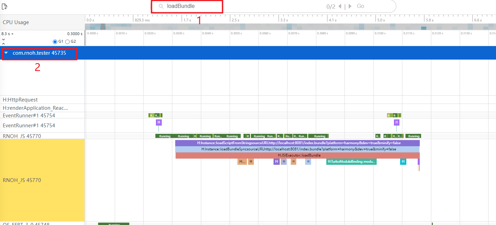
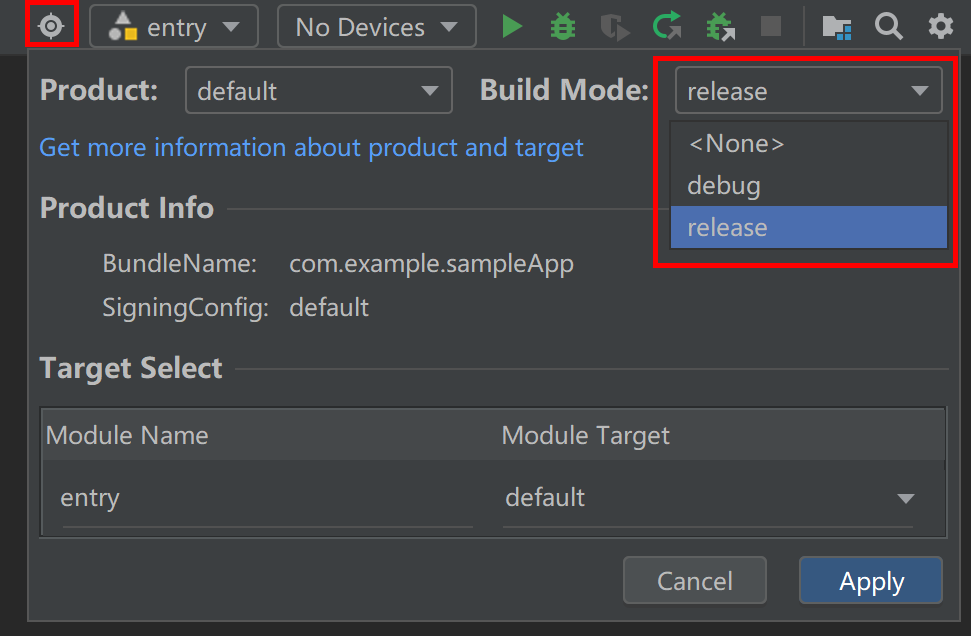

# 性能调优

## 页面生命周期管理

在`RNAbility`中为开发者提供了`onBackground`和`onForeground`接口用于监听页面的生命周期管理。这两个接口默认会在应用切换前台和后台的时候调用，但是对于页面间的路由，需要开发者自行适配。
由于当前HarmonyOS的页面路由存在`router`和`Navigation`两种方式，所以页面的生命周期管理也需要两种不同的适配方式：

- `router`中的适配方式：
    1. 在`@Entry`装饰的页面中，引入`RNAbility`类：

        ```TypeScript
        import {RNAbility} from '@rnoh/react-native-openharmony';
        ...
        @Entry
        @Component
        export struct ComponentName{
        @StorageLink('RNAbility') rnAbility: RNAbility | undefined = undefined
        ...
        }
        ```

    2. 在生命周期`onPageShow`和`onPageHide`中调用`rnAbility?.onForeground()`和`rnAbility?.onBackground()`：

        ```TypeScript
        onPageShow(){
            this.rnAbility?.onForeground();
        }
        onPageHide(){
            this.rnAbility?.onBackground();
        }
        ```

- `Navigation`中的适配方式;
    1. 在具有`NavDestination`的自定义组件中，引入`RNAbility`  类，该步骤同`router`路由。

    2. 在`NavDestination`的`onShown`回调事件中调用`rnAbility?.onForeground()`，在`onHidden`事件中调用`rnAbility?.onBackground()`：

        ```TypeScript
        ...
        build(){
            NavDestination(){
            ...
            }
            .onShown(() => {
            this.rnAbility?.onForeground();
            })
            .onHidden(() =>{
            this.rnAbility?.onBackground();
            })
        }
        ```

## 页面监控

使用Trace进行性能调优的时候，需要注意一下前置条件：

- 使用的hap包要为release的版本，而不是debug的版本；
- bundle要为字节码的形式，也就是在打bundle的时候设置`dev=false`。

### 内存监控

React Native for OpenHarmony使用`onMemoryLevel`用于监听程序内存的状态，当内存占用率高的时候，会自动触发程序的GC，释放内存。保障程序的正常运行。

### bundle加载完毕监控

1. 在代码中，可以通过`rnInstance.getBundleExecutionStatus(bundleURL: string)`方法，来获取指定url的bundle的加载状态，当获取到的状态为`"DONE"`的时候，表明当前的bundle已经加载完成，如：

    ```TypeScript
    rnInstance.getBundleExecutionStatus(jsBundleProvider?.getURL());
    if (jsBundleExecutionStatus === "DONE") {
        ···
    }
    ```

2. 也可以使用Trace的[调优](https://developer.huawei.com/consumer/cn/doc/harmonyos-guides-V5/bpta-optimization-overview-0000001869609160-V5)方式，监控bundle加载完毕的时机。通过[Smartperf-Host](https://gitee.com/openharmony-sig/smartperf#smartperf-host)工具打开Trace，并在在Trace中搜索`loadBundle`，即可跳转到对应的进程的`RNOH_JS`线程的对应位置（如图片中的`com.rnoh.tester`）：



### 页面首帧监控

可以使用Trace的[调优](https://developer.huawei.com/consumer/cn/doc/harmonyos-guides-V5/bpta-optimization-overview-0000001869609160-V5)方式，监控页面首帧加载完毕的时机。通过[Smartperf-Host](https://gitee.com/openharmony-sig/smartperf#smartperf-host)工具打开Trace，按照以下的特征便可以找到首帧加载的时间：

- `loadBundle`已经完成；
- 在**1**处，可以看到在`RNOH_JS`线程上，构造节点树的相关操作，如`cloneNode`等；
- 在**2**处，可以看到`ShadowTree::commit`，完成渲染流程中的提交；
- 在**3**处，虽然没有Trace打出来，但是并不代表这里线程空置，在一段时间中进行了组件`ComponentInstance`创建的操作；
- 在**4**处，在主线程上调用系统的原生API：`FlushVsync`，刷新视图同步事件，包括记录帧信息、刷新任务、绘制渲染上下文，完成最终的渲染操作。


# 应用性能调优

在进行应用的性能调优时，需要能够打包出一个生产环境的性能版本应用包进行调优，其中需要对环境进行配置，并使用性能工具进行调试。本文档将对应用性能调优配置、性能分析工具、以及三方库最新CAPI版本获取途径进行介绍。

## 1. JS端Release环境配置

JS端的性能优化配置主要是通过在打包时进行环境命令配置完成。

在一般的debug环境中，可以使用如下命令行进行打包。

```cmd
npm run codegen && react-native bundle-harmony --dev --minify=false
```


- **`npm run codegen`**：执行代码生成工具，用于生成一些必须的文件和数据结构。
- **`--dev`**：启用了开发模式，打包时不会进行压缩和优化，以便于调试。
- **`--minify=false`**：禁用了代码压缩，代码可读性更高，但体积较大。

在进行性能调优打包的时候，可以参考如下命令行进行性能优化。

``````cmd
npm run codegen && react-native bundle-harmony --dev=false --minify=true
``````


- **`--dev=false`**：关闭开发模式，启用生产模式。打包时会进行优化和压缩。
- **`--minify=true`**：启用了代码压缩，减少打包文件体积，优化性能。

## 2. 原生端环境配置

在原生端进行环境配置来进行性能调优时，开发者可以从以下两个方面进行设置。

### (1) IDE设置构建模式为release

在DevEco IDE中，可以对构建的模式进行设置。点击右上角的Product，将Build Mode切换为release，之后点击应用。在进行编译以及打包运行的时候，IDE将使用release模式进行构建，使得打包出来的应用能够进行性能调优。



### (2) 在CMakeList.txt中设置LOG_VERBOSITY_LEVEL

在默认情况下，开发者可以选择将CMakeList配置文件中的`LOG_VERBOSITY_LEVEL`设置为`1`，这通常意味着启用了较低级别的日志输出，这些日志主要用于显示关键信息或基本的调试输出。

```cmake
set(LOG_VERBOSITY_LEVEL 1)
```

具体来说，`LOG_VERBOSITY_LEVEL=1` 的作用如下：

#### a. **启用基本的日志输出**
当 `LOG_VERBOSITY_LEVEL` 设置为 `1` 时，CMake 会输出一些额外的日志信息，但不会过于详细。通常用于显示关键信息，比如构建的关键步骤、主要的状态更新、警告和错误等。这种级别的日志适合在普通开发或调试阶段使用，能够捕获重要的事件和问题，而不会因为大量细节信息而淹没关键信息。

#### b. **过滤过于详细的日志信息**
相比于更高的日志详细级别（如 `LOG_VERBOSITY_LEVEL=2` 或更高），`LOG_VERBOSITY_LEVEL=1` 会过滤掉大量的低优先级信息，避免输出非常详细的调试信息（如函数调用、变量状态等）。这样可以避免过多不必要的日志信息，保持输出简洁。

#### c. **适用场景**
这种日志级别适合开发人员需要一些额外的上下文来理解构建或配置过程中的问题，但不需要非常深入的调试信息。对于一般的调试、问题排查，这种设置能够提供适量的信息。

在具体的 CMake 项目中，`LOG_VERBOSITY_LEVEL=1` 可能会展示如下类型的信息：
- 关键的配置状态，如编译器、构建选项的变化。
- 项目依赖的加载情况。
- 警告和错误信息。

它不会输出非常细致的调试信息（如编译器的详细选项、内部变量的值等），这些信息通常需要将 `LOG_VERBOSITY_LEVEL` 提升到更高的数值才能看到。

因此，`LOG_VERBOSITY_LEVEL=1` 是一种平衡了日志详细度和可读性之间的设置，用于获取适度的构建过程反馈。

在进行性能调优时，过多的日志打印会影响应用的性能。因此，可以选择将CMakeList文件中的该设置注释，或者将该值设置为0，关闭日志打印。

```cmake
set(LOG_VERBOSITY_LEVEL 0)
```

## 3. 字节码（HBC）

在进行性能调优的过程中，开发者可以选择将JavaScript 包编译成 Hermes 字节码二进制文件， 将JavaScript代码转化为Hermes字节码，即HBC文件。Hermes 二进制包（通过编译 JavaScript 代码成 Hermes 字节码）具有以下几个关键性能优势：

- **更快的启动时间**：Hermes 将 JavaScript 代码预先编译为字节码（bytecode），而不是在运行时动态解析。相比标准的 JavaScript 引擎（如 JSC 或 V8），Hermes 可以跳过解析和编译步骤，从而显著缩短应用启动时间。对于移动设备，启动时间的减少会改善用户体验，尤其在应用首次加载时非常明显。
- **减少内存使用**：Hermes 编译生成的字节码比标准的 JavaScript 引擎更小且更高效，内存占用更少。Hermes 优化了字节码表示，去除了不必要的符号和调试信息，专注于执行效率。内存占用的减少使应用能够在低内存设备上运行得更加流畅。
- **更高效的垃圾回收机制**：Hermes 的垃圾回收器专门针对移动设备进行了优化。它使用了分代垃圾回收（generational garbage collection）策略，将内存分成多代来管理对象的生命周期。这个机制能显著减少暂停时间和内存碎片，从而提高应用的响应速度，并且有效利用移动设备的有限资源。
- **减少 JavaScript 编译时间**：Hermes 将 JavaScript 代码的编译移到了构建阶段，通过 `hermesc` 工具将 JavaScript 预编译为字节码，因此在应用运行时无需再进行编译。这减少了运行时的 CPU 负担，从而提高性能，特别是在复杂的应用程序或具有大量 JavaScript 代码的应用中，这种预编译能显著提升性能。

通过如下打包命令，开发者可以将JavaScript 包转化为HBC包：

``````cmd
npm run codegen && react-native bundle-harmony --dev=false --minify=true --bundle-output /tmp/bundle.harmony.js && hermesc --emit-binary /tmp/bundle.harmony.js -out ./harmony/entry/src/main/resources/rawfile/hermes_bundle.hbc
``````

- **`hermesc`**：通过 `hermesc` 将生成的 JavaScript 包编译成 Hermes 字节码二进制文件。Hermes 引擎通过预先编译字节码减少启动时间。
- **`--dev`**：开启开发模式，这可能会影响 Hermes 的性能优化。

## 4. 性能分析工具

在进行性能分析的时候，开发者可以使用DevEco IDE中的Profiler对应用的性能进行分析。具体的Profiler使用文档请参考：[使用DevEco Profiler进行性能调优](https://developer.huawei.com/consumer/cn/doc/harmonyos-guides-V5/ide-profiler-introduction-V5)。


## 5. 三方库最新CAPI版本

在应用开发过程中，如果使用了三方库，确保使用的是最新版本，这不仅有助于功能更新，还能在性能和安全性上获得提升。获取最新三方库 CAPI 版本的具体途径请参考[三方库的官方文档](https://gitee.com/react-native-oh-library/usage-docs/tree/master/zh-cn)和资源。

## 6. 预创建

在进行应用开发的过程中，经常会涉及到点击页面跳转新页面的情况。在这样的情况下，新的页面只有在点击之后才会进行加载，会导致跳转响应慢，用户体验不好的现象。该问题可以通过预创建的方法得到解决，帮助开发者进行应用性能的优化。详情可参考：
[预创建介绍](预创建介绍.md)
