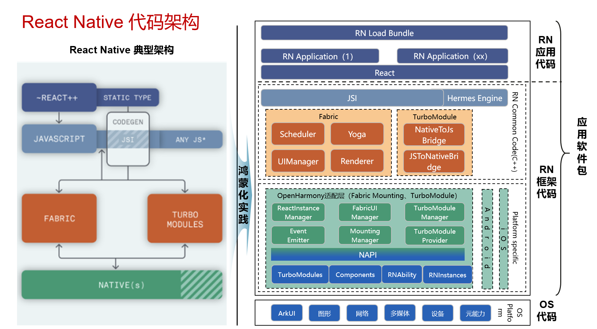
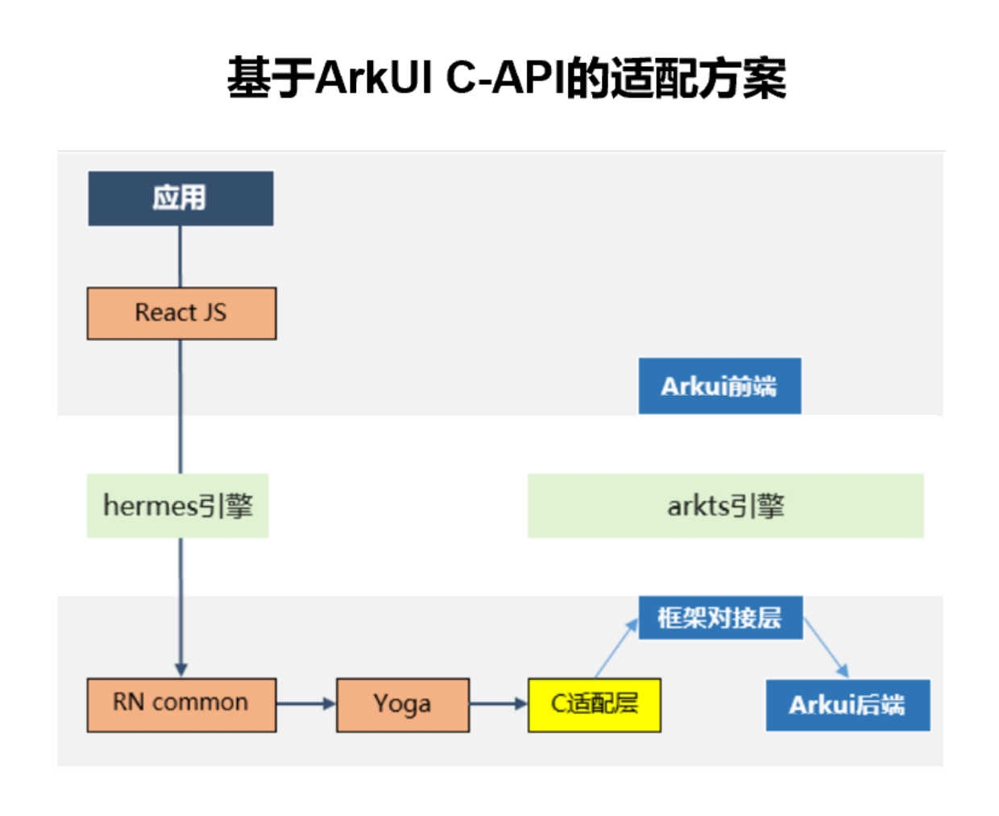
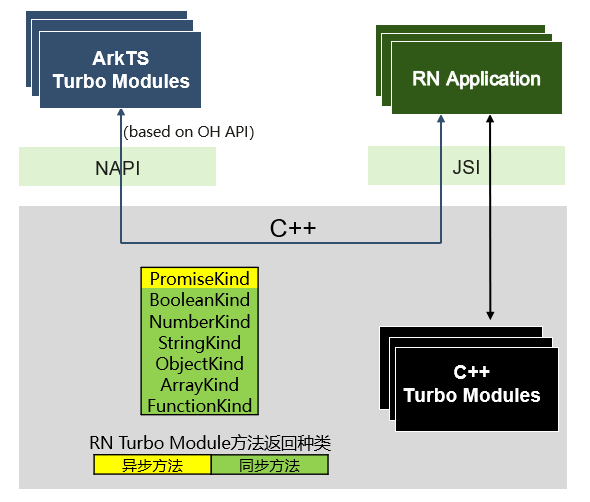
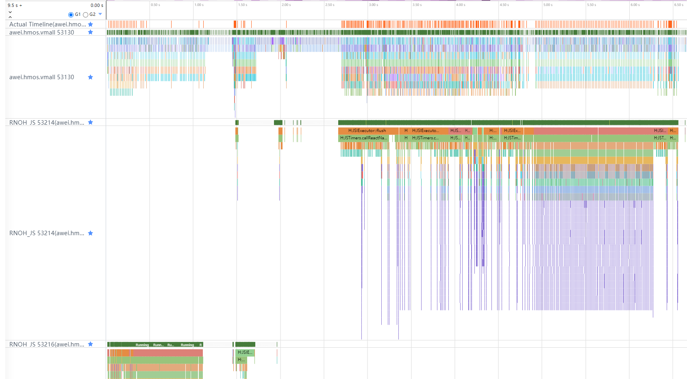
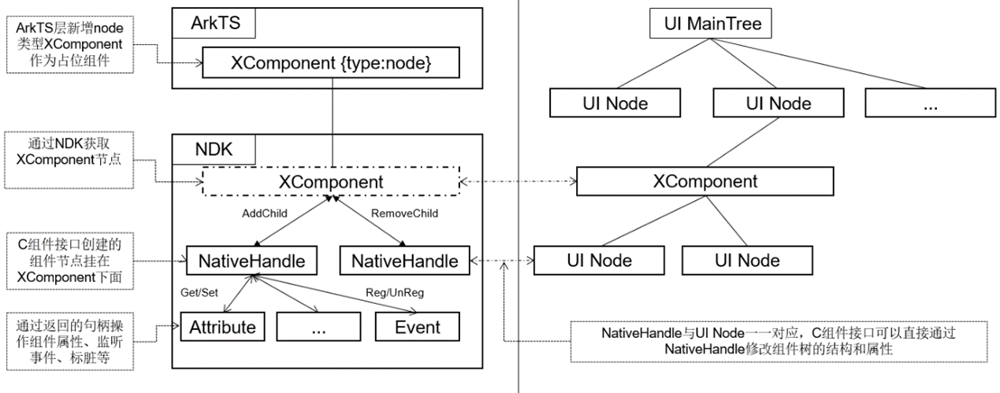
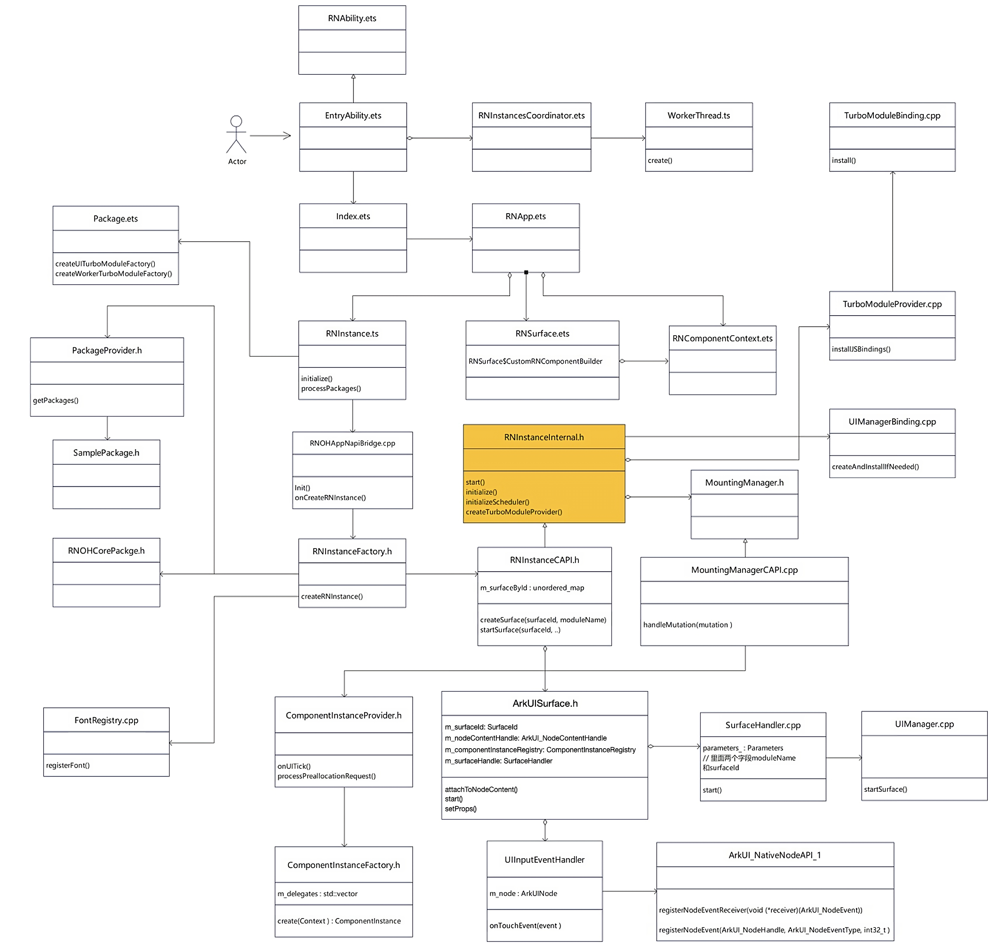

# 架构介绍

关于 **RN** 的架构，可以参考[React Native中文网](https://reactnative.cn/architecture/overview)。

## RNOH架构



如图，React Native for OpenHarmony 在 React Native 的新架构（0.68 以及之后的版本）的基础上，进行了鸿蒙化的适配。按照功能可以进行如下的划分：

- **RN** 应用代码：开发者实现的业务代码。
- **RN** 库代码：在 React Native 供开发者使用的组件和 API 的封装与声明。
- JSI（JavaScript Interface）：JavaScript 与 CPP 之间进行通信的 API。
- React Common：所有平台通用的 CPP 代码，用于对 **RN** 侧传过来的数据进行预处理。
- OpenHarmony 适配代码：接收并处理 React Common 传过来的数据，对接原生的代码，调用 ArkUI 的原生组件与 API。主要包括了两个部分：分别是 TurboModule 与 Fabric。
- OS 代码：对接系统底层功能，根据适配层代码传过来的数据进行渲染，或完成对应的功能。

## RN库代码

- 在现行的 React Native 中，有很多属性是在 React 侧完成的封装，也有很多属性是平台独有的。为了达成这个效果，React Native 在 JS 侧根据 `Platform` 增加了很多判断。所以，React Native 的鸿蒙化适配也需要增加 `HarmonyOS` 相关的平台判断，与相应的组件属性的封装。为此，鸿蒙化团队提供了 `react-native-harmony` 的 tgz 包，并通过更改 `metro.config.js` 配置，将该 tgz 包应用到 Metro Bundler 中。
- React Native 还提供了很多库的封装，例如 Codegen、打包工具等。为此，鸿蒙化团队提供了 `react-native-harmony-cli` 的包，对这些库进行了 `HarmonyOS` 平台的适配，用于向开发者提供相关的功能。

## Fabric

Fabric 是 React Native 的组件渲染系统。接收 React Native 传过来的组件信息，处理后发送给原生 OS，由 OS 完成页面的渲染。



在适配方案中，组件不通过复杂的流程对接到 ArkUI 的声明式范式上，而是直接使用[XComponent](#xcomponent接入)对接到 ArkUI 的后端接口进行渲染，缩短了流程，提高了组件渲染的效率。C-API 的性能收益包括以下的几个部分：

- C 端最小化、无跨语言的组件创建和属性设置；
- 无跨语言前的数据格式转换，不需要将 `string`，`enum` 等数据类型转换为 `object`，可以在 CPP 侧直接使用对应的数据进行处理；
- 可以进行属性 Diff，避免重复设置，降低了属性设置的开销。

渲染流水线请参考[渲染三阶段](渲染三阶段.md)。

## TurboModule



TurboModule 是 React Native 中用于 JavaScript 和原生代码进行交互的模块，为 RN JS 应用提供调用系统能力的机制。根据是否依赖 HarmonyOS 系统相关的能力，可以分为两类： cxxTurboModule 和 ArkTSTurboModule。

1. ArkTSTurboModule：
    - ArkTSTurboModule 为 React Native 提供了调用 ArkTS 原生 **API** 的方法。可以分为同步与异步两种。
    - ArkTSTurboModule 依赖 **NAPI** 进行原生代码与 CPP 侧的通信。包括 JS 与 C 之间的类型转换，同步和异步调用的实现等。
2. cxxTurboModule：
    - cxxTurboModule 主要提供的是不需要系统参与的能力，例如`NativeAnimatedTurboModule` 主要提供了数据计算的相关能力。
    - cxxTurboModule 不依赖于系统的原生 **API**，为了提高相互通信的效率，一般是在 cpp 侧实现，这样可以减少 native 与 cpp 之间的通信次数，提高性能。

## React Native线程模型

### RNOH线程模型

RNOH的线程一共有 4 个：

```cpp
enum TaskThread {
  MAIN = 0, // main thread running the eTS event loop
  JS, // React Native's JS runtime thread
  BACKGROUND, // background tasks queue
  WORKER, // used by some turbo modules
};
```

#### MAIN/UI线程

**RN** 业务主线程，也是应用主线，应用 UI 线程。该线程在应用中有唯一实例。

**RN** 在 **MAIN** 线程中主要承担的业务功能是：

- ArkUI 组件的生命周期管理：CREATE, UPDATE, INSERT, REMOVE, DELETE；
- ArkUI 组件树管理；
- RN TurboModule 业务功能运行；
- 交互事件、消息处理。

#### JS线程

JS 线程通过虚拟机执行 React（JS）代码，通过 React 代码与 RN Common 的核心代码交互完成 React Native 的 Render 阶段任务。

**RN** 在 JS 线程中主要承担的业务功能是：

- 加载 bundle，执行 bundle 依赖的 React 代码和 bundle 的业务代码。
- 由 React 业务代码驱动，创建 RN ShadowTree，设置 ShadowTree 的属性。
- 利用 Yoga 引擎进行组件布局，文本测量和布局。
- 比较完成布局的新、老 ShadowTree，生成差异结果 mutations。将 mutations提交到 **MAIN** 线程触发 Native 的显示刷新。
- 交互事件、消息处理。

JS 线程与 `RNInstance` 的实例绑定，有多个 `RNInstance`，则有多个对应的 JS 线程。

#### BACKGROUND线程

**BACKGROUND** 线程是 **RN** 的实验特性，开启 **BACKGROUND** 线程后，会将 JS 线程的部分布局、ShadowTree 比较的任务迁移到该线程执行，从而降低 JS 线程的负荷。

由于开启 **BACKGROUND** 涉及复杂的线程间通信，在稳定性方面带来风险，因此正式商用版本中不要开启 **BACKGROUND** 线程。

#### WORKER线程

**WORKER** 线程是 RNSDK700 版本的新特性，开启 worker 线程需要在继承 `RNAbility` 后重写 `getRNOHWorkerScriptUrl` 方法，通过该方法去配置 worker 线程
启动的文件路径。

worker 线程主要承担的业务功能是：

- 将 TurboModule 运行在 worker 线程，避免 TurboModule 通信和主线程 UI 绘制逻辑竞争有限的主线程资源。
- 可以让运行在worker线程的TurboModule互相通信。

### RNOH线程的长期演进

**MAIN** 线程和 JS 线程承担了 **RN** 框架的全部业务，在重载情况下可能会造成性能瓶颈。**RN**的业务也受同线程的其他应用代码的影响，造成执行延迟或阻塞等问题。

在长期演进时，可以考虑进行线程扩展：

- 增加唯一 **TM** 线程，将 TurboModule 的业务代码放到 **TM** 线程来执行，从而降低 **MAIN** 线程负荷。
- 增加单独的 **TIMER** 线程，确保时间基准稳定执行。

### 典型线程Trace图

- 线程号 53130：MAIN 线程
- 线程号 53214：JS 线程实例 1
- 线程号 53216：JS 线程实例 2



## 命令式组件
### XComponent接入



CAPI 版本使用 XComponent 总共分成了两个步骤：

1. `createSurface` 的时候创建 `XComponentSurface`；
2. `startSurface` 的时候将 CPP 的 `XComponentSurface` 连接到ArkUI的 `Xcomponent` 上。

`createSurface` 的时候主要做了以下的操作：

1. 创建并将 `XComponentSurface` 记录到 Map 中：

    ```cpp
    void RNInstanceCAPI::createSurface(
    facebook::react::Tag surfaceId,
    std::string const& moduleName) {
    m_surfaceById.emplace(
        surfaceId,
        XComponentSurface(
            ···
            surfaceId,
            moduleName));
    }
    ```

2. 在 `XComponentSurface` 中创建 rootView，用于挂载 C-API 的组件，并在 Surface 上统一处理 Touch 事件：

    ```cpp
    XComponentSurface::XComponentSurface(
    ···
    SurfaceId surfaceId,
    std::string const& appKey)
    : 
      ···
      m_nativeXComponent(nullptr),
      m_rootView(nullptr),
      m_surfaceHandler(SurfaceHandler(appKey, surfaceId)) {
    m_scheduler->registerSurface(m_surfaceHandler);
    m_rootView = componentInstanceFactory->create(
        surfaceId, facebook::react::RootShadowNode::Handle(), "RootView");
    m_componentInstanceRegistry->insert(m_rootView);
    m_touchEventHandler = std::make_unique<SurfaceTouchEventHandler>(m_rootView);
    }
    ```

`startSurface` 的时候主要做了以下的操作：

1. 在 ArkTS 侧创建 `XComponent`，并设置 `id`，`type` 与 `libraryname` 属性。其中：
    - id：组件的唯一标识，又由 `InstanceID` 和 `SurfaceID` 共同组成，记录了此 `XComponent` 属于哪一个 Instance 与 Surface；
    - type：`node`，标识该 XComponent 是一个占位组件，组件的实现都在 CAPI 侧；
    - libraryname：表示 C-API 组件在哪个 so 库中实现，并加载该 so 库，自动调用该 so 中定义的 `Init` 函数。当前 React Native for OpenHarmony 默认的 so 名字为 `rnoh_app`。

    ```typescript
    XComponent({
        id: this.ctx.rnInstance.getId() + "_" + this.surfaceHandle.getTag(),
        type: "node",
        libraryname: 'rnoh_app'
    })
    ```

2. 在 CPP 侧的 `Init` 中调用 `registerNativeXComponent` 函数，该函数中调用了 `OH_NativeXComponent_GetXComponentId` 用于获取 ArkTS 设置的 id，并根据 id 找到对应的 Instance 与 Surface。同时还要获取 `nativeXComponent` 对象，记录 ArkTS 侧的`XComponent`。

    ```cpp
    if (OH_NativeXComponent_GetXComponentId(nativeXComponent, idStr, &idSize) !=
      OH_NATIVEXCOMPONENT_RESULT_SUCCESS) {
        ···
    }
    std::string xcomponentStr(idStr);
    std::stringstream ss(xcomponentStr);
    std::string instanceId;
    std::getline(ss, instanceId, '_');
    std::string surfaceId;
    std::getline(ss, surfaceId, '_');
    ```

3. 调用 `OH_NativeXComponent_AttachNativeRootNode`，将 `XComponentSurface` 中记录的 rootView 连接到 ArkTS 侧的 `XComponent` 上：

    ```cpp
    OH_NativeXComponent_AttachNativeRootNode(
        nativeXComponent,
        rootView.getLocalRootArkUINode().getArkUINodeHandle());
    ```
4. 将 rootView 连接到 `XComponent` 后，rootView 就作为 CAPI 组件的根节点，后续的子孙节点通过 Mutation 指令逐个插入到组件树上。

### CAPI组件向上对接RN指令
1. 在 **RN** 鸿蒙适配层中，`SchedulerDelegate.cpp` 负责处理 RN Common 传递下来的指令。

    ```cpp
    void SchedulerDelegate::schedulerDidFinishTransaction(MountingCoordinator::Shared mountingCoordinator) {
        ...
    }
    ```
2. 在 MountingManagerCAPI.cpp 的didMount中对各个指令进行处理。

    ```cpp
    MountingManagerCAPI::didMount(MutationList const& mutations) {
        ...
    }
    ```
在 didMount 函数中，先根据预先配置的 arkTsComponentNames 获取 ArkTs 组件和 CAPI 组件的指令，分别进行处理。其中 CAPI 组件的指令会在 `handleMutation` 方法中逐个遍历每个指令，根据指令的类型（Create 、Delete、Insert、Remove、Update）进行不同的处理。

- Create 指令：接收到 Create 指令后，会根据指令的 tag、componentName 和 componentHandle 信息创建出一个对应组件类型的 ComponentInstance，比如 Image 组件的 Create 指令，会创建对应的 ImageComponentInstance。创建完组件之后，调用 updateComponentWithShadowView 方法设置组件的信息。其中，setLayout 设置组件的布局信息，setEventEmitter 设置组件的事件发送器，setState 设置组件的状态，setProps 设置组件的属性信息。

- **Delete指令**：根据接收到的 Delete 指令的 tag，删除对应组件的ComponentInstance。

- **Insert指令**：根据接收到 Insert 指令中包含父节点的 tag 和子节点的 tag，将子节点插入到对应的父节点上。

- **Remove指令**：接收到 Remove 指令中包含父节点的 tag 和子节点的 tag，在父节点上移除对应的子节点。

- **Update指令**：接收到 Update 指令后，调用组件的 **setLayout**、**setEventEmitter**、**setState**、**setProps** 更新组件相关信息。

### 适配层事件分发逻辑

#### 1.适配层事件的注册

当手势触碰屏幕后会命中相应的结点，通过回调发送对应事件，但是需要注册事件，如一个 Stack 节点注册了 NODE_ON_CLICK 事件。
```cpp
StackNode::StackNode()
:ArkUINode(NativeNodeAPi::getInstance()->createNode(ArkUI_NodeType::ARKUI_NODE_STACK)),
    m_stackNodeDelegate(nullptr)
    {
        maybeThrow(NativeNodeApi::getInstance()->registerNodeEvent(m_nodeHandle,NODE_ON_CLICK,0,this));
        maybeThrow(NativeNodeApi::getInstance()->registerNodeEvent(m_nodeHandle,NODE_ON_HOVER,0,this));
    }
```
SurfaceTouchEventHandler 注册了 NODE_TOUCH_EVENT 事件。
```cpp
SurfaceTouchEventHandler(
    ComponentInstance::Shared rootView,
    ArkTSMessageHub::Shared arkTSMessageHub,int rnInstanceId):
    ArkTSMessageHub::Observer(arkTSMessageHub),
    m_rootView(std::move(rootView)),
    m_rnInstanceId(rnInstanceId)
    {
        ArkUINodeRegistry::getInstance().registerTouchHandler(
            &m_rootView->getLocalRootArkUINode(),this);
            NativeNodeApi::getInstance()->registerNodeEvent(
                m_rootView->getLocalRootArkUINode().getArkUINodeHandle(),
                NODE_TOUCH_EVENT,
                NODE_TOUCH_EVENT,
                this);
    }
```

#### 2.适配层事件的接收

ArkUINodeRegistry 的构造中注册了一个回调，当注册了事件的节点被命中后，该事件通过回调传递处理。
```cpp
ArkUINodeRegistry::ArkUINodeRegistry(ArkTSBridge::Shared arkTSBridge):m_arkTSBridge(std::move(arkTSBridge))
{
    NativeNodeApi::getInstance()->registerNodeEventReceiver(
        [](ArkUI_NodeEvent* event){
            ArkUINodeRegistry::getInstance().receiveEvent(event)；
            });
}
```

#### 3.适配层事件的处理

回调传递的参数 `event` 通过 `OH_ArkUI_NodeEvent_GetEventType` 获取事件类型，通过 `OH_ArkUI_NodeEvent_GetNodeHandle`获取触发该事件的结点指针。
```cpp
auto eventType = OHArkUI_NodeEvent_GetEventType(event);
auto node = OH_ArkUI_NodeEvent_GetNodeHandle(event);
```
首先判断事件类型是否为 `Touch` 事件，如果是，就从一个存储了所有 `TouchEventHandler` 的 Map 中通过结点指针作为 key 去查找对应的 TouchEventHandler，如果没找到，这次 `Touch` 事件不处理。
```cpp
if(eventType == ArkUI_NodeEventType::NODE_TOUCH_EVENT)
{
    auto it = m_touchHandlerByNodeHandle.find(node);
    if(it == m_touchHandlerByNodeHandle.end())
    {
        return;
    }
}
```
如果找到了对应的 TouchEventHandler，通过 `OH_ArkUI_NodeEvent_GetInputEvent` 获取输入事件指针，若输入事件指针不为空，通过 `OH_ArkUI_UIInputEvent_GetType` 判断输入事件指针的类型是否为 `Touch` 事件，如果不是，这次 `Touch` 事件不处理。
```cpp
auto inputEvent = OH_ArkUI_NodeEvent_GetInputEvent(event);
if(inputEvent == nullptr || OH_ArkUI_UIInputEvent_GetType(inputEvent) != ArkUI_UIInputEvent_Type::ARKUI_UIINPUTEVENT_TYPE_TOUCH)
{
    return;
}
```
如果上述两个条件都满足，就通过` TouchEventHandler` 去处理 `Touch` 事件。
```cpp
it->second->onTouchEvent(inputEvent);
```
如果事件类型不为 `Touch` 事件，就从一个存储了所有 ArkUINode 的 Map 中通结点指针作为 key 去查找对应的 ArkUINode，若未找到，这次事件不处理。
```cpp
auto it = m_nodeByHandle.find(node);
if(it == m_nodeByHandle.end())
{
    return;
}
```
如果找了对应的 ArkUINode，通过 `OH_ArkUI_NodeEvent_GetNodeComponentEvent` 获取组件事件指针，该指针的 data 字段保留了 arkUI 传递过来的参数，并通过 ArkUINode 处理该事件。
```cpp
auto commponentEvent = OH_ArkUI_NodeEvent_GetNodeComponentEvent(event);
if(commponentEvent != nullptr)
{
    it->second->onNodeEvent(eventType,compenentEvent->data);
    return;
}
```

#### 4.Touch事件的传递给JS侧

上文中写明 TouchEventHandler 对 `Touch` 事件进行处理，以 xcomponentSurface 举例，`xcomponentSurface` 有一个继承了 TouchEventHandler 的成员变量，这个成员变量通过 `dispatchTouchEvent` 处理这次 `Touch` 事件。
```cpp
void onTouchEvent(ArkUI_UIInputEvent* event)override
{
    m_touchEventDispatcher.dispatchTouchEvent(event,m_rootView);
}
```
对于 `Touch` 事件首先通过 `Touch` 的位置等因素，获取对应 `touchTarget` （每个componentInstance 就是一个 touchTarget，下图的名字是 eventTarget）。
```cpp
class ComponentInstance:public TouchTarget,public std::enable_shared_from_this<ComponentInstance>
```
```cpp
for(auto const& targetTouches:touchByTargetId)
{
    auto it = m_touchTargetByTouchId.find(targetTouches.second.begin()->identifier);
    if(it == m_touchTargetByTouchId.end())
    {
        continue;
    }
    auto eventTarget = it->second.lock();
    if(eventTarget == nullptr)
    {
        m_touchTargetByTouchId.erase(it);
        continue;
    }
}
```
然后通过 componentInstance 保存的 `m_eventEmitter` 发送对应的事件给 js 侧，从而触发页面的刷新等操作。
Touch事件有以下四种类型:
- UI_TOUCH_EVENT_ACTION_DOWN
- UI_TOUCH_EVENT_ACTION_MOVE
- UI_TOUCH_EVENT_ACTION_UP
- UI_TOUCH_EVENT_ACTION_CANCEL

```cpp
switch(action)
{
    case UI_TOUCH_EVENT_ACTION_DOWN:
    eventTarget->getTouchEventEmitter()->onTouchStart(touchEvent);
    break;
    case UI_TOUCH_EVENT_ACTION_MOVE:
    eventTarget->getTouchEventEmitter()->onTouchMove(touchEvent);
    break;
    case UI_TOUCH_EVENT_ACTION_UP:
    eventTarget->getTouchEventEmitter()->onTouchEnd(touchEvent);
    break;
    case UI_TOUCH_EVENT_ACTION_CANCEL:
    default:
    eventTarget->getTouchEventEmitter()->onTouchCancel(touchEvent);
    break;
}
```

#### 5、非Touch事件的传递给js侧

上文中写明，非 `Touch` 事件由 ArkUINode 处理，对于每个继承了 ArkUINode 的类，重载了 `onNodeEvent` 方法，以 StackNode 举例，说明RN适配层是如何区分 `Click` 事件和 `Touch` 事件。前文说明，StackNode 注册了 `Click` 事件，所以通过回调，会走到 StackNode 的 `onNodeEvent` 部分，这里会先判断这个事件类型，这里是 `NODE_ON_CLICK` 类型，符合要求，但是对于第二个条件 `eventArgs[3].i32` (即上文描述的arkUI传递过来的参数)，如果是触屏手机，其值为2不满足 `eventArgs[3].i32 ！= 2` 的条件。
```cpp
void StackNode::onNodeEvent(ArkUI_NodeEventType eventType,EventArgs& eventArgs)
{
    if(eventType == ArkUI_NodeEventType::NODE_ON_CLICK && eventArgs[3].i32 != 2)
    {
        onClick();
    }
    if(eventType == ArkUI_NodeEventType::NODE_ON_HOVER)
    {
        if(m_stackNodeDelegate != nullptr)
        {
            if(eventArgs[0].i32)
            {
                m_stackNodeDelegate->onHoverIn();
            }else
            {
                m_stackNodeDelegate->onHoverOut();
            }
        }
    }
}
```
所以此时实际上不会触发 `Click` 的事件，因此 `Touch` 事件和 `Click` 事件不会冲突。如果触发了 `Click` 事件，StackNode 会通过代理 StackNodeDelegate 发送事件。
```cpp
void StackNode::onClick()
{
    if(m_stackNodeDelegate != nullptr)
    {
        m_stackNodeDelegate->onClick();
    }
}
```
其中 ViewComponentInstance 继承了 StackNodeDelegate，所以实际上走的是 ViewComponentInstance 的 `onClick` 函数。
```cpp
namespace rnoh
{
    class ViewComponentInstance
    :public CppComponentInstance<facebook::react::ViewShardowNode>,public StackNodeDelegate
    {
    }
}
```
这个函数通过 ViewComponentInstance 的 `m_eventEmitter` 发送事件给 JS，从而触发页面的刷新。
```cpp
void ViewComponentInstance::onClick()
{
    if(m_eventEmitter != nullptr)
    {
        m_eventEmitter->dispatchEvent("click",[=](facebook:jsi::Runtime& runtime)
        {auto payload = facebook::jsi::Object(runtime);
                return payload;
        });
    }
}
```

## RHOH启动流程

鸿蒙 **RN** 启动阶段分为 **RN** 容器创建、Worker 线程启动、NAPI 方法初始化、**RN** 实例创建四个阶段，接下来加载 bundle 和界面渲染，类图如下所示：



### RN容器创建

- **EntryAbility**

  全局 Ability，App 的启动入口。

- **Index.ets**

  App 页面入口。

- **RNApp.ets**

  - 配置 `appKey`，和 JS 侧 `registerComponent` 注册的 `appKey` 关联；
  - 配置初始化参数 `initialProps`，传递给 js 页面；
  - 配置 `jsBundleProvider`，指定 bundle 加载路径；
  - 配置ArkTS混合组件 `wrappedCustomRNComponentBuilder`；
  - 配置 `rnInstanceConfig`，指定开发者自定义 `package`，注入字体文件 `fontResourceByFontFamily`，设置 BG 线程开关，设置 C-API 开关；
  - 持有 `RNSurface`，作为 **RN** 页面容器。

- **RNSurface.ets**

  **RN** 页面容器，持有 `XComponent` 用于挂载 ArkUI 的 C-API 节点和响应手势事件。

### Worker线程启动

TurboModule 运行在 worker 线程，worker 线程是在程序启动时创建。

- **WorkerThread.ts**

  `EntryAbility` 创建时会创建 `RNInstancesCoordinator`，`RNInstancesCoordinator` 的构造函数中获取 worker 线程类地址，然后调用 WorkerThread 的 `create` 方法启动 worker 线程，如下：

  ```javascript
  const workerThread = new WorkerThread(logger, new worker.ThreadWorker(scriptUrl, { name: name }), onWorkerError)
  ```

- **RNOHWorker.ets**

  WorkerThread 中配置的 `scriptUrl` 即 `RNOHWorker.ets` 路径，`RNOHWorker.ets` 内部调用 `setRNOHWorker.ets` 的 `setRNOHWorker` 方法配置 worker 线程收发消息通道。

- **setRNOHWorker.ets**

  `setRNOHWorker` 方法配置 worker 线程收发消息通道，`createTurboModuleProvider` 方法注册系统自带和开发者自定义的运行在 worker 线程的 TurboModule。

### NAPI方法初始化

- **RNOHAppNapiBridge.cpp**

  `Init` 方法是静态方法，在程序启动时调用，配置了 18 个 ArkTS 调用 C++ 的方法，如下：

  ```
  registerWorkerTurboModuleProvider,
  getNextRNInstanceId, 
  onCreateRNInstance,                  // 创建RN实例
  onDestroyRNInstance,                 // 销毁RN实例
  loadScript,                          // 加载bundle
  startSurface,
  stopSurface,
  destroySurface,
  createSurface,                       // 创建RN界面
  updateSurfaceConstraints,
  setSurfaceDisplayMode,
  onArkTSMessage,
  emitComponentEvent,                  // 给RN JS发消息
  callRNFunction, 
  onMemoryLevel,
  updateState,
  getInspectorWrapper,
  getNativeNodeIdByTag
  ```

- **NapiBridge.ts**

  ArkTS 侧 `RNInstance.ts`、`SurfaceHandle.ts` 调用 C++ 的桥梁。

### RN实例创建

在 `RNInstance.ts` 中创建 **RN** 实例，分为以下步骤：

1. 获取 `RNInstance` 的 id：在 `RNInstanceRegistry.ets` 中通过 **NAPI** 调用 `getNextRNInstanceId` 方法获取。
2. 注册 ArkTS 侧 TurboModule：在 `RNInstance.ts` 中调用 `processPackage` 方法注册系统自带和开发者自定义的运行在 UI 线程上的 TurboModule。
3. 注册字体：在 `RNInstanceFactory.h` 中调用 `FontRegistry.h` 的 `registerFont` 方法注册应用侧扩展字体，接着通过图形接口注入字体信息。
4. 注册 **RN** 官方能力和开发者自定义能力：`RNInstanceFactory.h` 中通过 `PackageProvider.cpp` 的 `getPackage` 方法获取 **RN** 系统自带和开发者自定义 TurboModule，接着注册系统 View、系统自带 TurboModule、开发者自定义 View、开发者自定义 TurboModule。
5. 注册 ArkTS 混合组件：在 `RNInstanceFactory.cpp` 中注册 ArkTS 侧传递到 C++ 的 ArkTS 组件。
6. 初始化 JS 引擎：在 `RNInstanceInternal.cpp` 中初始化 JS 引擎 Hermes 或者 JSVM，通过 JS 引擎驱动 JS 消息队列。
7. 注册 TM 的 JSI 通道：在 `RNInstanceCAPI.cpp` 中调用 `createTurboModuleProvider` 创建 `TurboModuleProvider`，注入 `__turboModuleProxy` 对象给 JS 侧。
8. 注入 Scheduler：在 `RNInstanceInternal.cpp` 中初始化 Fabric 的 `Scheduler` 对象，ReactCommon 的组件绘制找到鸿蒙适配层注入的 `SchedulerDelegate` 才能进行界面绘制。
9. 注册 Fabric 的 JSI 通道：在 `RNInstanceInternal.cpp` 中调用 `UIManagerBinding.cpp` 的 `createAndInstallIfNeeded` 方法注入 `nativeFabricUIManager` 对象给 JS 侧。

### 加载bundle

**RN** 实例创建完毕则开始加载 bundle，如下：

ArkTS 侧加载 bundle、C++ 侧加载 bundle，切线程到 ReactCommon 的 `Instance.cpp` 中加载 bundle：

```
RNApp.ets > RNInstance.ts > RNOHAppNapiBridge.cpp > RNInstanceInternal.cpp > Instance.cpp
```