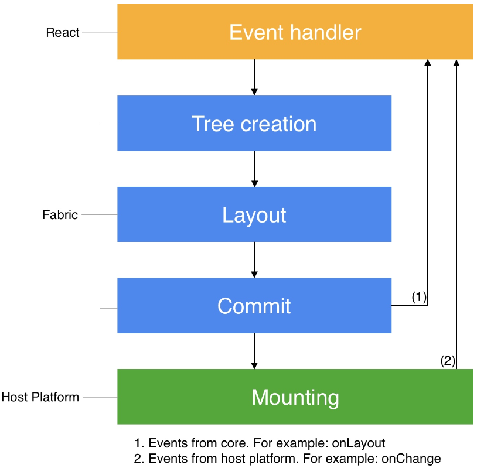
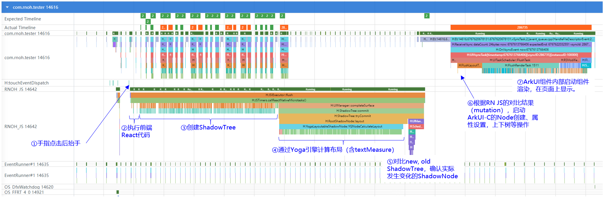

This documentation is based on React Native documentation licensed under the [CC-BY-4.0](https://creativecommons.org/licenses/by/4.0/) license at https://reactnative.cn/architecture/render-pipeline. © Meta Platforms Inc. Added the description of the three rendering phases in RNOH.

# React Native渲染流程分析

## 渲染流水线三个阶段

- 渲染（Render）：在JavaScript中，React执行那些产品逻辑代码创建React元素树（React Element Trees）。然后在C++中，用React元素树创建React影子树（React Shadow Tree）。
- 提交（Commit）：在React影子树完全创建后，渲染器会触发一次提交。这会将React元素树和新创建的React影子树的提升为“下一棵要挂载的树”。 这个过程中也包括了布局信息计算。
- 挂载（Mount）：React影子树有了布局计算结果后，它会被转化为一个宿主视图树（Host View Tree）。

渲染流水线的各个阶段可能发生在不同的线程中：

渲染流水线存在三种不同场景：

1. 初始化渲染；
2. React状态更新；
3. React Native渲染器的状态更新。

 

## RNOH的渲染三阶段实例化介绍

在RNOH中，以一次典型的渲染流程（点击按钮，跳转到包含1500个text组件的页面）为例，从Trace来实例化说明渲染三阶段：

### 渲染（Render）

1. 手指点击界面控件，然后抬起手指（上图步骤①），此事手势事件点击会被传递到RNOH JS线程，线程中响应点击事件，在JS虚拟机中开始执行前端React代码，React代码会加载并执行一些前端业务逻辑所必须的依赖函数（上图步骤②）。
2. React的业务代码在创建组件时，会通过JSI（Javascript与原生C++代码相互调用的接口层）调用到RN Common中的ShadowTree创建，这一段的流程中涉及频繁的JS/原生相互调用（上图步骤③）。

### 提交（Commit）

1. 一旦完成ShadowTree构建，会通过Yoga引擎进行布局计算（上图步骤④）。对于UI组件的布局计算，在Yoga引擎中直接完成，对于文本的布局计算，Yoga引擎通过回调函数`TextMeasurer::measure()`，由原生侧来完成，完成后的结果通过`AttributedString`、` ParagraphAttributes`、` LayoutConstraints`这3个对象传回Yoga。
2. ShadowTree创建并布局完成后（new tree），会与上一次创建的ShadowTree（old tree）进行对比，对比的核心函数是：`calculateShadowViewMutationsV2()`（上图步骤⑤）。
3. 新老ShadowTree对比完成后，会生成差异结果，RN JS调用主线程函数，将差异结果送到主线程启动渲染（上图步骤⑥）。

### 挂载（Mount）

1. 需原生端渲染的组件，以Mutation对象表达，在主线程处理每一个mutation对象。
2. 通过`MountingManagerCAPI::handleMutation()`执行具体的mutation处理，包含的方法为：`CREATE`, `DELETE`, `UPDATE`,` INSERT`, `REMOVE`, `REMOVE_DELETE_TREE`（按子树进行删除，当前尚不支持）。
3. `REMOVE`方法会将ArkUI组件Node从组件树上移下来，此时界面刷新，对应的组件不再呈现；`DELETE`方法触发组件Node删除。
4. `CREATE`方法创建ArkUI组件Node，但并不刷新界面；`INSERT`方法将组件Node挂到组件树上，此时界面刷新；`UPDATE`会更新Node的属性，同时也会触发界面刷新。