# 开发环境搭建

- 环境搭建

  1. 安装DevEco Studio，详情请参考[下载](https://developer.huawei.com/consumer/cn/doc/harmonyos-guides-V5/ide-software-download-V5)和[安装软件](https://developer.huawei.com/consumer/cn/doc/harmonyos-guides-V5/ide-software-install-V5)。

  2. 设置DevEco Studio开发环境，DevEco Studio开发环境需要依赖于网络环境，需要连接上网络才能确保工具的正常使用，详情请参考[配置开发环境](https://developer.huawei.com/consumer/cn/doc/harmonyos-guides-V5/ide-environment-config-V5)。

  3. 开发者可以参考以下链接，完成设备调试的相关配置：

      - [使用真机进行调试](https://developer.huawei.com/consumer/cn/doc/harmonyos-guides-V5/ide-run-device-0000001670539800-V5)
      - [使用模拟器进行调试](https://developer.huawei.com/consumer/cn/doc/harmonyos-guides-V5/ide-run-emulator-0000001582636200-V5)

  4. hdc环境配置

      hdc是HarmonyOS为开发人员提供的用于调试的命令行工具，鸿蒙React Native工程使用hdc进行真机调试。hdc工具通过HarmonyOS SDK获取，存放于SDK的`toolchains`目录下，请将`{DevEco Studio安装路径}/sdk/{SDK版本}/openharmony/toolchains`的完整路径添加到环境变量中。

      - windows环境变量设置方法：

        a. 在**此电脑 > 属性 > 高级系统设置 > 高级 > 环境变量**中，编辑系统变量path，添加hdc工具路径。

        b. 在**此电脑 > 属性 > 高级系统设置 > 高级 > 环境变量**中，添加HDC端口变量名为：`HDC_SERVER_PORT`，变量值可设置为任意未被占用的端口，如`7035`。

        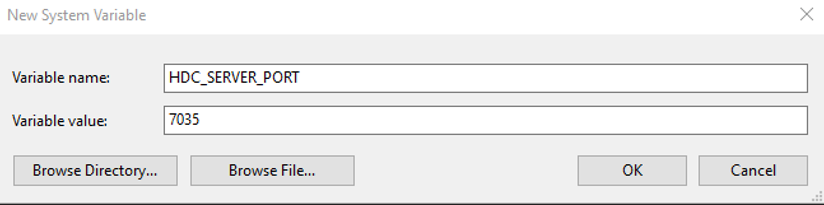
      - macOS环境变量设置方法：

        a. 打开终端，执行以下命令，打开`.bash_profile`文件。

          ```bash
          vi ~/.bash_profile
          ```

          输入以下内容，在PATH路径下添加HDC工具路径和添加`HDC_SERVER_PORT`端口信息：

          ```bash
          export PATH="/Applications/DevEco-Studio.app/Contents/sdk/{版本路径}/openharmony/toolchains:$PATH" # 按照实际 SDK 安装路径配置，需要选择{显示包内容}
          
          HDC_SERVER_PORT=7035 
          launchctl setenv HDC_SERVER_PORT $HDC_SERVER_PORT 
          export HDC_SERVER_PORT
          ```

          > HDC端口变量名为：`HDC_SERVER_PORT`，变量值可设置为任意未被占用的端口，如`7035`。

        b. 编辑完成后，单击Esc键退出编辑模式，然后输入“wq”，单击enter键保存。

        c. 执行以下命令使配置的环境变量生效：

          ```bash
          source ~/.bash_profile
          ```

  5. <span id="set_capi_path">配置CAPI版本环境变量</span>

      当前RN框架提供的Demo工程默认为CAPI版本，您需要配置环境变量`RNOH_C_API_ARCH = 1`。

      - Windows环境：

        在**此电脑 > 属性 > 高级系统设置 > 高级 > 环境变量**中，在系统变量中点击新建，添加变量名为：`RNOH_C_API_ARCH`，变量值为`1`。

        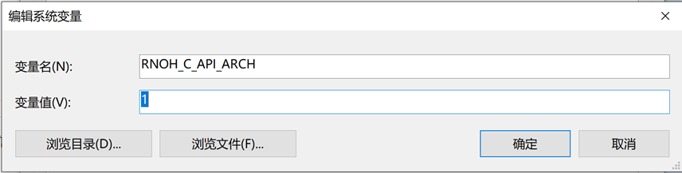

      - Mac环境：

        a. 打开终端应用程序（Terminal），您可以在"应用程序"文件夹的"实用工具"文件夹中找到它。在终端中，输入以下命令来设置环境变量：

          ```bash
          export RNOH_C_API_ARCH=1
          ```

          这将创建一个名为`RNOH_C_API_ARCH`的环境变量，并将其设置为`1`。

        b. 确认环境变量是否成功设置。在终端中输入以下命令：

          ```bash
          echo $RNOH_C_API_ARCH
          ```

          如果输出为1，则表示环境变量已成功设置。

        c. 如果您希望在每次打开终端时都自动设置该环境变量，可以将上述export命令添加到你的bash配置文件（例如~/.bash_profile、~/.bashrc 或 ~/.zshrc）。编辑相应的文件，并在末尾添加以下行：

          ```bash
          export RNOH_C_API_ARCH=1
          ```

        d. 保存文件并关闭编辑器，重新打开终端，检查环境变量是否仍然设置为1：

          ```bash
          echo $RNOH_C_API_ARCH
          ```

          如果输出为1，则表示环境变量已成功设置。

  6. 使用约束

      如果您需要自定义`CMakeLists.txt`，请将so命名为`rnoh_app`。

      ```CMAKE
      add_library(rnoh_app SHARED
          ···
          "${RNOH_CPP_DIR}/RNOHAppNapiBridge.cpp"
      )
      ```

  7. 补充说明

      完成以上环境配置即可进行鸿蒙的React Native项目开发，安卓和iOS的React Native完整环境搭建请参考React Native官网[环境搭建](https://reactnative.cn/docs/environment-setup)。

# 创建React Native工程

​ 本章节主要介绍React Native工程的初始化，安装鸿蒙依赖包，并成功运行的过程。

## 创建新项目

​可选择一个目录，例如D盘根目录，使用 React Native 内置的命令行工具来创建一个名为“AwesomeProject”的新项目。这个命令行工具不需要安装，可以直接用 node 自带的npx命令来创建，目前 React Native for OpenHarmony仅支持**0.72.5**版本的 React Native：

  ```bash
  npx react-native@0.72.5 init AwesomeProject --version 0.72.5
  ```

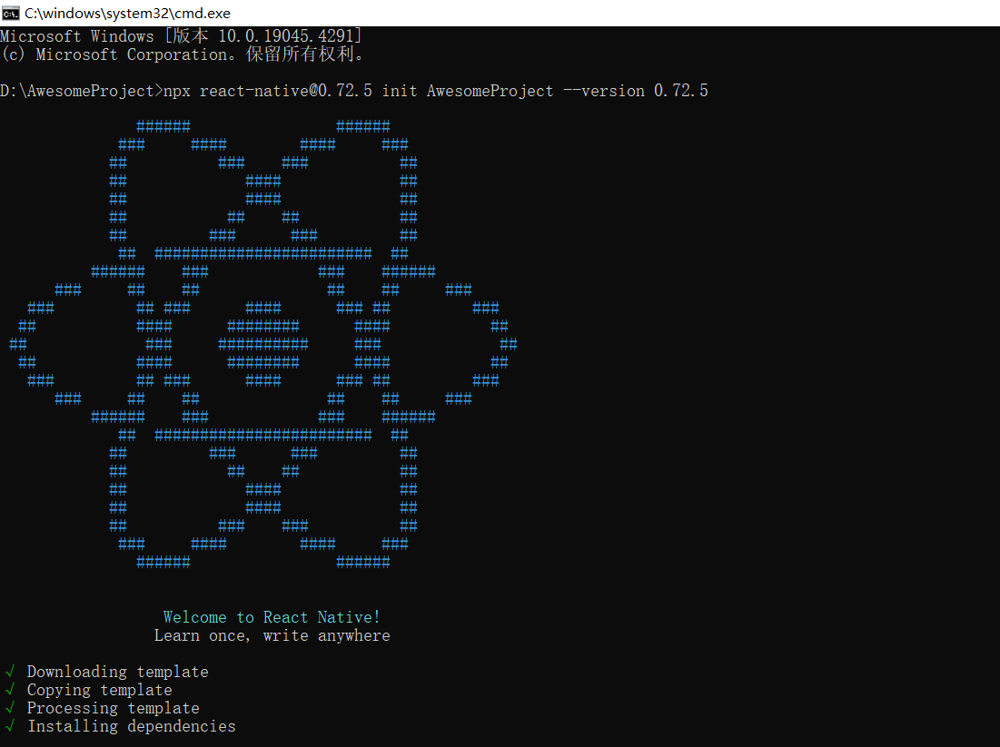

​ 该命令在mac环境下初始化React Native项目时会下载iOS依赖库，耗时较长，开发者可以选择执行以下命令跳过该过程，后续根据需要自行下载，不影响鸿蒙项目开发：

  ```bash
  npx react-native@0.72.5 init AwesomeProject --version 0.72.5 --skip-install
  ```

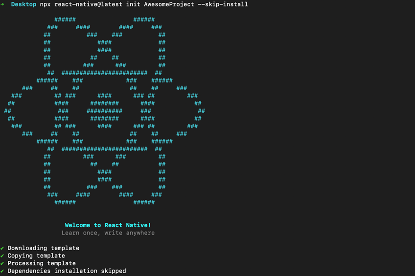

## 安装鸿蒙依赖包并生成bundle

本节中使用的各类文件的版本版本配套关系，可以参考[React Native鸿蒙化版本信息](版本说明.md)。
> 在本节中，您可以按照本节中的操作一步一步完成环境的搭建，也可以使用附件中的`AwesomeProjectReplace.zip`，一一替换对应的文件，修改版本信息并运行。

### 下载并安装鸿蒙化依赖

1. 下载发布文件里的`react-native-harmony`和`react-native-harmony-cli`的tgz包。其中：
   - react-native-harmony-xxx.tgz：React Native的JS侧适配代码；
   - react-native-harmony-cli-xxx.tgz：适配HarmonyOS的一些命令行实现，如`Codegen`。
2. 在AwesomeProject在同级目录下新建文件夹，分别命名为react-native-harmony和react-native-harmony-cli。  
3. 分别将tgz包放入对应的文件中，如图所示：  
   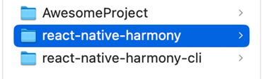
4. 打开`AwesomeProject`目录下的`package.json`，新增HarmonyOS的依赖，并根据发布文件中的react-native-harmony版本，修改`package.json`中对应版本，也就是下面xxx的地方：
   ```diff
   {
    "name": "AwesomeProject",
    "version": "0.0.1",
    "private": true,
    "scripts": {
      "android": "react-native run-android",
      "ios": "react-native run-ios",
      "lint": "eslint .",
      "start": "react-native start",
      "test": "jest",
   +    "dev": "react-native bundle-harmony --dev"
    },
    "dependencies": {
      "react": "18.2.0",
      "react-native": "0.72.5",
   +    "react-native-harmony": "file:../react-native-harmony/rnoh-react-native-harmony-xxx.tgz"
    },
    "devDependencies": {
      "@babel/core": "^7.20.0",
      "@babel/preset-env": "^7.20.0",
      "@babel/runtime": "^7.20.0",
      "@react-native/eslint-config": "^0.72.2",
      "@react-native/metro-config": "^0.72.11",
      "@tsconfig/react-native": "^3.0.0",
      "@types/react": "^18.0.24",
      "@types/react-test-renderer": "^18.0.0",
      "babel-jest": "^29.2.1",
      "eslint": "^8.19.0",
      "jest": "^29.2.1",
      "metro-react-native-babel-preset": "0.76.8",
      "prettier": "^2.4.1",
      "react-test-renderer": "18.2.0",
      "typescript": "4.8.4"
    },
   + "overrides": {
   +   "@react-native-community/cli": "11.3.6",
   +   "@react-native/codegen": "0.74.0"
   + },
   + "resolutions": {
   +   "@react-native-community/cli": "11.3.6"
   + },
    "engines": {
      "node": ">=16"
    }
   }
   ```
5. 在`AwesomeProject`目录下运行安装依赖包命令：
  
    ```bash
    npm install
    ```
    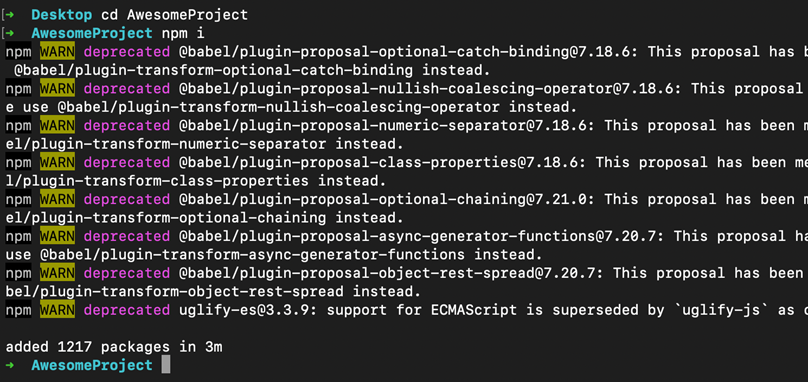

### 运行指令并生成bundle

1. 打开`AwsomeProject\metro.config.js`，并添加HarmonyOS的适配代码。配置文件的详细介绍，可以参考[React Native 中文网](https://reactnative.cn/docs/metro)。修改完成后的文件内容如下：

    ```JavaScript
    const {mergeConfig, getDefaultConfig} = require('@react-native/metro-config');
    const {createHarmonyMetroConfig} = require('react-native-harmony/metro.config');

    /**
    * @type {import("metro-config").ConfigT}
    */
    const config = {
      transformer: {
        getTransformOptions: async () => ({
          transform: {
            experimentalImportSupport: false,
            inlineRequires: true,
          },
        }),
      },
    };

    module.exports = mergeConfig(getDefaultConfig(__dirname), createHarmonyMetroConfig({
      reactNativeHarmonyPackageName: 'react-native-harmony',
    }), config);
    ```
2. 在AwesomeProject目录下运行生成bundle文件的命令。运行成功后，会在`AwesomeProject/harmony/entry/src/main/resources/rawfile`目录下生成`bundle.harmony.js`和`assets`文件夹，`assets`用来存放图片（如果`bundle`中不涉及本地图片，则没有`assets`文件夹）。
  
    ```bash
    npm run dev
    ```

    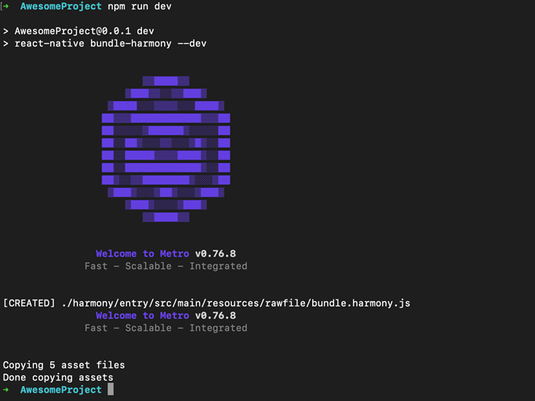

    > 如果运行时报错“`'react-native'不是内部或外部命令，也不是可运行的程序或批处理文件。`”，请重新运行`npm install`命令。

3. 您也可以使用Metro服务来加载bundle包。具体使用方式，可以参考[Metro热加载](调试调测.md#metro热加载)。

# 创建鸿蒙工程

本章节主要介绍了鸿蒙工程的创建，并加载React Native相关的依赖包和bundle包，最终完成鸿蒙工程的运行的过程。
> 您可以按照本节中的操作一步一步完成环境的搭建，也可以使用附件中的`MyApplicationReplace.zip`的内容，一一替换对应的文件，修改版本并运行。

## 新建工程或者在已有工程中集成

​ 下面演示在新建工程中集成。点击`File > New > Create Project`，选择创建`Empty Ability`工程，如图所示：

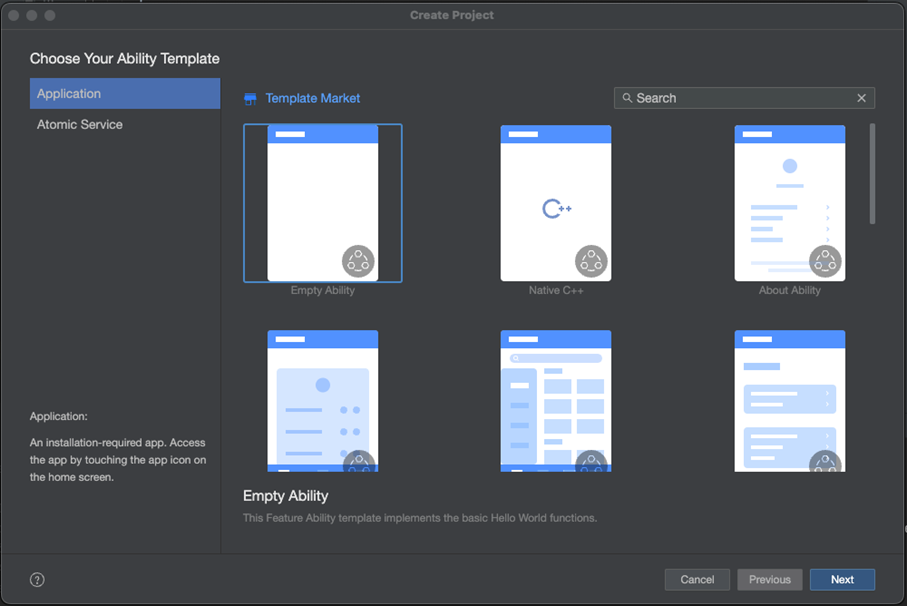

​ 点击`Next`按钮，并在`Compile SDK`中选择`API12`，创建一个名为“MyApplication”的项目。注意项目路径不要太长，如图所示：

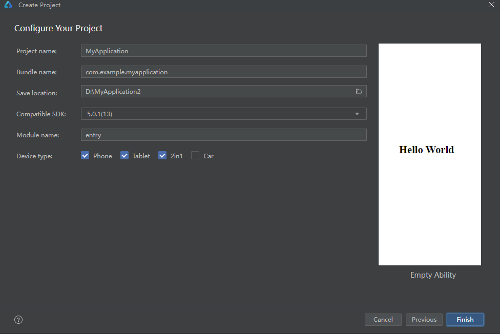

​ 连接真机，点击`File > Project Structure`，在弹窗界面点击`Signing Configs`，勾选`Support HarmonyOS`和`Automatically generate signature`，然后点击`Sign In`登录华为账号，并签名。

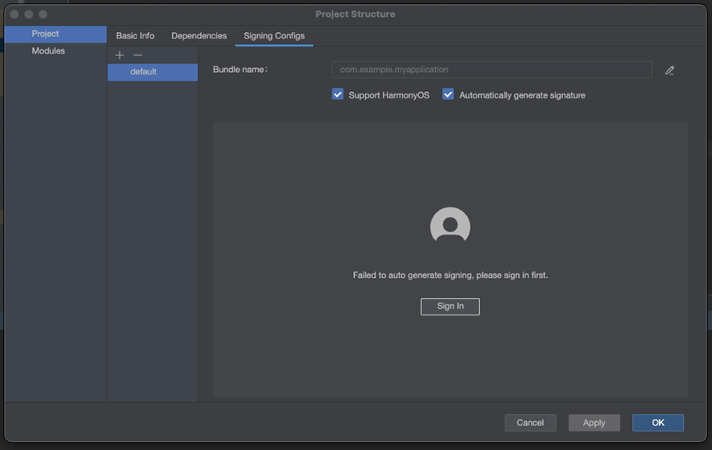

## 添加 React Native 配置

1. 在`MyApplication`目录下新建`libs`文件夹，将`react_native_openharmony-xxx.har`放入该目录。
2. 打开`MyApplication/entry`下的`oh-package.json5`，添加har包的依赖：
    ```diff
    {
      "name": "entry",
      "version": "1.0.0",
      "description": "Please describe the basic information.",
      "main": "",
      "author": "",
      "license": "",
      "dependencies": {
    +     "@rnoh/react-native-openharmony": "file:../libs/react_native_openharmony-xxx.har"
      }
    }
    ```
    > 不要忘记补充使用的har包的版本号。
3. 检查`entry/oh-package.json5`文件中`dependencies`配置的har包依赖路径，点击顶部菜单栏的`File` > `Sync and Refresh Project`来执行`ohpm install`，执行完成后会在`entry`目录下生成`oh_modules`文件夹。
    由于har包比较大，这一步耗时会比较长，务必保证`ohpm install`和IDE自发的`SyncData`全都完成，否则会导致编译报错。

## 在原生工程中集成RNOH

### 补充CPP侧代码

1. 在`MyApplication/entry/src/main`目录下新建cpp文件夹。
2. 在cpp目录下新增`CMakeLists.txt`，并将RNOH的适配层代码添加到编译构建中生成`librnoh_app.so`：
    ```CMake
    project(rnapp)
    cmake_minimum_required(VERSION 3.4.1)
    set(CMAKE_SKIP_BUILD_RPATH TRUE)
    set(OH_MODULE_DIR "${CMAKE_CURRENT_SOURCE_DIR}/../../../oh_modules")
    set(RNOH_APP_DIR "${CMAKE_CURRENT_SOURCE_DIR}")

    set(RNOH_CPP_DIR "${OH_MODULE_DIR}/@rnoh/react-native-openharmony/src/main/cpp")
    set(RNOH_GENERATED_DIR "${CMAKE_CURRENT_SOURCE_DIR}/generated")
    set(CMAKE_ASM_FLAGS "-Wno-error=unused-command-line-argument -Qunused-arguments")
    set(CMAKE_CXX_FLAGS "-fstack-protector-strong -Wl,-z,relro,-z,now,-z,noexecstack -s -fPIE -pie")
    add_compile_definitions(WITH_HITRACE_SYSTRACE)
    set(WITH_HITRACE_SYSTRACE 1) # for other CMakeLists.txt files to use

    add_subdirectory("${RNOH_CPP_DIR}" ./rn)

    add_library(rnoh_app SHARED
        "./PackageProvider.cpp"
        "${RNOH_CPP_DIR}/RNOHAppNapiBridge.cpp"
    )

    target_link_libraries(rnoh_app PUBLIC rnoh)
    ```
3. 在cpp目录下新增`PackageProvider.cpp`，该文件需要满足以下要求：
   - 需要导入`RNOH/PackageProvider`；
   - 实现`getPackages`方法，用于创建三方库或自定义TurboModule或Fabric的package对象。
   > 此处不涉及三方库与自定义TurboModule或组件，需要返回空数组。
    ```CPP
    #include "RNOH/PackageProvider.h"

    using namespace rnoh;

    std::vector<std::shared_ptr<Package>> PackageProvider::getPackages(Package::Context ctx) {
        return {};
    }
    ```
4. 打开`MyApplicaton\entry\build-profile.json5`，将cpp中的代码添加到鸿蒙的编译构建任务中，详细介绍可以参考[模块级build-profile.json5](https://developer.huawei.com/consumer/cn/doc/harmonyos-guides-V5/ide-hvigor-build-profile-0000001778834297-V5#section11914746114811)：
   ```diff
   {
    "apiType": "stageMode",
    "buildOption": {
   +   "externalNativeOptions": {
   +      "path": "./src/main/cpp/CMakeLists.txt",
   +      "arguments": "",
   +      "cppFlags": "",
   +    }
    },
    "buildOptionSet": [
      {
        "name": "release",
        "arkOptions": {
          "obfuscation": {
            "ruleOptions": {
              "enable": true,
              "files": [
                "./obfuscation-rules.txt"
              ]
            }
          }
        }
      },
    ],
    "targets": [
      {
        "name": "default"
      },
      {
        "name": "ohosTest",
      }
    ]
   }
   ```

### 补充ArkTS侧的代码

1. 打开`MyApplicaton\entry\src\main\ets\entryability\EntryAbility.ets`，引入并使用`RNAbility`，该文件需要满足以下的要求：
   - 如果需要扩展使用对应的生命周期函数，请在代码中使用super，`RNAbility`在生命周期函数中进行了对应的操作，需要使用super保证功能不丢失；
   - 需要重写`getPagePath`，返回程序的入口page。
    ```TypeScript
    import { RNAbility } from '@rnoh/react-native-openharmony';

    export default class EntryAbility extends RNAbility {
      getPagePath() {
        return 'pages/Index';
      }
    }
    ```
2. 在`MyApplicaton\entry\src\main\ets`目录下新增`RNPackagesFactory.ets`，该文件需要满足以下要求：
   - 在`@rnoh/react-native-openharmony`导入`RNPackageContext`和`RNPackage`；
   - 在文件中导出`createRNPackages`方法，用于创建三方库或自定义TurboModule、Fabric的package对象。
    > 此处不涉及三方库与自定义TurboModule或组件，需要返回空数组。
    ```TypeScript
    import { RNPackageContext, RNPackage } from '@rnoh/react-native-openharmony/ts';
    export function createRNPackages(ctx: RNPackageContext): RNPackage[] {
      return [];
    }
    ```
3. 打开`MyApplicaton\entry\src\main\ets\pages\Index.ets`，添加RNOH的使用代码，修改后如下：
   > `RNApp`的参数`appKey`需要与RN工程中`AppRegistry.registerComponent`注册的`appName`保持一致，否则会导致白屏。
    ```TypeScript
    import {
      AnyJSBundleProvider,
      ComponentBuilderContext,
      FileJSBundleProvider,
      MetroJSBundleProvider,
      ResourceJSBundleProvider,
      RNApp,
      RNOHErrorDialog,
      RNOHLogger,
      TraceJSBundleProviderDecorator,
      RNOHCoreContext
    } from '@rnoh/react-native-openharmony';
    import { createRNPackages } from '../RNPackagesFactory';

    @Builder
    export function buildCustomRNComponent(ctx: ComponentBuilderContext) {}

    const wrappedCustomRNComponentBuilder = wrapBuilder(buildCustomRNComponent)

    @Entry
    @Component
    struct Index {
      @StorageLink('RNOHCoreContext') private rnohCoreContext: RNOHCoreContext | undefined = undefined
      @State shouldShow: boolean = false
      private logger!: RNOHLogger

      aboutToAppear() {
        this.logger = this.rnohCoreContext!.logger.clone("Index")
        const stopTracing = this.logger.clone("aboutToAppear").startTracing();

        this.shouldShow = true
        stopTracing();
      }

      onBackPress(): boolean | undefined {
        // NOTE: this is required since `Ability`'s `onBackPressed` function always
        // terminates or puts the app in the background, but we want Ark to ignore it completely
        // when handled by RN
        this.rnohCoreContext!.dispatchBackPress()
        return true
      }

      build() {
        Column() {
          if (this.rnohCoreContext && this.shouldShow) {
            if (this.rnohCoreContext?.isDebugModeEnabled) {
              RNOHErrorDialog({ ctx: this.rnohCoreContext })
            }
            RNApp({
              rnInstanceConfig: {
                createRNPackages,
                enableNDKTextMeasuring: true, // 该项必须为true，用于开启NDK文本测算
                enableBackgroundExecutor: false,
                enableCAPIArchitecture: true, // 该项必须为true，用于开启CAPI
                arkTsComponentNames: []
              },
              initialProps: { "foo": "bar" } as Record<string, string>,
              appKey: "AwesomeProject",
              wrappedCustomRNComponentBuilder: wrappedCustomRNComponentBuilder,
              onSetUp: (rnInstance) => {
                rnInstance.enableFeatureFlag("ENABLE_RN_INSTANCE_CLEAN_UP")
              },
              jsBundleProvider: new TraceJSBundleProviderDecorator(
                new AnyJSBundleProvider([
                  new MetroJSBundleProvider(),
                  // NOTE: to load the bundle from file, place it in
                  // `/data/app/el2/100/base/com.rnoh.tester/files/bundle.harmony.js`
                  // on your device. The path mismatch is due to app sandboxing on HarmonyOS
                  new FileJSBundleProvider('/data/storage/el2/base/files/bundle.harmony.js'),
                  new ResourceJSBundleProvider(this.rnohCoreContext.uiAbilityContext.resourceManager, 'hermes_bundle.hbc'),
                  new ResourceJSBundleProvider(this.rnohCoreContext.uiAbilityContext.resourceManager, 'bundle.harmony.js')
                ]),
                this.rnohCoreContext.logger),
            })
          }
        }
        .height('100%')
        .width('100%')
      }
    }
    ```

## 加载bundle包

​ 在上一章节中已经完成了bundle文件的生成，接下来将它加载到DevEco Studio中以运行MyApplication项目。加载bundle有三种方式：
- 方式一：本地加载bundle。将bundle文件和assets图片放在`entry/src/main/resources/rawfile`路径下，在`entry/src/main/ets/pages/Index.ets`中使用。
- 方式二：使用Metro服务加载bundle。详细流程参考[Metro热加载](调试调测.md#metro热加载)。
- 方式三：加载沙箱目录的bundle：
  
  - [应用沙箱](https://gitee.com/openharmony/docs/blob/master/zh-cn/application-dev/file-management/app-sandbox-directory.md)是一种以安全防护为目的的隔离机制，避免数据受到恶意路径穿越访问。在这种沙箱的保护机制下，应用可见的目录范围即为“应用沙箱目录”。
  - 开发者在应用开发调试时，需要向应用沙箱下推送一些文件以期望在应用内访问或测试，此时有两种方式：

    −     第一种：可以通过DevEco Studio向应用安装路径中放入目标文件，详见[应用安装资源访问](https://gitee.com/openharmony/docs/blob/master/zh-cn/application-dev/quick-start/resource-categories-and-access.md)。

    −     第二种：在具备设备环境时，可以使用另一种更为灵活的方式，通过hdc工具来向设备中应用沙箱路径推送文件。推送命令如下，其中，沙箱路径可通过[向应用沙箱推送文件查询](https://gitee.com/openharmony/docs/blob/master/zh-cn/application-dev/file-management/send-file-to-app-sandbox.md)：

    ```bash
    hdc file send ${待推送文件的本地路径} ${沙箱路径}
    ```

  - 加载沙箱目录bundle，需要在RNApp的`jsBundlePrivider`参数中使用`new FileJSBundleProvider('bundlePath')`将bundle注册进框架，并运行bundle。

在`MyApplication/entry`目录下`Index.ets`文件中，创建RNApp时传入`jsBundleProvider`用于加载bundle。如下所示这里传入了`FileJSBundleProvider`，用于沙箱目录加载`bundle`。

## 启动并运行工程

​ 使用DevEco Studio运行MyApplication工程。执行完成后，控制台如图所示：

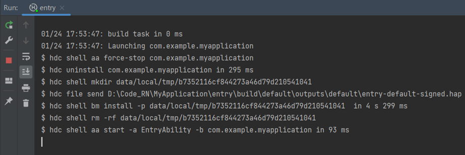

> 全量编译C++代码耗时较长，请耐心等待。

## release包使用

1. 打开`MyApplication/entry`下的`oh-package.json5`，替换har包的依赖为对应版本的release包：
    ```diff
    {
      "name": "entry",
      "version": "1.0.0",
      "description": "Please describe the basic information.",
      "main": "",
      "author": "",
      "license": "",
      "dependencies": {
    +     "@rnoh/react-native-openharmony": "file:../libs/react_native_openharmony-xxx-release.har"
      }
    }
    ```

2. 替换`MyApplication\entry\src\main\cpp\CMakeLists.txt`文件为以下代码


    ```cmake
    project(rnapp)
    cmake_minimum_required(VERSION 3.4.1)
    set(CMAKE_SKIP_BUILD_RPATH TRUE)
    set(NATIVERENDER_ROOT_PATH "${CMAKE_CURRENT_SOURCE_DIR}")
    set(OH_MODULE_DIR "${CMAKE_CURRENT_SOURCE_DIR}/../../../oh_modules")
    set(RNOH_CPP_DIR "${OH_MODULE_DIR}/@rnoh/react-native-openharmony/src/main/include")
    set(REACT_COMMON_PATCH_DIR "${RNOH_CPP_DIR}/patches/react_native_core")

    set(CMAKE_CXX_STANDARD 17)
    set(LOG_VERBOSITY_LEVEL 1)
    set(CMAKE_ASM_FLAGS "-Wno-error=unused-command-line-argument -Qunused-arguments")
    set(RNOH_GENERATED_DIR "${CMAKE_CURRENT_SOURCE_DIR}/generated")
    set(CMAKE_CXX_FLAGS "-fstack-protector-strong -Wl,-z,relro,-z,now,-z,noexecstack -s -fPIE -pie -DNDEBUG")
    set(WITH_HITRACE_SYSTRACE 1) # for other CMakeLists.txt files to use
    add_compile_definitions(WITH_HITRACE_SYSTRACE)
    # folly的编译选项
    set(folly_compile_options
        -DFOLLY_NO_CONFIG=1
        -DFOLLY_MOBILE=1
        -DFOLLY_USE_LIBCPP=1
        -DFOLLY_HAVE_RECVMMSG=1
        -DFOLLY_HAVE_PTHREAD=1
        -Wno-comma
        -Wno-shorten-64-to-32
        -Wno-documentation
        -faligned-new
    )
    add_compile_options("-Wno-unused-command-line-argument")
    # 添加头文件目录
    include_directories(${NATIVERENDER_ROOT_PATH}
                        ${RNOH_CPP_DIR}
                        ${REACT_COMMON_PATCH_DIR}
                        ${RNOH_CPP_DIR}/third-party/folly
                        ${RNOH_CPP_DIR}/third-party/rn/ReactCommon
                        ${RNOH_CPP_DIR}/third-party/rn/ReactCommon/react/nativemodule/core
                        ${RNOH_CPP_DIR}/third-party/rn/ReactCommon/jsi
                        ${RNOH_CPP_DIR}/third-party/rn/ReactCommon/callinvoker
                        ${RNOH_CPP_DIR}/third-party/boost/libs/utility/include
                        ${RNOH_CPP_DIR}/third-party/boost/libs/stacktrace/include
                        ${RNOH_CPP_DIR}/third-party/boost/libs/predef/include
                        ${RNOH_CPP_DIR}/third-party/boost/libs/array/include
                        ${RNOH_CPP_DIR}/third-party/boost/libs/throw_exception/include
                        ${RNOH_CPP_DIR}/third-party/boost/libs/config/include
                        ${RNOH_CPP_DIR}/third-party/boost/libs/core/include
                        ${RNOH_CPP_DIR}/third-party/boost/libs/preprocessor/include
                        ${RNOH_CPP_DIR}/third-party/double-conversion
                        ${RNOH_CPP_DIR}/third-party/rn/ReactCommon/react/renderer/graphics/platform/cxx
                        ${RNOH_CPP_DIR}/third-party/rn/ReactCommon/runtimeexecutor
                        ${RNOH_CPP_DIR}/third-party/glog/src
                        ${RNOH_CPP_DIR}/third-party/boost/libs/mpl/include
                        ${RNOH_CPP_DIR}/third-party/boost/libs/type_traits/include
                        ${RNOH_CPP_DIR}/third-party/rn/ReactCommon/yoga
                        ${RNOH_CPP_DIR}/third-party/boost/libs/intrusive/include
                        ${RNOH_CPP_DIR}/third-party/boost/libs/assert/include
                        ${RNOH_CPP_DIR}/third-party/boost/libs/move/include
                        ${RNOH_CPP_DIR}/third-party/boost/libs/static_assert/include
                        ${RNOH_CPP_DIR}/third-party/boost/libs/container_hash/include
                        ${RNOH_CPP_DIR}/third-party/boost/libs/describe/include
                        ${RNOH_CPP_DIR}/third-party/boost/libs/mp11/include
                        ${RNOH_CPP_DIR}/third-party/boost/libs/iterator/include
                        ${RNOH_CPP_DIR}/third-party/boost/libs/detail/include
                        ${RNOH_CPP_DIR}/patches/react_native_core/react/renderer/textlayoutmanager/platform/harmony
                        )

    configure_file(
      ${RNOH_CPP_DIR}/third-party/folly/CMake/folly-config.h.cmake
      ${RNOH_CPP_DIR}/third-party/folly/folly/folly-config.h
    )
    file(GLOB GENERATED_CPP_FILES "./generated/*.cpp")
    # 添加rnoh动态共享包
    add_library(rnoh SHARED
        "${RNOH_CPP_DIR}/RNOHOther.cpp"
        "${RNOH_CPP_DIR}/third-party/folly/folly/lang/SafeAssert.cpp"
        )
    # 链接其他so
    target_link_directories(rnoh PUBLIC ${OH_MODULE_DIR}/@rnoh/react-native-openharmony/libs/arm64-v8a)
    target_link_libraries(rnoh PUBLIC
        rnoh_semi
        libace_napi.z.so
        libace_ndk.z.so
        librawfile.z.so
        libhilog_ndk.z.so
        libnative_vsync.so
        libnative_drawing.so
        libc++_shared.so
        libhitrace_ndk.z.so
        react_render_scheduler
        rrc_image
        rrc_text
        rrc_textinput
        rrc_scrollview
        react_nativemodule_core
        react_render_animations
        jsinspector
        hermes
        jsi
        logger
        react_config
        react_debug
        react_render_attributedstring
        react_render_componentregistry
        react_render_core
        react_render_debug
        react_render_graphics
        react_render_imagemanager
        react_render_mapbuffer
        react_render_mounting
        react_render_templateprocessor
        react_render_textlayoutmanager
        react_render_telemetry
        react_render_uimanager
        react_utils
        rrc_root
        rrc_view
        react_render_leakchecker
        react_render_runtimescheduler
        runtimeexecutor
        )

    if("$ENV{RNOH_C_API_ARCH}" STREQUAL "1")
        message("Experimental C-API architecture enabled")
        target_link_libraries(rnoh PUBLIC libqos.so)
        target_compile_definitions(rnoh PUBLIC C_API_ARCH)
    endif()
    # RNOH_END: add_package_subdirectories

    # 添加rnoh_app共享包
    add_library(rnoh_app SHARED
        ${GENERATED_CPP_FILES}
        "./PackageProvider.cpp"
        "${RNOH_CPP_DIR}/RNOHOther.cpp"
        "${RNOH_CPP_DIR}/RNOHAppNapiBridge.cpp"
    )

    target_link_libraries(rnoh_app PUBLIC rnoh)

    target_compile_options(rnoh_app PUBLIC ${folly_compile_options} -DRAW_PROPS_ENABLED -std=c++17)


    ```

3. 将`MyApplication/entry`的`oh_module`文件夹删除，点击`entry`文件夹，再点击顶部菜单栏的`build`>`Clean Project`清除项目缓存。
4. 点击顶部菜单栏的`File` > `Sync and Refresh Project`来执行`ohpm install`，执行完成后会在`entry`目录下生成`oh_modules`文件夹。
5. 点击顶部菜单栏的`Run`>`Run 'entry'`运行工程，运行成功后截图如下：
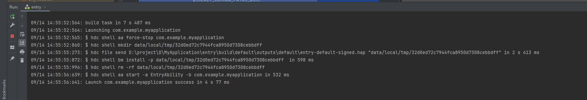