# 调试调测

## Metro热加载

`React Native`使用[`Metro`](https://metrobundler.dev/)构建`JavaScript`代码和资源，本节介绍了配置步骤和使用方式。

### 配置Metro

您需要在项目的`metro.config.js`文件中配置harmony平台的Metro配置选项。它可以导出：

- **一个对象（推荐）**，将与Metro的内部配置默认值合并。
- **一个函数**，该函数将使用Metro的内部配置默认值被调用，并返回最终的配置对象。

在`React Native`中，你的Metro配置应该扩展[@react-native/metro-config](https://www.npmjs.com/package/@react-native/metro-config)或[@expo/metro-config](https://www.npmjs.com/package/@expo/metro-config)。这些包含构建和运行`React Native`应用所需的基本默认值。

为了在harmony平台上配置Metro，您还需要拓展`react-native-harmony`，通过`createHarmonyMetroConfig`创建harmony平台的Metro。

下面是[示例工程](附录.md)中默认的`metro.config.js`文件：

```JavaScript
// metro.config.js
const { mergeConfig, getDefaultConfig } = require('@react-native/metro-config');
const {
  createHarmonyMetroConfig,
} = require('react-native-harmony/metro.config');
/**
 * Metro配置
 * https://metrobundler.dev/docs/configuration
 *
 * @type {import("metro-config").ConfigT}
 */
const config = {
  transformer: {
    getTransformOptions: async () => ({
      transform: { 
        experimentalImportSupport: false, 
        inlineRequires: true 
      },
    }),
  },
};
module.exports = mergeConfig(
  getDefaultConfig(__dirname),
  createHarmonyMetroConfig({
    reactNativeHarmonyPackageName: 'react-native-harmony',
  }),
  config
);
```

如果您使用的是`RNApp`启动的RN框架，那么这一步可以跳过。如果您使用的是`RNSurface`启动的RN框架，您就需要创建一个`RNComponentContext`，并在`context`的`devToolsController`中增加如下的事件监听，并删除原有的`RNInstance`实例，重新启动一个新的`RNInstance`实例，即可启用热加载的功能：

```TypeScript
this.ctx.devToolsController.eventEmitter.subscribe("RELOAD", async () => {
  this.cleanUp();
  ths.init();
})
```

### 使用Metro

RNOH 提供了`MetroJSBundleProvider`API 用于加载Metro服务提供的jsBundle，使用方法如下：

- 场景一 使用`RNApp.ets`

  如果你使用了RNOH提供的组件`RNApp`，则只需要将`new MetroJSBundleProvider()`传给`jsBundleProvider`属性即可：

  ```ts
  RNApp({
    ...
    // 方式1
    // jsBundleProvider: new MetroJSBundleProvider()
    jsBundleProvider: new TraceJSBundleProviderDecorator(
      new AnyJSBundleProvider([
        // 方式2
        new MetroJSBundleProvider(),
      ]),
      this.rnohCoreContext.logger),
  })
  ```

  harmony工程准备好后，用数据线将真机与电脑连接，打开新的命令行工具并执行：

  ```PowerShell
  hdc rport tcp:8081 tcp:8081
  ```

  接下来打开js侧控制台，在RN工程目录中执行以下命令启动RN应用：

  ```PowerShell
  npm run start
  ```

  执行成功后显示以下的内容：

  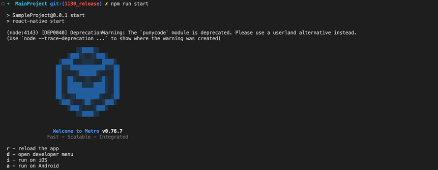

  start命令会使用工程目录下默认的`metro.config.js`，您也可以配置start命令，使用自定义的config文件：

  ```json
  // package.json
  ···
  "scripts": {
    ···
    "start": "react-native start --config metro.config.harmony.js",
    ···
  }
  ···
  ```

- 场景二 不使用`RNApp.ets`

  不使用`RNApp`的话，需要开发者自己去创建并管理`RNInstance`，假设你已经拥有了一个`RNInstance`的实例`rnInstance`，加载Metro服务的方法可参考如下代码：

  ```ts
  rnInstance.runJSBundle(new MetroJSBundleProvider())
  ```

  harmony工程准备好后，接下来打开js侧控制台，在RN工程目录中执行以下命令启动RN应用：

  ```PowerShell
  npm run start
  ```

  然后用数据线将真机与电脑连接，打开新的命令行工具并执行：

  ```PowerShell
  hdc rport tcp:8081 tcp:8081
  ```

  执行成功后显示以下的内容：

  

  start命令会使用工程目录下默认的`metro.config.js`，您也可以配置start命令，使用自定义的config文件：

  ```json
  // package.json
  ···
  "scripts": {
    ···
    "start": "react-native start --config metro.config.harmony.js",
    ···
  }
  ···
  ```

- 场景三 访问局域网中的Metro服务

  上面的方案需要连接数据线并转发8081端口，RNOH另外还提供了另外一个API(`MetroJSBundleProvider.fromServerIp`)，该方法接收3个参数：

  * `ip` - Metro 服务器的IP地址
  * `port` - Metro 服务的端口地址，默认 8081
  * `appKeys` - App name合集，默认空数组

  使用方法便是将`MetroJSBundleProvider.fromServerIp`替换掉上面的`new MetroJSBundleProvider()`，如：

  ```ts
  RNApp({
    ...
    jsBundleProvider: new TraceJSBundleProviderDecorator(
      new AnyJSBundleProvider([
        MetroJSBundleProvider.fromServerIp('192.168.43.14', 8081),
      ]),
      this.rnohCoreContext.logger),
  })
  ```

  这种方式只需要保证手机能连通电脑，打开APP后便能访问Metro服务，不需要连接数据线和转发端口。


使用Metro服务加载bundle时如下场景皆可触发应用刷新：

- 在编辑器中编辑代码，并保存，便可以看到改动点自动更新到手机上
- 在命令行工具中输入r，也会触发应用更新
- 在命令行工具中输入d，在弹出的`React Nactive Dev Menu`对话框中选择Reload也会触发应⽤刷新

## JS调试

### 打开React Native Dev Menu

1. 分别执行以下命令：

    ```PowerShell
    hdc rport tcp:8081 tcp:8081
    ```

    ```PowerShell
    npm run start
    ```

    执行成功后显示以下的内容：

    

2. 在手机上打开应用。
3. 在命令行工具中输入`d`，便可以看到手机上弹出了`React Nactive Dev Menu`对话框。

    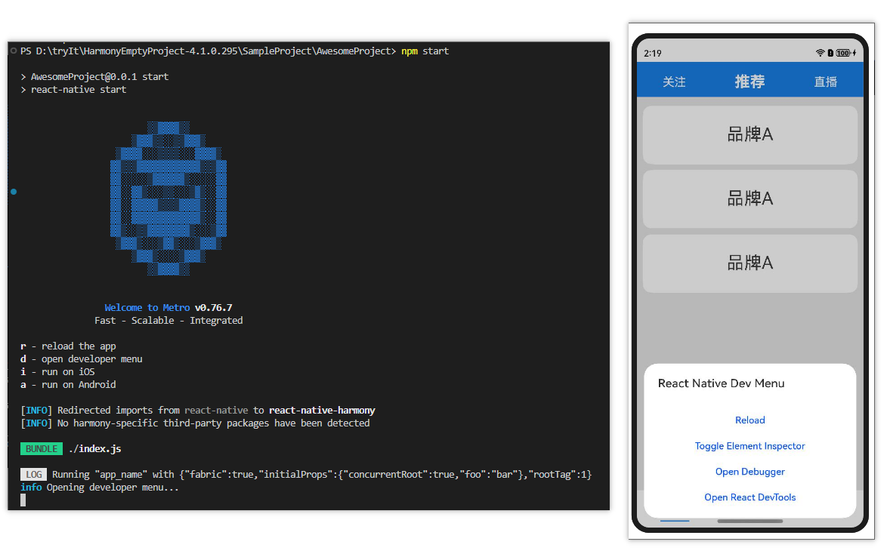

### Element Inspector

您可以通过`Element Inspector`查看RN元素的盒子模型及样式，具体操作步骤如下：

1. 通过Metro加载bundle，打开`React Nactive Dev Menu`对话框后选择`Toggle Element Inspector`。
2. 选择`Inspect`，然后点击要审查的元素，便可看到黑色蒙层中显示出了元素的层级关系、样式以及盒子模型，如图：

    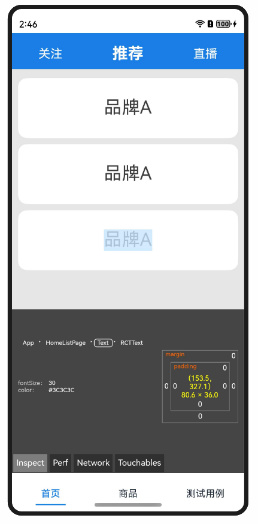

3. 点击蒙层中面包屑的其他节点可查看当前元素的父级/子级元素的样式。
4. 重新点击页面上的其他元素，便可切换到该元素。
5. 取消选中蒙层中的`Inspect`，便可关闭元素审查。

### React DevTools

`React DevTools`可以用于调试应用程序中的React组件层次结构。独立版本的`React DevTools`允许连接到`React Native`应用程序。要使用它，需要[安装或运行 react-devtools 包](https://reactnative.dev/docs/next/react-devtools)。执行步骤如下：

1. 新建一个命令行工具并执行：

    ```PowerShell
    npx react-devtools
    ```

2. 再新建一个命令行工具并执行此命令（`react-devtools`默认使用8097端口）：

    ```PowerShell
    hdc rport tcp:8097 tcp:8097
    ```

3. 通过Metro加载bundle，打开`React Nactive Dev Menu`对话框，选择`Open React DevTools`：

    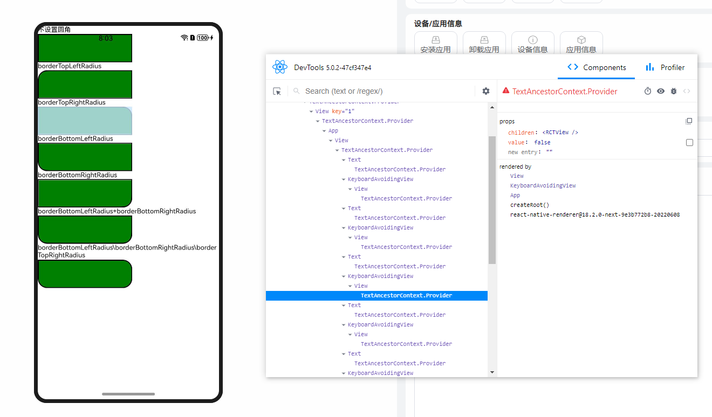

### 断点调试

在启用断点调试之前，需要您启动RN实例的时候开启debugger。您可以在`RNApp`中以`rnInstanceConfig`的参数的形式传入：

```TypeScript
// index.ets
RNApp({
  rnInstanceConfig: {
    enableDebugger: true,
    ···
  },
  ···
})
```

在编码过程中，您可以使用以下两种方式来设置断点，并调试您的代码。

#### flipper

`flipper`是一个移动应用调试器，您可以通过[官网](https://fbflipper.com/)或[github](https://github.com/facebook/flipper/releases)选择v0.239.0版本进行下载并安装。

1. 【可选】安装完成后，将`Flipper.exe`配置到环境变量中。
2. 通过Metro服务加载bundle，并打开手机应用界面的`React Nactive Dev Menu`对话框。
3. 选择`Open Debugger`，便可以自动弹出调试界面，如图所示：

    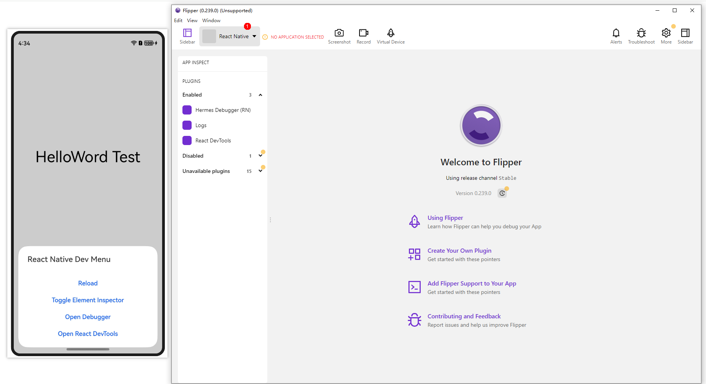

    若没有配置环境变量，可能会出现打开`flipper`失败的情形，此时可手动打开`flipper`，然后在标记1处选择`React Native`，也能达到上述效果。

4. 依次点击`Hermes Debugger (RN)`、`Sources`，接着按`Ctrl + P(macos上command + P)`，然后输入你要调试的文件名，选择文件即可打开源代码，在你要定位的行号点击即打下断点，当代码运行到此处时便会自动停下，如图所示：

    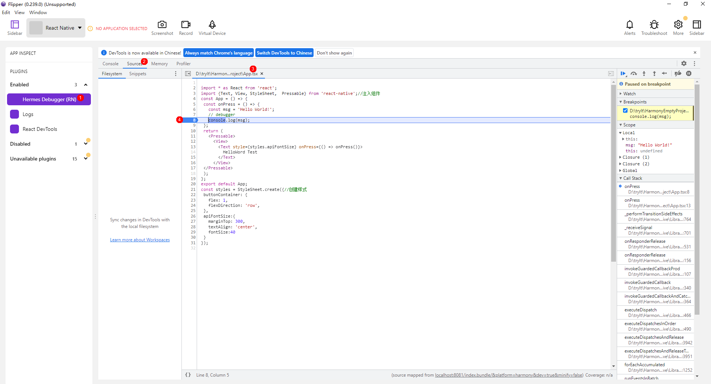

5. 您也可以在代码中写下语句`debugger`，连接`flipper`，当代码运行到`debugger`处时，`flipper`会自动打开源码并定位到`debugger`处以供您调试，如图所示：

    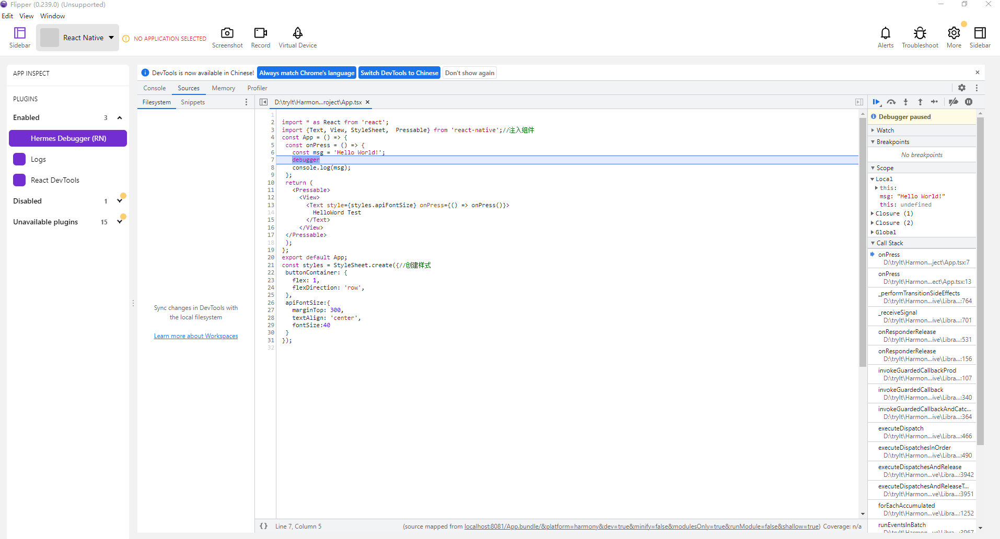

#### Chrome DevTools

在没安装`flipper`的情况下也可通过`Chrome DevTools`进行调试代码，具体操作步骤如下：

1. 通过Metro服务加载bundle。
2. 打开Chrome浏览器，并在地址栏输入：`chrome://inspect`。
3. 点击`Configure...`，然后在弹出的对话框中输入：`localhost:8081`，勾上`[] Enable port forwarding`，点击`Done`，如图：

    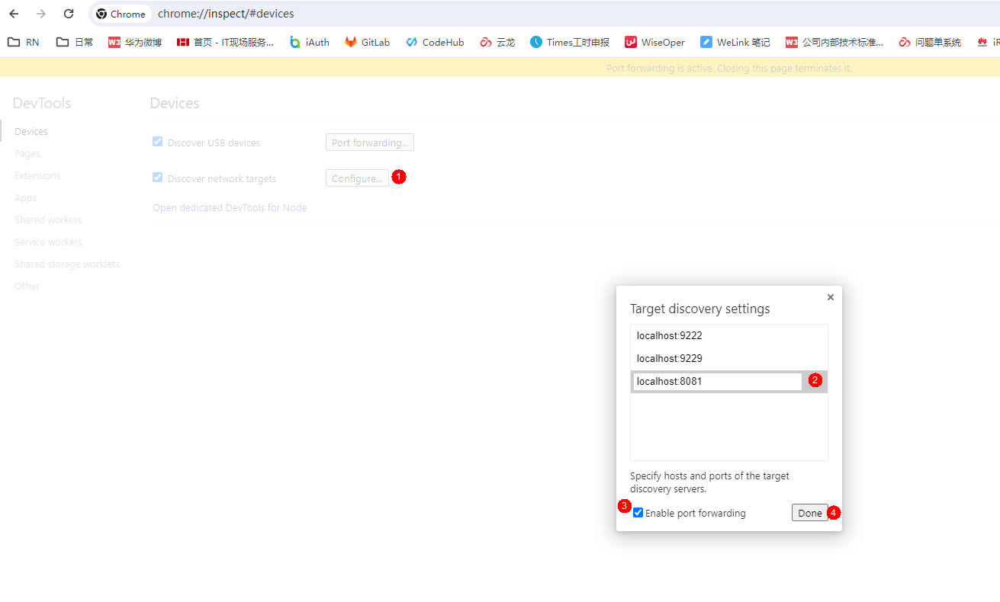

4. 稍等片刻，便可在`Remote Target`面板上看到`Hermes React Native`。
5. 点击`Hermes React Native`下方的`inspect`，便可打开`DevTools`，如图：

    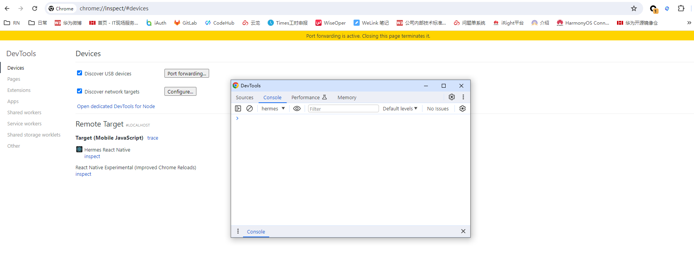

6. 点击`Sources` > `Workspace`选项卡，点击`Add folder`按钮，在弹出来的资源选择器中选择当前项目的源文件然后点击选择文件夹按钮，如图：

    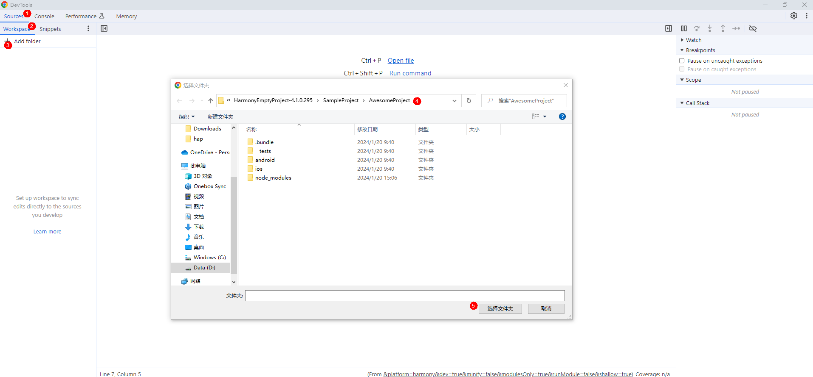

7. 之后打断点的方法跟`flipper`的方式保持一致，如图：

    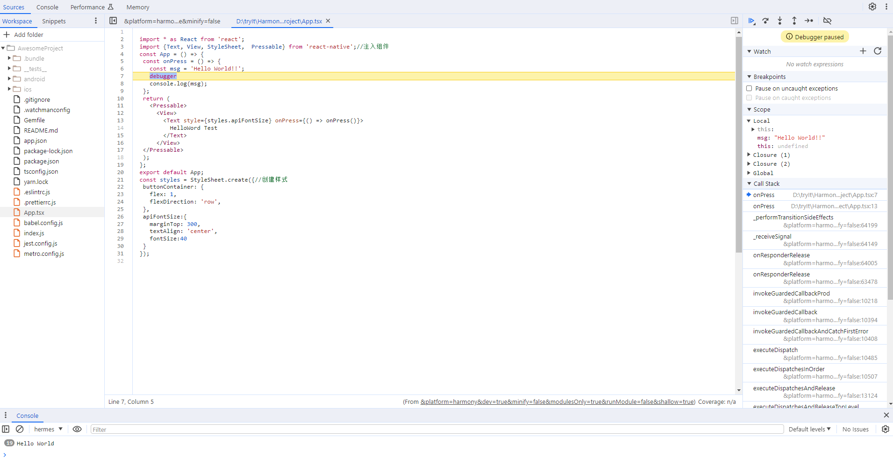

#### 调试常见问题

1. 如果chrome打开断点无法继续执行，请重新启动`inspector`。
2. 如果打开`flipper`之后，看到`loading...`，然后页面一片空白（如图），说明您没有[安装OpenSSL](https://www.openssl.org/)，安装后即可正常使用。

    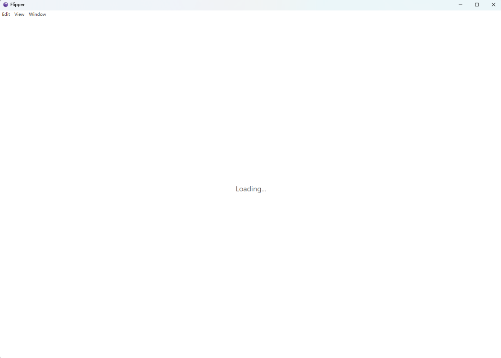

## 报错信息输出

### LogBox日志

`LogBox`是手机侧的故障提示框，当js侧发生错误时手机的应用界面上便会弹出错误告警，如图：

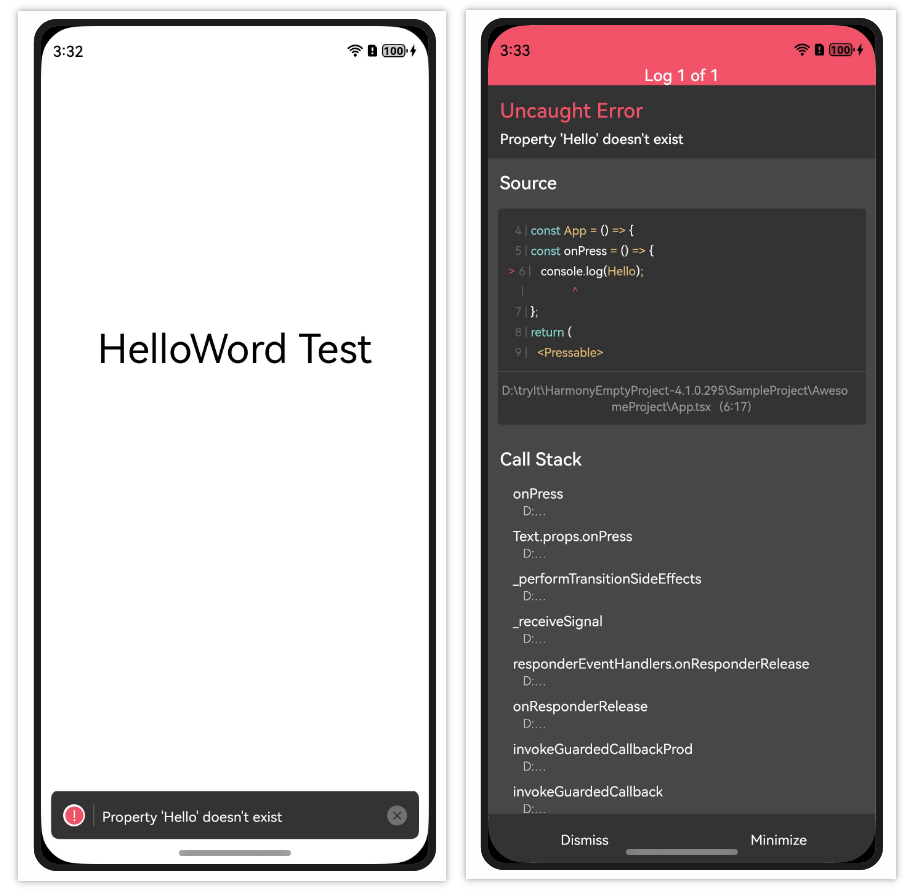

右侧部分即为`LogBox`，展示了错误的说明、源码以及调用栈信息。如果您使用的是Metro服务加载bundle，点击设备上`LogBox`中的调用栈，便可在电脑端中使用编辑器（如VSCode）自动打开对应的文件以供您查看并定位问题。

如果您使用的是`RNApp`启动的RN框架，那么这一步可以跳过。如果您使用的是`RNSurface`启动的RN框架，您就需要创建一个`RNComponentContext`并创建`LogBox`的构造器，并在`context`的`devToolsController`中增加如下的事件监听，并进行对应的启动和关闭`LogBox`弹窗的操作：

```TypeScript
this.logBoxDialogController = new CustomDialogController({
  cornerRadius: 0,
  customStyle: true,
  alignment: DialogAlignment.TopStart,
  backgroundColor: Color.Transparent,
  builder: LogBoxDialog({
    ctx: RNComponentContext,
    rnInstance: this.rnInstance,
    initialProps: this.initialProps,
    buildCustomComponent: this.buildCustomComponent,
  })
})
···
this.rnInstance.getTurboModule<LogBoxTurboModule>(LogBoxTurboModule.NAME).eventEmitter.subscribe("SHOW", () => {
  this.logBoxDialogController.open();
})
this.rnInstance.getTurboModule<LogBoxTurboModule>(LogBoxTurboModule.NAME).eventEmitter.subscribe("HIDE", () => {
  this.logBoxDialogController.close();
})
```

### 控制台日志

#### DevEco Studio

当js侧发生错误时，通过以下方法可在`DevEco Studio`上查看到错误信息：

1. 手机连接到电脑，打开`DevEco Studio`，打开一个项目；
2. 在`DevEco Studio`下方点击`Log`；
3. 在`HiLog`的筛选栏中一次选择你连接的设备、`All logs of selected app`、`[应用包名]`、`Warn/Error`；
4. 设置完后，js侧发生故障时，故障信息便能实时的显示在`DevEco Studio`，如图：

    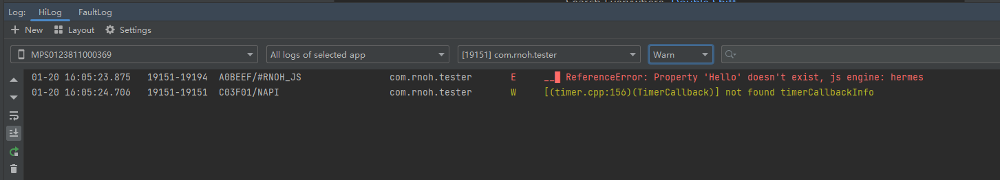

#### 命令行工具

若是通过Metro服务加载bundle，当js侧发生错误时，命令行工具便会输出错误发生的原因和具体位置，如图：

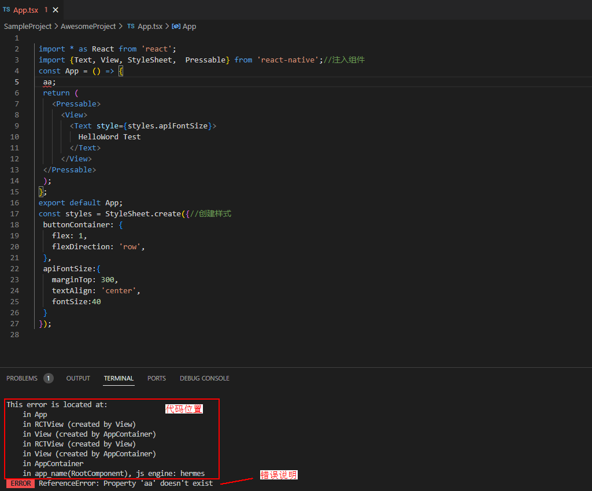

#### 其他

在`React Native`中亦可通过`console.log`、`console.warn`、`throw`等触发一个日志或告警。

### 添加Trace

#### JS侧

可通过引入`react-native`提供的`Systrace`添加Trace。

例如添加一个名为`ONPRESS`的同步Trace，以跟踪一个按钮的`onPress`：

```JavaScript
import {Systrace} from 'react-native';
...
<Button
  onPress={() => {
    Systrace.beginEvent('ONPRESS');
    // do something
    Systrace.endEvent();
  }}
/>
```

例如添加一个名为`ASYNC`的异步Trace，通过两个按钮控制开始和结束：

```JavaScript
import {Systrace} from 'react-native';
...
let traceCookie = null;
...
<Button
  onPress={() => {
    if (traceCookie === null) {
      traceCookie =
      Systrace.beginAsyncEvent('ASYNC');
    }
  }}
/>
<Button
  onPress={() => {
    if (traceCookie !== null) {
      Systrace.endAsyncEvent('ASYNC', traceCookie);
    }
  }}
/>
/>
```

#### ArkTS侧

ArkTS侧大多数类和对象的成员中存在一个logger或者ctx对象（ctx对象内涵一个logger，logger内提供了封装的startTracing()用于添加Trace）。

例如添加一个名为`myTrace`的Trace：

```TypeScript
const stopTracing = this.logger.clone("myTrace").startTracing()
// do something
stopTracing()
```

也可以直接使用未封装的`@ohos.hiTraceMeter`能力添加Trace。

例如添加一个名为`myTrace`的Trace，使用0作为识别标志（用于区分同名Trace）：

```TypeScript
import hiTrace from '@ohos.hiTraceMeter';
...
hiTrace.startTrace(`myTrace`, 0)
// do something
hiTrace.finishTrace(`myTrace`, 0)
```

#### C++侧


可通过引入`react/renderer/debug/SystraceSection.h`，实例化一个`facebook::react::SystraceSection`对象添加Trace。

Trace的范围与该`facebook::react::SystraceSection`对象的生命周期（作用域）相同，可以使用大括号控制范围。

例如添加一个名为`myTrace`的Trace：

```CPP
#include <react/renderer/debug/SystraceSection.h>
...
{
  facebook::react::SystraceSection s("myTrace");
  // do something
}
```
