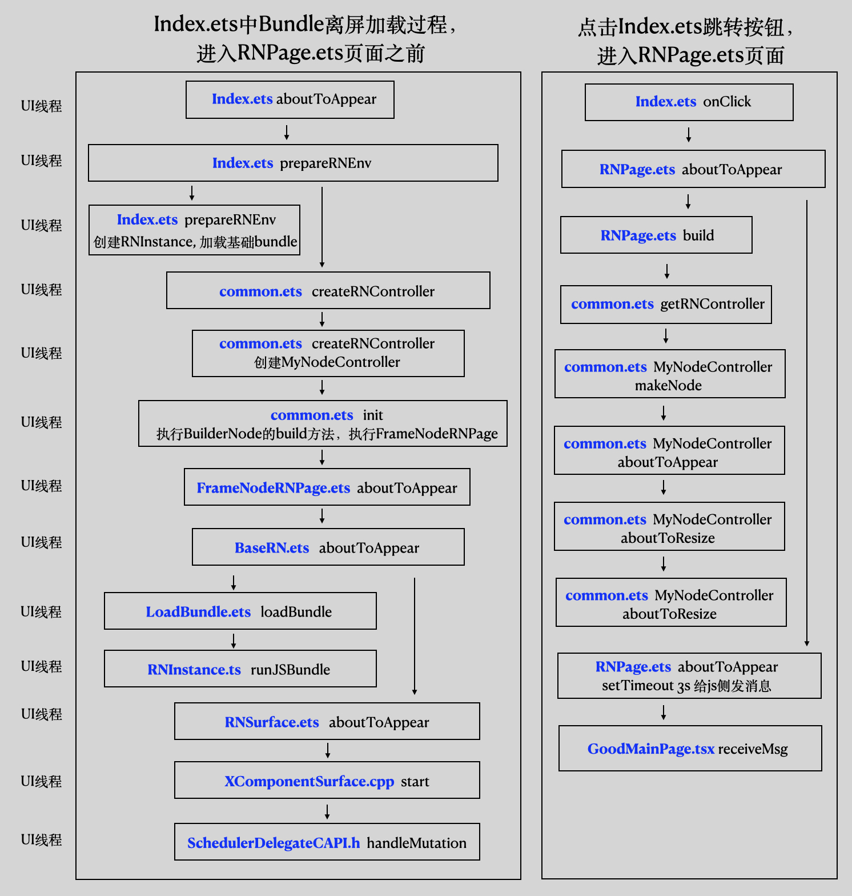

# 预加载RN页面

在鸿蒙操作系统中使用 ArkTS 进行页面预加载是一种高效的优化方式。ArkTS（Ark TypeScript）是鸿蒙的编程语言，结合鸿蒙系统的能力，可以在页面切换时提供更流畅的用户体验。本文将介绍如何在鸿蒙操作系统中使用 ArkTS 进行页面预加载。

## 为什么要进行页面预加载？

在鸿蒙应用中，页面切换可能会涉及大量资源加载、布局计算等操作。如果不进行预加载，用户在切换页面时可能会遇到明显的延迟。通过预加载页面，开发者可以在用户实际访问页面之前提前加载资源，从而减少页面切换时的等待时间。

## 实现步骤

### 1. 初始化 ArkTS 页面

首先，确保你的鸿蒙应用是基于 ArkTS 编写的。以下是一个基础页面结构示例：

```typescript
@Entry
@Component
struct MainPage {
  build() {
    Column() {
      Button("Go to Preloaded Page")
        .onClick(() => {
          // 跳转到预加载页面
          router.push({ url: "pages/PreloadedPage" });
        });
    }
  }
}
```

### 2. 创建预加载逻辑

在 ArkTS 中，可以通过在应用启动或页面初始化时，提前加载目标页面的资源。这可以通过提前初始化页面组件或者预先进行一些计算来实现。

```typescript
@Component
struct PreloadedPage {
  @State data: string = "";

  // 在页面初始化时预加载数据
  aboutToAppear() {
    this.preloadData();
  }

  preloadData() {
    // 进行数据的预加载操作，例如数据请求或资源加载
    ...
  }

  build() {
    Column() {
      Text(this.data.isEmpty() ? "Loading..." : this.data);
    }
  }
}
```

### 3. 在应用启动时进行预加载

在应用的主页面或启动时，可以调用页面的预加载逻辑。这样当用户实际切换到该页面时，资源已经准备就绪。

```typescript
@Entry
@Component
struct MainPage {
  @State isPreloaded: boolean = false;

  build() {
    Column() {
      Button(this.isPreloaded ? "Go to Preloaded Page" : "Preloading...")
        .onClick(() => {
          if (this.isPreloaded) {
            router.push({ url: "pages/PreloadedPage" });
          }
        });
    }
  }

  // 在页面加载时预先加载目标页面
  aboutToAppear() {
    this.preloadPage();
  }

  preloadPage() {
    // 模拟页面预加载
    setTimeout(() => {
      this.isPreloaded = true;
      console.log("Page preloaded");
    }, 1000);
  }
}
```

可参考FrameNode预加载RN页面中的例子。

### 4. 页面切换时的性能优化

在预加载页面资源后，切换页面时可以直接显示已经加载好的内容，减少延迟。你可以在页面切换过程中使用过渡动画或其他优化技术，进一步提升用户体验。

```typescript
router.push({
  url: "pages/PreloadedPage",
  transition: { type: "slide", duration: 300 }
});
```

## 总结

通过在鸿蒙操作系统中使用 ArkTS 进行页面预加载，开发者可以显著提升应用的性能和响应速度。预加载不仅减少了页面切换时的延迟，还能改善整体用户体验。在实际应用中，开发者可以根据不同的业务需求灵活调整预加载策略，以达到最佳效果。

# 预创建RN实例

在鸿蒙操作系统中使用 ArkTS 进行 React Native 实例的预创建，可以有效提升应用启动和页面切换的性能。通过在应用启动阶段提前初始化 React Native 实例，你可以减少用户在访问页面时的延迟。本文将详细介绍如何在 ArkTS 中实现 React Native 实例的预创建。

## 为什么要进行 React Native 实例预创建？

ArkTS 是鸿蒙操作系统的主要开发语言，结合鸿蒙系统的能力，可以更好地管理应用资源和任务。通过 ArkTS 进行 React Native 实例的预创建，开发者可以利用鸿蒙系统的多任务和资源管理能力，确保应用在启动时更加流畅。

## 实现步骤

### 1. 创建预加载逻辑

在应用启动时，使用 ArkTS 的生命周期回调来预创建 React Native 实例。通过在应用初始化阶段创建实例，可以提前加载 React Native 环境，减少后续页面加载时间。

```typescript
@Entry
@Component
struct MainAbility {
  @State reactInstanceReady: boolean = false;

  build() {
    Column() {
      if (this.reactInstanceReady) {
        // React Native 实例已准备好
        Button("Go to React Native Page")
          .onClick(() => {
            // 跳转到 React Native 页面
            router.push({ url: "pages/ReactNativePage" });
          });
      } else {
        // 显示加载中提示
        Text("Loading React Native instance...");
      }
    }
  }

  aboutToAppear() {
    // 在应用启动时预创建 React Native 实例
    this.preCreateReactNativeInstance();
  }

  preCreateReactNativeInstance() {
    // 进行 React Native 实例的初始化
    ...
  }
}
```
可参考FrameNode预加载RN页面中的例子。


### 2. 创建 React Native 页面

在 ArkTS 中，你可以将 React Native 页面作为应用的一部分进行管理。通过在页面实际展示之前，使用预创建的实例，可以加快页面的显示速度。

```typescript
@Component
struct ReactNativePage {
  build() {
    Column() {
      Text("This is a React Native Page")
        .fontSize(20)
        .fontWeight(FontWeight.Bold);
      // 在这里加载和显示 React Native 视图
    }
  }

  // 加载 React Native 视图时，使用预创建的实例
  aboutToAppear() {
    console.log("React Native Page initialized with preloaded instance");
  }
}
```

### 3. 页面切换优化

在页面切换时，可以利用鸿蒙系统的动画和过渡效果，进一步提升用户体验。例如，在页面切换时添加平滑的过渡动画，使用户感受到更加自然的体验。

```typescript
router.push({
  url: "pages/ReactNativePage",
  transition: { type: "slide", duration: 300 }
});
```

## 总结

通过在鸿蒙操作系统中使用 ArkTS 进行 React Native 实例的预创建，可以显著提升应用的启动速度和页面切换的流畅性。ArkTS 结合鸿蒙系统的强大特性，使得开发者可以更加灵活地管理 React Native 实例的生命周期。在实际开发中，可以根据具体需求调整预创建策略，确保应用在性能和资源使用之间达到平衡。

# FrameNode预加载RN页面

在React Native的开发中，Bundle预加载是一个常见的优化手段，可以在应用启动或者切换页面的时候提前进行资源的加载，提升用户体验。本文将介绍如何用FrameNode在鸿蒙中实现React Native页面的预加载。

## 什么是FrameNode
对于具备自己前端定义的三方框架React Native，需要将特定的dsl转换成为ArkUI的声明式描述。这个转换过程需依赖额外的数据驱动绑定至Builder中，转换比较复杂且性能较低。这依赖了系统ArkUI框架的布局、事件能力，以及最基础的节点操作和自定义能力，大部分组件通过自定义完成，但是需要使用部分原生组件混合显示。FrameNode的设计就是为了解决上述的问题。

FrameNode表示组件树的实体节点，配合自定义占位容器组件NodeContainer等，在占位容器内挂载一棵自定义的节点树，并对这个节点树中的节点进行动态的增加、修改、删除等操作。基础的FrameNode可以设置通用属性、设置事件回调，并提供完整的自定义能力，包括自定义测量、布局以及绘制。

除此之外，ArkUI框架还提供获取和遍历获得原生组件对应的代理FrameNode对象的能力，下文简称代理节点。代理节点可以用于需要遍历整个UI的树形结构，并支持获取原生组件节点的具体信息或者额外注册组件的事件监听回调。

详细信息可以参考HarmonyOS官方文档：https://developer.huawei.com/consumer/cn/doc/harmonyos-guides-V5/arkts-user-defined-arktsnode-framenode-V5


## 使用场景
在开发复杂应用时，页面切换的性能至关重要。如果目标页面需要加载大量资源（如图片，文字等），可以通过FrameNode提前进行加载和渲染，从而减少页面切换时的延迟。

## 实现步骤
我们以[FrameNode预加载Sample](../Samples/FrameNodeSample)对FrameNode的加载进行实现步骤的讲解。在这个例子中，我们会尝试构建一个简单的React Native页面，其中主要包含了两个页面，分别为一个首页与一个React Native页面。其中首页通过ArkTS原生编写，而另一个页面则是一个需要加载bundle的React Native页面。

具体的流程图如下所示：



首先，我们在首页的`Index.est`中的`prepareRNEnv()`环节进行初始化，加载基础bundle。使用`common.est`中的`createRNController`进行`NodeControllerd`的创建，并且绑定上对应的`instanceKey`。同时也执行`BuilderNode`的`build`方法，创建并返回`FrameNode`。


```typescript
// index.est中的prepareRNEnv()阶段
async prepareRNEnv(): Promise<Map<string, RNInstance>> {
    this.rnohCoreContext = AppStorage.get('RNOHCoreContext');
    let instanceMap: Map<string, RNInstance> = new Map();

    const cpInstance: RNInstance = await this.rnohCoreContext!.createAndRegisterRNInstance({
      createRNPackages: createRNPackages,
      enableNDKTextMeasuring: true,
      enableBackgroundExecutor: false,
      enableCAPIArchitecture: true,
      arkTsComponentNames: arkTsComponentNames
    }
    );
    const ctxCp: RNComponentContext = new RNComponentContext(
      RNOHContext.fromCoreContext(this.rnohCoreContext!, cpInstance),
      wrapBuilder(buildCustomComponent),
      wrapBuilder(buildRNComponentForTag),
      new Map()
    );

    LoadManager.cpInstance = cpInstance;
    await cpInstance.runJSBundle(new ResourceJSBundleProvider(getContext().resourceManager,
      'bundle/bundle.harmony.js'));
    instanceMap.set('CPReactInstance', cpInstance);

    return instanceMap;
  }
```

```typescript
// common.ets中的MyNodeController，进行FrameNode创建并返回
class MyNodeController extends NodeController {
  private rootNode: BuilderNode<[Params]> | null = null;
  private isRemove: boolean = false;

  aboutToAppear(): void {
  }

  aboutToResize(size: Size): void {
  }

  setRemove(status: boolean) {
    this.isRemove = status;
  }

  makeNode(uiContext: UIContext): FrameNode | null {
    if (this.isRemove) {
      return null;
    }

    if (this.rootNode === null) {
      this.rootNode = new BuilderNode(uiContext);
      this.rootNode.build(wrapBuilder<BuilderData[]>(myRNPageBuilder), { text: 'This is a Text' })
    }

    return this.rootNode.getFrameNode();
  }

  rebuild(): void {
    super.rebuild();
  }

  update(message: string) {
    if (this.rootNode !== null) {
      this.rootNode.update({ text: message });
    }
  }

  init(instanceKey: string, uiContext: UIContext) {
    if (this.rootNode != null) {
      return;
    }
    this.rootNode = new BuilderNode(uiContext)
    this.rootNode.build(wrapBuilder<BuilderData[]>(myRNPageBuilder), { text: 'This is a Text' })
  }
}
```

在`common.est`中使用`FrameNodeRNPage`的构造器，传入对应的Instance, bundle进行预加载。

```typescript
// FrameNodePage.ets中的build()
build() {
    Stack() {
      BaseRN({
        rnInstance: this.instance,
        moduleName: this.moduleName,
        bundlePath: this.bundlePath,
      }).align(Alignment.Top).margin({ top: 0 })
    }
  }
```

通过上述的步骤，我们就可以在`index.ets`进行加载的同时对需要进行bundle加载的页面进行预加载。之后在进行首页中的按键点击时，对应的`RNPage.est`页面已完成加载，可以进行更快的渲染。

## 总结
通过使用 FrameNode 进行 Bundle 预加载，可以显著提升 OpenHarmony 应用的启动和页面切换性能。上述步骤展示了如何在应用中实现这一功能，开发者可以根据实际需求进行灵活调整。