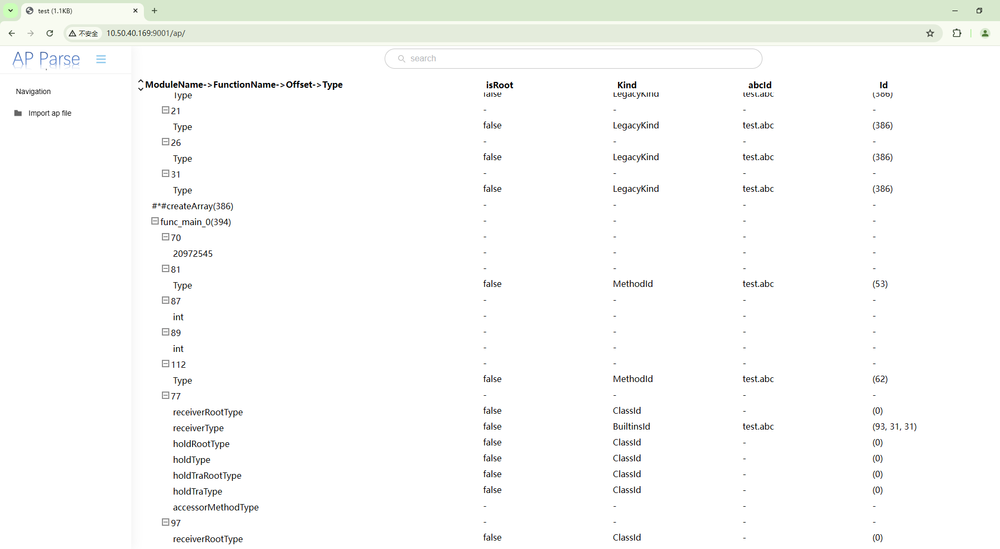

# Ap文件可视化工具

#### 简介

本文主要介绍Ap文件可视化工具，该工具根据ark_js_vm生成的ap文件实现可视化分析，该工具通过web访问。

#### 目录

```
arkcompiler/ets_runtime/tools/ap_file_viewer
├── build.py   构建脚本
├── native     ap文件解析为json源码
├── package.json 项目配置文件
├── README.md   工具使用指导文档
├── server     工具web服务代码
├── src        工具前端源码
└── webpack.config.js webpack打包配置文件
```

#### 使用对象

分析ap文件的开发者

#### 使用场景

需对ap文件分析，窗口中展示可视化展示ap文件内容

#### 工具使用

具体的工具使用步骤，可以左键单击以下链接了解：

[工具使用说明](./docs/INSTRUCTION_zh.md)


### 工具输出

在window或linux环境下，根据导入ap件，如下图所示：



## 工具开发说明

### 对象

工具的开发者

### 开发场景

若当前工具的功能已经不能满足开发者的全部需求，则开发者可以基于已有的源码对工具进行二次开发，来增强工具的能力，编译打包生成自定义的工具。

### 开发步骤

[工具开发说明](./docs/DEVELOP_zh.md)

## 版本说明

暂无

## FAQ

## 参与贡献

暂无

## 相关仓

暂无


