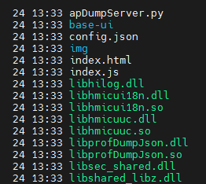
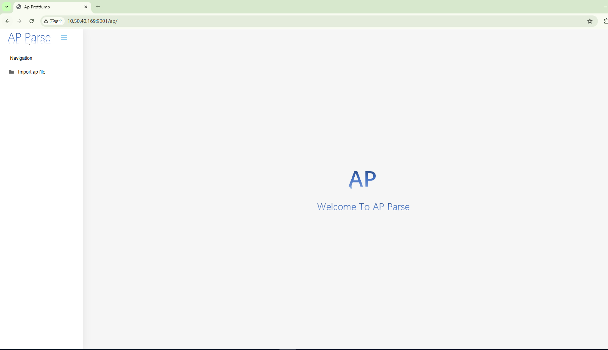

# AP可视化工具开发说明

若当前工具功能不满足开发者需求，开发者需增强工具能力，则可基于已有源码进行工具二次开发，编译打包生成自定义的工具。

## 使用场景

1. 编译打包发布工具

2. 开发者需增强工具能力，进行二次开发

## 编译步骤：

#### 编译：

在ap_file_viewer 目录下执行

```
python build.py
```

生成dist目录,dist目录中内容如下：



#### 运行

在dist目录内运行python apDumpServer.py启动web服务，如下图所示：


打开chrome浏览器，访问http://{ip}:9001/ap/，如下图所示：



#### 开发

```
项目整体为BS架构：
   native为 C++ 代码，提供将ap文件转换为json的接口。
   server为 python 代码, 提供http接口，主要有：文件上传接口和静态文件访问接口
   src 是前端js代码， 提供json数据渲染
```
