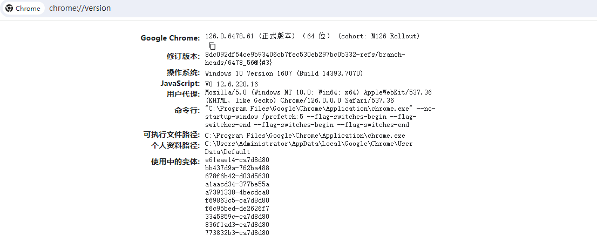

# AP分析工具单元测试

## 概述
为了确保开发过程中代码逻辑紧密贴合设计要求，实施单元测试是一种关键实践。本文主要介绍AP分析工具单元测试使用指导。

## 目录

    ap_code
        ├── ...                    # 其他文件        
        └──test
             ├── figures           # 图片文件
             ├── test.txt          # txt格式文件
             ├── test.ap           # ap后缀文件
             ├── test_ap.py        # 单元测试代码
             ├── requirements.txt  # python依赖库
             └── README.md         # 指导文档    

## 软件环境准备

依赖版本：python3.11

1.右键windows开始菜单，单击运行，输入cmd，单击确定。

2.在命令行中进入到ap_code\test目录下，安装依赖库命令如下：

	pip install -r requirements.txt

3.查看谷歌浏览器版本，此处得到浏览器版本为126.0.6478.61，查询网址为：chrome://version/，在浏览器中访问，如下图所示：

4.由于浏览器版本为126.0.6478.61，查看驱动版本列表中是否有126.0.6478.61版本，若有可下载此版本驱动；若没有可下载126.0.6478版本。进入版本系统选择列表后，选择win32（win系统不区分win32或win64）下载压缩包，下载地址如下：

[驱动下载地址](https://googlechromelabs.github.io/chrome-for-testing/)

5.将解压缩获得的chromedriver.exe放到Python的Scripts目录下。

## 使用说明

在命令行中进入到ap_code\test目录下：

1.执行所有用例，命令为：

	pytest -s -W ignore test_ap.py

2.执行单个用例，如test_import_file，命令为：

	pytest -s -W ignore test_ap.py::test_import_file

## 相关仓

暂无
