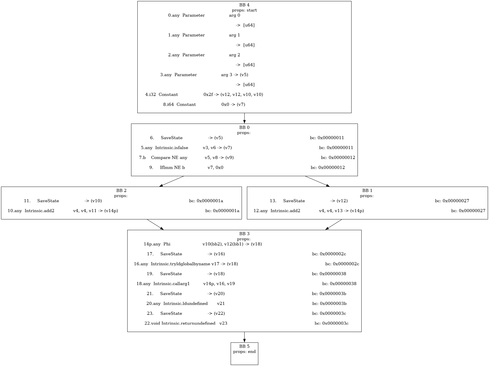

# Tool draw_cfg.py
## Introduction

`draw_cfg.py` is a tool for drawing IR CFGs, you can find it in `runtime_core/compiler/tools/`.


## Dependencies

To install `graphviz` in ubuntu:

```shell
sudo apt install graphviz
pip3 install graphviz
```


## Usage

```
usage: draw_cfg.py [-h] [--no-insts] [--out OUT]

A tool for drawing CFGs by reading ir dump from stdin

options:
  -h, --help  show this help message and exit
  --no-insts  drawing without ir instructions
  --out OUT   output directory, default to './out'
```

Example:

Suppose you want to draw the IR CFG of following js code:

```js
function example(cond) {
    let a = 47;
    if (cond) {
        a = a + a;
    } else {
        a = a + a;
    }

    print(a);
}
```

You should:

1. get ir dump from optimizer, as follows:

```
Method: L_GLOBAL;::example

BB 4
prop: start, bc: 0x00000000
    0.any  Parameter                  arg 0                                                                
 ->  [u64]
    1.any  Parameter                  arg 1                                                                
 ->  [u64]
    2.any  Parameter                  arg 2                                                                
 ->  [u64]
    3.any  Parameter                  arg 3 -> (v5)                                                                
 ->  [u64]
    4.i32  Constant                   0x2f -> (v12, v12, v10, v10)                                                                
    8.i64  Constant                   0x0 -> (v7)                                                                
succs: [bb 0]

BB 0  preds: [bb 4]
prop: bc: 0x00000000
    6.     SaveState                   -> (v5)                                                                 bc: 0x00000011
    5.any  Intrinsic.isfalse           v3, v6 -> (v7)                                                                 bc: 0x00000011
    7.b    Compare NE any             v5, v8 -> (v9)                                                                 bc: 0x00000012
    9.     IfImm NE b                 v7, 0x0                                                                 bc: 0x00000012
succs: [bb 1, bb 2]

BB 2  preds: [bb 0]
prop: bc: 0x00000014
   11.     SaveState                   -> (v10)                                                                 bc: 0x0000001a
   10.any  Intrinsic.add2              v4, v4, v11 -> (v14p)                                                                 bc: 0x0000001a
succs: [bb 3]

BB 1  preds: [bb 0]
prop: bc: 0x00000021
   13.     SaveState                   -> (v12)                                                                 bc: 0x00000027
   12.any  Intrinsic.add2              v4, v4, v13 -> (v14p)                                                                 bc: 0x00000027
succs: [bb 3]

BB 3  preds: [bb 2, bb 1]
prop: bc: 0x0000002c
  14p.any  Phi                        v10(bb2), v12(bb1) -> (v18)                                                                
   17.     SaveState                   -> (v16)                                                                 bc: 0x0000002c
   16.any  Intrinsic.tryldglobalbyname v17 -> (v18)                                                                 bc: 0x0000002c
   19.     SaveState                   -> (v18)                                                                 bc: 0x00000038
   18.any  Intrinsic.callarg1          v14p, v16, v19                                                                 bc: 0x00000038
   21.     SaveState                   -> (v20)                                                                 bc: 0x0000003b
   20.any  Intrinsic.ldundefined       v21                                                                 bc: 0x0000003b
   23.     SaveState                   -> (v22)                                                                 bc: 0x0000003c
   22.void Intrinsic.returnundefined   v23                                                                 bc: 0x0000003c
succs: [bb 5]

BB 5  preds: [bb 3]
prop: end, bc: 0x0000003d
```

2. use `draw_cfg.py` to draw CFG:

```shell
./draw_cfg.py --out out < your_ir_dump
```

Output image is `./out/cfg_L_GLOBAL;::example.png`: 
