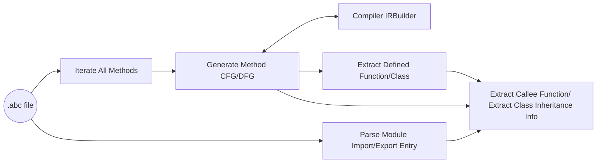

# 基于方舟字节码文件的安全扫描接口

## 1.背景

JS/TS 应用中对关键敏感函数的调用参数，如果直接来自用户的外部输入，没有进行有效性判断，容易导致注入攻击或者应用程序崩溃。因此，需要提供基于方舟字节码文件（Ark ByteCode, 简称`abc`）的安全漏洞扫描工具，以提高应用的可靠性、安全性。

在此，我们为安全漏洞扫描工具提供基于`abc`文件的分析接口，以供分析相关函数的调用链和参数信息，进行漏洞检测。

## 2.原理

工具的大致实现流程如下：



对一个`abc`文件，我们会解析它导入和导出的模块间信息，遍历所有函数，调用IR Builder的接口，生成所有函数的控制流图和数据流图。根据生成图以及模块间的导入导出信息，构建函数之间的调用关系以及类的继承关系，并提供相应的接口。

## 3.使用方法

### 3.1 支持平台说明

安全扫描工具当前支持在Linux/MacOS平台上编译和运行，以及在Linux平台上交叉编译能够在Windows平台上运行的可执行程序。

### 3.2 自定义代码

我们在`runtime_core/libark_defect_scan_aux/tests/unittest/defect_scan_aux_demo.cpp`提供了简单的示例代码，其中指定了`abc`文件路径（例如，`test.abc`），开发者可根据需求修改该示例代码文件，然后编译运行。

### 3.3 编译命令

#### Linux
```
./build.sh --product-name rk3568 --build-target ark_host_linux_defectscanaux_unittest
```

`out/rk3568/clang_x64/arkcompiler/runtime_core`目录下会生成示例文件对应的可执行程序文件。

#### Windows
```
./build.sh --product-name rk3568 --build-target ark_host_win_defectscanaux_unittest
```

`out/rk3568/mingw_x86_64/arkcompiler/runtime_core`目录下会生成示例文件对应的可执行程序文件。

#### Mac M1
```
cd ${OpenHarmony}

./prebuilts/build-tools/darwin-arm64/bin/gn gen ./out/mac_arm64 \
--root=. \
--dotfile=./arkcompiler/toolchain/build/compile_script/.gn \
--args="target_os=\"mac\" target_cpu=\"arm64\" is_debug=false"

./prebuilts/build-tools/darwin-arm64/bin/ninja  -d keeprsp -C out/mac_arm64 ark_host_defectscanaux_tools -k 1
```

`out/mac_arm64/arkcompiler/runtime_core`目录下会生成示例文件对应的可执行程序文件。

#### Mac x64
```
cd ${OpenHarmony}

./prebuilts/build-tools/darwin-x86/bin/gn gen ./out/mac_x64 \
--root=. \
--dotfile=./arkcompiler/toolchain/build/compile_script/.gn \
--args="target_os=\"mac\" target_cpu=\"x64\" is_debug=false"

./prebuilts/build-tools/darwin-x86/bin/ninja  -d keeprsp -C out/mac_x64 ark_host_defectscanaux_tools -k 1
```

`out/mac_x64/arkcompiler/runtime_core/`目录下会生成示例文件对应的可执行程序文件。

### 3.4 如何生成`abc`文件

#### 3.4.1 使用命令行
参考《[es2panda使用方式](https://gitee.com/openharmony/arkcompiler_ets_frontend/blob/master/README_zh.md#%E7%BC%96%E8%AF%91%E6%9E%84%E5%BB%BA)》编译js/ts文件生成`abc`文件。

#### 3.4.2 使用DevEco Studio
通过DevEco Studio编译应用，编译成功后，解压应用`hap`包，找到其中的`abc`文件。

### 3.5 执行扫描

将需要扫描的`abc`文件放到示例代码中指定的文件路径后，执行示例代码对应的可执行程序即可。

以 Linux 为例
```shell
cd out/rk3568/clang_x64/arkcompiler/runtime_core
./defect_scan_aux_demo
```

## 4.接口说明

### 4.1 `AbcFile`

| 接口名及参数 | 描述 |
| ----------- | ---- |
| static std::unique_ptr\<const AbcFile\> Open(std::string_view abc_filename)                                                | 根据文件名打开方舟字节码文件并返回该文件 |
| bool IsMergeAbc() const                                                                                                    | 返回方舟字节码文件是否为合并格式 |
| const std::set\<std::string\> GetFileRecordList() const                                                                    | 若为合并abc，返回所有文件描述名 |
| size_t GetFileRecordCount() const                                                                                          | 若为合并abc，返回abc中的文件个数 |
| const std::string &GetAbcFileName() const                                                                                  | 返回方舟字节码文件的名称 |
| const std::vector\<std::shared_ptr\<Class\>\> &GetClassList() const                                                        | 返回包含所有类的列表 |
| size_t GetDefinedFunctionCount() const                                                                                     | 返回定义的函数个数 |
| size_t GetDefinedClassCount() const                                                                                        | 返回定义的类的个数 |
| const Function \*GetFunctionByName(std::string_view func_name) const                                                       | 根据名称返回指定函数 |
| const Function \*GetExportFunctionByExportName(std::string_view export_func_name, std::string_view record_name = "") const | 根据导出名返回指定的导出函数，若为合并abc，需指定文件描述名 |
| const Class \*GetClassByName(std::string_view class_name) const                                                            | 根据类名返回指定类 |
| const Class \*GetExportClassByExportName(std::string_view export_class_name, std::string_view record_name = "") const      | 根据导出名返回指定的导出类，若为合并abc，需指定文件描述名 |
| size_t GetLineNumberByInst(const Function \*func, const Inst &inst) const                                                  | 根据指令返回该指令对应源码的行号 |
| std::string GetLocalNameByExportName(std::string_view export_name, std::string_view record_name = "") const                | 根据变量的导出名返回其本地的名称，若为合并abc，需指定文件描述名 |
| std::string GetImportNameByExportName(std::string_view export_name, std::string_view record_name = "") const               | 根据变量的导出名返回其导入的名称，若为合并abc，需指定文件描述名 |
| std::string GetModuleNameByExportName(std::string_view export_name, std::string_view record_name = "") const               | 根据变量的导出名返回导入该变量的模块名，若为合并abc，需指定文件描述名 |
| std::string GetModuleNameByLocalName(std::string_view local_name, std::string_view record_name = "") const                 | 根据变量的本地名返回导入该变量的模块名，若为合并abc，需指定文件描述名 |
| std::string GetImportNameByLocalName(std::string_view local_name, std::string_view record_name = "") const                 | 根据变量的本地名返回该变量的导入名，若为合并abc，需指定文件描述名 |

### 4.2 `Function`

| 接口名及参数 | 描述 |
| ----------- | ---- |
| const std::string &GetFunctionName() const                              | 返回函数名 |
| const AbcFile \*GetAbcFileInstance() const                              | 返回该函数所在的方舟字节码文件 |
| const std::string &GetRecordName() const                                | 若为合并abc，返回该函数所在的文件描述名 |
| const Graph &GetGraph() const                                           | 返回该函数的构图 |
| const Class \*GetClass() const                                          | 返回定义该函数的类 |
| const Function \*GetParentFunction() const                              | 返回定义该函数的函数 |
| uint32_t GetArgCount() const                                            | 返回参数个数 |
| size_t GetDefinedClassCount() const                                     | 返回函数中定义的类的个数  |
| size_t GetDefinedFunctionCount() const                                  | 返回函数中定义的函数的个数 |
| size_t GetCalleeInfoCount() const                                       | 返回调用信息的个数 |
| const CalleeInfo \*GetCalleeInfoByCallInst(const Inst &call_inst) const | 根据调用指令返回调用信息 |

### 4.3 `Class`

| 接口名及参数 | 描述 |
| ----------- | ---- |
| const std::string &GetClassName() const                                   | 返回类名 |
| const AbcFile *GetAbcFileInstance() const                                 | 返回该类所在的方舟字节码文件 |
| const std::string &GetRecordName() const                                  | 若为合并abc，返回该类所在的文件描述名 |
| Function *GetDefiningFunction() const                                     | 返回定义该类的函数 |
| size_t GetMemberFunctionCount() const                                     | 返回成员函数的数量 |
| const Function *GetMemberFunctionByName(std::string_view func_name) const | 根据名称返回成员函数 |
| const std::vector<const Function *> &GetMemberFunctionList() const        | 返回所有成员函数 |
| const Class *GetParentClass() const                                       | 返回父类 |
| const std::string &GetParentClassName() const                             | 返回父类名 |
| const std::string &GetParClassExternalModuleName() const                  | 返回导入父类的模块名 |
| const std::string &GetParClassGlobalVarName() const                       | 返回父类的全局变量名 |

### 4.4 `CalleeInfo`

| 接口名及参数 | 描述 |
| ----------- | ---- |
| int GetCalleeArgCount() const                    | 返回该被调者的参数个数 |
| const Inst &GetCallInst() const                  | 返回该被调者相关的调用指令 |
| const Function \*GetCaller() const               | 返回该被调者的调用者 |
| const Class \*GetClass() const                   | 返回该被调者所在的类 |
| const Function \*GetCallee() const               | 返回该被调者的对应函数 |
| const std::string &GetFunctionName() const       | 返回该被调者的函数名 |
| const std::string &GetClassName() const          | 返回该被调者所在的类名 |
| const std::string &GetExternalModuleName() const | 返回导入该被调者的模块名 |
| const std::string &GetGlobalVarName() const      | 返回该被调者所在的全局变量名 |

### 4.5 `Graph`
| 接口名及参数 | 描述 |
| ----------- | ---- |
| BasicBlock GetStartBasicBlock() const                      | 返回第一个基块 |
| BasicBlock GetEndBasicBlock() const                        | 返回最后一个基块 |
| std::vector<BasicBlock> GetBasicBlockList() const          | 返回所有基块 |
| void VisitAllInstructions(const InstVisitor visitor) const | 遍历所有指令 |

### 4.6 `BasicBlock`

| 接口名及参数 | 描述 |
| ----------- | ---- |
| std::vector\<BasicBlock\> GetPredBlocks() const | 返回前驱基块 |
| std::vector\<BasicBlock\> GetSuccBlocks() const | 返回后继基块 |
| std::vector\<Inst\> GetInstList() const         | 返回基块中所有指令 |

### 4.7 `Inst`
| 接口名及参数 | 描述 |
| ----------- | ---- |
| InstType GetType() const                   | 返回指令类型 |
| bool IsInstStLexVar() const                | 返回指令是否为`stlexvar`类型 |
| bool IsInstLdLexVar() const                | 返回指令是否为`ldlexvar`类型 |
| bool IsInstStGlobal() const                | 返回指令是否为`stglobalvar`类型 |
| bool IsInstLdGlobal() const                | 返回指令是否为`ldglobalvar`类型 |
| uint32_t GetPc() const                     | 返回指令的程序计数器 |
| BasicBlock GetBasicBlock() const           | 返回该指令所属的基块 |
| Graph GetGraph() const                     | 返回该指令所属的基块所属的图 |
| std::vector\<Inst\> GetInputInsts() const  | 返回该指令的输入指令 |
| std::vector\<Inst\> GetUserInsts() const   | 返回将该指令作为输入的指令 |

## 5.已知问题
### 5.1 `Try catch`块包含`throw`语法的场景中构图存在问题
对于如下在`Try catch`块中包含`throw`语法的示例，
```javascript
try {
  throw 1;
} catch (e) {
}
```
正确的基块结构简化后如下所示，即`Throw Block`的后继为`Catch Block`。
```
+----------------+       +----------------+
|   Start Block  | ----> |  Throw Block   |
+----------------+       +----------------+
                                 |
                                 v
                         +----------------+
                         |  Catch Block   |
                         +----------------+
                                 |
                                 v
                         +----------------+
                         |   End Block    |
                         +----------------+
```

但是，当前实现会将`Throw Block`指向当前函数的结束块，导致某些场景下`Catch Block`块没有前驱，简化后的基块结构如下所示：
```
+----------------+       +----------------+
|   Start Block  | ----> |  Throw Block   | ------
+----------------+       +----------------+      |
                                                 |
                         +----------------+      |
                         |  Catch Block   |      |
                         +----------------+      |
                                 |               |
                                 v               |
                         +----------------+      |
                         |    End Block   | <-----
                         +----------------+
```

### 5.2 接口所提供的类的继承关系和函数调用关系等不完全准确

由于不存在完美的静态分析，本工具所提供的类的继承关系和函数调用关系接口（如`GetCaller`和`GetCalleee`）等为尽力分析的结果，但可能并不完全准确。

开发者可根据构图和指令等确定的信息，定制化进行更准确地漏洞扫描分析。