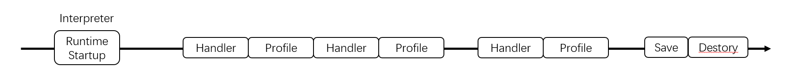

# Profile guided optimization of AOT

AOT compiler support profile guided optimization

## PGO file format

**Profiled Information:** abcfiles, classes, methods, virtual call caches, branch caches, throw caches

```
FileHeader
    magic[]
    version[]
    versionProfileType  // profile type supportted by this version
    savedProfiledType  // saved profile type in this file
    headerSize  // size of FileHeader
    withCha: len(classCtxStr) | 0
    classCtxStr

PandaFiles
    numberOfFiles
    sectionSize
    PandaFileInfo: [type, filePathLen, filePath]

SectionInfos
    sectionNumber
    sectionSize
    sectionInfo: [checkSum, zippedSize, unzippedSize, sectionType, pandaFileIdx]

Methods
    numberOfMethods
    pandaFileIdx
    MethodData [methodIdx, classIdx, savedType, chunkSize, ProfileData[]]
        profileData []
            profType
            numberOfRecords
            chunkSize
            inlineCaches [pc, (classIdx, abcfileIdx)[4]]
        profileData []
            profType
            numberOfRecords
            chunkSize
            branches [pc, taken, notTaken]
        profileData []
            profType
            numberOfRecords
            chunkSize
            throws [pc, taken]
```

## Save profile during runtime destroy

Note that we will only save profile information for abcfiles in **BOOT and INITIAL APP context**.



Now, we only dump profiling data to file when runtime destory to avoid big impact on VM.

1. Record profiled method during runtime

We record list of profiled methods and binded it to ClassLinker.

2. Serialization

Step1: Transform data in ProfilingData to AotProfilingData

Step2: Build sections based on AotProfilingData

Step3: Write sections to file