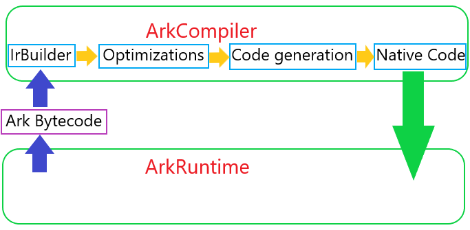

# Intro

The ArkCompiler is used to compile methods into native code for faster execution.  
At the input, the ArkCompiler receives the Ark Bytecode of a method, and at the output generates executable code for the target architecture.  

There are two main ArkCompiler modes: Just In Time(JIT) and Ahead Of Time(AOT).  

## Terminology

**IR** (Intermediate representation) is the data structure or code used internally by a compiler.   
**Graph** the main structure in IR, which contains information about the compilation unit (method), its properties, etc.  
**BasicBlock** linear execution section. BasicBlocks are the vertices of the graph.  
**Instructions** are code execution units. The BasicBlocks consist of two linked list of instructions. The instruction must be linked to one BasicBlocks. [list of instructions with description](../optimizer/ir/instructions.yaml)  
**Pass** separate iteration of graph processing. Pass can be of two types: Analysis(does not change the basic structure of IR) and Optimization.
**IrBuilder** is first pass of the compiler. It constructs the Intermediate Representation (IR) from the Ark Bytecode.  
**Codegen**  is last pass of the compiler. It generates native code for target architecture from IR.  
**JIT** (Just In Time) is compilation mode, which executed during execution of ArkRuntime.  
**AOT** (Ahead Of Time) is compilation mode, which executed regardless of execution ArkRuntime.  
**Compiler dump** is visual representation of the Compiler IR

## The scheme of the compiler



# JIT

Compiler JIT mode works during ArkRuntime execution.  
The main ArkCompiler options for the configuration of the compiler in JIT mode:  

| option name | type of option | default value | decription|
| ------ | ------ | ------ | ------ |
| --compiler-enable-jit | bool | true | Enables/disables JIT compiler |
| --compiler-hotness-threshold | uint32_t | 3000 |  Threshold for "hotness" counter of the method after that it will be compiled |
| --no-async-jit | bool | false |  Perform compilation in the main thread or in parallel worker |

The combination of options "--compiler-hotness-threshold=0 --no-async-jit=true" (named also force jit) allows you to compile all methods before calling them and execute the compiled code.  
The --no-async-jit=true is testing option and it forcibly sets the type of GC STW, because the force jit incorrect works if an object can be moved.  

# AOT

`ark_aot` tool aims to compile input panda files into the single AOT file that can be consumed by ArkRuntime.

ark_aot has following options:

- `--panda-files` - list of input panda(.abc) files to be compiled
- `--output` - path to the output AOT file (default is `out.an`)
- `--location` - path where panda files are actually stored in the device
- `--compiler-cross-arch` - target architecture: arm, arm64, x86, x86_64 (If the option is not set, then the architecture on which ark_aot is launched is taken.). Compiler option

ark_aot uses ArkRuntime inside, thus, runtime's options are also may be specified. 
For example ark_aot uses the option `--boot-panda-files`  to specify the standard library(s)

To use the compiled file(.an), you need to pass the option `--aot-file=file.an` or/and `-aot-files=file1.an:file2.an:..:fileN.an` to `ark` cmdline.  

Also there is the option `--enable-an` - Try to load ARK .an file based on abc file location, include boot files.  

[full AOT documentation](../../doc/aot.md)  

# Compiler options and hints

## compiler-dump

- `--compiler-dump` - print compiler IR for each method and each pass. The dumps are saved in folder `./ir_dump`. The options has suboptions: [full list](../compiler.yaml)

dump structure:  

./ir_dump/00N_pass_00XX_CLASSNAME_METHODNAME_PASSNAME.ir

example:  

./ir_dump/002_pass_0006_MultipleCatch_multipleCatch_Peepholes.ir

- 00N  - the sequence number of the compiled method
- 00XX- the sequence number of the compiler pass
- CLASSNAME - name of class compiled method
- METHODNAME - name of compiled method
- PASSNAME - name of compiler pass

example of a dump:

```
BB 4  preds: [bb 12]
prop: loop 1, depth 1, try (id 0), bc: 0x00000015
   42.b    Compare EQ i32             v39, v25p -> (v43)                                               bc: 0x00000017
   43.     IfImm NE b                 v42, 0x0                                                         bc: 0x00000017
succs: [bb 5, bb 6]
```
- `BB 4` - number of the basic block
- `preds: [bb 12]` - numbers of predecessors blocks for the block
- `succs: [bb 5, bb 6]` - numbers of successors blocks for the block(first successor is true successor)
- `42.`, `43.` - number of the instruction  
- `.b` - type of the instruction(void type isn't printed)
- `Compare`, `IfImm` - name/opcode of the instruction  
- `EQ i32` - additional information about the instruction(Conditional code and input type for the examples)  
- `v39, v25p` - number of the input istructions
- ` -> (v43)` - number of the user istructions
- `bc: 0x00000017` the offset for the bytecode instruction from which these instructions were constructed

## compiler-disasm-dump

- `--compiler-disasm-dump` - print disassembler for the compiler IR for each method. The dump are saved in current folder. The options has suboptions: [full list](../compiler.yaml)

dump structure:  

disasm_N_CLASSNAME_METHODNAM.txt  

example:  

disasm_2_MultipleCatch_multipleCatch.txt  

- N  - the sequence number of the compiled method(equal from ir_dump)
- CLASSNAME - name of class compiled method
- METHODNAME - name of compiled method

example of a disasm-dump:

x86_64:

```
  # [inst]   202.i32  SelectImm LT i32           v201(r11), v28p(rax), v28p(rax), 0x0 -> r11 (v203)               bc: 0x0000000e
    00000057: cmp $0x00, %eax
    0000005a: mov %eax, %r12d
    0000005d: cmovl %r11d, %r12d
    00000061: mov %r12d, %r11d
  # [inst]   203.i32  AndI                       v202(r11), 0xfffffffffffffffe -> r11 (v204)                      bc: 0x0000000e
    00000064: mov $0xFFFFFFFE, %r12d
    0000006a: and %r12d, %r11d
  # [inst]   204.i32  Sub                        v28p(rax), v203(r11) -> r11 (v43, v41)                           bc: 0x0000000e
    0000006d: sub %eax, %r11d
    00000070: neg %r11d
  # [inst]    41.     IfImm EQ i32               v204(r11), 0x0                                                   bc: 0x00000013
    00000073: cmp $0x00, %r11d
    00000077: jz +0x2E
```

arm64:

```
  # [inst]    94.i32  SelectImm LT i32           v93(r0), v28p(r19), v28p(r19), 0x0 -> r0 (v95)                   bc: 0x0000000e
    005c: cmp w19, #0x0 // (0)
    0060: csel w0, w0, w19, lt
  # [inst]    95.i32  AndI                       v94(r0), 0xfffffffffffffffe -> r0 (v96)                          bc: 0x0000000e
    0064: and w0, w0, #0xfffffffe
  # [inst]    96.i32  Sub                        v28p(r19), v95(r0) -> r0 (v43, v41)                              bc: 0x0000000e
    0068: sub w0, w19, w0
  # [inst]    41.     IfImm EQ i32               v96(r0), 0x0                                                     bc: 0x00000013
    006c: cbz w0, #+0x70 (addr 0x7f4e320c00dc)
```

## compiler-regex

- `--compiler-regex` - a regular expression that specifies methods to compile. The grammar used is ECMA-262 RegExp grammar

The option is used for compile one(or several) method(s), instead of all methods(or not compile some methods). Should be used in one of the manners:
1. `--compiler-regex` - selects methods with fully-matched qualified name (i.e. 'Class::Method').
2. `--compiler-regex-with-signature` - selects methods with fully-matched qualified name with signature (i.e. 'void Class::Method(f64)'). Useful for overloaded method.

## compiler-check-final

ArkCompiler has GraphChecker(doesn't works in Release mode), which checks that the graph state is correct after each optimization.  
The option `--compiler-check-final=true` runs the GraphChecker only after last pass - Codegen. The option is mainly used in tests, for faster execution.  
If tests failed in ASSERT in the GraphChecker after Codegen pass, try to remove the option `--compiler-check-final=true` from cmdline, to search for optimization, after which an incorrect state appeared.  

Also, if you add a test in AOT or force jit mode, and it takes a long time to execute, you can add this option to speed up.

## compiler-log

- `--compiler-log=OPT1:OPT2:..:OPTN` - print log for optimizations from the list, for enabling all logs set `all` : `--compiler-log=all`

!NOTE compiler logs are enabled with runtime logs, so the options `--log-components=compiler --log-level=LEVEL` are necessary

examples:

```
[TID 0029aa] D/compiler: [INLINING] Try to inline(id=8, virtual, size=98, vregs=15, CHA): i32 MultipleCatch::multipleCatch(MultipleCatch, i32, i32, i32)                                                                                     [TID 0029aa] D/compiler: [PM] Run pass: ..IrBuilderInlineAnalysis
[TID 0029aa] D/compiler: [INLINING] Method contains unsuitable bytecode
.....................
[TID 0029ae] D/compiler: [CLEANUP] Removed empty block: 6
[TID 0029ae] D/compiler: [CLEANUP] Removed empty block: 7
[TID 0029ae] D/compiler: [CLEANUP] Removed empty block: 10
[TID 0029ae] D/compiler: [CLEANUP] Removed empty block: 11
.....................
[TID 0029ae] D/compiler: [VN_OPT]  Equivalent instructions are searched for inst with id 77
[TID 0029ae] D/compiler: [VN_OPT]  Set VN 31 for inst 77
[TID 0029ae] D/compiler: [VN_OPT]  Equivalent instructions are found, id 48   
.....................
[TID 0029ae] D/compiler: [LICM_OPT] Visit Loop, id = 1
[TID 0029ae] D/compiler: [LICM_OPT] Hoist instruction with id = 9
.....................
[TID 0029b2] D/compiler: [PEEPHOLE] Peephole (/home/pishin/arkcompiler_runtime_core/compiler/optimizer/optimizations/peepholes.cpp:939) is applied for    67.b    Compare GE i32             v21, v16                                                         bc: 0x00000020
```

# Runtime hints for working with compiler

## log-components

The option `--log-components=COMPONENT1:COMPONENT2...COMPONENT_N` enables logging of various components. [full list of the runtime components](../../libpandabase/templates/logger.yaml)

- `compiler` - displays information about which methods are compiled and the result of compilation
- `AOT` - displays information about which AOT files were found and for which methods the compiled code was found in the AOT files
- `interop` - shows information about the interaction of the compiler and runtime(exceptions in compiled code, deoptimizations from compiled code, e.t.c.)

## StackWalker

`StackWalker` - is interface to walk through the execution stack.
It is used in
 - GC for getting object roots
 - Interop for restoring interpreter frame from compiler frame

 `StackWalker` has function Dump: `void StackWalker::Dump(std::ostream &os, bool print_vregs /* = false */)`  
 The function can be inserted in cpp runtime code(`StackWalker::Create(ManagedThread::GetCurrent()).Dump(std::cerr, true)`) for printing call stack, including compiled and inlined functions.

 example:

 ```
Panda call stack:
   0: 0x7ffff164d890 in std.core.Exception::provisionStackTrace (compiled: npc=c1, inlined) InlineInfo #1: bpc=0x0, vregs_num: 0
roots: REGISTER[11]=0x4432c0
   1: 0x7ffff164d890 in std.core.Exception::<ctor> (compiled: npc=c1, inlined) InlineInfo #0: bpc=0x11, vregs_num: 0
roots: REGISTER[11]=0x4432c0
   2: 0x7ffff164d890 in Exception0::<ctor> (compiled: npc=c1) Stackmap #1: npc=0xc1, bpc=0x0, inline_depth=2, roots=[r:0x800]
roots: REGISTER[11]=0x4432c0
   3: 0x7f3f15920200 in MultipleCatch::multipleCatch (managed)
             v0 = 1                   INT64       -
             v1 = 16                  INT64       -
             v2 = 2808                INT64       -
             v3 = 139908559667213     INT64       -
             v4 = 4294967286          INT64       -
             v5 = 4294967286          INT64       -
             v6 = 4294967285          INT64       -
             v7 = 139908559675392     INT64       -
             v8 = 4294967285          INT64       -
             v9 = 8192                INT64       -
            v10 = 0x442078            OBJECT      -
            v11 = 3                   INT64       -
            v12 = 2                   INT64       -
            v13 = 1                   INT64       -
            ACC = 0x4432c0            OBJECT      -
   4: 0x7f3f15920140 in MultipleCatch::wrapper (managed)
             v0 = 0x442078            OBJECT      -
             v1 = 3                   INT64       -
             v2 = 2                   INT64       -
             v3 = 1                   INT64       -
             v4 = 100                 INT64       -
            ACC = 0x442078            OBJECT      -
   5: 0x7f3f15920000 in ETSGLOBAL::main (managed)
             v0 = 10                  INT64       -
             v1 = 100                 INT64       -
             v2 = 1                   INT64       -
             v3 = 2                   INT64       -
             v4 = 3                   INT64       -
             v5 = 0                   INT64       -
             v6 = 0                   INT64       -
             v7 = 0x442078            OBJECT      -
             v8 = 0x442078            OBJECT      -
             v9 = 3                   INT64       -
            v10 = 2                   INT64       -
            v11 = 1                   INT64       -
            v12 = 100                 INT64       -
            ACC = 0x442078            OBJECT      -
 ```

 - `npc=c1` - offset of method compiled code - adrress an instruction(next in) in a disasm dump
 - `Exception0::<ctor>` Class and methos name  

 You can find the npc in the disasm dump for the method and get point of the call.
 std.core.Exception::<ctor>
 !NOTE if method mark as `inlined`, npc is to be searched in caller method without `inlined` flag.  
 In the example methods `std.core.Exception::provisionStackTrace` and `std.core.Exception::<ctor>` are inlined in `Exception0::<ctor>` and their code is contained in disasm  `Exception0::<ctor>`.

 ## verify-entrypoints

 The option `--verify-entrypoints` creates StackWalker on each call runtime from compiled code and calls the function Verify, which checks that the stack is correct and all objects in the stack are live (checks class from all objects).
 !NOTE the options don't work in release mode.

# Cross-Values

`Cross-values` is a module that delivers implementation-defined constants (data structure sizes, offsets inside data structures, etc.), which is necessary for cross-compiling. For example, this allows generating binaries for `AArch64` on `x86-64` system.

- [documentation about Cross-values](../../docs/cross-values.md)

# Links

- [Documentation about compiler IR and optimizations](../../docs/ir_format.md)
- [Documentation about AOT](../../docs/aot.md)
- [Documentation about ark_aot tool](aot.md)
- [Documentation saving code information in comped code](../../docs/code_metainfo.md)
- [Documentation about Cross-values](../../docs/cross-values.md)
- [Documentation about Deoptimization](../../docs/deoptimization.md)
- [Documentation about IrToc](../../docs/irtoc.md)
- [Documentation about OSR](../../docs/on-stack-replacement.md)
- [Documentation about Interaction of compiled code and the runtime](../../docs/runtime-compiled_code-interaction.md)
- [Codegen documentation](codegen_doc.md)
- [Encoder documentation](.../optimizer/code_generator/encoder.md)
- [List of instructions with description](../optimizer/ir/instructions.yaml)  
- [Compiler options](../compiler.yaml)