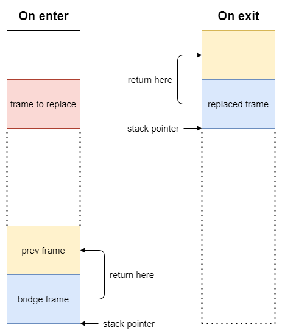

# CFI directives

## Overview

In some situations **hand-written** assembly code is preferred to compiler-generated, i.e. for performance reasons (usage of special cryptographic/vector instructions) or if there is a need for manual stack/registers manipulation.
In case of **compiler-generated** code compilers emit special **debug symbols** in resulting binary code and debuggers/profilers use this information.  
`CFI` (**Call Frame Information**) is a subset of these debug symbols which is responsible for correct **stack unwinding**.
Unfortunately, hand-written assembly lacks of debug symbols and they should be added manually by a programmer.

## Introduction to CFI

In case you need basics please read related wiki article.

## Bridges annotation

Most `asm` bridges have similar layout:
- Prolog
- Data preparation for calls
- Calls
- Result handling
- Epilog

From `CFI` perspective, annotation of `prolog` and `epilog` is needed.
In prolog we save `lr`, `fp` and `callee` regs on stack.
So we should explicitly mark these stack slots with help of `CFI` directives.
`Debugger` or `profiler` will use this information in unwinding:
 - to find the right previous `frame` (with `fp` and `lr` regs)
 - to restore `callees` in previous frame

In epilog we read saved `callees` from stack and also `fp`/`lr`. Here we annotate that saved registers are restored.

## Non-standard bridges

There are bridges which `hack` stack memory (setting `stack pointer` to other stack frame), i.e.:
- Deoptimization, all bridges
- OsrEntryAfterCFrame

These bridges return control flow to code which has not called them.  

In that case we "say" to `debugger` that we are not going to return to previous frame. So we directly specify other frame in which we will return + spot slots for `callees` (it can be `callee` slots in `cframe` or `boundary frame`).
