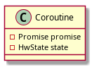
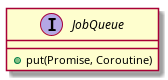
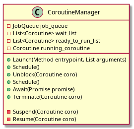
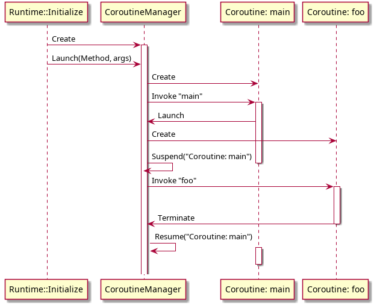
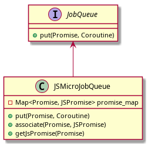

# Coroutines and promises
The document describes single-threaded coroutine model.

## Classes
All the classes below are runtime classes.

### Coroutine


Coroutine class contains state and the associated Promise object (which will be fulfilled by the entrypoint method's return value).  

The state should contain information about coroutine's call stack and other neccessary information to suspend and resume execution.  
When runtime creates a new coroutine new stack is created and coroutine's entrypoint is called on the new stack.

#### Fields
* promise - the promise associated with the coroutine and returned by 'launch' instruction.
* state - the coroutine's state needed to suspend and resume the coroutine.

### JobQueue


JobQueue interface is used to process promises asynchronously.  
When runtime executes `await` operator runtime puts the promise and the coroutine into the queue and suspends the coroutine. 
When the promise gets processed the waiting coroutine is scheduled again.

### CoroutineManager


CoroutineManager manages switching between coroutines. It responsible for suspending the current coroutine and choosing the next coroutine for execution.
When control is returned from the coroutine entrypoint function, runtime calls `Terminate` for the coroutine.

#### Fields
* job_queue - an instance of JobQueue to process promises asynchronously.
* wait_list - a list of waiting coroutines.
* ready_to_run_list - the list of coroutines which can be scheduled if the current coroutine gets suspended.
* running_coroutine - the running coroutine.

#### Methods
* `void Launch(Method entrypoint, List arguments)`
    * Create an instance of a coroutine with empty stack
    * Create a promise
    * Suspend the current coroutine
    * Put the current coroutine to the front `ready_to_run_list`
    * Set `running_coroutine` to the new coroutine
    * Invoke `entrypoint` on the new stack
* `void Schedule()`
    * Suspend the current coroutine
    * Swap the head of `ready_to_run_list` and `current_coroutine`
    * Resume `current_coroutine`
* `void Unblock(Coroutine coro)`
    * Remove the `coro` from the `wait_list`
    * Put the coro to the front of `ready_to_run_list`
* `void Await(Promise promise)`
    * Suspend the current coroutine
    * Put `promise` argument and the current coroutine to the `job_queue`
    * Put the current coroutine to the end of `wait_list`
    * Resume the coroutine from the front of `ready_to_run_list`
* `void Terminate(Coroutine coro)`
    * Resolve the promise by return value or reject it if there is an exception 
    * Delete coroutine `coro`
    * Resume the coroutine from the front of `ready_to_run_list`
* `void Suspend(Coroutine coro)`
    * Save current execution state (hw registers, stack pointer, Thread structure) into the `coro`'s context
* `void Resume(Coroutine coro)`
    * Set the coroutine `coro` to `running_coroutine`
    * Restore the coroutine state (hw registers, stack pointer, Thread structure) from coroutine's context

## Coroutine awaiting
The promise returned by `launch` instruction is used to await the coroutine.
`await` function applied to the promise suspends execution of the current coroutine even if the promise is fulfilled.  
The promise is put into the JobQueue and the coroutine is put into `wait_list` until the promise gets processed. When the JobQueue processes the promise CoroutineManager schedules the coroutine for execution.

## Coroutine life cycle
Runtime launches a new coroutine when it executes `launch` instruction. The steps runtime executes are the following:

* Create a new instance of Coroutine
* Create a new Promise object and set it to the coroutine
* Create new stack for the coroutine
* Invoke entrypoint method on the new stack

If the entrypoint method has `@MainThread` or `@Async` annotation the coroutine is always executed in the same thread where the instruction is executing.
Else the coroutine may be executed in a different thread (implementation dependent).

When the coroutine returns from the entrypoint method the return value is used to fulfill the Promise object if there is no pending exception.
In case there is a pending exception, the Promise object is rejected and the exception is stored to the Promise object.

The main coroutine is created in a special way during runtime initialization. Runtime doesn't create a new stack for it but uses the existing one.  
Entrypoint method for the main coroutine is specified in the command line arguments.



During initialization runtime creates an instance of CoroutineManager and the main coroutine. The main coroutine starts executing `main` function.  
Suppose the main function executes a *launch foo()* instruction i.e. start an asynchronous operation. At this moment CoroutineManager creates an
instance of coroutine and a Promise. Next CoroutineManager suspends the main coroutine and puts it to `ready_to_run_list`.
CoroutineManager invokes new coroutine's entrypoint method *foo* on the new stack.
After the coroutine finished its promise is automatically resolved by entrypoint's method return value.
At this moment CoroutineManager schedules the next ready to run coroutine (the main coroutine).

## Bytecode representation of async/await constructions
Below is description of ETS constructions and the corresponding bytecode structures.

| ETS operator | ETS bytecode | Comment |
| :-- | :-- | :------ |
|```async <function declaration>``` | ```.function @name@ <ets.annotation=ets.Async>``` | Frontend adds @Async runtime annotation if the source function is declared as `async`. |
| `fn(args)` | `launch fn_method_id, args` | `launch` bytecode instruction is used to calls async functions. |
| `await promise`; | `Coroutine.Await(promise)` | `await` is translated into call of the `await` native function implemented in runtime. |

## Interaction with JS runtime
#### JSMicroJobQueue
Class JSMicroJobQueue, implementation of JobQueue interface, interacts with micro job queue in JS VM.  
Also this class should track associations between ETS promises and their counterparts in JS world.



`promise_map` map stores references to ETS and JS Promise objects. The references should be GC roots for both GCs.
If ETS GC moves an ETS promise it should update the reference in the map. The same is for JS GC.

Implementation of `put` gets the associated JS instance of Promise (or creates a new one) and connects ETS promise to JS instance using `then` callback.
When the callback is called (i.e. the promise is processed) the corresponding coroutine should be scheduled for execution.

```
class JSMicroJobQueue: public JobInterface {
public:
    virtual void put(Promise promise, Coroutine coro) override {
        auto js_env = GetJSEnv();
        // Get associated JS Promise instance
        js_value js_promise = getJSPromise(promise);
        if (js_promise == undefined) {
            js_promise = js_env.create_promise();
            associate(promise, js_promise)
        }
        js_promise.then([&promise, &coro] (js_value value){
            promise.resolve(unwrap(value));
            CoroutineManager.Unblock(coro);
            CoroutineManager.Schedule();
        });
        js_env.PushMicroTask(js_promise);
        CoroutineManager.Await(coro, promise);
    }
};
```

#### Async function calling
Calling an async function should launch a coroutine.  
In case JS engine calls an ETS function then control should pass through JS2ETS C++ bridge.
The C++ bridge should check if the callee has @Async annotation and launch a new coroutine.  
Below is a pseudocode of such bridge.
```
js_value JS2ETSEntrypoint(Napi::CallbackInfo *info) {
    auto js_env = info->GetEnv();
    auto callee = info->GetCallee(); // js callee function object
    ets_env ets = GetEtsEnv();
    // get name of function.
    const char *method_name = js_env.GetProperty(fn, "name");
    // return the method which corresponds to the JS function
    Method *method = ets_env.resolve(method_name);
    if (method->IsAsync()) { // check @Async annotation
        // for async function we start a coroutine
        ets_value ets_promise = ets_env.launch(method, proxy(args)); 
        // wrap ETS promise (result) to JS promise
        js_value js_promise = js_env.new_promise();
        JSMicroJobQueue.map(ets_promise, js_promise);
        // connect ETS promise with JS promise
        ets_promise.then([&js_promise] (ets_object value) {
            js_promise.resolve(wrap(value));
        });
        ets_promise.catch([&js_promise] (ets_object value) {
            js_promise.reject(wrap(value));
        });
        return js_promise;
    }
}
```

#### Handling Promise objects returned from JS code
If ETS code should await the Promise instance returned by a JS function the JS object should be wrapped into 
ETS object and the objects should be associated.  
Wrapping code should look as follow:

```
ets_object JsPromiseToEtsPromise(js_value js_promise) {
    js_env js_env = get_js_env();
    ets_env ets = get_ets_env();
    
    ets_object ets_promise = ets.create_promise();
    JSMicroJobQueue.map(ets_promise, js_promise);
    return ets_promise;
}
```

## Example

### TS function calls ETS function.
Typescript source code:
```typescript
async function bar(): Promise<string> {
    print("enter bar");
    return "exit bar";
}

async function foo(): Promise<string> {
    print("enter foo");
    print(await bar());
    return "exit foo";
}
```

Translated ETS code is the same except `@Async` annotation is added to `foo` and `bar`.

JS code executed by JS VM:
```javascript
async function main() {
    print("enter main");
    print(await foo());
    print("exit main");
}

main();
```

Expected output is:  
```
enter main
enter foo
enter bar
exit bar
exit foo
exit main
```

Execution and state:

`>` - means already executed line  
`>>` - means the current line

<table cellpadding=10 style="border-spacing: 0px">
<tr bgcolor="#ABB2B9">
<th>#</th>
<th>
Current function
</th>
<th>CoroutineManager's state<br>(before the current instruction)</th>
<th>Output</th>
<th>Comment</th>
</tr>
<tr>
<td>1.</td>
<td>
<pre>
>>  function main() {
        print("enter main");
        print(await foo());
        print("exit main");
    }
</pre>
</td>
<td>
running_coroutine=main<br>
ready_to_run=[]<br>
job_queue=[]<br>
</td>
<td></td>
<td>There is only main coroutine exists.</td>
</tr>
<tr bgcolor="#EAECEE">
<td>2.</td>
<td>
<pre>
> function main() {
>       print("enter main");
>>      print(await >>foo());
        print("exit main");
    }
</pre>
</td>
<td>
running_coroutine=main<br>
ready_to_run=[]<br>
job_queue=[]<br>
</td>
<td>enter&nbsp;main</td>
<td>
`foo` is an ETS function. From JS point of view `foo` has native entrypoint `foo_impl`.
</td>
</tr>
<tr>
<td>3.</td>
<td>
<pre>
> js_value foo_impl(Napi::CallbackInfo &info) {
>   auto js_env = info.GetEnv();
>   auto callee = info.GetCallee(); // js callee function object (foo)
>   ets_env ets = GetEtsEnv();
>   // get name of function. Should return "foo"
>   const char *method_name = js_env.GetProperty(fn, "name");
>   // return the method which corresponds to "foo" function
>   Method *method = ets_env.resolve(method_name);
>   if (method->IsAsync()) { // check @Async annotation
>     // for async function we start a coroutine
>>    ets_value ets_promise = ets_env.launch(method, proxy(args)); 
      // wrap ETS promise (result) to JS promise
      js_value js_promise = js_env.new_promise();
      // connect ETS promise with JS promise
      ets_promise.then([&js_promise] (ets_object value) {
          js_promise.resolve(wrap(value));
      });
      ets_promise.catch([&js_promise] (ets_object value) {
          js_promise.reject(wrap(value));
      });
      return js_promise;
    }
  }
</pre>
</td>
<td>
running_coroutine=main<br>
ready_to_run=[]<br>
job_queue=[]<br>
</td>
<td>
enter&nbsp;main
</td>
<td>
`foo_impl` is a C++ bridge between JS and ETS. It converts JS values into ETS values, resolves the callee function.
Since the callee is an async function the bridge creates a coroutine.
</td>
</tr>
<tr bgcolor="#EAECEE">
<td>4.</td>
<td>
<pre>
  @Async
> function foo(): String {
>     print("enter foo");
>>    print(await >>bar());
      return "exit foo";
  }
</pre>
</td>
<td>
running_coroutine=foo<br>
ready_to_run=[main]<br>
job_queue=[]<br>
</td>
<td>
enter&nbsp;main<br>
enter&nbsp;foo<br>
</td>
<td>
Launching `foo` leads to put the `main` coroutine to the beginning of `ready_to_run_list`.<br>
Since `bar` is an async function a coroutine will be created.
</td>
</tr>
<tr>
<td>5.</td>
<td>
<pre>
  @Async
> function bar(): String {
>     print("enter bar");
>     return "exit bar";
>>}
</pre>
</td>
<td>
running_coroutine=bar<br>
ready_to_run=[foo,main]<br>
job_queue=[]<br>
</td>
<td>
enter&nbsp;main<br>
enter&nbsp;foo<br>
enter&nbsp;bar<br>
</td>
<td>
Launching `bar` coroutine ejects `foo` coroutine to the beginning of `ready_to_run_list`.<br>
When `bar` is finised it resolves the associated promise and the coroutine gets terminated.
Runtime resumes `foo` coroutine.
</td>
</tr>
<tr bgcolor="#EAECEE">
<td>6.</td>
<td>
<pre>
  @Async
> function foo(): String {
>     print("enter foo");
>>    print(>>await bar());
      return "exit foo";
  }
</pre>
</td>
<td>
running_coroutine=foo<br>
ready_to_run=[main]<br>
job_queue=[]<br>
</td>
<td>
enter&nbsp;main<br>
enter&nbsp;foo<br>
enter&nbsp;bar<br>
</td>
<td>
Awaiting `bar`'s promise leads to call of MicroJobQueue.
</td>
</tr>
<tr>
<td>7.</td>
<td>
<pre>
> virtual void MicroJobQueue::put(Promise promise, Coroutine coro) override {
>     auto js_env = GetJSEnv();
>     js_value js_promise = js_env.create_promise();
>     js_promise.then([&promise, &coro] (js_value value){
          promise.resolve(unwrap(value));
          CoroutineManager.Unblock(coro);
          CoroutineManager.Schedule();
>     });
>     js_env.PushMicroTask(js_promise);
>>    CoroutineManager.Await(coro, promise);
  }
</pre>
</td>
<td>
running_coroutine=foo<br>
ready_to_run=[main]<br>
job_queue=[bar's&nbsp;promise]<br>
</td>
<td>
enter&nbsp;main<br>
enter&nbsp;foo<br>
enter&nbsp;bar<br>
</td>
<td>
The method creates a JS mirror of bar's promise and adds it to JS engine's MicroJobQueue.<br>
`await` method will put `foo` coroutine to `wait_list`. The main coroutine will be resumed in `foo_impl`.
</td>
</tr>
<tr bgcolor="#EAECEE">
<td>8.</td>
<td>
<pre>
> js_value foo_impl(Napi::CallbackInfo &info) {
>   auto js_env = info.GetEnv();
>   auto callee = info.GetCallee(); // js callee function object (foo)
>   ets_env ets = GetEtsEnv();
>   // get name of function. Should return "foo"
>   const char *method_name = js_env.GetProperty(fn, "name");
>   // return the method which corresponds to "foo" function
>   Method *method = ets_env.resolve(method_name);
>   if (method->IsAsync()) { // check @Async annotation
>     // for async function we start a coroutine
>     ets_value ets_promise = ets_env.launch(method, proxy(args)); 
>     // wrap ETS promise (result) to JS promise
>     js_value js_promise = js_env.new_promise();
>     // connect ETS promise with JS promise
>     ets_promise.then([&js_promise] (ets_object value) {
          js_promise.resolve(wrap(value));
>     });
>     ets_promise.catch([&js_promise] (ets_object value) {
          js_promise.reject(wrap(value));
>     });
>     return js_promise;
    }
  }
</pre>
</td>
<td>
running_coroutine=main<br>
ready_to_run=[]<br>
wait_list=[foo]<br>
job_queue=[bar's&nbsp;promise]<br>
</td>
<td>
enter&nbsp;main<br>
enter&nbsp;foo<br>
enter&nbsp;bar<br>
</td>
<td>
Runtime resumes the main coroutine in `foo_impl`. The returned ETS promise is wrapped into JS promise and
the promises are connected. I.e. resolving/rejecting of ETS promise leads to resolving/rejecting JS promise.
</td>
</tr>
<tr>
<td>9.</td>
<td>
<pre>
> function main() {
>       print("enter main");
>>      print(>>await foo());
        print("exit main");
    }
</pre>
</td>
<td>
running_coroutine=main<br>
ready_to_run=[]<br>
wait_list=[foo]<br>
job_queue=[bar's&nbsp;promise]<br>
</td>
<td>
enter&nbsp;main<br>
enter&nbsp;foo<br>
enter&nbsp;bar<br>
</td>
<td>
JS runtime puts the promise returned by `foo` into job queue and gets suspended.
</td>
</tr>
<tr bgcolor="#EAECEE">
<td>10.</td>
<td>
<pre>
>  main();
>> process_micro_job_queue();
</pre>
</td>
<td>
running_coroutine=main<br>
ready_to_run=[]<br>
wait_list=[foo]<br>
job_queue=[bar's&nbsp;promise,foo's&nbsp;promise]<br>
</td>
<td>
enter&nbsp;main<br>
enter&nbsp;foo<br>
enter&nbsp;bar<br>
</td>
<td>
When the main function is finished JS runtime starts processing micro job queue.
The first promise in the queue is bar's promise. Since it is already resolved JS runtime
calls its 'then' method which resumes `foo` coroutine.
</td>
</tr>
<tr>
<td>11.</td>
<td>
<pre>
> virtual void MicroJobQueue::put(Promise promise, Coroutine coro) override {
>     auto js_env = GetJSEnv();
>     js_value js_promise = js_env.create_promise();
>     js_promise.then([&promise, &coro] (js_value value){
>         promise.resolve(unwrap(value));
>         CoroutineManager.Unblock(coro);
>>        CoroutineManager.Schedule();
>     });
>     js_env.PushMicroTask(js_promise);
>     CoroutineManager.Await(coro, promise);
  }
</pre>
</td>
<td>
running_coroutine=main<br>
ready_to_run=[foo]<br>
wait_list=[]<br>
job_que=[foo's&nbsp;promise]<br>
</td>
<td>
enter&nbsp;main<br>
enter&nbsp;foo<br>
enter&nbsp;bar<br>
</td>
<td>
MicroJobQueue calls `then` method for `bar` promise. The method schedules `foo` coroutine.<br>
The main coroutine is ejected into `ready_to_run_list` and `foo` continues execution.
</td>
</tr>
<tr bgcolor="#EAECEE">
<td>12.</td>
<td>
<pre>
  @Async
> function foo(): String {
>     print("enter foo");
>     print(await bar());
>     return "exit foo";
>>}
</pre>
</td>
<td>
running_coroutine=foo<br>
ready_to_run=[main]<br>
wait_list=[]<br>
job_queue=[foo's&nbsp;promise]<br>
</td>
<td>
enter&nbsp;main<br>
enter&nbsp;foo<br>
enter&nbsp;bar<br>
exit&nbsp;bar<br>
</td>
<td>
`foo` coroutine is terminated and runtime resolves its promise by the returned value.
Then runtime resumes the main coroutine.
</td>
</tr>
<tr>
<td>13.</td>
<td>
<pre>
>  main();
>> process_micro_job_queue();
</pre>
</td>
<td>
running_coroutine=main<br>
ready_to_run=[]<br>
wait_list=[]<br>
job_queue=[foo's&nbsp;promise]<br>
</td>
<td>
enter&nbsp;main<br>
enter&nbsp;foo<br>
enter&nbsp;bar<br>
exit&nbsp;bar<br>
</td>
<td>
JS engine continues processing micro job queue. The next task is foo's promise which already resolved.
</td>
</tr>
<tr bgcolor="#EAECEE">
<td>14.</td>
<td>
<pre>
> function main() {
>       print("enter main");
>       print(await foo());
>       print("exit main");
>>  }
</pre>
</td>
<td>
running_coroutine=main<br>
ready_to_run=[]<br>
wait_list=[]<br>
job_queue=[]<br>
</td>
<td>
enter&nbsp;main<br>
enter&nbsp;foo<br>
enter&nbsp;bar<br>
exit&nbsp;bar<br>
exit&nbsp;foo<br>
exit&nbsp;main<br>
</td>
<td>
After processing foo's promise the main function gets resumed and finishes its execution.
</td>
</tr>
<tr>
</table>
