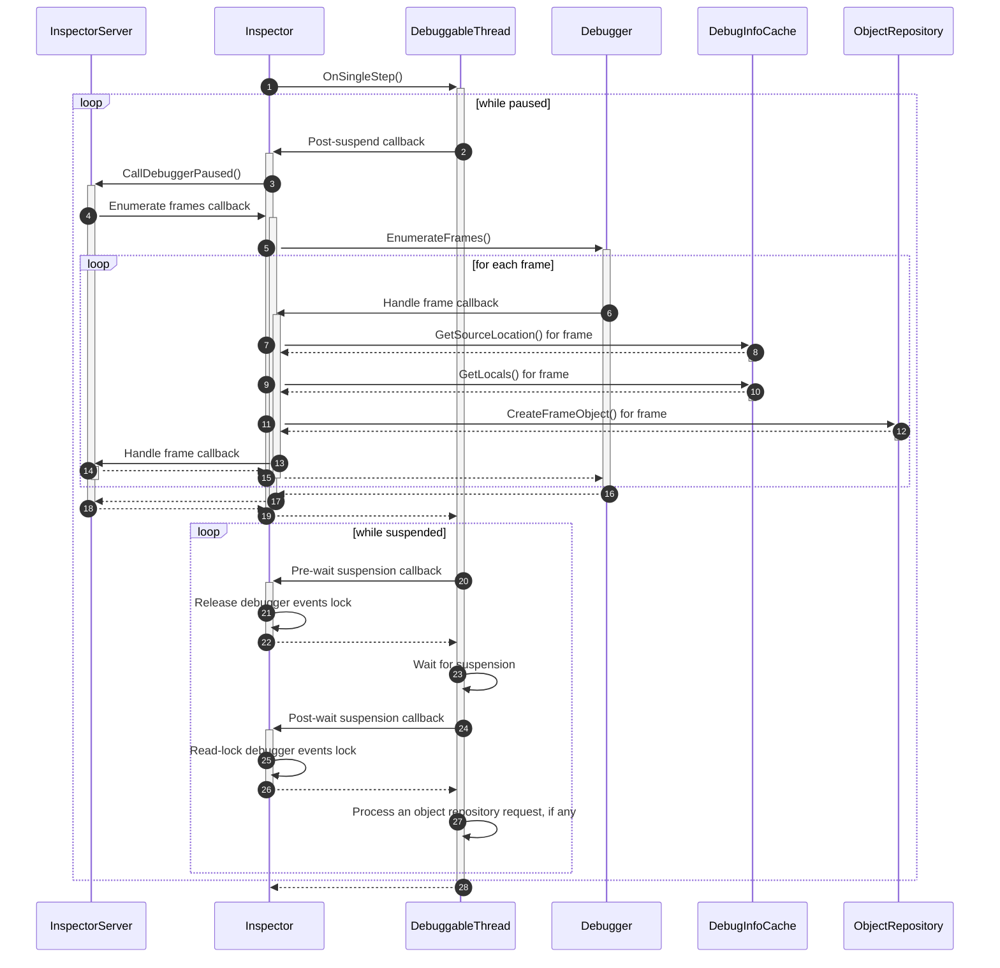
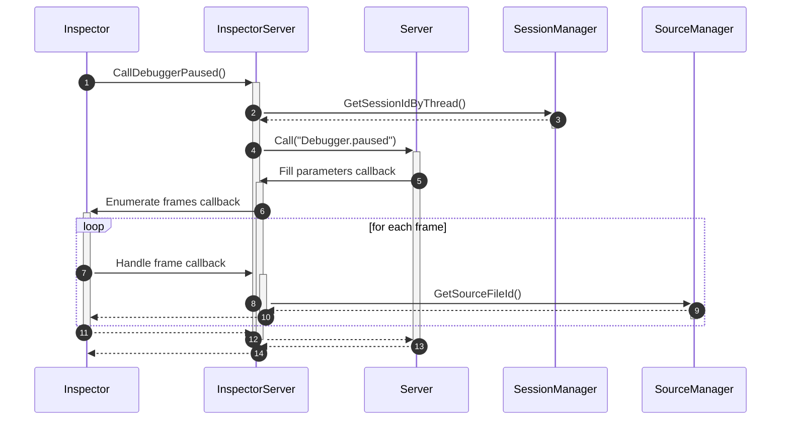
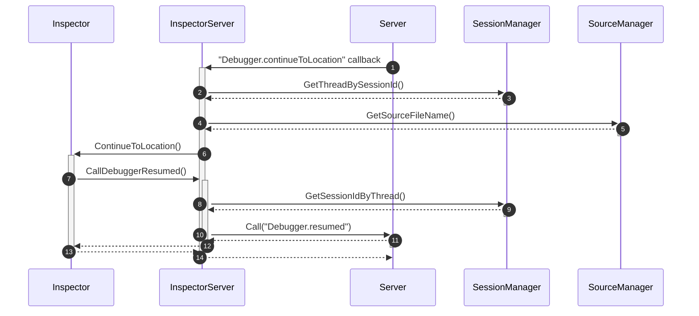
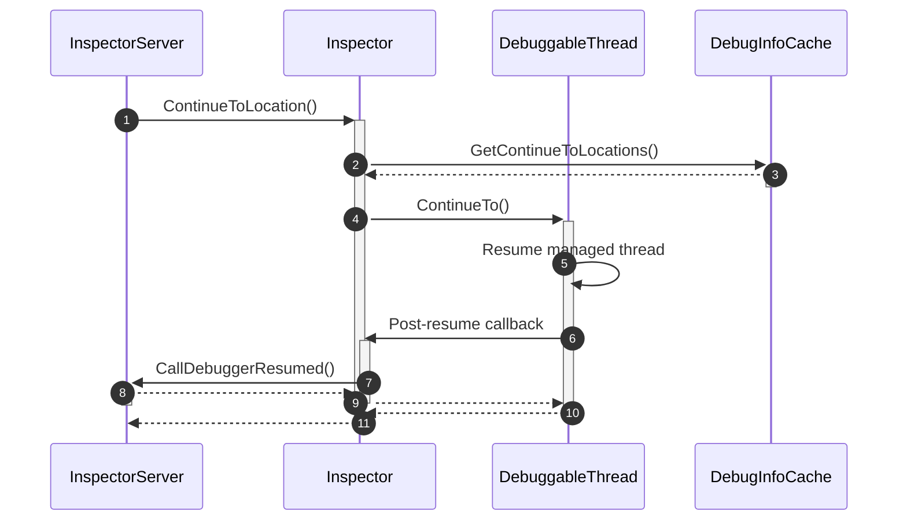
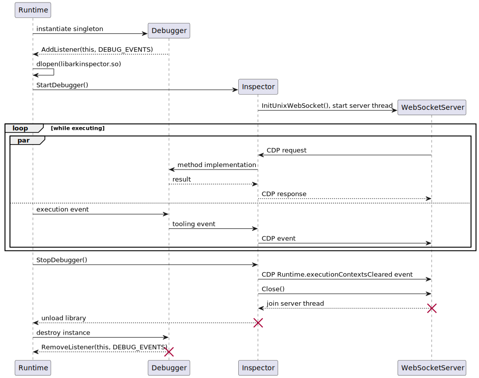

# Main parts description

Two big parts, the `Inspector` and `InspectorServer` classes, isolate debugger and server logic respectively. Their brief description follows.

## Inspector

The main class, it is responsible for interoperability with the runtime and managing other modules. It starts a separate server thread to listen to client requests.

The `Inspector` class implements `PtHooks` interface and manages debugger events correspondingly.

`Inspector` uses the following modules.

### DebuggableThread

Represents an application thread being debugged. It encapsulates a `ThreadState` and processes logic of thread suspensions. Threads have the following three levels of suspension:

#### Paused

The thread is paused (`state_.IsPaused()` is `true`) means that a breakpoint was hit, or a step was performed, etc., and the thread should not execute the following instructions until it will be unpaused.

#### Suspended

The thread is suspended (`suspended_` is `true`) means that the thread actually is going to sleep now, but it still can process asynchronous requests to the object repository ([see below](./inspector.md#objectrepository)).

Before and after the suspension (i.e. setting `suspended_` to `true`) the `pre_suspend_` and `post_suspend_` callbacks are called respectively. The latter sends a `Debugger.paused` event in the current implementation of `Inspector`.

The thread could be resumed when still remaining paused. In this case it suspends again. This opportunity is used by the `Touch()` call during new connection processing to notify the client about the thread state (when suspending, the corresponding `Debugger.paused` event is sent).

#### Wait for suspension

When the thread is suspended, the `thread_->Suspend()` call is performed. It increases managed thread's suspension counter. Then, when `thread_->WaitSuspension()` is called, it waits until a resume call will decreases the counter and it becomes zero. 

Before and after waiting for suspension `pre_wait_suspension_` and `post_wait_suspension_` callbacks are called respectively. They release and take a read-lock on debugger events processing (in the current implementation of `Inspector`) to allow / disallow new connections processing. 

If thread's suspension counter becomes zero, but `suspended_` is still `true`, this means that a request to the object repository was sent. The request is executed, then the counter is increased and the thread is waiting for suspension again.

### ThreadState

An FSM-like state of an application thread. It processes events from the runtime and client requests and decides (due to breakpoints, stepping state etc.) when to pause or unpause the thread.

### ObjectRepository

Makes remote objects corresponding to managed objects (maps managed objects to IDs) and primitives. Also manages fake frame objects.

To store managed objects in a GC-safe manner, `HandleScope` is used. Due to limitation of handle scopes, an object repository could be used only from the corresponding application thread. That's why asynchronous requests to object repositories ([see above](./inspector.md#wait-for-suspension)) were implemented.

An object repository is valid during a pause only. It is destroyed when the thread is resumed, and remote object mapping become invalid. 

### DebugInfoCache

The service provides necessary debug info for the application. It caches the info during module loads.

The debug info could be backed by disassembled code to allow debugging when source code is not available. The module tracks fake disassembled source file names to substitute their contents when corresponding source code requests occur.

### Debugger

Inspector utilizes the runtime instrumentation capabilities with the help of a `DebugInterface` object.

## InspectorServer

The class is responsible for communication with client. It wraps the `Server` class and gives a convenient Inspector protocol based API. It hides all Inspector protocol related details inside and translates them to the language of runtime (e.g. session and source IDs). The implementation is pretty straightforward. It uses the following helper modules.

### Server

This provides a low-level JSON-based interface to a connection.

### SessionManager

The module is responsible for translation between runtime threads and Inspector session IDs.

### SourceManager

The class is responsible for translation between source file names and Inspector source file IDs. Also, it keeps track of which session was informed about the ID (so the `InspectorServer` could send the corresponding "Debugger.scriptParsed" message).

# Threading model overview

In the multi-thread version, the two main kinds of threads are considered:
- The server thread, it is a single thread responsible for processing client requests;
- Application threads, these are the execution threads of the debuggable application.

The main idea is that the user requests are processed by the server thread, while the debugger events are processed by application threads. This fact is used to simplify provision of thread safety in several places.

For example, in `InspectorServer::CallTargetDetachedFromTarget`, when the server is paused, we are sure that we could safely remove the corresponding thread from the session and source managers. It is because:
- the server thread sleeps;
- and we are executing on the corresponding application thread.

So, we do not consider the case, when someone else in Inspector could access the corresponding `PtThread` objects.

Another example is processing of a new connection in `Inspector`. On validation, a write-lock on debugger events processing is held. Then, during the connection open hook, we safely reset debuggable thread states because:
- we are executing on the server thread;
- and application threads could not process events due to the aforementioned write-lock.

We do not consider that someone else in Inspector could access the debuggable thread states.

`DebuggableThread`'s safety also actively relies on these assumptions. For example, we do not consider the case of simultaneous calls to `OnSingleStep` and `OnMethodEntry`. Follow the inline comments for more information.

# Diagrams

The diagrams below are split in two parts (`Inspector` and `InspectorServer` perspectives) for simplification.

A single step event and a "Continue to" request are chosen as the most interesting cases.

## Single step event (***an application thread***)

### Inspector perspective

### InspectorServer perspective

## "Continue to" request (***the server thread***)

### InspectorServer perspective

### Inspector perspective

## Runtime perspective

The diagram below represents high-level scheme of communication between ArkTS Runtime and Inspector debugger.

