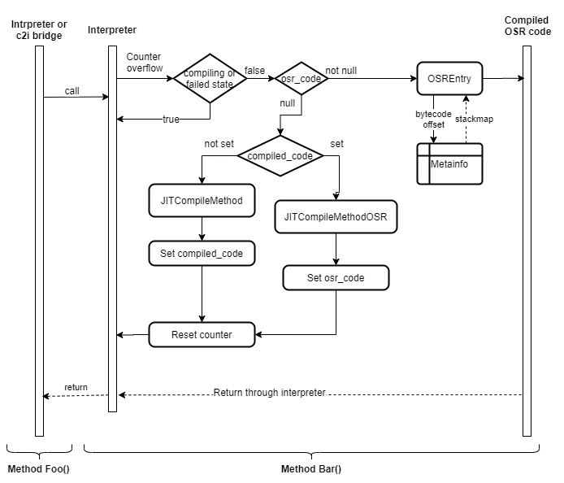

# On-Stack Replacement

### Overview

On-Stack Replacement (OSR) is a technique for switching between different implementations of the same function.

Under the OSR, we mean the transition from interpreter code to optimized code. Opposite transition - from optimized to
unoptimized - we call `Deoptimization`.

OSR workflow:
```
                                    +-----------------------+
                                    |                       |
                                    |     Interpreter       |
                                    |                       |
                                    +-----------------------+
    Method::osr_code                            |
    +------------------------+                  |
    | Method Prologue        |                  V
    +------------------------+         +-----------------+
    | mov x10, 0             |         |OsrEntry         |
    | mov d4, 3.14           |         +-----------------+
    |                        |                  |
    |                        |                  +---------------------+
    |        . . .           |                  |                     V
    |                        |                  |            +-------------------+
    | osr_entry_1:           |                  |            |  PrepareOsrEntry  |
+-->|------------------------|                  |            |(fill CFrame from  |
|   |  Loop 2                |                  |            | OsrStateStamp)    |
|   |                        |                  |            +-------------------+
|   |                        |                  |   CFrame          |       ^
|   |------------------------|                  |<------------------+       |
|   |        . . .           |                  |                           |
|   |                        |                  |       OsrStateStamp       |
|   |------------------------|                  |      +-----------------------------------+
|   | Method epilogue        |                  |      |native_pc   : INVALID              |
|   |------------------------|                  |      |bytecode_pc : offsetof osr_entry_1 |
|   | OSR Stub 1:            |<-----------------+      |osr_entry   : osr_code+bytecode_pc |
|   | mov x10, 0             |                         |vregs[]     : vreg1=Slot(2)        |
|   | mov d4, 3.14           |                         |              vreg4=CpuReg(8)      |
+---| jump osr_entry_1       |                         +-----------------------------------+
    +------------------------+
```

### Triggering

Both, OSR and regular compilation use the same hotness counter. First time, when counter is overflowed we look 
whether method is already compiled or not. If not, we start compilation in regular mode. Otherwise, we compile
method in OSR mode.

Once compilation is triggered and OSR compiled code is already set, we begin On-Stack Replacement procedure.

Triggering workflow:



### Compilation

JIT compiles the whole OSR-method the same way it compiles a hot method.

To ensure all loops in the compiled code may be entered from the interpreter, we need to avoid loop-optimizations.
In OSR-methods special osr-entry flag is added to the loop-header basic blocks and some optimizations have to skip
such loops.

There are no restrictions for inlining: methods can be inlined in a general way and all loop-optimizations are
applicable for them, because methods' loop-headers are not marked as osr-entry.

New pseudo-instruction is introduced: SaveStateOsr - instruction should be the first one in each loop-header basic block
with true osr-entry flag.
This instruction contains information about all live virtual registers at the enter to the loop.
Codegen creates special OsrStackMap for each SaveStateOsr instruction. Difference from regular stackmap is that it has
`osr entry bytecode offset` field.

### Metainfo

On each OSR entry, we need to restore execution context.
To do this, we need to know all live virtual registers at this moment.
For this purpose new stackmap and new opcode were introduced.
 
New opcode(OsrSaveState) has the same properties as regular SaveState, except that codegen handles them differently.
No code is generated in place of OsrSaveState, but a special OsrEntryStub entity is created,
which is necessary to generate an OSR entry code.

OsrEntryStub does the following:
1. move all constants to the cpu registers or frame slots by inserting move or store instructions
2. encodes jump instruction to the head of the loop where the corresponding OsrSaveState is located

The first point is necessary because the Panda compiler can place some constants in the cpu registers,
but the constants themselves are not virtual registers and won't be stored in the metainfo.
Accordingly, they need to be restored back to the CPU registers or frame slots.

Osr stackmaps (OsrStateStamp) are needed to restore virtual registers.
Each OsrStateStamp is linked to specific bytecode offset, which is offset to the first instruction of the loop.
Stackmap contains all needed information to convert IFrame to CFrame.

### Frame replacement

Since Panda Interpreter is written in the C++ language, we haven't access to its stack. Thus, we can't just replace
interpreter frame by cframe on the stack. When OSR is occurred we call OSR compiled code, and once it finishes execution
we return `true` to the Interpreter. Interpreter, in turn, execute fake `return` instruction to exit from the execution
procedure.

Pseudocode:
```python
def interpreter_work():
    switch(current_inst):
        case Return:
            return
        case Jump:
            if target < current_inst.offset:
                if update_hotness(method, current_inst.bytecode_offset):
                    set_current_inst(Return)
        ...

def update_hotness(method: Method*, bytecode_offset: int) -> bool:
    hotness_counter += 1
    return false if hotness_counter < threshold:

    if method.HasOsrCode():
        return OsrEntry(method, bytecode_offset)
    
    ... # run compilation, see Triggering for more information

    return false

def osr_entry(method: Method*, bytecode_offset: int) -> bool:
    stamp = Metainfo.find_stamp(bytecode_offset)
    return false if not stamp

    # Call assembly functions to do OSR magic

    return true
```

Most part of the OSR entry is written in an assembly language, because CFrame is resided in the native stack.

Osr Entry can occur in three different contexts according to the previous frame's kind:
1. **Previous frame is CFrame**

    Before: cframe->c2i->iframe

    After: cframe->cframe'

    New cframe is created in place of `c2i` frame, which is just dropped

2. **Previous frame is IFrame**

    Before: iframe->iframe

    After: iframe->i2c->cframe'

    New cframe is created in the current stack position. But before it we need to insert i2c bridge.

3. **Previous frame is null(current frame is the top frame)**

    Before: iframe

    After: cframe'

c2i - compiled to interpreter code bridge

i2c - interpreter to compiled code bridge

cframe' - new cframe, converted from iframe