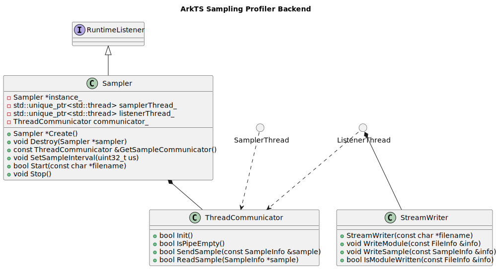
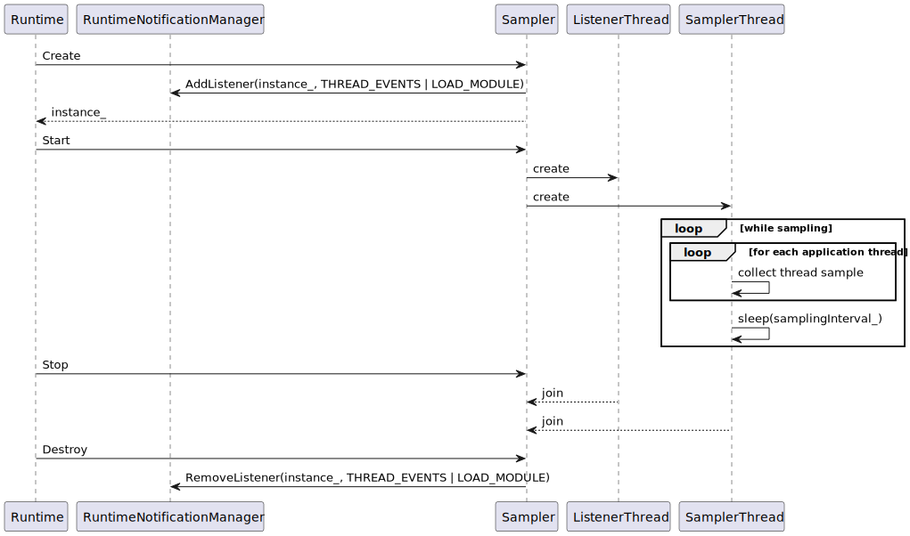
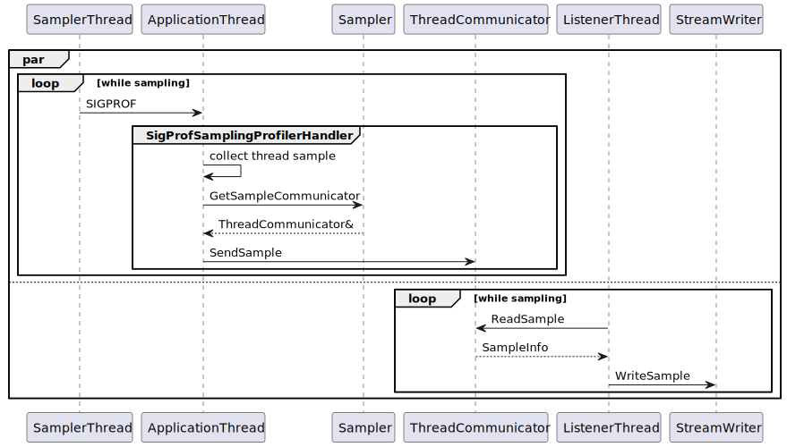

# ArkTS Sampling Profiler

Sampling profiler based on POSIX `SIGPROF` signals.

Current implementation allows profiling only the whole application from start till end. Gathered information is written in a binary file in `ASPT` (Ark Sampling Profiler Trace) format (see description in [SampleWriter](../sample_writer.h)). More information about sampler usage can be found [here](../../../../tools/sampler/README.md).

## Public API

The only public class for profiler backend is `Sampler`. It follows singleton pattern with paired static methods `Create` and `Destroy`, which are invoked during runtime creation and destruction respectively.

Public methods `Start` and `Stop` provide users with means of controling profiling, where `Start` accepts output file path as its argument. The methods must not be called concurrently.

Another public method `SetSampleInterval` allows setting sampling interval in microseconds with default value of `500`. This method must be called before a call to `Start`.

## Implementation

Implementation requires starting two separate threads denoted as `SamplerThread` and `ListenerThread`. The first one is responsible for setting a process signal handler and sending `SIGPROF` in a loop to all application threads registered at the moment. Then the signal handler in each application thread collects the information about the thread and current stack trace. After successful stack trace collection the information is sent to `ListenerThread` via `ThreadCommunicator`.

`ListenerThread` spins on `ThreadCommunicator`, reads the incoming samples and writes them into the output ASPT file. Such separation of file IO and signal handling is required for minimizing user code execution perturbation caused by profiler.
