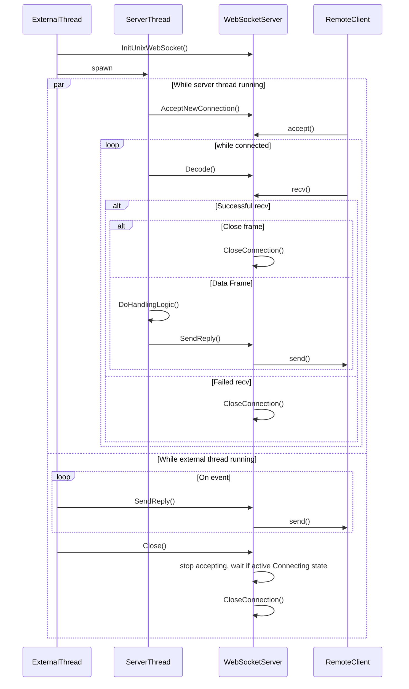
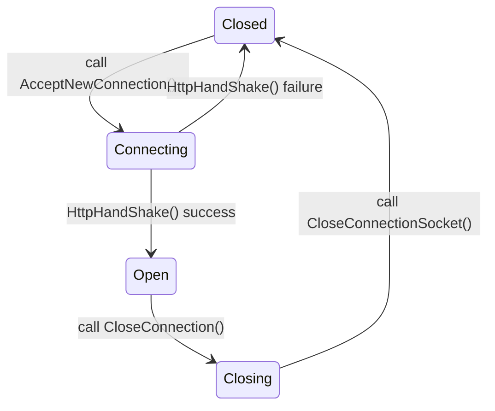

# WebSocketServer

Class `WebSocketServer` represents:
* Server endpoint accepting new `WebSocket` connections,
* Single connection with client, encapsulated in `WebSocketBase` class.

All operations operations of the class (e.g. accepting new connection or receiving new messages) are blocking. Hence typical usage cases imply initializing server and starting a distinct _server thread_, which will:
* Call `AcceptNewConnection` when there is no active connection;
* Until the connection is ended in loop call `Decode`, handle the incoming message and reply with `SendReply`.

The connection might terminate either from client side or by call to `CloseConnection` (gracefully closes connection according to specification) or `Close` (will close both endpoint and active connection).

Interface is designed with trade safety, and all _external threads_ are able to call `SendReply`, `CloseConnection` and `Close`. Note that `SendReply` from an _external thread_ might happen concurrently with `CloseConnection` and `AcceptNewConnection`, so the message might be send to the new connection. To prevent such unexpected behavior, the _external thread_ can set callbacks to be triggered before the connection is finally closed, which is done with `SetCloseConnectionCallback` and `SetFailConnectionCallback` methods.

The following diagram sums up separation of concerns between server and external threads:

## Connection

`WebSocketServer` incapsulates an active connection with a client. Methods `Decode`, `SendReply`, `CloseConnection` relate to a currently active connection (if any presents). Class maintains connection's state according to RFC6455:

