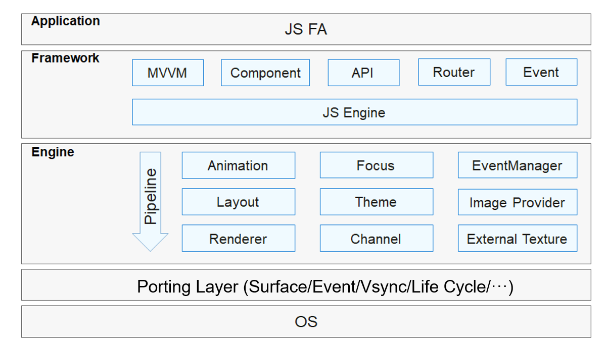

# JS UI Framework<a name="EN-US_TOPIC_0000001076213364"></a>

-   [Introduction](#section15701932113019)
-   [Directory Structure](#section1791423143211)
-   [When to Use](#section171384529150)
-   [Available Components](#section271831717166)
-   [Repositories Involved](#section1447164910172)

## Introduction<a name="section15701932113019"></a>

The OpenHarmony JS UI framework provides basic, container, and canvas UI components and standard CSS animation capabilities. It supports the web-development-like programming paradigm.

-   **Web-development-like paradigm**

    The JS UI framework supports languages that are similar to those for web development, such as HTML and CSS. You can use them to describe the page layout and style, and use JavaScript \(conforming to the ECMAScript specification\) for page behavior. This paradigm allows you to avoid code for UI state switching. The view configuration information is intuitive.


**Figure  1**  Framework architecture<a name="fig2606133765017"></a>  


The JS UI framework consists of the application, framework, engine, and porting layers.

-   **Application**

    Contains apps with Feature Abilities \(FAs\) developed with the JS UI framework. The FA app in this document refers to the app with FAs developed using JavaScript.

-   **Framework**

    Parses UI pages and provides the Model-View-ViewModel \(MVVM\), page routing, custom components and more for front end development.

-   **Engine**

    Accomplishes animation parsing, Document Object Model \(DOM\) building, layout computing, rendering command building and drawing, and event management.

-   **Porting Layer**

    Abstracts the platform layer to provide abstract interfaces to connect to the platform. For example, event interconnection, rendering pipeline interconnection, and lifecycle interconnection.


## Directory Structure<a name="section1791423143211"></a>

The source code of the framework is stored in  **/foundation/arkui/ace\_engine**. The following shows the directory structure.

```
/foundation/arkui/ace_engine
├── adapter                       # Platform adaptation code
│   ├── common
│   └── ohos
├── frameworks                    # Framework code
│   ├── base                      # Basic libraries
│   ├── bridge                    # Bridging layer for frontend and backend components
│   └── core                      # Core components
```

## When to Use<a name="section171384529150"></a>

JS UI framework provides various UI components with rich functionalities and style definitions. You can use and reuse any component anywhere as needed. You can customize new components by combining existing ones to simplify development.

## Available Components<a name="section271831717166"></a>

**Table  1**  Components provided by the framework

<a name="table2347172925617"></a>
<table><thead align="left"><tr id="row5347429155610"><th class="cellrowborder" valign="top" width="28.64%" id="mcps1.2.3.1.1"><p id="p1347102910567"><a name="p1347102910567"></a><a name="p1347102910567"></a>Type</p>
</th>
<th class="cellrowborder" valign="top" width="71.36%" id="mcps1.2.3.1.2"><p id="p83475294565"><a name="p83475294565"></a><a name="p83475294565"></a>Components</p>
</th>
</tr>
</thead>
<tbody><tr id="row15347122918562"><td class="cellrowborder" valign="top" width="28.64%" headers="mcps1.2.3.1.1 "><p id="p679795614335"><a name="p679795614335"></a><a name="p679795614335"></a>Basic</p>
</td>
<td class="cellrowborder" valign="top" width="71.36%" headers="mcps1.2.3.1.2 "><p id="p88813982011"><a name="p88813982011"></a><a name="p88813982011"></a>button, text, input, label, image, progress, rating, span, marquee, image-animator, divider, menu, chart, option, picker, picker-view, piece, qrcode, select, slider, switch, toolbar, toolbar-item, toggle</p>
</td>
</tr>
<tr id="row1973535793115"><td class="cellrowborder" valign="top" width="28.64%" headers="mcps1.2.3.1.1 "><p id="p8735195713313"><a name="p8735195713313"></a><a name="p8735195713313"></a>Container</p>
</td>
<td class="cellrowborder" valign="top" width="71.36%" headers="mcps1.2.3.1.2 "><p id="p1268024618208"><a name="p1268024618208"></a><a name="p1268024618208"></a>div, list, list-item, list-item-group, stack, swiper, tabs, tab-bar, tab-content, refresh, dialog, badge, panel, popup, stepper, stepper-item</p>
</td>
</tr>
<tr id="row1792218915320"><td class="cellrowborder" valign="top" width="28.64%" headers="mcps1.2.3.1.1 "><p id="p692289163220"><a name="p692289163220"></a><a name="p692289163220"></a>Canvas</p>
</td>
<td class="cellrowborder" valign="top" width="71.36%" headers="mcps1.2.3.1.2 "><p id="p199228910327"><a name="p199228910327"></a><a name="p199228910327"></a>canvas</p>
</td>
</tr>
<tr id="row837615526208"><td class="cellrowborder" valign="top" width="28.64%" headers="mcps1.2.3.1.1 "><p id="p4377752152016"><a name="p4377752152016"></a><a name="p4377752152016"></a>Grid</p>
</td>
<td class="cellrowborder" valign="top" width="71.36%" headers="mcps1.2.3.1.2 "><p id="p17377185222019"><a name="p17377185222019"></a><a name="p17377185222019"></a>grid-container, grid-row, grid-col</p>
</td>
</tr>
</tbody>
</table>

## Repositories Involved<a name="section1447164910172"></a>

JS UI framework

**arkui\_ace\_engine**

ace\_engine\_lite

arkui\_napi

