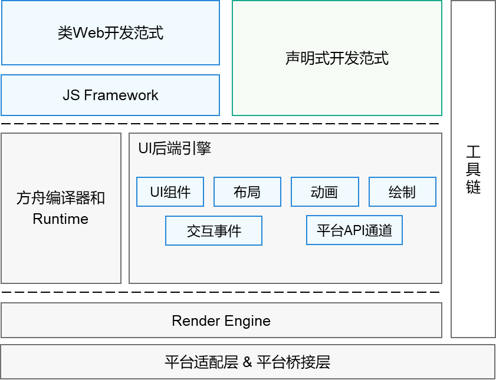

# ArkUI开发框架<a name="ZH-CN_TOPIC_0000001076213364"></a>

-   [简介](#section15701932113019)
-   [目录](#section1791423143211)
-   [使用场景](#section171384529150)
-   [相关仓](#section1447164910172)

## 简介<a name="section15701932113019"></a>

ArkUI框架是OpenHarmony UI开发框架，提供开发者进行应用UI开发时所必需的能力，包括UI组件、动画、绘制、交互事件、JS API扩展机制等。ArkUI框架提供了两种开发范式，分别是基于ArkTS的声明式开发范式（简称“声明式开发范式”）和兼容JS的类Web开发范式（简称“类Web开发范式”）。

**图 1**  ArkUI框架结构<a name="fig2606133765017"></a>  


从上图可以看出，类Web开发范式与声明式开发范式的UI后端引擎和语言运行时是共用的，其中，UI后端引擎实现了ArkUI框架的六种基本能力。声明式开发范式无需JS Framework进行页面DOM管理，渲染更新链路更为精简，占用内存更少，因此更推荐开发者选用声明式开发范式来搭建应用UI界面。


## 目录<a name="section1791423143211"></a>

ArkUI开发框架源代码在/foundation/arkui/ace\_engine下，目录结构如下图所示：

```
/foundation/arkui/ace_engine
├── adapter                       # 平台适配目录
│   ├── common
│   └── ohos
├── frameworks                    # 框架代码
│   ├── base                      # 基础库
│   ├── bridge                    # 前后端组件对接层
│   └── core                      # 核心组件目录
```

## 使用场景<a name="section171384529150"></a>

ArkUI框架提供了丰富的、功能强大的UI组件、样式定义，组件之间相互独立，随取随用，也可以在需求相同的地方重复使用。开发者还可以通过组件间合理的搭配定义满足业务需求的新组件，减少开发量。

## 相关仓<a name="section1447164910172"></a>

[ArkUI框架子系统](https://gitee.com/openharmony/docs/blob/master/zh-cn/readme/ArkUI%E6%A1%86%E6%9E%B6%E5%AD%90%E7%B3%BB%E7%BB%9F.md)

**arkui\_ace\_engine**

[arkui\_ace\_engine\_lite](https://gitee.com/openharmony/arkui_ace_engine_lite)

[arkui\_napi](https://gitee.com/openharmony/arkui_napi)

