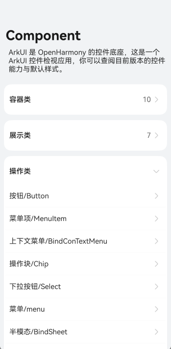
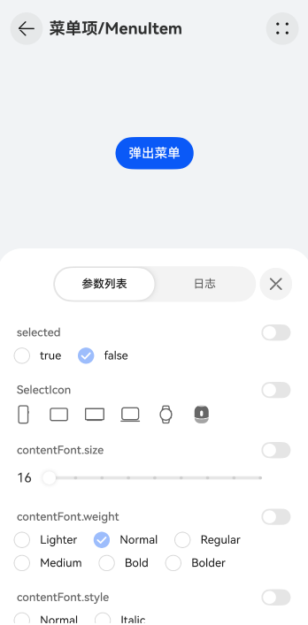
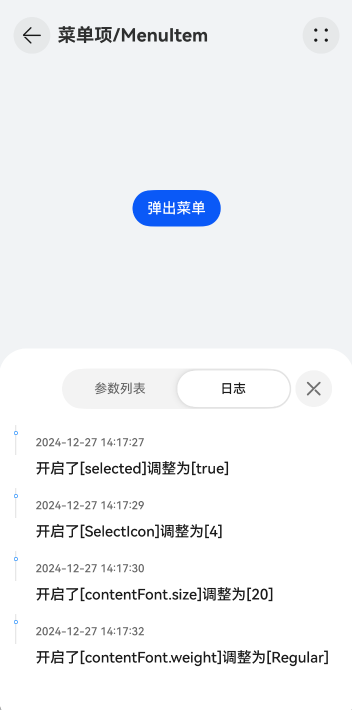

# ArkUI exmaples app

## 背景
ArkUI是OpenHarmony的UI框架，方便使用者查看组件的效果，以保证原生组件的规范性与一致性。但是目前OpenHarmony社区缺少一个可以让使用者看到UI组件真机预览效果的应用软件。为此，需要设计开发一款ArkUI组件预览应用软件，该应用软件提供直观界面和强大功能，允许调整组件属性并即时预览效果。
通过ArkUI组件预览应用软件的引入，将会提高使用者的工作效率，促进ArkUI UX标准化，推动UX规范持续进化，最终提升OpenHarmony应用的用户满意度。

## 需求描述&功能描述
### 需求描述
- 参考[Docs](https://gitee.com/openharmony/docs/blob/master/zh-cn/application-dev/reference/apis-arkui/Readme-CN.md) ArkTS组件,分批次实现组件的UI效果预览功能
- 实现每个组件的属性与事件设置功能，用户设置不同的属性或触发不同的事件，都可以实时在真机上预览到对应的UI效果
- 普通组件需要预览的属性包含通用属性/组件属性/构造器参数
- 高级组件需要预览的属性包含组件属性/构造器参数
- 注册组件的事件，并将事件信息打印到UI界面
- 系统接口不需要验证
- 完成开发后，需要将代码合入到[arkui_ace_engin](https://gitee.com/openharmony/arkui_ace_engine/tree/master/examples/components)

### 功能描述
- 进入应用后，通过列表选择需要预览的组件
- 
- 进入组件预览页后，可以通过页面右上角按钮打开参数列表设置属性
- 
- 事件监听信息会打印到UI界面
- 

## 关键设计

### 页面结构

- 应用为单页面程序，使用Navigation+NavDestination完成组件列表和组件预览UI的展示

### 属性Block
- 在common中定义不同类型的属性block，统一组件属性设置项的UI风格

## 模块设计

### 模块设计


ArkUI组件预览应用软件包含UI层，业务层，基础层：
- UI层
  - 主要页面：组件导航页，组件预览页
  - 导航菜单：帮助用户迅速导航到需要预览调试的组件
  - 组件预览：选择需要预览调试的组件后，将进入预览页，展示对应属性的组件真机效果，并提供弹窗，用户可以在弹窗上进行组件的属性设置
- 基础层
  - 公共组件：封装可复用的滑动进度条，选择器，复选框,单选框等自定义UI组件
  - 公共资源：统一定义尺寸，颜色，图片资源等公共资源
  - 提供字符串处理，日志，数据换算，资源管理等通用工具类
  - 基础数据模块：封装包含ArkUI组件通用属性的数据基类
- 业务层
  - 应用软件根据ArkUI组件分类，定义6个业务模块
  - 业务模块包含组件属性的数据对象

### 组件信息
- 行列与堆叠
  - [Flex](https://gitee.com/openharmony/docs/blob/master/zh-cn/application-dev/reference/apis-arkui/arkui-ts/ts-container-flex.md)
  - [Column](https://gitee.com/openharmony/docs/blob/master/zh-cn/application-dev/reference/apis-arkui/arkui-ts/ts-container-column.md)
  - [Row](https://gitee.com/openharmony/docs/blob/master/zh-cn/application-dev/reference/apis-arkui/arkui-ts/ts-container-row.md)
  - [Stack](https://gitee.com/openharmony/docs/blob/master/zh-cn/application-dev/reference/apis-arkui/arkui-ts/ts-container-stack.md)
  - [RelativeContainer](https://gitee.com/openharmony/docs/blob/master/zh-cn/application-dev/reference/apis-arkui/arkui-ts/ts-container-relativecontainer.md)
  - [FolderStack](https://gitee.com/openharmony/docs/blob/master/zh-cn/application-dev/reference/apis-arkui/arkui-ts/ts-container-folderstack.md)
- 栅格与分栏
  - [GridRow](https://gitee.com/openharmony/docs/blob/master/zh-cn/application-dev/reference/apis-arkui/arkui-ts/ts-container-gridrow.md)
  - [GridCol](https://gitee.com/openharmony/docs/blob/master/zh-cn/application-dev/reference/apis-arkui/arkui-ts/ts-container-gridcol.md)
  - [ColumnSplit](https://gitee.com/openharmony/docs/blob/master/zh-cn/application-dev/reference/apis-arkui/arkui-ts/ts-container-columnsplit.md)
  - [RowSplit](https://gitee.com/openharmony/docs/blob/master/zh-cn/application-dev/reference/apis-arkui/arkui-ts/ts-container-rowsplit.md)
  - [FoldSplitContainer](https://gitee.com/openharmony/docs/blob/master/zh-cn/application-dev/reference/apis-arkui/arkui-ts/ohos-arkui-advanced-FoldSplitContainer.md)
  - [SideBarContainer](https://gitee.com/openharmony/docs/blob/master/zh-cn/application-dev/reference/apis-arkui/arkui-ts/ts-container-sidebarcontainer.md)
- 滚动与滑动
  - [List](https://gitee.com/openharmony/docs/blob/master/zh-cn/application-dev/reference/apis-arkui/arkui-ts/ts-container-list.md)
  - [ListItem](https://gitee.com/openharmony/docs/blob/master/zh-cn/application-dev/reference/apis-arkui/arkui-ts/ts-container-listitem.md)
  - [ListItemGroup](https://gitee.com/openharmony/docs/blob/master/zh-cn/application-dev/reference/apis-arkui/arkui-ts/ts-container-listitemgroup.md)
  - [Grid](https://gitee.com/openharmony/docs/blob/master/zh-cn/application-dev/reference/apis-arkui/arkui-ts/ts-container-grid.md)
  - [GridItem](https://gitee.com/openharmony/docs/blob/master/zh-cn/application-dev/reference/apis-arkui/arkui-ts/ts-container-griditem.md)
  - [Scroll](https://gitee.com/openharmony/docs/blob/master/zh-cn/application-dev/reference/apis-arkui/arkui-ts/ts-container-scroll.md)
  - [Swiper](https://gitee.com/openharmony/docs/blob/master/zh-cn/application-dev/reference/apis-arkui/arkui-ts/ts-container-swiper.md)
  - [WaterFlow](https://gitee.com/openharmony/docs/blob/master/zh-cn/application-dev/reference/apis-arkui/arkui-ts/ts-container-waterflow.md)
  - [FlowItem](https://gitee.com/openharmony/docs/blob/master/zh-cn/application-dev/reference/apis-arkui/arkui-ts/ts-container-flowitem.md)
  - [ScrollBar](https://gitee.com/openharmony/docs/blob/master/zh-cn/application-dev/reference/apis-arkui/arkui-ts/ts-basic-components-scrollbar.md)
  - [Refresh](https://gitee.com/openharmony/docs/blob/master/zh-cn/application-dev/reference/apis-arkui/arkui-ts/ts-container-refresh.md)
- 导航与切换
  - [Navigation](https://gitee.com/openharmony/docs/blob/master/zh-cn/application-dev/reference/apis-arkui/arkui-ts/ts-basic-components-navigation.md)
  - [NavDestination](https://gitee.com/openharmony/docs/blob/master/zh-cn/application-dev/reference/apis-arkui/arkui-ts/ts-basic-components-navdestination.md)
  - [Stepper](https://gitee.com/openharmony/docs/blob/master/zh-cn/application-dev/reference/apis-arkui/arkui-ts/ts-basic-components-stepper.md)
  - [StepperItem](https://gitee.com/openharmony/docs/blob/master/zh-cn/application-dev/reference/apis-arkui/arkui-ts/ts-basic-components-stepperitem.md)
  - [Tabs](https://gitee.com/openharmony/docs/blob/master/zh-cn/application-dev/reference/apis-arkui/arkui-ts/ts-container-tabs.md)
  - [TabContent](https://gitee.com/openharmony/docs/blob/master/zh-cn/application-dev/reference/apis-arkui/arkui-ts/ts-container-tabcontent.md)
- 按钮与选择
  - [Button](https://gitee.com/openharmony/docs/blob/master/zh-cn/application-dev/reference/apis-arkui/arkui-ts/ts-basic-components-button.md)
  - [Toggle](https://gitee.com/openharmony/docs/blob/master/zh-cn/application-dev/reference/apis-arkui/arkui-ts/ts-basic-components-toggle.md)
  - [Checkbox](https://gitee.com/openharmony/docs/blob/master/zh-cn/application-dev/reference/apis-arkui/arkui-ts/ts-basic-components-checkbox.md)
  - [CheckboxGroup](https://gitee.com/openharmony/docs/blob/master/zh-cn/application-dev/reference/apis-arkui/arkui-ts/ts-basic-components-checkboxgroup.md)
  - [CalendarPicker](https://gitee.com/openharmony/docs/blob/master/zh-cn/application-dev/reference/apis-arkui/arkui-ts/ts-basic-components-calendarpicker.md)
  - [DatePicker](https://gitee.com/openharmony/docs/blob/master/zh-cn/application-dev/reference/apis-arkui/arkui-ts/ts-basic-components-datepicker.md)
  - [TextPicker](https://gitee.com/openharmony/docs/blob/master/zh-cn/application-dev/reference/apis-arkui/arkui-ts/ts-basic-components-textpicker.md)
  - [TimePicker](https://gitee.com/openharmony/docs/blob/master/zh-cn/application-dev/reference/apis-arkui/arkui-ts/ts-basic-components-timepicker.md)
  - [Radio](https://gitee.com/openharmony/docs/blob/master/zh-cn/application-dev/reference/apis-arkui/arkui-ts/ts-basic-components-radio.md)
  - [Rating](https://gitee.com/openharmony/docs/blob/master/zh-cn/application-dev/reference/apis-arkui/arkui-ts/ts-basic-components-rating.md)
  - [Select](https://gitee.com/openharmony/docs/blob/master/zh-cn/application-dev/reference/apis-arkui/arkui-ts/ts-basic-components-select.md)
  - [Slider](https://gitee.com/openharmony/docs/blob/master/zh-cn/application-dev/reference/apis-arkui/arkui-ts/ts-basic-components-slider.md)
  - [SegmentButton](https://gitee.com/openharmony/docs/blob/master/zh-cn/application-dev/reference/apis-arkui/arkui-ts/ohos-arkui-advanced-SegmentButton.md)
- 文本与输入
  - [Text](https://gitee.com/openharmony/docs/blob/master/zh-cn/application-dev/reference/apis-arkui/arkui-ts/ts-basic-components-text.md)
  - [TextArea](https://gitee.com/openharmony/docs/blob/master/zh-cn/application-dev/reference/apis-arkui/arkui-ts/ts-basic-components-textarea.md)
  - [TextInput](https://gitee.com/openharmony/docs/blob/master/zh-cn/application-dev/reference/apis-arkui/arkui-ts/ts-basic-components-textinput.md)
  - [RichEditor](https://gitee.com/openharmony/docs/blob/master/zh-cn/application-dev/reference/apis-arkui/arkui-ts/ts-basic-components-richeditor.md)
  - [Search](https://gitee.com/openharmony/docs/blob/master/zh-cn/application-dev/reference/apis-arkui/arkui-ts/ts-basic-components-search.md)
  - [Span](https://gitee.com/openharmony/docs/blob/master/zh-cn/application-dev/reference/apis-arkui/arkui-ts/ts-basic-components-span.md)
  - [ImageSpan](https://gitee.com/openharmony/docs/blob/master/zh-cn/application-dev/reference/apis-arkui/arkui-ts/ts-basic-components-imagespan.md)
  - [ContainerSpan](https://gitee.com/openharmony/docs/blob/master/zh-cn/application-dev/reference/apis-arkui/arkui-ts/ts-basic-components-containerspan.md)
  - [SymbolSpan](https://gitee.com/openharmony/docs/blob/master/zh-cn/application-dev/reference/apis-arkui/arkui-ts/ts-basic-components-symbolSpan.md)
  - [SymbolGlyph](https://gitee.com/openharmony/docs/blob/master/zh-cn/application-dev/reference/apis-arkui/arkui-ts/ts-basic-components-symbolGlyph.md)
  - [Hyperlink](https://gitee.com/openharmony/docs/blob/master/zh-cn/application-dev/reference/apis-arkui/arkui-ts/ts-container-hyperlink.md)
  - [SelectionMenu](https://gitee.com/openharmony/docs/blob/master/zh-cn/application-dev/reference/apis-arkui/arkui-ts/ohos-arkui-advanced-SelectionMenu.md)
- 图片与视频
  - [Image](https://gitee.com/openharmony/docs/blob/master/zh-cn/application-dev/reference/apis-arkui/arkui-ts/ts-basic-components-image.md)
  - [ImageAnimator](https://gitee.com/openharmony/docs/blob/master/zh-cn/application-dev/reference/apis-arkui/arkui-ts/ts-basic-components-imageanimator.md)
- 信息展示
  - [AlphabetIndexer](https://gitee.com/openharmony/docs/blob/master/zh-cn/application-dev/reference/apis-arkui/arkui-ts/ts-container-alphabet-indexer.md)
  - [Badge](https://gitee.com/openharmony/docs/blob/master/zh-cn/application-dev/reference/apis-arkui/arkui-ts/ts-container-badge.md)
  - [Chip](https://gitee.com/openharmony/docs/blob/master/zh-cn/application-dev/reference/apis-arkui/arkui-ts/ohos-arkui-advanced-Chip.md)
  - [ChipGroup](https://gitee.com/openharmony/docs/blob/master/zh-cn/application-dev/reference/apis-arkui/arkui-ts/ohos-arkui-advanced-ChipGroup.md)
  - [Counter](https://gitee.com/openharmony/docs/blob/master/zh-cn/application-dev/reference/apis-arkui/arkui-ts/ts-container-counter.md)
  - [advanced.Counter](https://gitee.com/openharmony/docs/blob/master/zh-cn/application-dev/reference/apis-arkui/arkui-ts/ohos-arkui-advanced-Counter.md)
  - [DataPanel](https://gitee.com/openharmony/docs/blob/master/zh-cn/application-dev/reference/apis-arkui/arkui-ts/ts-basic-components-datapanel.md)
  - [Gauge](https://gitee.com/openharmony/docs/blob/master/zh-cn/application-dev/reference/apis-arkui/arkui-ts/ts-basic-components-gauge.md)
  - [LoadingProgress](https://gitee.com/openharmony/docs/blob/master/zh-cn/application-dev/reference/apis-arkui/arkui-ts/ts-basic-components-loadingprogress.md)
  - [Marquee](https://gitee.com/openharmony/docs/blob/master/zh-cn/application-dev/reference/apis-arkui/arkui-ts/ts-basic-components-marquee.md)
  - [PatternLock](https://gitee.com/openharmony/docs/blob/master/zh-cn/application-dev/reference/apis-arkui/arkui-ts/ts-basic-components-patternlock.md)
  - [Progress](https://gitee.com/openharmony/docs/blob/master/zh-cn/application-dev/reference/apis-arkui/arkui-ts/ts-basic-components-progress.md)
  - [Popup](https://gitee.com/openharmony/docs/blob/master/zh-cn/application-dev/reference/apis-arkui/arkui-ts/ohos-arkui-advanced-Popup.md)
  - [QRCode](https://gitee.com/openharmony/docs/blob/master/zh-cn/application-dev/reference/apis-arkui/arkui-ts/ts-basic-components-qrcode.md)
  - [TextClock](https://gitee.com/openharmony/docs/blob/master/zh-cn/application-dev/reference/apis-arkui/arkui-ts/ts-basic-components-textclock.md)
  - [TextTimer](https://gitee.com/openharmony/docs/blob/master/zh-cn/application-dev/reference/apis-arkui/arkui-ts/ts-basic-components-texttimer.md)
- 空白与分隔
  - [Blank](https://gitee.com/openharmony/docs/blob/master/zh-cn/application-dev/reference/apis-arkui/arkui-ts/ts-basic-components-blank.md)
  - [Divider](https://gitee.com/openharmony/docs/blob/master/zh-cn/application-dev/reference/apis-arkui/arkui-ts/ts-basic-components-divider.md)
- 菜单
  - [Menu](https://gitee.com/openharmony/docs/blob/master/zh-cn/application-dev/reference/apis-arkui/arkui-ts/ts-basic-components-menu.md)
  - [MenuItem](https://gitee.com/openharmony/docs/blob/master/zh-cn/application-dev/reference/apis-arkui/arkui-ts/ts-basic-components-menuitem.md)
  - [MenuItemGroup](https://gitee.com/openharmony/docs/blob/master/zh-cn/application-dev/reference/apis-arkui/arkui-ts/ts-basic-components-menuitemgroup.md)
- 弹窗
  - [警告弹窗 (AlertDialog)](https://gitee.com/openharmony/docs/blob/master/zh-cn/application-dev/reference/apis-arkui/arkui-ts/ts-methods-alert-dialog-box.md)
  - [列表选择弹窗 (ActionSheet)](https://gitee.com/openharmony/docs/blob/master/zh-cn/application-dev/reference/apis-arkui/arkui-ts/ts-methods-action-sheet.md)
  - [自定义弹窗 (CustomDialog)](https://gitee.com/openharmony/docs/blob/master/zh-cn/application-dev/reference/apis-arkui/arkui-ts/ts-methods-custom-dialog-box.md)
  - [日历选择器弹窗 (CalendarPickerDialog)](https://gitee.com/openharmony/docs/blob/master/zh-cn/application-dev/reference/apis-arkui/arkui-ts/ts-methods-calendarpicker-dialog.md)
  - [日期滑动选择器弹窗 (DatePickerDialog)](https://gitee.com/openharmony/docs/blob/master/zh-cn/application-dev/reference/apis-arkui/arkui-ts/ts-methods-datepicker-dialog.md)
  - [时间滑动选择器弹窗 (TimePickerDialog)](https://gitee.com/openharmony/docs/blob/master/zh-cn/application-dev/reference/apis-arkui/arkui-ts/ts-methods-timepicker-dialog.md)
  - [文本滑动选择器弹窗 (TextPickerDialog)](https://gitee.com/openharmony/docs/blob/master/zh-cn/application-dev/reference/apis-arkui/arkui-ts/ts-methods-textpicker-dialog.md)
  - [全模态(bindContentCover)](https://gitee.com/openharmony/docs/blob/master/zh-cn/application-dev/reference/apis-arkui/arkui-ts/ts-universal-attributes-modal-transition.md)
  - [半模态(bindSheet)](https://gitee.com/openharmony/docs/blob/master/zh-cn/application-dev/reference/apis-arkui/arkui-ts/ts-universal-attributes-sheet-transition.md)
  - [bindPopup(bindPopup)](https://gitee.com/openharmony/docs/blob/master/zh-cn/application-dev/reference/apis-arkui/arkui-ts/ts-universal-attributes-popup.md)
  - [promptAction(promptAction)](https://gitee.com/openharmony/docs/blob/master/zh-cn/application-dev/reference/apis-arkui/js-apis-promptAction.md)


## 关键流程


- 使用导航组件 Navigation 加载所有组件
- 用户选择组件后，打开组件对应的NavDestination
- 定义组件属性值对应的的状态变量
- 通过设置界面操作修改状态变量，刷新组件UI,完成预览功能

## 文件结构
## 目录
### 目录结构
```
/foundation/arkui/ace_engine/examples/components
├── common                                          # 公共能力层目录
│   └── src/main/ets            
│                 └── components                    # 公共组件
│                 └── utils                         # 公共工具
├── features                                        # 公共能力层目录
│      └── xxxxxx                                   # 分类代码目录，如行列与堆叠
├── entry                      
│      └── src/main/ets            
│                   └── entryability             
│                   └── entrybackupability             
│                   └── pages               
│                         └── index.ets               # 首页
```

## DFX设计
### 体验性
- 目标：确保UX预览App提供直观、高效且令人愉悦的用户体验。
- 措施：
   - 界面设计：采用简洁的UI设计，确保所有功能一目了然，减少用户认知负担。
   - 交互设计：优化手势操作，如滑动、点击等，确保流畅且符合用户习惯。
   - 即时反馈：提供清晰的加载状态、操作反馈和错误提示，增强用户操作的确定性和控制感。
### 高效开发
- 目标：提升开发效率，减少开发周期中的错误和重复工作。
- 措施：
   - 所有属性设置使用common module定义的通用block组件，提升开发效率
   - 模块化开发：将App拆分为多个独立的模块，每个模块负责特定的功能，便于团队协作和代码复用。
   - 自动化测试：集成单元测试和集成测试框架，确保代码质量，减少手动测试的工作量。
   - 版本控制：使用Git等版本控制系统，管理代码变更，确保团队成员之间的协作顺畅。
### 可维护性
- 目标：确保App在发布后易于维护和更新，降低长期维护成本。
- 措施：
   - 清晰文档：编写详细的开发文档，包括架构设计图和代码注释等。
   - 代码质量：遵循编程规范，保持代码清晰、可读和可维护。
### 可扩展性
- 目标：确保App能够随着业务需求的变化而灵活扩展。
- 措施：
   -  通过配置RouteGroup数组数据新增组件

## 测试设计

- 每个组件对应一个describe，每个属性对应一个it（用例），对组件的属性设置UI进行单元测试
- UITest用例步骤如下：
  - 进入组件
  - 打开属性设置UI
  - 找到对应的属性block
  - 进行设置
  - assert结果
- 可以通过@ohos.UiTest获取的组件属性，需要assert属性值与用例输入值相等
- 不可通过@ohos.UiTest获取的组件属性，设置成功即可
- UITest覆盖率需达到80%-90%

## 规范与要求
- [JavaScript语言通用编程规范](https://gitee.com/openharmony/docs/blob/master/zh-cn/contribute/OpenHarmony-JavaScript-coding-style-guide.md)
- [OpenHarmony应用TS&JS编程指南](https://gitee.com/openharmony/docs/blob/master/zh-cn/contribute/OpenHarmony-Application-Typescript-JavaScript-coding-guide.md)
- [社区共建合入要求](https://gitee.com/openharmony/applications_app_samples/blob/master/CodeCommitChecklist.md)
- 应用支持API12标准SDK


