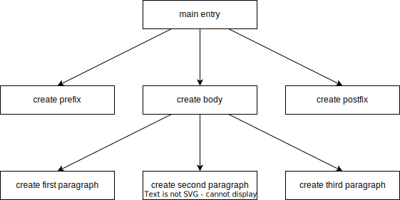

# Basic concepts of the incremental UI building

Incremental runtime is part of the declarative UI framework
designed to optimize calculations and rebuilding trees depending on states.
This document explains the basic concepts underlying the chosen approach.

## 1. Positional memoization

### Call graphs

A call graph is a control-flow diagram,
which represents calling relationships between subroutines in a computer program.
Each node represents a function (or a method)
and each directional edge indicates that one function calls another one.


> Figure 1. A call graph example

### Idempotent functions

Idempotence is the property of certain operations in mathematics and computer science
whereby they can be applied multiple times
without changing the result beyond the initial application.

If all functions in some call graph are idempotent, then such graph is also idempotent.
Therefore, it's enough to call it only once and use the cached result later.

### @memo functions

The @memo function is a kind of idempotent function
that should recalculate the cached result when the used state has changed.
If none of the used states has changed, the @memo function is considered idempotent
and its cached result is used instead of recalculation.

The @memo function can only be called within some @memo context,
i.e. from other @memo functions.
An attempt to call the @memo function without the @memo context
will cause a compiler error (in some cases a runtime error).

```typescript
const state = mutableState("some text")

/** @memo */
function printAll() {
    console.log("state: " + state.value) // recomposed on state change
}
```

Consider the example of a call graph shown in Figure 1.
Suppose that each of its functions is a @memo function.
Then the first time we evaluate `main entry`,
we need to call each used function in the specified order.
This initial calculation is called *composition*.

Now assume that `create second paragraph` uses some state that has just changed.
This means that the cached result of this @memo function needs to be recalculated.
Also, `create body` must be recalculated too, because it uses `create second paragraph`.
Similarly, `main entry` must also be recalculated.
This partial recalculation of the call graph is called *recomposition*.
Thus, the recomposition of the considering example will look like this:
- compute the value of `main entry`
    - use the cached value of `create prefix`
    - compute the value of `create body`
        - use the cached value of `create first paragraph`
        - compute the value of `create second paragraph`
        - use the cached value of `create third paragraph`
    - use the cached value of `create postfix`

### Parameters

A @memo function can have parameters,
which (as well as states) affect its idempotence.
If some @memo function during recomposition computes a different argument,
the called @memo function will be recomputed even if its states are not changed.

```typescript
const state = mutableState(10)

/** @memo */
function printAll() {
    print(Math.floor(state.value / 10)) // recomposed on state change
}

/** @memo */
function print(value: number) {
    console.log("parameter: " + value) // recomposed on parameter change
}
```

Consider the example above.
Both methods will be called during composition.
The argument for `print` will be `1`.
If the state value is changed, `printAll` will be recomposed
and the argument for `print` will be recalculated.

Suppose the state value becomes `15`.
Then the argument will be `1`, and the recomposition of `print` will not occur.
But if the state value becomes `20`, the argument will be `2`.
Changing the parameter value will cause the recomposition of `print`,
and this value will be logged.

### Positioning

A @memo function can be called from another one several times.
Therefore, it is needed to distinguish between different calls.
For this purpose, *positional memoization* is used.
For each @memo function call, the compiler computes
the corresponding callsite key based on its position in the code.

```typescript
const state1 = mutableState("some text")
const state2 = mutableState("separate text")

/** @memo */
function printAll() {
    print("state1", state1.value) // recomposed on first state change
    print("state2", state2.value) // recomposed on second state change
}

/** @memo */
function print(name: string, value: string) {
    console.log(name + ": " + value) // recomposed on parameter change
}
```

In the example above, `print` is called twice during composition.
If a single state is changed, only the corresponding `print` is recomposed.
If both states are changed, `print` is recomposed twice,
even if the values of both states are equal.

### Conditional constructs

The @memo function can call other functions, both @memo and regular ones.
In addition, conditional statements can be used without any restrictions.

```typescript
const state = mutableState(true)

/** @memo */
function print() {
    const value = state.value ? random("ON") : random("OFF")
    console.log("random value is " + value)
}

/** @memo */
function random(text: string): string {
    return text + ": " + Math.random()
}
```

Consider the example above.
`print` has two different calls of `random`,
but only one of them is called during composition/recomposition
because of positional memoization.
When the state changes,
one call *leaves the composition* and another one *enters the composition*.
When a @memo function leaves the composition, all cached results are forgotten.

Note that `random` is called with constant arguments and it does not use any states.
This means that this @memo function will be called only once during composition.
Therefore, the library `Math.random` will also be called only once,
and the calculated value will be cached for future use.

### Loop constructs

Positioning may be insufficient to distinguish
multiple calls at the same position in case of loops.
The current implementation allows to use loop statements
to iterate stable content only.
The example below contains ten `print` calls,
each of which is called with a constant argument.

```typescript
/** @memo */
function printAll() {
    for (let i = 0; i < 10; i++) print(i)
}

/** @memo */
function print(index: number) {
    console.log("index: " + index)
}
```

To resolve the positioning issue in loops,
the runtime provides additional @memo functions
to distinguish between calls on different iterations of the loop.
`RepeatWithKey`, `RepeatByArray`, and `RepeatRange`
allow to control the callsite key generation for each iteration.

## 2. State management

## 3. Build UI tree incrementally
