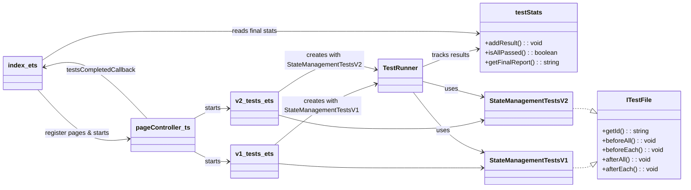
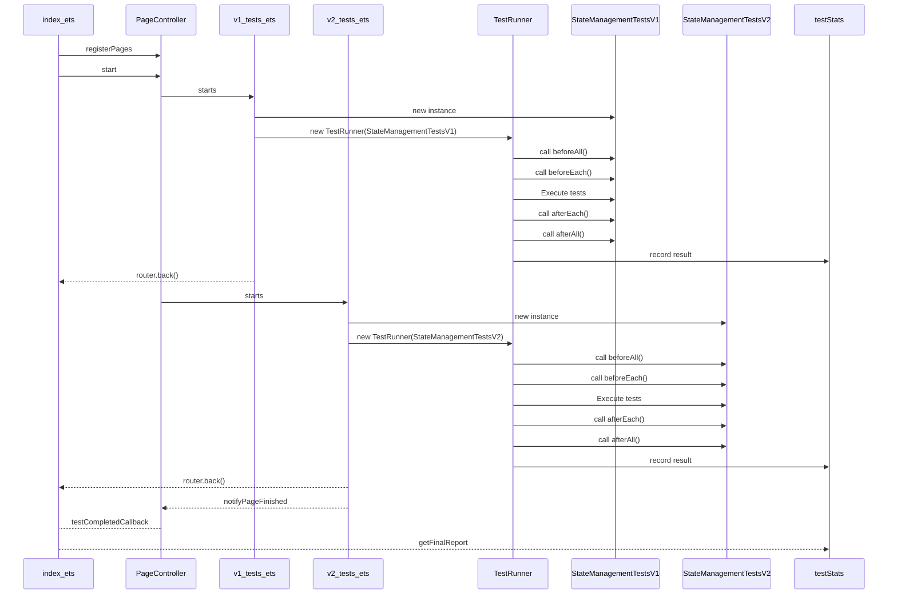

# How to Run and Write UT Test Case for ArkUI

Tests can be run on an RK board or a phone. The HAP must be installed, and tests will run automatically when the application starts.

## Building
HAP can be build and signed by build server with the following command
 ```bash
 ./build.sh --product-name rk3568 --build-target statemgmt_ut_hap
 NOTE: When adding new tests and changing .ts files. Its often necessary to remove .hvigor folder to build system to detect changes. You can use this command to always detect .ts file changes.
   rm -rf foundation/arkui/ace_engine/frameworks/bridge/declarative_frontend/state_mgmt/test/unittest/.hvigor/cache/ &&  ./build.sh --product-name rk3568 --build-target statemgmt_ut_hap
 ```
 Output:
```bash
./out/rk3568/obj/foundation/arkui/ace_engine/frameworks/bridge/declarative_frontend/state_mgmt/test/unittest/StateMgmtTest.hap
 ```
## Fixing a Failed Build
If you modify the test code and the build fails, you can locate the cause of the error in the build log.
1. Open the build log file:
```bash
./out/rk3568/build.log
```
2. Search for the error message you encountered.

Note: The relevant error may not be at the end of the log.

## Installing the Unit Test HAP manually
+ HAP file available and not plans to change source code:
Copy StateMgmtTest.hap to local PC then:
 ```bash
  hdc install -r StateMgmtTest.hap
 ```
 Then run tests by clicking the application icon to start it.

 + Cmd line to start the application without clicking the icon.

```bash
 hdc shell aa start -a EntryAbility -b com.ohos.state_mgmt_ut
```

 + Cmd line to close the application.

```bash
 hdc shell aa force-stop com.ohos.state_mgmt_ut
```

## Installing and Running Unit Test with script
+ Unit tests are automatically run when application is started.
+ To re-run the unit tests, restart the application.
+ Cmd line to install and run the application.
```bash
// This script can be found from scripts folder
// Important: StateMgmtTest.hap must be in the same folder than run_ut.ps1.
.\run_ut.ps1

// TIP: Add param debug to see full log
// Optional to have output in a log file
.\run_ut.ps1 debug > outputlog.log
code outputlog.log

```

## Adding new Tests

### Adding new UnitTest whenever new functionality is added to stateMgmt.ts files (normal case)
Add Unit test that calls the new functionality. Remember edge cases. In simplest case you just add one new function to the end of selected .ts files under v1_tests or v2_tests.

### Adding more test coverage when no new stateMgmt implementation is done (advanced)
Normally App developer does not directly call stateMgmt functions and functions are not part of the API. Because of this there is no clear developer documentation how functions should be called. However, To create unit tests, you must call individual functions directly. And then use some way to check was the behavior as expected. Normally you can see that from the stateMgmt source code. For example if some class properties are changed you can check those to verify the test result.
One good way to invent test cases and see how the functions are called is to observe DevEco .ts generated files from the different kind of applications. DevEco generates stateMgmt function calls as a .ts files from .ets source code.

Before adding a new test case, consider whether an appropriate test file already exists for the feature:
✅ If a test file already covers the feature, simply add your new test case to that file.
📁 If the feature is not yet covered, create a new test file dedicated to it.
🖼️ If your test requires new UI elements that would interfere with existing tests, you may need to create a separate UI page (.ets file).
⚠️ Note: Creating new UI pages should be avoided when possible, as switching between pages adds unnecessary runtime and complexity. Try to reuse existing pages unless separation is clearly necessary.

### Adding to existing file
+ Add your new test function at the end of an existing .ts file under the v1_tests or v2_tests folders.
+ Function should:
  +  Take no parameters
  +  Return a void. Test is passed if error is not thrown.
+ Use the built-in assertion helpers (eq, lt, gt) to validate test results:
  + eq(a, b) – passes if a === b
  + neq(a, b) – passes if a !== b
  + gt(a, b) – passes if a > b
  + lt(a, b) – passes if a < b
    + These will throw an error on failure, which is automatically detected by the test framework.
    + IMPORTANT: There is optional third parameter in these helper functions. Use this when there are multiple such cases inside a single test to clearly separate the error conditions. For Example:
```ts
    eq (idAtStart, idAtEnd, 'Start equals end');
    eq (idAtRecording, idNum, 'Recording id is correct');
```
+ Declare any external classes or types you plan to use at the top of the file.
+  Take declarations from
   foundation/arkui/ace_engine/frameworks/bridge/declarative_frontend/state_mgmt/distRelease/stateMgmt.d.ts
+ INFO: All test functions are automatically discovered and executed from test classes (for example CommonTestsV2 class in commonTestsV2.ts). See testRunner.ts for details...
+ If you need to run logic:
  + **Before all tests**, use the beforeAll() function.
  + **Before each tests**, use the beforeEach() function.
  + **After all tests**, use the afterAll() function.
  + **After each tests**, use the afterEach() function.
```bash
// Create stateMgmt.d.ts to get class definitions.
// NOTE: Copy what you need from stateMgmt.d.ts to your test case.
// You can change private to public for testing purposes!
cd foundation/arkui/ace_engine/frameworks/bridge/declarative_frontend/state_mgmt
npm install
npm run build_release
```

### Adding a new test file (.ts)
+ Add new .ts file under v1_tests or v2_tests.
+ Export your new test class. Implement ITestFile interfaces (beforeAll, beforeEach, getId)
+ Please use descriptive names to make it easier for others to understand.
```ts
// Simplest example yourNewTest.ts
import { eq, neq, gt, lt, ITestFile } from '../lib/testRunner'

export class YourNewTestsV2 implements ITestFile
  private idString: string = "";

  constructor(str: string) {
    this.idString = str;
  }
  public beforeAll () : void {}
  public beforeEach () : void {}
  public afterAll () : void {}
  public afterEach () : void {}

  public getId(): string {
    return this.idString;
  }
  // Test cases

  /* Verify that one is 1
  */
  public testMeWorking() : boolean
  {
    const one : number = 1;
    return eq(one,1);
  }
```
+ Add new entry .ets file to run .ts file
+ Add new import and entry to v1_tests.ets or v2_tests.ets
  ```ts
  // Example adding test file to be run in .ets file
  // file v2_tests.ets
  import { YourNewTestsV2 } from '../../v2_tests/yourNewTest.ts'
  // Add this new line...
  TestRunner.bind(this)(new YourNewTestsV2('V2_one_test'));
  // ...before this line
  router.back();

  ```

### Adding a new UI (.ets) file
+ First check if you can have your test goal done by adding new UI items to existing files (v1_tests.ets, v2_tests.ets).
  + If all previous tests still pass, you may extend these files.
+ If you cannot add to the existing pages:
+  Add a new page under pages. For example v2_special_page.ets
+  Add a new .ts test file under v1_tests or v2_tests as appropriate. See the previous section for structure and naming conventions.
+  Ensure your new page is listed in resources/base/profile/main_pages.json.
+  Implement the test UI logic in your new .ets page
+  In aboutToAppear(), use setTimeout() and TestRunner to run your new test file. Remember to call router.back() and PageController.notifyPageFinished() when the test finished. See example from existing .ets files.
+  Add new page to PageController in Index.ets to start your .ets page.

## Analyzing the results
+ Results are shown directly on the device screen.
+ Final result will be shown in top. It's either **All: FAILED** or **All:PASSED**
+ Detailed result will be show in UI also. If there are too many entries to fit on the screen, scroll the UI to view all.
+ '__ut ' string is added to the beginning of the final results. So that they can be easily to found from DevEco log output.Just write __ut to then log window search window on top right. Use 'info' logging level.
+ **If all tests pass**, the results are printed using console.log.
  **If any test fails**, results are logged using console.error.


```bash
__ut V1_common->verifyAPIVersion              PASSED 0 ms
__ut V1_common->verifyThisIsV1Object          PASSED 0 ms
__ut V1_local->localStorageCreateAndClear     PASSED 2 ms
__ut V1_local->localStorageBasicFuncs         PASSED 1 ms
__ut V2_common->verifyAPIVersion              PASSED 0 ms
__ut V2_common->verifyThisIsV2Object          PASSED 0 ms
__ut V2_monitor->testBasicMonitorCreation     PASSED 0 ms
__ut V2_observe->addVariableDecoMetaTest      PASSED 1 ms
__ut V2_observe->testStartStopGetRecording    PASSED 1 ms
__ut V2_observe->testExecuteUnobservedFunc    PASSED 0 ms
__ut V2_observe->testAddRef                   PASSED 0 ms
__ut V2_recycle->testHasRecyclePool           PASSED 0 ms
__ut V2_recycle->testRecyclePoolV2Class       PASSED 1 ms
__ut Summary:
__ut Executed: 13
__ut Passed:   13
__ut Failed:   0
```

### Analyzing the failed issue
Let's have an example.
1. Modify monitorTestsV2.ts function testBasicMonitorCreation and change the eq condition function to check against value 0. Which causes test to fail.
```ts
// Change this
eq(monitor.values_.size, 3, "added three monitor values");
// To
eq(monitor.values_.size, 0, "added three monitor values");
```

1. Build the HAP
```bash
rm -rf foundation/arkui/ace_engine/frameworks/bridge/declarative_frontend/state_mgmt/test/unittest/.hvigor/cache/ &&  ./build.sh --product-name rk3568 --build-target statemgmt_ut_hap
```
2. Transfer documentation/run_ut.ps1 to PC if not already available.

3. Transfer following file to PC to the same folder that run_ut.ps1
```bash
./out/rk3568/obj/foundation/arkui/ace_engine/frameworks/bridge/declarative_frontend/state_mgmt/test/unittest/StateMgmtTest.hap
 ```

4. Open command PS (power shell) prompt and run .\run_ut.ps1

```bash
__ut V2_common->verifyAPIVersion              PASSED 0 ms
__ut V2_common->verifyThisIsV2Object          PASSED 0 ms
__ut V2_monitor->testBasicMonitorCreation     FAILED 4 ms Error: WRONG value: 3 expected: 0. added three monitor values
__ut V2_observe->addVariableDecoMetaTest      PASSED 1 ms
__ut V2_observe->testStartStopGetRecording    PASSED 0 ms
```

5. When you need more information. Use debug option with run_ut.ps1 script

```bash
 .\run_ut.ps1 debug > detail.log
 code detail.log
 ```

6. Search testBasicMonitorCreation

7. You can also see DevEco log output to see the same log. Instead of step 4 you can install and run HAP manually like described in the beginning of this document.


### Design

NOTE: In actual implementation StateManagementTestsV1 and V2 are separated to multiple files under folder v1_tests and v2_tests.

## Class Diagram



---

## Sequence Diagram


