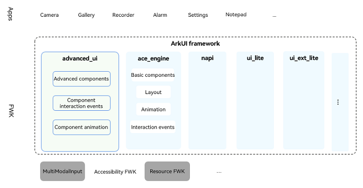
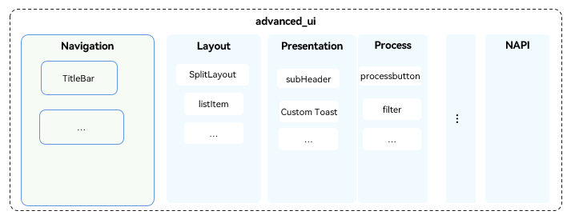

# advanced_ui_component

## Introduction
advanced_ui is an ArkTS-based UI framework that offers efficient UI combinations for applications in different use cases, bolstered by closed, consistent, and out-of-the-box public component APIs.

## Software Architecture
**Figure 1** Relationship between advanced_ui and ArkUI


**Figure 2** advanced_ui architecture



## Directory Structure
The following figure shows the directory structure.

```
/arkui_advanced_ui_component
├── interface                       # APIs
│   ├── arkdialog                   # Components
│   └── composelistitem
│   └── .....

├── source                          # Framework source code
│   ├── arkdialog                   # Components
│   └── composelistitem
│   └── .....
```
## When to Use

With advanced_ui, you can develop your application UI must faster, leveraging its diverse array of UI component combinations with consistent design and style definitions. You can use and reuse any component anywhere as needed.

## How to Use
> See the [doc folder](https://gitee.com/openharmony-sig/arkui_advanced_ui_component/tree/master/doc).
 
