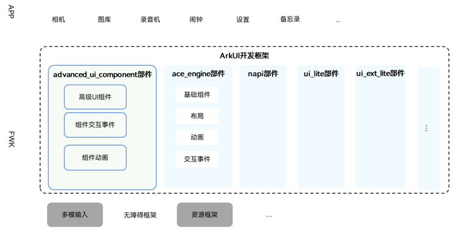
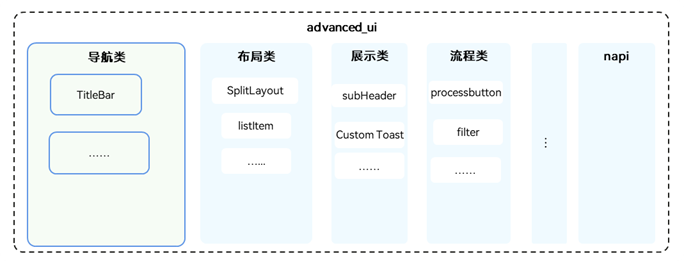

# advanced_ui_component

## 介绍
advanced_ui 是基于使用场景设计，为应用提供高效的UI组合，接口封闭、风格一致，开箱即用的组件接口；使用ArkTS语言开发，依赖系统的public API

## 软件架构
**图 1**  advanced_ui和ArkUI架构关系 

**图 2**  advanced_ui架构设计 


## 目录
目录结构如下图所示：

```
/arkui_advanced_ui_component
├── interface                       # 接口目录
│   ├── arkdialog                   # 各个组件目录
│   └── composelistitem
│   └── .....

├── source                          # 框架源码
│   ├── arkdialog                   # 各个组件目录
│   └── composelistitem
│   └── .....
```
## 使用场景<a name="section171384529150"></a>

advanced_ui框架提供了丰富的、ui设计统一的、高效的UI组合组件、样式定义，组件之间相互独立，随取随用，也可以在需求相同的地方重复使用。开发者可以高效的使用，节省大量的工作量。

## 使用说明
> 见[doc文件夹](https://gitee.com/openharmony-sig/arkui_advanced_ui_component/tree/master/doc)

 
