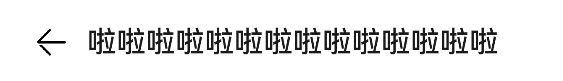
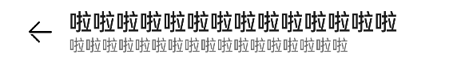
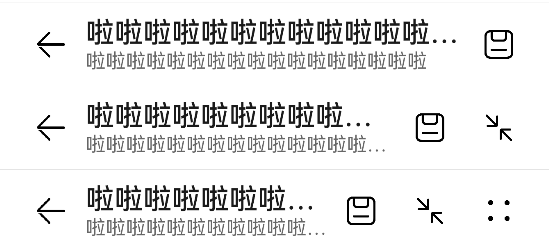
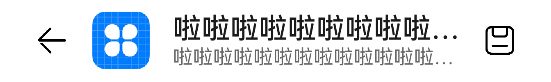

# ComposeTitleBar


普通型标题栏的一种，支持设置标题、头像（可选）、副标题（可选）；可用于一级页面、二级及其以上界面（配置返回键）。


>  **说明：**
> 该组件从API Version 10开始支持。后续版本如有新增内容，则采用上角标单独标记该内容的起始版本。


## 导入模块

```
import { ComposeTitleBar } from "@ohos.arkui.advanced.ComposeTitleBar"
```


## 子组件

无


## 接口

ComposeTitleBar({item?: ComposeTitleBarMenuItem, title: ResourceStr, subtitle?: ResourceStr, menuItems?: Array&lt;ComposeTitleBarMenuItem&gt;})

**装饰器类型：**\@Component

**系统能力：** SystemCapability.ArkUI.ArkUI.Full

**参数：**

| 参数名 | 参数类型 | 必选 | 参数描述 | 
| -------- | -------- | -------- | -------- |
| item | [ERROR:Invalid&nbsp;link:zh-cn_topic_0000001617072014.xml#xref1948916525328,link:zh-cn_topic_0000001609264184.xml#section478410410453](zh-cn_topic_0000001609264184.xml#section478410410453) | 否 | 用于左侧头像的单个菜单项目 | 
| title | [ResourceStr](https://docs.openharmony.cn/pages/v4.0/zh-cn/application-dev/reference/arkui-ts/ts-types.md/#resourcestr) | 是 | 标题 | 
| subtitle | [ResourceStr](https://docs.openharmony.cn/pages/v4.0/zh-cn/application-dev/reference/arkui-ts/ts-types.md/#resourcestr) | 否 | 副标题 | 
| menuItems | Array&lt;[ERROR:Invalid&nbsp;link:zh-cn_topic_0000001617072014.xml#xref33563123310,link:zh-cn_topic_0000001609264184.xml#section478410410453](zh-cn_topic_0000001609264184.xml#section478410410453)&gt; | 否 | 右侧菜单项目列表 | 


### ComposeTitleBarMenuItem

| 名称 | 值 | 是否必填 | 描述 | 
| -------- | -------- | -------- | -------- |
| value | [ResourceStr](https://docs.openharmony.cn/pages/v4.0/zh-cn/application-dev/reference/arkui-ts/ts-types.md/#resourcestr) | 是 | 图标资源 | 
| isEnabled | boolean | 是 | 是否启用，默认启用 | 
| action | ()&nbsp;=&gt;&nbsp;void | 否 | 触发时的动作闭包 | 


## 示例 1 - 单行文本

```
import { ComposeTitleBar } from "@ohos.arkui.advanced.ComposeTitleBar"

@Entry
@Component
struct Index {
  build() {
    Row() {
      Column() {
        ComposeTitleBar({
          title: "啦啦啦啦啦啦啦啦啦啦啦啦啦啦"
        })
      }.width('100%')
    }.height('100%')
  }
}
```




## 示例 2 - 双行文本

```
import { ComposeTitleBar } from "@ohos.arkui.advanced.ComposeTitleBar"

@Entry
@Component
struct Index {
  build() {
    Row() {
      Column() {
        ComposeTitleBar({
          title: "啦啦啦啦啦啦啦啦啦啦啦啦啦啦",
          subtitle: "啦啦啦啦啦啦啦啦啦啦啦啦啦啦啦啦啦"
        })
      }.width('100%')
    }.height('100%')
  }
}
```




## 示例 3 - 双行文本带菜单

```
import { ComposeTitleBar } from "@ohos.arkui.advanced.ComposeTitleBar"
import Prompt from '@system.prompt'

@Entry
@Component
struct Index {
  menuItems: { value: Resource, isEnabled: boolean, action: () => void }[] =
    [ { isEnabled: true, value: $r('app.media.ic_public_save'),
        action: () => prompt.showToast({ message: "show toast index 1" })
      },
      { isEnabled: true, value: $r('app.media.ic_public_reduce'),
        action: () => prompt.showToast({ message: "show toast index 2" })
      },
      { isEnabled: true, value: $r('app.media.ic_public_edit'),
        action: () => prompt.showToast({ message: "show toast index 3" })
      },
      { isEnabled: true, value: $r('app.media.ic_public_reduce'),
        action: () => prompt.showToast({ message: "show toast index 4" })
      } ]
  build() {
    Row() {
      Column() {
        Divider().height(2).color(0xCCCCCC)
        ComposeTitleBar({
          title: "啦啦啦啦啦啦啦啦啦啦啦啦啦啦",
          subtitle: "啦啦啦啦啦啦啦啦啦啦啦啦啦啦啦啦啦",
          menuItems: this.menuItems.slice(0, 1),
        })
        Divider().height(2).color(0xCCCCCC)
        ComposeTitleBar({
          title: "啦啦啦啦啦啦啦啦啦啦啦啦啦啦",
          subtitle: "啦啦啦啦啦啦啦啦啦啦啦啦啦啦啦啦啦",
          menuItems: this.menuItems.slice(0, 2),
        })
        Divider().height(2).color(0xCCCCCC)
        ComposeTitleBar({
          title: "啦啦啦啦啦啦啦啦啦啦啦啦啦啦",
          subtitle: "啦啦啦啦啦啦啦啦啦啦啦啦啦啦啦啦啦",
          menuItems: this.menuItems,
        })
        Divider().height(2).color(0xCCCCCC)
      }.width('100%')
    }.height('100%')
  }
}
```




## 示例 4 - 头像+双行文本带菜单

```
import { ComposeTitleBar } from "@ohos.arkui.advanced.ComposeTitleBar"
import Prompt from '@system.prompt'

@Entry
@Component
struct Index {
  build() {
    Row() {
      Column() {
        ComposeTitleBar({
          menuItems: [ { isEnabled: true, value: $r('app.media.ic_public_save'),
            action: () => Prompt.showToast({ message: "show toast index 1" })
          } ],
          title: "啦啦啦啦啦啦啦啦啦啦啦啦啦啦",
          subtitle: "啦啦啦啦啦啦啦啦啦啦啦啦啦啦啦啦啦",
          item: { isEnabled: true, value: $r('app.media.app_icon'),
            action: () => Prompt.showToast({message:"show toast index portrait"})
          } })
      }.width('100%')
    }.height('100%')
  }
}
```


