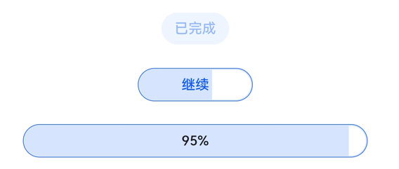

# ProgressButton


文本下载按钮，可显示具体下载进度。


>  **说明：**
> 该组件从API Version 10开始支持。后续版本如有新增内容，则采用上角标单独标记该内容的起始版本。


## 导入模块

```
import { ProgressButton } from '@ohos.arkui.advanced.ProgressButton'
```


## ProgressButton

ProgressButton({progress: number, content: string, progressButtonWidth?: Length, clickCallback: () =&gt; void, enable: boolean})

**装饰器类型：**\@Component

**系统能力：** SystemCapability.ArkUI.ArkUI.Full

**参数：**

| 参数名 | 参数类型 | 必填 | 装饰器类型 | 描述 | 
| -------- | -------- | -------- | -------- | -------- |
| progress | number | 是 | \@Prop | 下载按钮的当前进度值。 | 
| content | string | 是 |  | 下载按钮的文本。 | 
| progressButtonWidth | Length | 否 | - | 下载按钮的宽度。 | 
| clickCallback | void | 是 |  | 下载按钮的点击回调。 | 
| enable | boolean | 是 |  | 下载按钮是否可以点击，<br/>默认为true。 | 


## 示例

```
import { ProgressButton } from '@ohos.arkui.advanced.ProgressButton'
@Entry
@Component
struct Index {
  @State halfProgress: number = 50
  @State smallProgress: number = 8
  @State bigProgress: number = 51
  @State textState1: string = '下载'
  @State textState2: string = '下载'
  @State textState3: string = '下载'
  @State isRunning1: boolean = false
  @State isRunning2: boolean = false
  @State isRunning3: boolean = false
  @State enableState1: boolean = true
  @State enableState2: boolean = true
  @State enableState3: boolean = true
  build() {
    Column({space: 20}) {
      Text('6、下载按钮：')
      ProgressButton({
        progress: this.halfProgress,
        progressButtonWidth: "60",
        content: this.textState1,
        enable: this.enableState1,
        clickCallback: () => {
          if (this.textState1 && !this.isRunning1 && this.halfProgress < 100) {
            this.textState1 = '继续'
          }
          this.isRunning1 = !this.isRunning1
          let timer = setInterval(() => {
            if (this.isRunning1) {
              if (this.halfProgress === 100) {
              } else {
                this.halfProgress++
                if (this.halfProgress === 100) {
                  // this.halfProgress = 0
                  this.textState1 = '已完成'
                  this.enableState1 = false
                }
                console.info('x progress++ = ' + this.halfProgress)
              }
            } else {
              console.info('x isRunning = ' + false)
              clearInterval(timer)
            }
          }, 100)
        }
      })
      ProgressButton({
        progress: this.smallProgress,
        progressButtonWidth: "100",
        content: this.textState2,
        enable: this.enableState2,
        clickCallback: () => {
          if (this.textState2 && !this.isRunning2 && this.smallProgress < 100) {
            this.textState2 = '继续'
          }
          this.isRunning2 = !this.isRunning2
          let timer = setInterval(() => {
            if (this.isRunning2) {
              if (this.smallProgress === 100) {

              } else {
                this.smallProgress++
                if (this.smallProgress === 100) {
                  this.textState2 = '已完成'
                  this.enableState2 = false
                }
                console.info('x progress++ = ' + this.smallProgress)
              }
            } else {
              console.info('x isRunning = ' + false)
              clearInterval(timer)
            }
          }, 100)
        }
      })
      ProgressButton({
        progress: this.bigProgress,
        progressButtonWidth: '300',
        content: this.textState3,
        enable: this.enableState3,
        clickCallback: () => {
          this.isRunning3 = !this.isRunning3
          if (!this.isRunning3 && this.textState3 && this.bigProgress < 100) {
            this.textState3 = '继续'
          }

          let timer = setInterval(() => {
            if (this.isRunning3) {
              if (this.bigProgress === 100) {
              } else {
                this.bigProgress++
                if (this.bigProgress === 100) {
                  this.textState3 = '已完成'
                  this.enableState3 = false
                }
                console.info('x progress++ = ' + this.bigProgress)
              }
            } else {
              console.info('x isRunning = ' + false)
              clearInterval(timer)
            }
          }, 100)
        }
      })
    }.alignItems(HorizontalAlign.Center).width('100%')
  }
}
```



